# Kafka Internals — 클러스터, 브로커, 리플리케이션, 컨트롤러, 코디네이터

> 이 4가지 개념은 Kafka에만 국한되지 않는다. 모든 분산 시스템의 기본 패턴이다. 여기서 익힌 구조를 Redis Cluster, Kubernetes, Elasticsearch에서도 그대로 읽을 수 있다.

이 문서는 kafka-lab의 Step 1~10을 관통하는 **Kafka 인프라 내부 구조**를 설명한다.
테스트를 돌리기 전에 한 번 읽으면 "왜 이 설정이 중요한지"가 보이고, 테스트를 돌린 후에 다시 읽으면 "그래서 내부에서 무슨 일이 일어난 건지"가 보인다.

---

## 목차

- [1. 클러스터 — 전체 그림](#1-클러스터--전체-그림)
- [2. 브로커 — 데이터를 실제로 저장하는 서버](#2-브로커--데이터를-실제로-저장하는-서버)
- [3. 리플리케이션 — 데이터가 살아남는 방법](#3-리플리케이션--데이터가-살아남는-방법)
- [4. 컨트롤러 — 클러스터의 두뇌](#4-컨트롤러--클러스터의-두뇌)
- [5. 코디네이터 — Consumer Group 관리자](#5-코디네이터--consumer-group-관리자)
- [6. 전체 그림 — 다 합치면](#6-전체-그림--다-합치면)
- [7. 이 개념들이 kafka-lab 어디에서 나오는가](#7-이-개념들이-kafka-lab-어디에서-나오는가)

---

## 1. 클러스터 — 전체 그림

Kafka는 혼자 돌지 않는다. **여러 서버(브로커)가 모여서 하나의 시스템으로 동작**하는 것이 클러스터다.

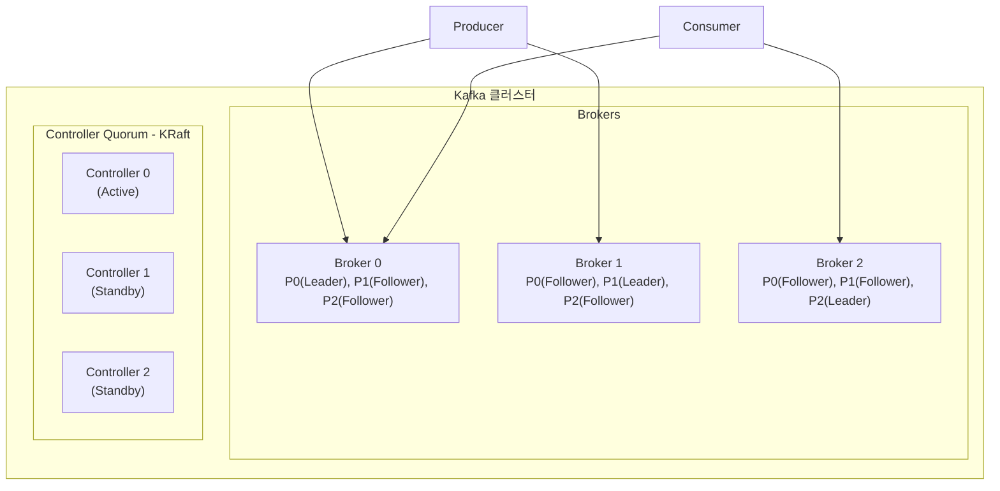
```mermaid
graph TB
    subgraph Kafka 클러스터
        subgraph Brokers
            B0["Broker 0<br/>P0(Leader), P1(Follower), P2(Follower)"]
            B1["Broker 1<br/>P0(Follower), P1(Leader), P2(Follower)"]
            B2["Broker 2<br/>P0(Follower), P1(Follower), P2(Leader)"]
        end
        subgraph Controller Quorum - KRaft
            C0["Controller 0<br/>(Active)"]
            C1["Controller 1<br/>(Standby)"]
            C2["Controller 2<br/>(Standby)"]
        end
    end

    Producer --> B0
    Producer --> B1
    Consumer --> B0
    Consumer --> B2
```

> 이 lab은 KRaft **Combined 모드**(`KAFKA_PROCESS_ROLES=broker,controller`)로 동작한다. 하나의 프로세스가 Broker와 Controller를 겸한다. 대규모 클러스터에서는 Controller 전용 노드를 분리하는 **Isolated 모드**를 사용한다.

**왜 여러 대인가?**

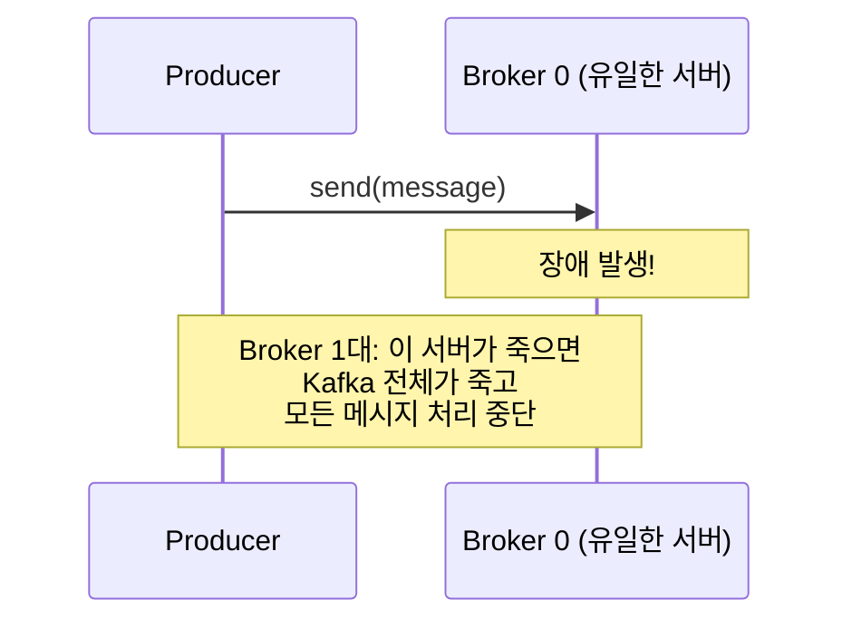
```mermaid
sequenceDiagram
    participant P as Producer
    participant B0 as Broker 0 (유일한 서버)

    P->>B0: send(message)
    Note over B0: 장애 발생!

    Note over P,B0: Broker 1대: 이 서버가 죽으면<br/>Kafka 전체가 죽고<br/>모든 메시지 처리 중단
```

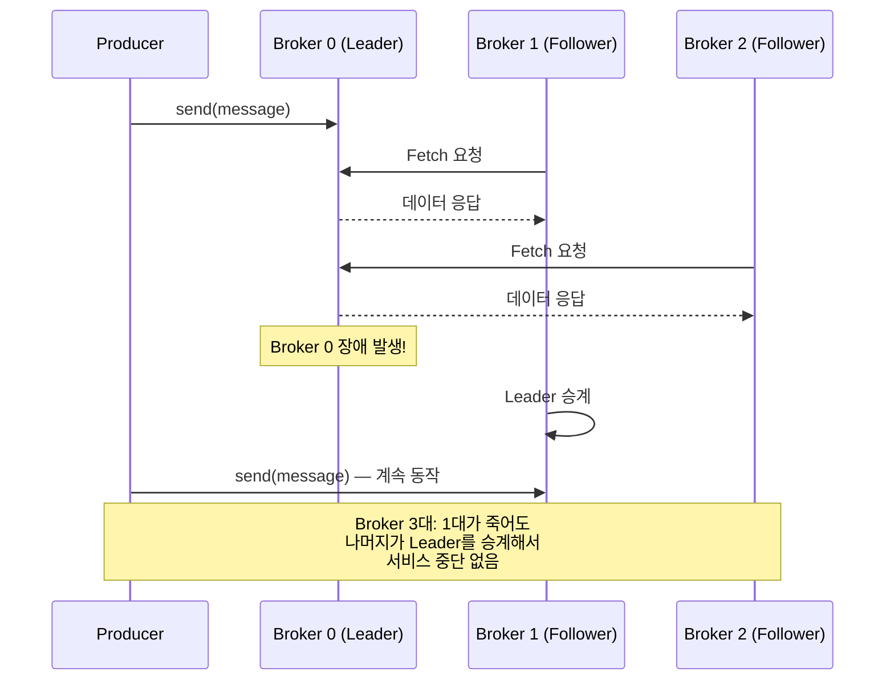
```mermaid
sequenceDiagram
    participant P as Producer
    participant B0 as Broker 0 (Leader)
    participant B1 as Broker 1 (Follower)
    participant B2 as Broker 2 (Follower)

    P->>B0: send(message)
    B1->>B0: Fetch 요청
    B0-->>B1: 데이터 응답
    B2->>B0: Fetch 요청
    B0-->>B2: 데이터 응답

    Note over B0: Broker 0 장애 발생!

    B1->>B1: Leader 승계
    P->>B1: send(message) — 계속 동작

    Note over P,B2: Broker 3대: 1대가 죽어도<br/>나머지가 Leader를 승계해서<br/>서비스 중단 없음
```

---

## 2. 브로커 — 데이터를 실제로 저장하는 서버

각 Broker는 **파티션의 데이터를 디스크에 저장**한다. Kafka가 "메시지 큐"가 아니라 "분산 로그 저장소"라고 불리는 이유가 여기에 있다. 메시지는 파일 시스템의 로그 세그먼트에 **append-only**로 기록된다.

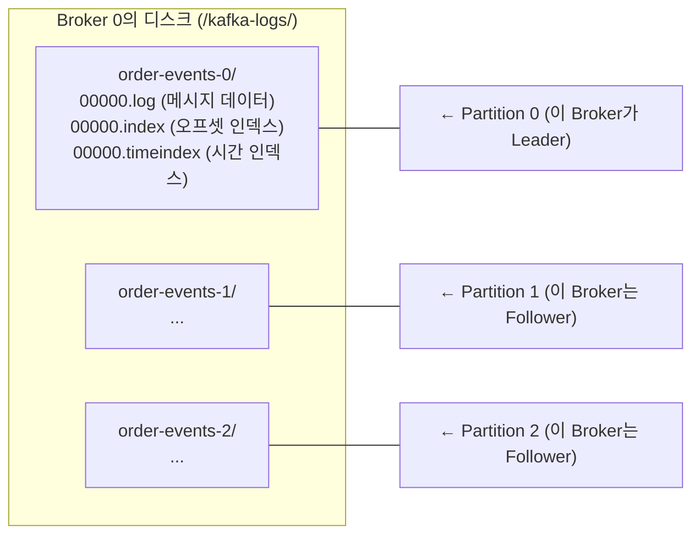
```mermaid
graph LR
    subgraph "Broker 0의 디스크 (/kafka-logs/)"
        P0["order-events-0/<br/>00000.log (메시지 데이터)<br/>00000.index (오프셋 인덱스)<br/>00000.timeindex (시간 인덱스)"]
        P1["order-events-1/<br/>..."]
        P2["order-events-2/<br/>..."]
    end

    P0 --- note1["← Partition 0 (이 Broker가 Leader)"]
    P1 --- note2["← Partition 1 (이 Broker는 Follower)"]
    P2 --- note3["← Partition 2 (이 Broker는 Follower)"]
```

### 핵심 규칙

- 하나의 파티션에는 **Leader 1개 + Follower N개**가 있다
- Producer는 **Leader에만 쓴다**
- Consumer도 기본적으로 **Leader에서 읽는다** (Kafka 2.4+에서는 `replica.selector.class` 설정으로 Follower 읽기도 가능하지만, 기본은 Leader 읽기다)
- Follower는 Leader에게 **Fetch 요청을 보내서 데이터를 가져간다** (Pull 모델)

### Producer가 메시지를 보내면 어떤 일이 일어나는가

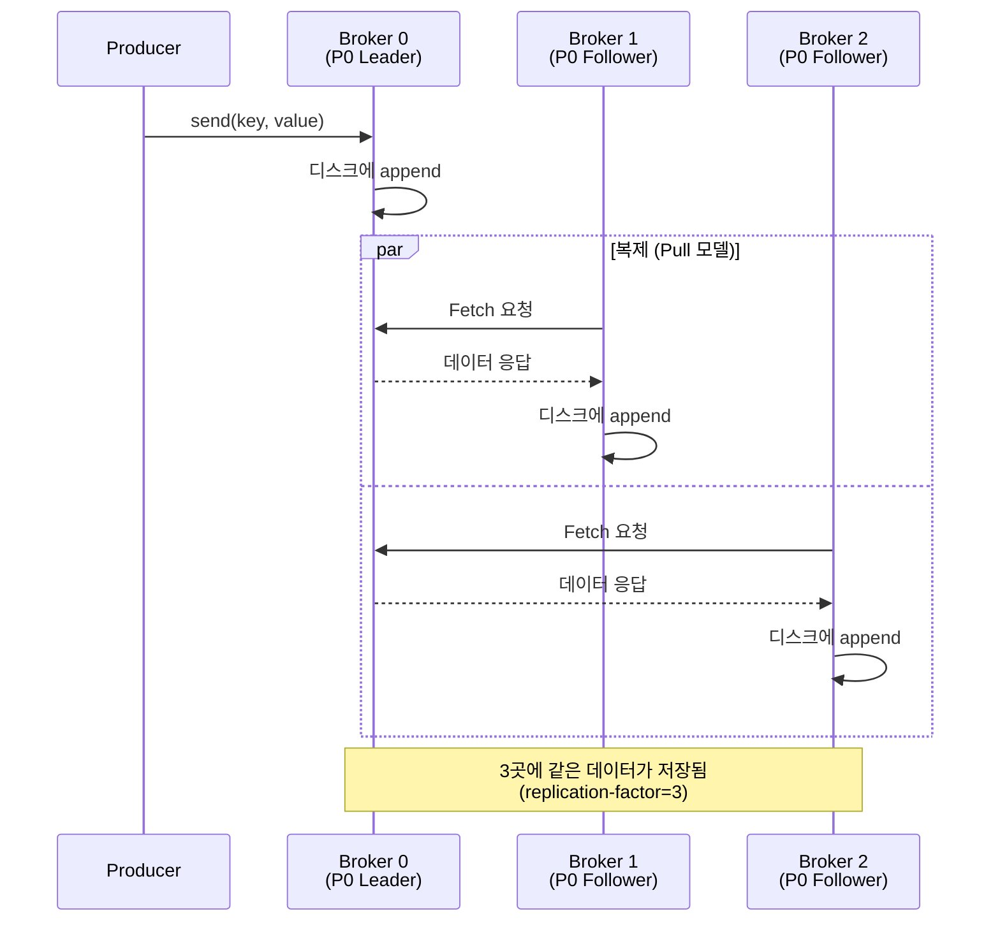
```mermaid
sequenceDiagram
    participant P as Producer
    participant B0 as Broker 0<br/>(P0 Leader)
    participant B1 as Broker 1<br/>(P0 Follower)
    participant B2 as Broker 2<br/>(P0 Follower)

    P->>B0: send(key, value)
    B0->>B0: 디스크에 append

    par 복제 (Pull 모델)
        B1->>B0: Fetch 요청
        B0-->>B1: 데이터 응답
        B1->>B1: 디스크에 append
    and
        B2->>B0: Fetch 요청
        B0-->>B2: 데이터 응답
        B2->>B2: 디스크에 append
    end

    Note over B0,B2: 3곳에 같은 데이터가 저장됨<br/>(replication-factor=3)
```

> Kafka의 복제는 **Pull 모델**이다. Leader가 Follower에게 밀어넣는 게 아니라, Follower가 Leader에게 Fetch 요청을 보내서 가져간다. Leader는 각 Follower의 fetch offset을 추적해서 ISR 충족 여부를 판단한다.

---

## 3. 리플리케이션 — 데이터가 살아남는 방법

**Replication Factor = 3이면, 같은 데이터가 3개의 Broker에 존재한다.**

### ISR (In-Sync Replicas) — 핵심 개념

ISR은 **Leader와 "충분히 따라잡은" Follower 목록**이다.

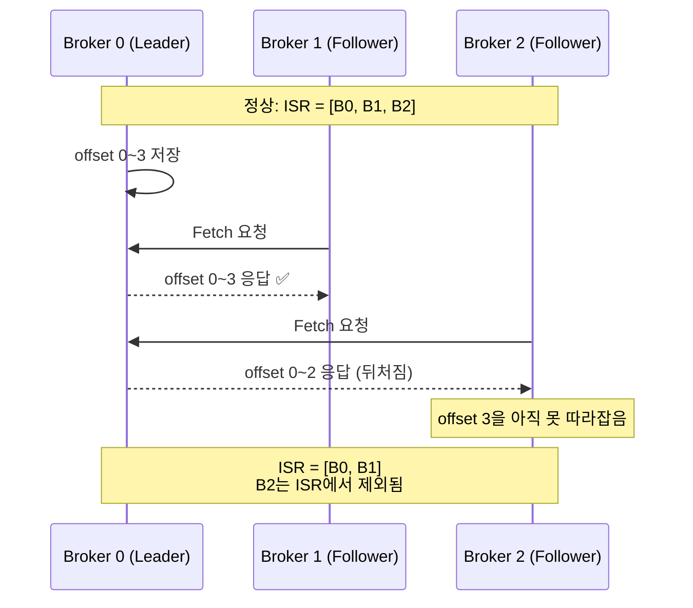
```mermaid
sequenceDiagram
    participant B0 as Broker 0 (Leader)
    participant B1 as Broker 1 (Follower)
    participant B2 as Broker 2 (Follower)

    Note over B0,B2: 정상: ISR = [B0, B1, B2]

    B0->>B0: offset 0~3 저장

    B1->>B0: Fetch 요청
    B0-->>B1: offset 0~3 응답 ✅

    B2->>B0: Fetch 요청
    B0-->>B2: offset 0~2 응답 (뒤처짐)

    Note over B2: offset 3을 아직 못 따라잡음

    Note over B0,B2: ISR = [B0, B1]<br/>B2는 ISR에서 제외됨
```

### Follower가 뒤처지면 ISR에서 빠진다

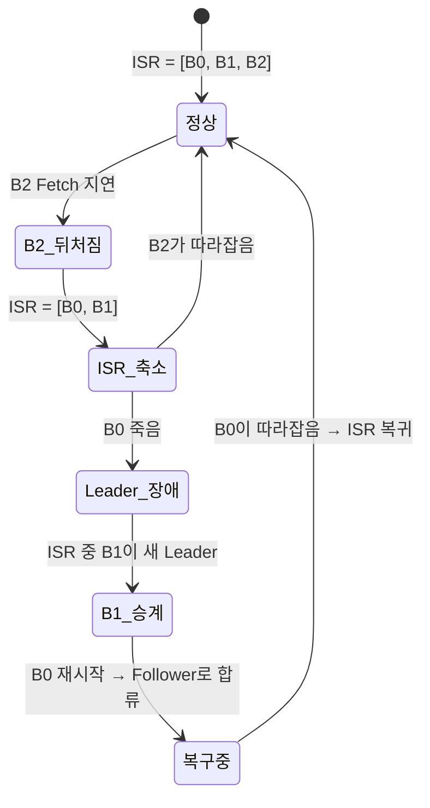
```mermaid
stateDiagram-v2
    [*] --> 정상: ISR = [B0, B1, B2]
    정상 --> B2_뒤처짐: B2 Fetch 지연
    B2_뒤처짐 --> ISR_축소: ISR = [B0, B1]
    ISR_축소 --> 정상: B2가 따라잡음
    ISR_축소 --> Leader_장애: B0 죽음
    Leader_장애 --> B1_승계: ISR 중 B1이 새 Leader
    B1_승계 --> 복구중: B0 재시작 → Follower로 합류
    복구중 --> 정상: B0이 따라잡음 → ISR 복귀
```

### acks 설정과 리플리케이션의 관계

이 개념이 **Step 1 (Producer Guarantee)**에서 나온다. acks 설정은 "몇 개의 Broker가 데이터를 저장해야 성공으로 치는가"를 결정한다.

**acks=0 — 확인 안 함**

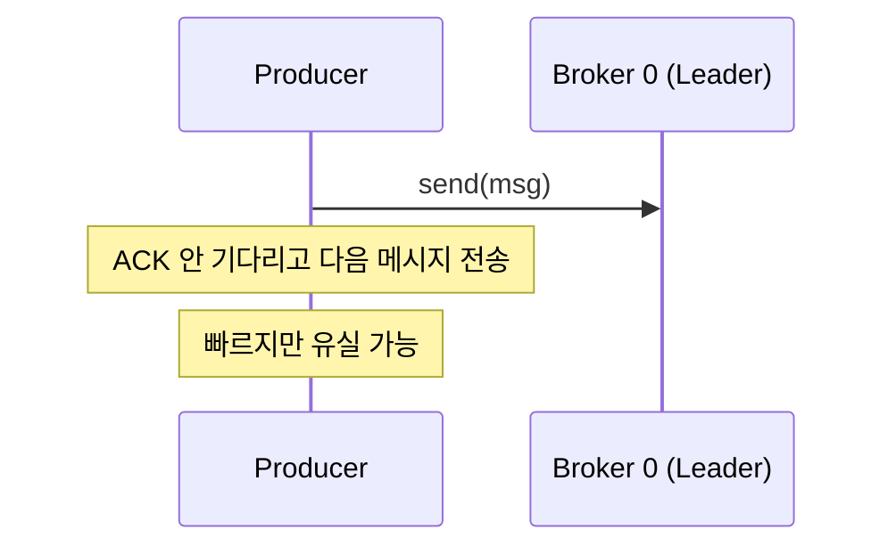
```mermaid
sequenceDiagram
    participant P as Producer
    participant B0 as Broker 0 (Leader)

    P->>B0: send(msg)
    Note over P: ACK 안 기다리고 다음 메시지 전송
    Note over P: 빠르지만 유실 가능
```

**acks=1 — Leader만 확인**

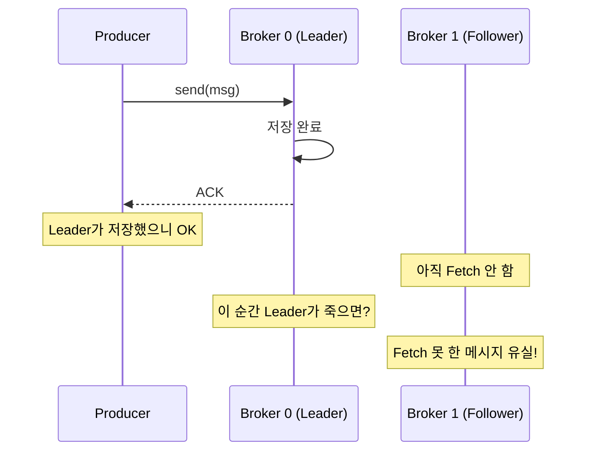
```mermaid
sequenceDiagram
    participant P as Producer
    participant B0 as Broker 0 (Leader)
    participant B1 as Broker 1 (Follower)

    P->>B0: send(msg)
    B0->>B0: 저장 완료
    B0-->>P: ACK

    Note over P: Leader가 저장했으니 OK
    Note over B1: 아직 Fetch 안 함

    Note over B0: 이 순간 Leader가 죽으면?
    Note over B1: Fetch 못 한 메시지 유실!
```

**acks=all — ISR 전체 확인**

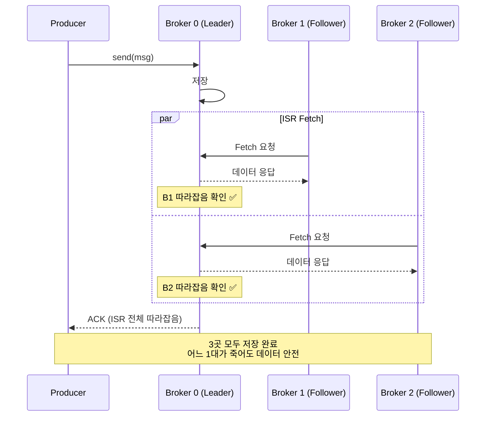
```mermaid
sequenceDiagram
    participant P as Producer
    participant B0 as Broker 0 (Leader)
    participant B1 as Broker 1 (Follower)
    participant B2 as Broker 2 (Follower)

    P->>B0: send(msg)
    B0->>B0: 저장

    par ISR Fetch
        B1->>B0: Fetch 요청
        B0-->>B1: 데이터 응답
        Note over B0: B1 따라잡음 확인 ✅
    and
        B2->>B0: Fetch 요청
        B0-->>B2: 데이터 응답
        Note over B0: B2 따라잡음 확인 ✅
    end

    B0-->>P: ACK (ISR 전체 따라잡음)

    Note over P,B2: 3곳 모두 저장 완료<br/>어느 1대가 죽어도 데이터 안전
```

### Step 1의 함정이 여기서 나온다

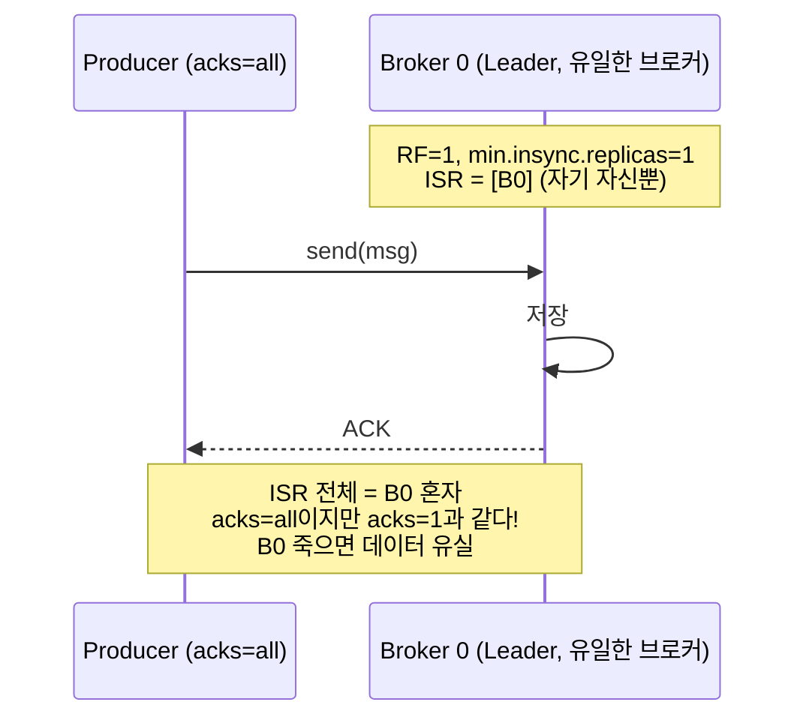
```mermaid
sequenceDiagram
    participant P as Producer (acks=all)
    participant B0 as Broker 0 (Leader, 유일한 브로커)

    Note over B0: RF=1, min.insync.replicas=1<br/>ISR = [B0] (자기 자신뿐)

    P->>B0: send(msg)
    B0->>B0: 저장
    B0-->>P: ACK

    Note over P,B0: ISR 전체 = B0 혼자<br/>acks=all이지만 acks=1과 같다!<br/>B0 죽으면 데이터 유실
```

`min.insync.replicas`는 "ISR이 이 수 미만이면 쓰기를 거부하라"는 **하한선**이다. RF=3, ISR=3인 상태에서 `min.insync.replicas=1`이면, `acks=all`은 여전히 ISR 3대 전부를 확인한다. 문제는 ISR이 1대로 줄어드는 것을 **허용한다는 점**이다. ISR이 리더 1대로 줄어든 뒤에야 acks=1로 퇴화한다.

**acks=all은 RF>=3 + min.insync.replicas=2일 때만 의미가 있다.**
→ Step 1에서 `acks_all에_min_insync_replicas_1이면_사실상_acks_1이다()` 테스트가 이것을 증명한다.

> `min.insync.replicas`는 Producer 설정이 아니라 **브로커/토픽 레벨 설정**이다.

---

## 4. 컨트롤러 — 클러스터의 두뇌

컨트롤러는 **"어떤 Broker가 어떤 파티션의 Leader인가?"를 관리하는 두뇌**다.

### 컨트롤러가 관리하는 메타데이터

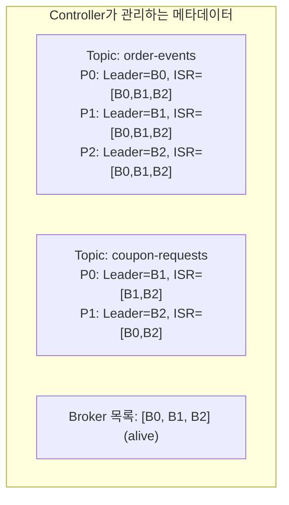
```mermaid
graph TB
    subgraph "Controller가 관리하는 메타데이터"
        T1["Topic: order-events<br/>P0: Leader=B0, ISR=[B0,B1,B2]<br/>P1: Leader=B1, ISR=[B0,B1,B2]<br/>P2: Leader=B2, ISR=[B0,B1,B2]"]
        T2["Topic: coupon-requests<br/>P0: Leader=B1, ISR=[B1,B2]<br/>P1: Leader=B2, ISR=[B0,B2]"]
        BL["Broker 목록: [B0, B1, B2] (alive)"]
    end
```

### ZooKeeper 시절 vs KRaft 모드

**예전 (ZooKeeper 시절)**

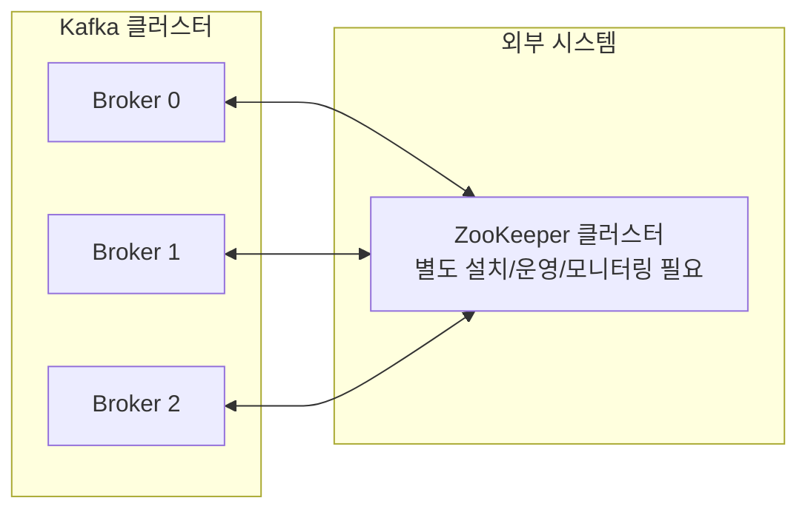
```mermaid
graph LR
    subgraph "Kafka 클러스터"
        B0[Broker 0]
        B1[Broker 1]
        B2[Broker 2]
    end
    subgraph "외부 시스템"
        ZK[ZooKeeper 클러스터<br/>별도 설치/운영/모니터링 필요]
    end

    B0 <--> ZK
    B1 <--> ZK
    B2 <--> ZK
```

**지금 (KRaft 모드, Kafka 3.3+ production-ready, 4.0에서 ZooKeeper 제거)**

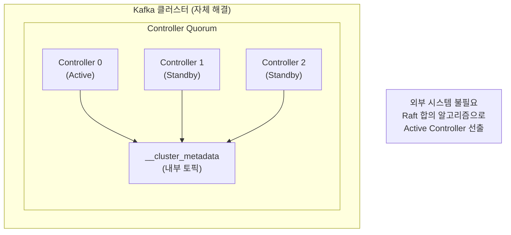
```mermaid
graph TB
    subgraph "Kafka 클러스터 (자체 해결)"
        subgraph "Controller Quorum"
            C0["Controller 0<br/>(Active)"]
            C1["Controller 1<br/>(Standby)"]
            C2["Controller 2<br/>(Standby)"]
            META["__cluster_metadata<br/>(내부 토픽)"]
        end
        C0 --> META
        C1 --> META
        C2 --> META
    end

    Note["외부 시스템 불필요<br/>Raft 합의 알고리즘으로<br/>Active Controller 선출"]
```

> KRaft는 Kafka 2.8에서 EA(Early Access)로 도입되고, **3.3에서 production-ready**가 됐다. 이 lab은 Kafka 3.7.0으로 이미 KRaft 모드로 동작한다. Kafka 4.0에서 ZooKeeper 지원이 완전히 제거된다.

### Active Controller가 죽으면?

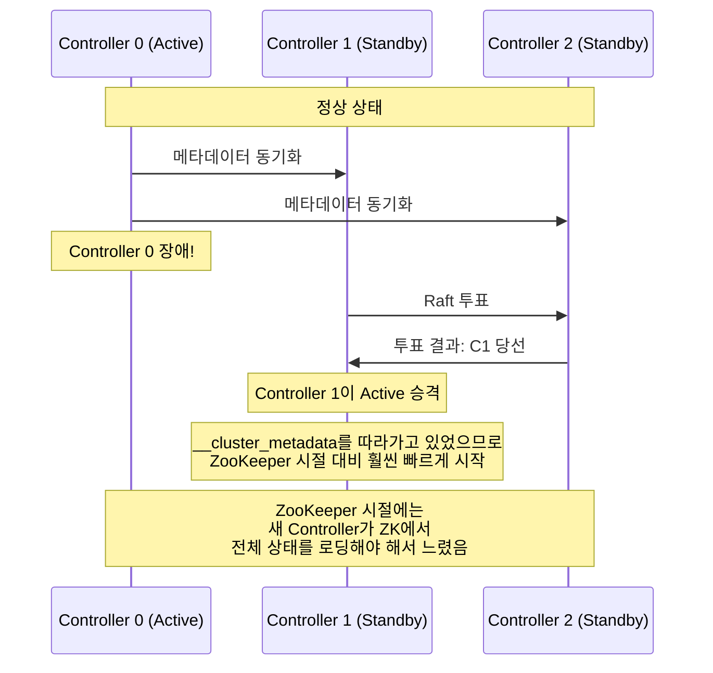
```mermaid
sequenceDiagram
    participant C0 as Controller 0 (Active)
    participant C1 as Controller 1 (Standby)
    participant C2 as Controller 2 (Standby)

    Note over C0,C2: 정상 상태

    C0->>C1: 메타데이터 동기화
    C0->>C2: 메타데이터 동기화

    Note over C0: Controller 0 장애!

    C1->>C2: Raft 투표
    C2->>C1: 투표 결과: C1 당선

    Note over C1: Controller 1이 Active 승격
    Note over C1: __cluster_metadata를 따라가고 있었으므로<br/>ZooKeeper 시절 대비 훨씬 빠르게 시작

    Note over C0,C2: ZooKeeper 시절에는<br/>새 Controller가 ZK에서<br/>전체 상태를 로딩해야 해서 느렸음
```

### Controller가 Leader 장애를 처리하는 흐름

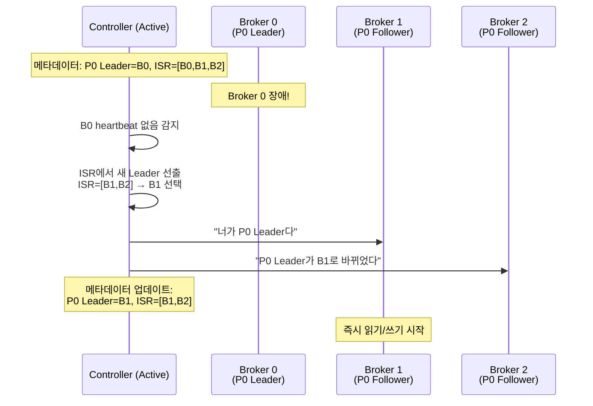
```mermaid
sequenceDiagram
    participant Ctrl as Controller (Active)
    participant B0 as Broker 0<br/>(P0 Leader)
    participant B1 as Broker 1<br/>(P0 Follower)
    participant B2 as Broker 2<br/>(P0 Follower)

    Note over Ctrl: 메타데이터: P0 Leader=B0, ISR=[B0,B1,B2]

    Note over B0: Broker 0 장애!

    Ctrl->>Ctrl: B0 heartbeat 없음 감지
    Ctrl->>Ctrl: ISR에서 새 Leader 선출<br/>ISR=[B1,B2] → B1 선택

    Ctrl->>B1: "너가 P0 Leader다"
    Ctrl->>B2: "P0 Leader가 B1로 바뀌었다"

    Note over Ctrl: 메타데이터 업데이트:<br/>P0 Leader=B1, ISR=[B1,B2]

    Note over B1: 즉시 읽기/쓰기 시작
```

→ Step 10에서 `KRaft_모드에서_컨트롤러_노드를_확인할_수_있다()` 테스트가 이 구조를 확인한다.

---

## 5. 코디네이터 — Consumer Group 관리자

컨트롤러가 "클러스터 전체의 두뇌"라면, 코디네이터는 **"Consumer Group 전담 관리자"**다.

### 컨트롤러 vs 코디네이터

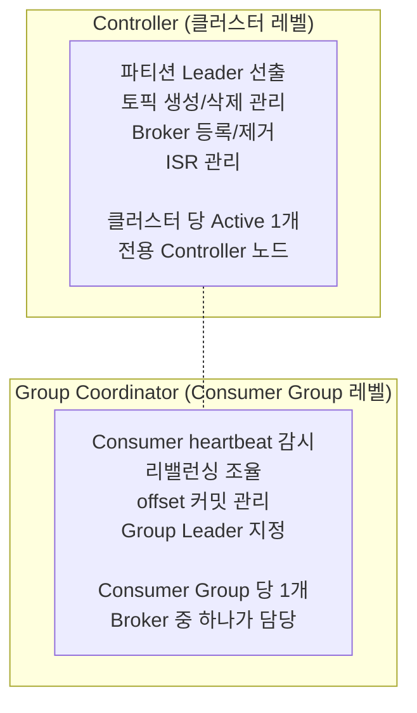
```mermaid
graph TB
    subgraph "Controller (클러스터 레벨)"
        CT["파티션 Leader 선출<br/>토픽 생성/삭제 관리<br/>Broker 등록/제거<br/>ISR 관리<br/><br/>클러스터 당 Active 1개<br/>전용 Controller 노드"]
    end

    subgraph "Group Coordinator (Consumer Group 레벨)"
        GC["Consumer heartbeat 감시<br/>리밸런싱 조율<br/>offset 커밋 관리<br/>Group Leader 지정<br/><br/>Consumer Group 당 1개<br/>Broker 중 하나가 담당"]
    end

    CT -.- GC
```

**코디네이터는 전용 서버가 아니다.** Broker 중 하나가 특정 Consumer Group의 코디네이터를 겸임한다. 어떤 Broker가 코디네이터가 되는지는 `hash(groupId) % __consumer_offsets 파티션 수`로 결정된다.

### 코디네이터가 하는 일

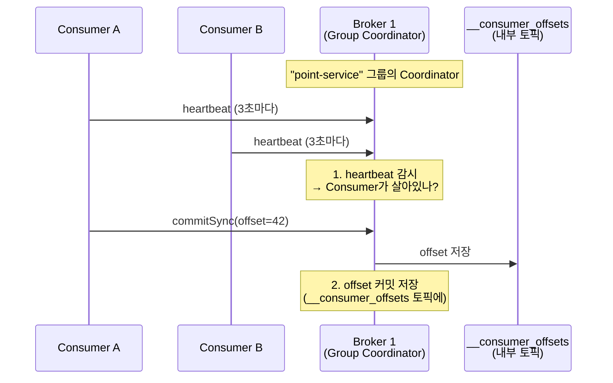
```mermaid
sequenceDiagram
    participant CA as Consumer A
    participant CB as Consumer B
    participant Coord as Broker 1<br/>(Group Coordinator)
    participant OT as __consumer_offsets<br/>(내부 토픽)

    Note over Coord: "point-service" 그룹의 Coordinator

    CA->>Coord: heartbeat (3초마다)
    CB->>Coord: heartbeat (3초마다)

    Note over Coord: 1. heartbeat 감시<br/>→ Consumer가 살아있나?

    CA->>Coord: commitSync(offset=42)
    Coord->>OT: offset 저장
    Note over Coord: 2. offset 커밋 저장<br/>(__consumer_offsets 토픽에)
```

### 리밸런싱은 코디네이터가 조율한다

리밸런싱에서 중요한 점은, **파티션 배정을 계산하는 것은 코디네이터가 아니라 Group Leader(Consumer 중 하나)**라는 것이다. Kafka는 서버 부하를 줄이기 위해 이 로직을 클라이언트에 위임했다.

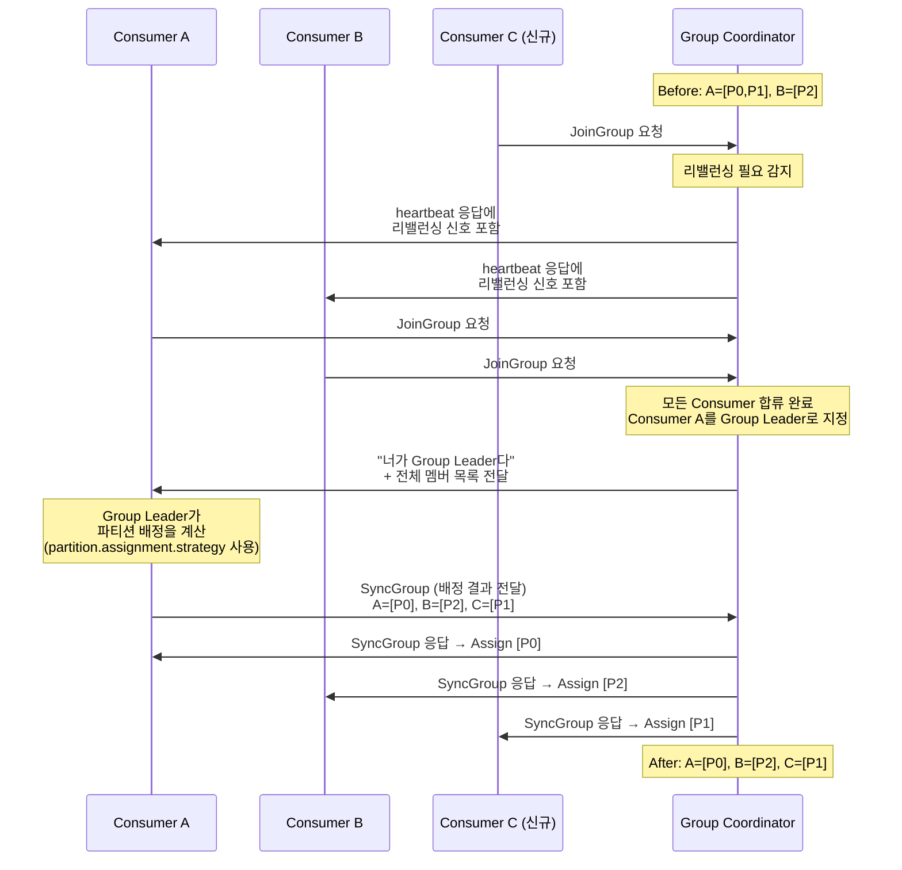
```mermaid
sequenceDiagram
    participant CA as Consumer A
    participant CB as Consumer B
    participant CC as Consumer C (신규)
    participant Coord as Group Coordinator

    Note over Coord: Before: A=[P0,P1], B=[P2]

    CC->>Coord: JoinGroup 요청
    Note over Coord: 리밸런싱 필요 감지

    Coord->>CA: heartbeat 응답에<br/>리밸런싱 신호 포함
    Coord->>CB: heartbeat 응답에<br/>리밸런싱 신호 포함

    CA->>Coord: JoinGroup 요청
    CB->>Coord: JoinGroup 요청

    Note over Coord: 모든 Consumer 합류 완료<br/>Consumer A를 Group Leader로 지정

    Coord->>CA: "너가 Group Leader다"<br/>+ 전체 멤버 목록 전달

    Note over CA: Group Leader가<br/>파티션 배정을 계산<br/>(partition.assignment.strategy 사용)

    CA->>Coord: SyncGroup (배정 결과 전달)<br/>A=[P0], B=[P2], C=[P1]

    Coord->>CA: SyncGroup 응답 → Assign [P0]
    Coord->>CB: SyncGroup 응답 → Assign [P2]
    Coord->>CC: SyncGroup 응답 → Assign [P1]

    Note over Coord: After: A=[P0], B=[P2], C=[P1]
```

> KIP-848(3세대 프로토콜, Kafka 4.0 예정)에서는 이 파티션 배정 로직이 서버(코디네이터)로 이동한다. Step 4에서 프로토콜 3세대를 다룬다.

→ Step 4에서 `Eager_리밸런싱에서는_새_Consumer_합류_시_모든_파티션이_revoke된다()` 테스트가 이 과정을 증명한다.

### __consumer_offsets — offset은 어디에 저장되는가

Consumer가 `commitSync()`로 커밋하는 offset은 Broker의 **`__consumer_offsets`라는 내부 토픽**에 저장된다. 코디네이터가 이 토픽을 관리한다.

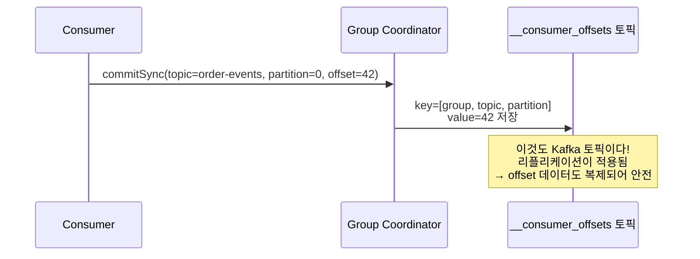
```mermaid
sequenceDiagram
    participant C as Consumer
    participant Coord as Group Coordinator
    participant CO as __consumer_offsets 토픽

    C->>Coord: commitSync(topic=order-events, partition=0, offset=42)
    Coord->>CO: key=[group, topic, partition]<br/>value=42 저장

    Note over CO: 이것도 Kafka 토픽이다!<br/>리플리케이션이 적용됨<br/>→ offset 데이터도 복제되어 안전
```

Consumer가 재시작하면 코디네이터가 `__consumer_offsets`에서 마지막 커밋 offset을 읽어서 "어디까지 읽었는가"를 알려준다. 이것이 Step 2에서 다루는 offset 관리의 내부 동작이다.

---

## 6. 전체 그림 — 다 합치면

```mermaid
graph TB
    subgraph "Kafka 클러스터"
        subgraph "Control Plane (두뇌)"
            C0["Controller 0 (Active)"]
            C1["Controller 1 (Standby)"]
            C2["Controller 2 (Standby)"]
            CM["__cluster_metadata"]
            C0 --> CM
            C1 --> CM
            C2 --> CM
        end

        subgraph "Data Plane (데이터)"
            B0["Broker 0<br/>P0(Leader) P1(F) P2(F)"]
            B1["Broker 1<br/>P0(F) P1(Leader) P2(F)<br/>──────────<br/>Group Coordinator<br/>(point-service)"]
            B2["Broker 2<br/>P0(F) P1(F) P2(Leader)"]
        end

        CO["__consumer_offsets"]
        B1 --> CO
    end

    P["Producer<br/>(API 서버)"] --> B0
    P --> B1
    CA["Consumer A<br/>(point-service)"] --> B1
    CB["Consumer B<br/>(point-service)"] --> B2
```

### 메시지가 Producer에서 Consumer까지 가는 전체 흐름

```mermaid
sequenceDiagram
    participant P as Producer
    participant Ctrl as Controller
    participant B0 as Broker 0<br/>(P0 Leader)
    participant B1 as Broker 1<br/>(P0 Follower,<br/>Group Coordinator)
    participant B2 as Broker 2<br/>(P0 Follower)
    participant C as Consumer

    Note over P: 1. Metadata 요청 (아무 Broker에)
    P->>B0: Metadata 요청
    B0-->>P: 전체 토픽-파티션-리더 매핑 응답
    Note over P: 클라이언트에 메타데이터 캐싱

    Note over P: 2. Leader에 직접 쓰기
    P->>B0: send(key="order-1", value="{...}")
    B0->>B0: 디스크에 append

    Note over B0: 3. 리플리케이션 (Pull)
    par
        B1->>B0: Fetch 요청
        B0-->>B1: 데이터 응답
    and
        B2->>B0: Fetch 요청
        B0-->>B2: 데이터 응답
    end
    B0-->>P: ACK (acks=all이면 ISR 전체 따라잡은 후)

    Note over C: 4. Consumer가 poll
    C->>B0: poll() from P0
    B0-->>C: message(offset=42, "order-1", "{...}")

    Note over C: 5. 처리 후 offset 커밋
    C->>B1: commitSync(offset=43)
    Note over B1: __consumer_offsets에 저장<br/>(코디네이터 역할)
```

---

## 7. 이 개념들이 kafka-lab 어디에서 나오는가

| 개념 | 관련 Step | 테스트에서 확인하는 것 |
|------|----------|---------------------|
| **리플리케이션 / ISR** | [Step 1](src/test/java/com/example/kafka/s01_producer/README.md) | acks=all + min.insync.replicas=1일 때 ISR 축소 시 acks=1로 퇴화 |
| **파티션 Leader / Follower** | [Step 3](src/test/java/com/example/kafka/s03_partition/README.md) | key → 파티션 매핑, 파티션 수 변경 시 rekey, concurrency와 파티션 관계 |
| **코디네이터 / 리밸런싱** | [Step 4](src/test/java/com/example/kafka/s04_rebalancing/README.md) | Eager vs Cooperative(2라운드), Static Membership, 퇴출 메커니즘 두 가지 |
| **__consumer_offsets** | [Step 2](src/test/java/com/example/kafka/s02_consumer/README.md) | offset 커밋, AckMode 제어, auto-commit 함정 |
| **KRaft 컨트롤러** | [Step 10](src/test/java/com/example/kafka/s10_broker/README.md) | KRaft 모드 확인, 동적 설정 변경(incrementalAlterConfigs) |
| **클러스터 / 브로커 정보** | [Step 9](src/test/java/com/example/kafka/s09_monitoring/README.md) | describeCluster, ISR 모니터링(under-replicated 감지) |

---

## 왜 이걸 공부해야 하는가

이 4가지 개념(클러스터, 컨트롤러, 코디네이터, 리플리케이션)은 **Kafka에만 국한되지 않는다.** 모든 분산 시스템의 기본 패턴이다.

| Kafka 개념 | 같은 원리가 적용되는 곳 |
|-----------|---------------------|
| 클러스터 (여러 서버가 하나의 시스템) | Redis Cluster, Elasticsearch Cluster, Kubernetes Node Pool |
| 컨트롤러 (메타데이터 관리, Leader 선출) | Kubernetes Control Plane, etcd Leader, ZooKeeper Leader |
| 코디네이터 (작업 분배, 상태 추적) | Kubernetes Scheduler, Yarn ResourceManager |
| 리플리케이션 (데이터 복제, 장애 내성) | MySQL Master-Slave, Redis Replication, MongoDB Replica Set |

Kafka의 내부 구조를 이해하면, **다른 분산 시스템을 만났을 때도 "이건 Controller 역할이고, 이건 Replication이구나"라고 패턴으로 읽을 수 있다.**