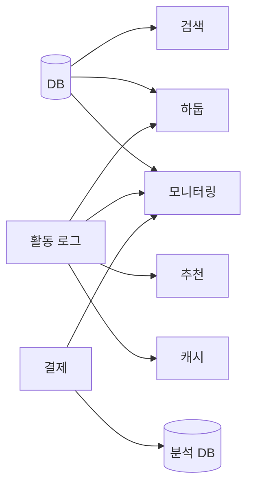
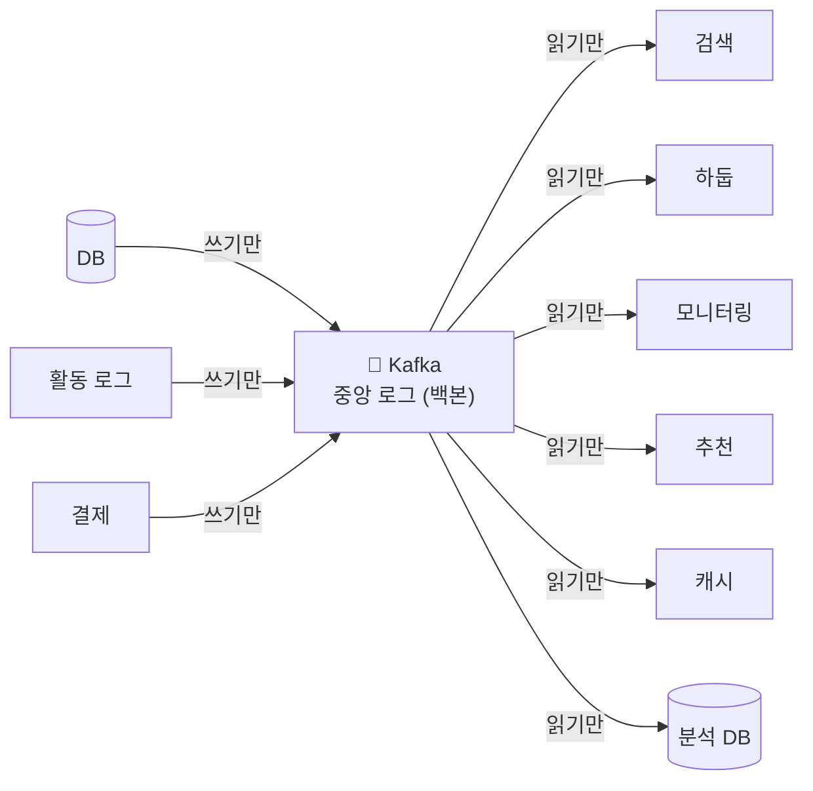

# 들어가며: Kafka는 무엇을 풀려고 태어났나

> ⚠️ **러프 초안.** 책의 프롤로그. 용어를 외우기 전에 **맥락**을 먼저 잡는 장.
> 다음 장: [1장. Kafka란 무엇인가](./01-what-is-kafka.md)

---

## 이 책을 읽는 법

기술을 "이름"으로 외우면 금방 잊는다. `acks`, `ISR`, `Connect`, `KRaft`... 단어를 암기하는 순간 맥락이 사라진다.

이 책은 반대로 간다. **"무슨 문제가 있었고, 그걸 풀려고 무엇이 나왔나"** 를 먼저 깔고, 그 흐름 위에 용어를 얹는다. 그러면 `KRaft`는 외울 단어가 아니라 *"아, ZooKeeper가 불편해서 Kafka가 스스로 해결하게 만든 거구나"* 라는 **이야기의 한 장면**이 된다.

그리고 모든 핵심 주장은 **돌아가는 테스트로 증명한다.** 읽고 → 의심하고 → 직접 돌려본다. (다만 이 프롤로그·개념 장 자체엔 테스트가 없다 — 런타임 증명은 뒤 장과 II권 Spring Step이 맡는다.)

---

## Kafka 이전의 세계: N×M 통합 지옥

2010년 무렵 LinkedIn. 회사 안에 시스템이 수십 개였다. 관계형 DB, 검색 엔진, 캐시, 데이터 웨어하우스(하둡), 모니터링, 로그 수집, 추천 엔진...

문제는 **이들이 서로 데이터를 주고받아야 한다는 것**이었다. DB의 변경을 검색 엔진에 반영하고, 사용자 활동 로그를 하둡과 모니터링과 추천에 동시에 보내고...

> *소스 N개 × 목적지 M개 → point-to-point 파이프라인이 **N×M개로 폭발**.*

- 시스템 하나를 추가할 때마다 **기존 모든 시스템과 새로 이어야** 했다.
- 기존 메시지 큐(ActiveMQ 등)는 **LinkedIn 규모의 처리량**과, **임의 시점부터의 재생을 여러 독립 소비자가 값싸게** 하는 데 맞지 않았다. (persistent 전달·durable 구독 자체는 있었지만, 큐 시맨틱에서는 읽으면 사라져 다수 소비자의 독립 재처리가 비쌌다.)

> 핵심 통증: **통합의 복잡도가 N×M으로 폭발**하고, 한 번 흘려보낸 데이터를 **다시 읽을 수 없었다.**

---

## 발상의 전환: "모든 데이터를 하나의 로그로 흘려보낸다"

LinkedIn의 팀(Jay Kreps 등)이 내린 결론은 단순했다:

> **시스템끼리 직접 잇지 말자. 중앙에 "로그" 하나를 두고, 모두가 거기에 쓰고, 거기서 읽게 하자.**

- 통합 복잡도가 **N×M → N+M** 으로 줄었다.
- 생산자와 소비자가 **서로를 모른다**(디커플링). 새 소비자는 그냥 로그를 구독하면 된다.
- 로그는 (retention 범위 내에서) **읽어도 지워지지 않으니** 새 소비자가 **과거부터 다시 읽을** 수 있다. (retention/compaction 트레이드오프는 → 2·8장)

이것이 Kafka의 정체성이다. **메시지 큐가 아니라 "실시간 데이터의 중앙 로그(데이터 백본)"** 다.

> 왜 하필 "로그"라는 자료구조가 이 일에 그렇게 잘 맞는지(디커플링·버퍼·재생·영속)는 → [1장](./01-what-is-kafka.md)에서 이어진다.

> 💡 참고: 이름 'Kafka'는 작가 프란츠 카프카에서 따왔을 뿐, 기능과 무관하다. **이름은 외울 게 못 된다.** 이 책이 맥락을 강조하는 이유다.

---

## 생태계는 "결핍"에서 하나씩 자라났다

Kafka의 핵심(Core)은 의외로 단순하다: **로그에 쓰는 Producer, 저장하는 Broker, 읽는 Consumer.** 그게 전부다.

그런데 현장에서 쓰다 보니 핵심만으로는 부족한 지점들이 드러났고, **그 결핍마다 새 도구가 태어났다.** 이름이 아니라 "어떤 불편을 메웠나"로 읽어보자.

| 결핍 (불편했던 점) | 그래서 나온 것 | 한 줄 |
|--------------------|----------------|-------|
| DB·파일·S3 같은 외부 시스템을 Kafka에 붙이려고 **매번 Producer/Consumer를 직접 짜야** 했다 | **Kafka Connect** | 코드 대신 **설정**으로 외부 시스템 ↔ Kafka 파이프라인 구성 (위 N×M 그림의 양 끝을 자동화) |
| 로그를 단순 전달이 아니라 **변환·집계·조인** 하고 싶은데, 그러려고 Spark/Flink 별도 클러스터를 띄우기는 무거웠다 | **Kafka Streams** | 별도 클러스터 없이 **라이브러리**로 스트림 처리 (상태 저장·윈도우 집계) |
| Streams마저 코드인데, **SQL로** 스트림을 다루고 싶었다 | **ksqlDB** | `SELECT ... FROM stream` 으로 실시간 처리 |
| Producer가 메시지 형식을 바꾸면 **Consumer가 조용히 깨졌다** (데이터 계약 부재) | **Schema Registry** | 스키마(Avro 등)를 중앙에서 관리하고 호환성을 강제 |
| 메타데이터·리더 선출을 **ZooKeeper라는 외부 시스템**에 의존해서 운영이 무겁고 느렸다 | **KRaft** | Kafka가 **스스로** 합의(Raft)해서 메타데이터를 관리(외부 의존 제거) |

> ※ **Apache Kafka에 기본 포함**된 것은 Connect·Streams·KRaft이고, **ksqlDB·Schema Registry는 Confluent 제품**(Community License)이다. 같은 "Kafka 생태계"라도 출처가 다르다.

> **KRaft가 특히 우아한 이유**: "데이터를 로그로 관리하자"는 Kafka의 핵심 발상을, **Kafka 자신의 메타데이터에도 적용**한 것이다. 클러스터 상태마저 `__cluster_metadata`라는 내부 로그에 쌓는다. (Kafka 3.3에서 안정화, 4.0에서 ZooKeeper 완전 제거. 이 lab도 KRaft 모드로 동작한다.)

---

## 이 책의 지도

- **Core(Producer/Consumer/Broker)의 원리와 함정**이 본진이다. 가장 많이 쓰고, 가장 많이 데이는 곳.
- 같은 주제를 **I권(원리) → II권(코드·Spring) → III권(운영)** 세 깊이로 내려가며 다룬다. (권 정의는 [전체 표지](../README.md)가 단일 진실)
- 전체 구성과 진행 상태 → [전체 표지](../README.md) · [ROADMAP.md](../../ROADMAP.md)

---

## 다음 장

→ [1장. Kafka란 무엇인가](./01-what-is-kafka.md): "로그"라는 자료구조와 가장 작은 단위들(Topic·Partition·Offset), 그리고 왜 이렇게 설계했는가.
