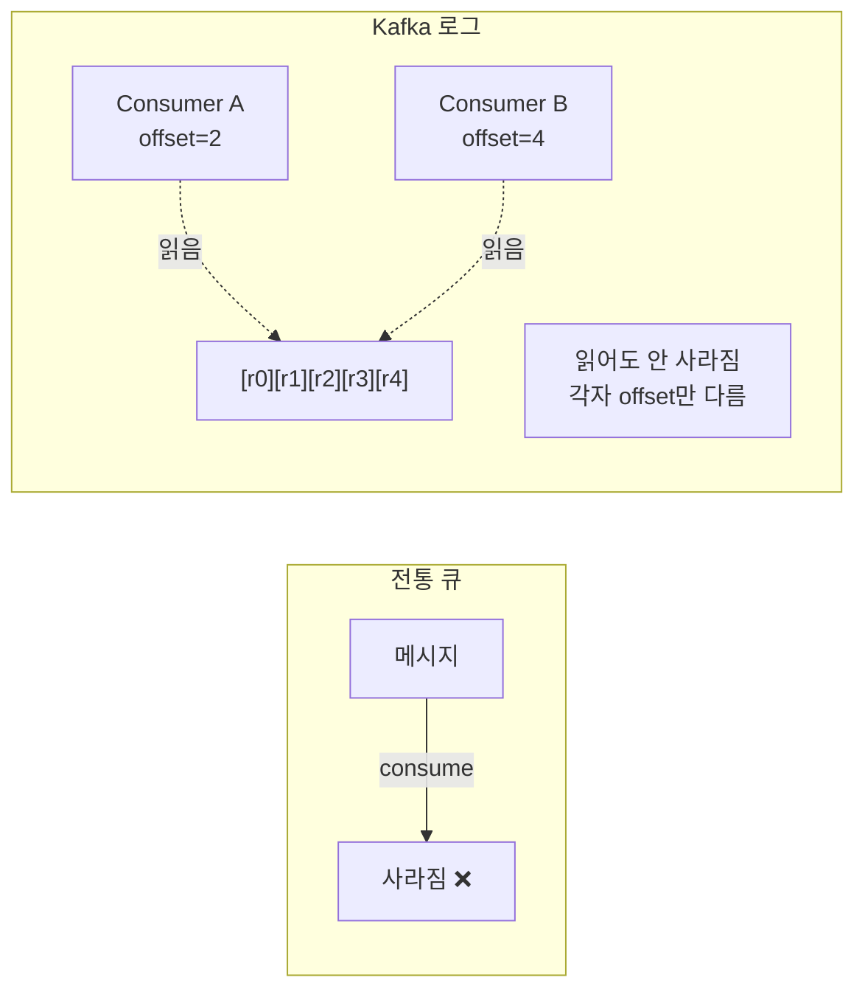
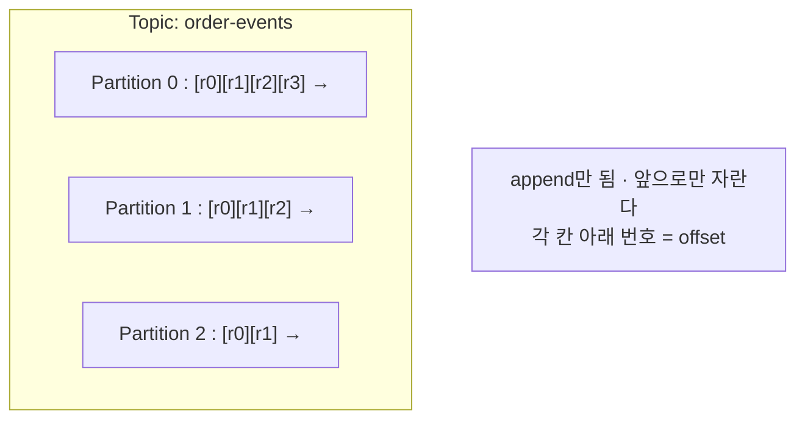
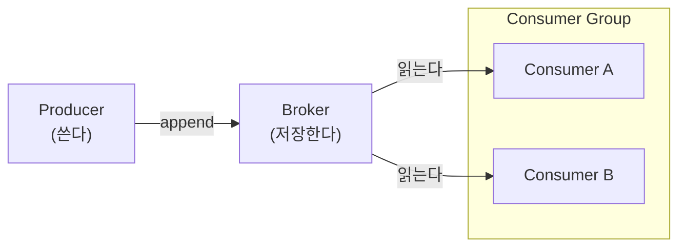

# 1장. Kafka란 무엇인가

> ⚠️ **러프 초안.** 책의 도입부 개념장. 서술 → 증명(테스트) 순서로 채워가는 중.
> 앞 장: [들어가며 — Kafka는 무엇을 풀려고 태어났나](./00-prologue.md)
> 이 장의 다음(2~5장)은 [KAFKA-ARCHITECTURE.md](../../../KAFKA-ARCHITECTURE.md)(클러스터·복제·컨트롤러·코디네이터)의 내용을 분해·흡수한다.

---

## 1.1 한 문장으로

**Kafka는 분산된, 복제되는, 순서가 보장되는 append-only 로그(commit log)다.**

흔히 "메시지 큐"라고 부르지만, 본질은 큐가 아니라 **로그**다. 이 한 끗 차이가 Kafka의 거의 모든 동작을 설명한다.

---

## 1.2 "큐가 아니라 로그"가 왜 중요한가

전통적인 메시지 큐(RabbitMQ 등)와 Kafka의 결정적 차이:

| | 전통 큐 | Kafka (로그) |
|---|---------|-------------|
| 메시지를 읽으면 | **사라진다** (소비 = 삭제) | **안 사라진다** (offset만 앞으로 이동) |
| 보관 | 소비될 때까지 | retention 기간 동안 (읽든 안 읽든) |
| 같은 메시지를 여러 소비자가 | 어렵다 (경쟁 소비) | 자연스럽다 (각자 자기 offset) |
| 과거로 되감기(replay) | 불가능 | 가능 (offset을 뒤로) |

**핵심**: Kafka는 "읽어도 지워지지 않는 로그"다. 소비자는 데이터를 가져가는 게 아니라 **"어디까지 읽었는지(offset)"만 기억**한다.

> ⚠️ (경계) 이 "읽어도 안 사라짐"은 **consumer group 소비 한정**이다. Kafka의 **share group**(KIP-932, 4.2 GA)은 레코드별 ack·락 기반의 **큐 시맨틱**을 더한다 — 저장은 여전히 append-only 로그이고, 그 **위에 큐 시맨틱을 얹는** 것이다(→ 10장). `[KIP-932 · docs @4.2]`

> 이 성질이 뿌리가 되는 곳:
> - 여러 소비자 독립 소비 → Consumer Group
> - 과거 재처리(replay), 장애 복구 → **II권 Consumer(offset)**, **EOS(재처리/멱등)**

---

## 1.3 가장 작은 단위들 (어휘)

- **Record** — 한 건의 메시지. `key`, `value`, `timestamp`, `headers`, `offset`으로 구성.
- **Topic** — 레코드가 쌓이는, 이름 붙은 로그. (논리적 단위)
- **Partition** — Topic을 쪼갠 **물리적 로그 조각**. 두 가지가 핵심:
  - **순서는 파티션 "안에서만" 보장된다.** Topic 전체 순서는 보장하지 않는다.
  - **병렬 처리의 단위다.** 파티션 수가 곧 최대 동시 소비자 수.
- **Offset** — 파티션 안에서 레코드의 위치 번호. 단조 증가하며 절대 재사용되지 않는다.

> "순서는 파티션 안에서만"이 뿌리가 되는 곳: **II권 Partition & 순서**

---

## 1.4 등장인물

| 역할 | 하는 일 | 한 줄 |
|------|---------|-------|
| **Producer** | 쓴다 (append) | key로 어느 파티션에 넣을지 결정 |
| **Broker** | 저장한다 | 디스크에 append-only로 기록하는 서버 |
| **Consumer** | 읽는다 | offset을 들고 다니며 "어디까지 읽었는지" 스스로 기억 |
| **Consumer Group** | 나눠 읽는다 | 여러 Consumer가 파티션을 분담하는 단위 |

> 여러 Broker가 모여 이루는 **Cluster**, 그 두뇌인 **Controller**, Consumer Group을 관리하는 **Coordinator**는
> I권 3~5장에서 제1원리로 깊게 다룬다.

---

## 1.5 왜 이렇게 설계했나 — 3가지 근본 결정

개념을 외우는 것보다, **"왜 이런 선택을 했는가"** 를 이해하면 나머지가 따라온다.

### ① 디스크에 쓰는데 왜 빠른가?

"디스크 = 느리다"는 통념이 깨지는 지점. Kafka는
- **순차 append**만 한다 (랜덤 쓰기 X) → 디스크도 순차는 빠르다
- **OS page cache**를 활용한다 (JVM 힙이 아니라)
- **zero-copy(sendfile)** 로 디스크→네트워크를 커널에서 바로 전송

→ "메시지 큐인데 왜 로그 파일에 쌓나"의 답. (deep-dive: **I권 7장 저장 엔진**)

### ② 순서 보장을 왜 파티션 단위로 "좁혔나"?

- Topic 전체 순서를 보장하려면 → 단일 로그 → 단일 스레드 → **확장 불가**
- 파티션별 순서만 보장하면 → **병렬 처리 + 부분 순서**를 동시에 얻음
- 대가: "전체 순서"가 필요하면 파티션 1개를 쓰거나, key 설계로 풀어야 함

→ 처리량과 순서의 **트레이드오프**.

### ③ 왜 Consumer가 offset을 들고 다니나 (pull 모델)?

- Broker는 **상태를 적게** 갖는다 ("누가 어디까지 읽었나"를 신경 쓰지 않음)
- Consumer가 **자기 속도로** 당겨간다(pull). 느린 소비자가 빠른 소비자를 막지 않음
- 재처리도 Consumer가 offset만 되감으면 됨

→ Broker는 단순하게, 제어권은 Consumer에게.

---

## 1.6 이 책은 개념을 "증명"한다 (executable book)

이 책의 모든 핵심 주장에는 **돌아가는 테스트**가 붙는다. 읽고 → 의심하고 → 직접 돌려 확인한다.

| 이 장의 개념 | 증명하는 곳 |
|--------------|------------|
| 읽어도 안 사라진다 (offset만 이동) | II권 Consumer — `seek으로_특정_offset부터_재소비할_수_있다` |
| 순서는 파티션 안에서만 | II권 Partition — `같은_key로_발행하면_같은_파티션에_들어가_순서가_보장된다` |
| 파티션 수 = 병렬성의 한계 | II권 Partition — `Consumer_수가_파티션_수보다_많으면_놀리는_Consumer가_발생한다` |
| pull 모델 / Consumer가 offset 관리 | II권 Consumer — AckMode, auto-commit 함정 |

---

## 1.7 다음 장

→ **2장. 로그라는 추상** — 왜 하필 append-only 로그인가, "현재 상태는 로그의 파생물"이라는 발상.
→ 이어서 **3장. 복제** — 이 로그가 어떻게 죽지 않고 살아남는가 (ISR·HW·leader epoch).

← [들어가며](./00-prologue.md) · [I권 목차](./README.md) · [용어집](../../GLOSSARY.md)
