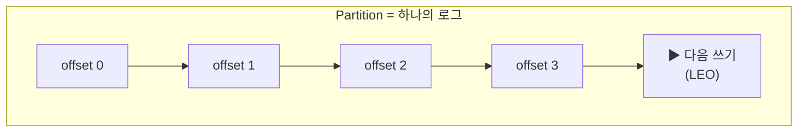
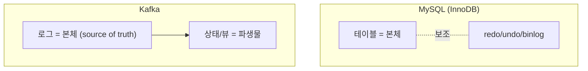
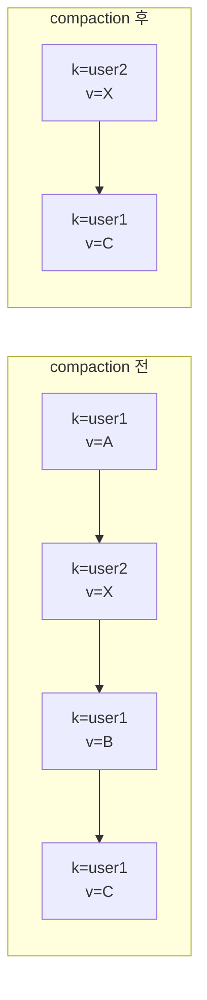

# 2장. 로그라는 추상

> 앞 장: [1장 Kafka란 무엇인가](./01-what-is-kafka.md) · 다음 장: [3장 복제](./03-replication.md)
>
> **이 장의 보장(한 문장)**: *Kafka에서 상태는 로그의 파생물이다 — append-only 로그가 진실의 원천(source of truth)이고, 모든 뷰는 그 로그를 재생(replay)해 만든다.*

1장에서 우리는 Kafka를 "큐가 아니라 로그"라고 불렀다. 이 장은 그 한 문장을 끝까지 밀어붙인다. **왜 하필 로그라는 자료구조였나**, 그리고 그 선택이 어떻게 Kafka의 거의 모든 동작을 결정하는가.

---

## 2.1 로그의 세 가지 성질 — append-only · 불변 · 단조 offset

Kafka의 로그는 우리가 흔히 말하는 "애플리케이션 로그(log4j가 찍는 텍스트)"가 아니다. 컴퓨터 과학에서 말하는 **commit log** — *추가만 되고(append-only), 한 번 쓰이면 바뀌지 않으며(immutable), 순서가 있는(ordered)* 레코드의 연속이다.



세 성질이 각각 무엇을 가능하게 하는가:

- **append-only**: 쓰기는 항상 로그의 끝에 붙는다. 중간을 고치지 않는다. → 순차 I/O만 발생하고(8장에서 이게 왜 빠른지 본다), 동시성 제어가 단순해진다(끝에만 쓰니까).
- **불변(immutable)**: offset 42의 레코드는 영원히 그대로다. → 누가 언제 읽어도 같은 값. **재생 가능성(replayability)** 의 토대다.
- **단조 offset**: offset은 파티션 안에서 0부터 1씩 증가하고, 재사용되지 않으며, 비어 있어도 되돌아가지 않는다. → offset은 단순한 "위치"이자 동시에 **논리적 시계(logical clock)** 다. "어디까지 읽었나"를 offset 하나로 표현할 수 있는 이유다.

> 이 세 성질은 뒤의 모든 장으로 흘러간다. 복제(3장)는 "같은 로그를 여러 노드에 복사", 합의(4장)는 "메타데이터도 로그로", 트랜잭션(7장)은 "control record를 로그에 끼워넣기", 저장 엔진(8장)은 "이 로그를 디스크에 어떻게 놓나"다.

---

## 2.2 왜 로그인가 — 큐도 테이블도 아닌 이유

로그의 의미는 **무엇이 아닌지**와 대비할 때 선명해진다.

### 큐(queue)와의 차이 — 소비가 곧 삭제인가

전통 메시지 큐(RabbitMQ 등)에서 메시지는 소비되면 사라진다. 큐는 "전달 후 폐기"가 본질이다. Kafka는 소비해도 로그가 그대로 남고, **소비자는 자기 offset만 앞으로 옮긴다**. 그래서:

- 여러 소비자(그룹)가 같은 로그를 **독립적으로** 읽는다.
- offset을 되감으면 **과거를 다시 읽는다**(replay).
- 데이터의 수명은 소비 여부가 아니라 **retention 정책**이 정한다(8장).

### 테이블(table)과의 차이 — 무엇이 본체인가

이게 더 근본적이다. 관계형 DB는 **테이블(현재 상태)이 본체**이고, 로그(redo/undo/binlog)는 그 상태를 지키거나 복제하기 위한 *보조*다.

Kafka는 정확히 **거꾸로**다.



- MySQL: "현재 잔고는 얼마인가"가 테이블에 직접 저장되고, 로그는 그걸 복구/복제하는 수단.
- Kafka: "입금 +1000, 출금 -300, ..."이라는 **사건의 로그가 본체**이고, "현재 잔고"는 그 로그를 접어서(fold) 만드는 **파생 결과**다.

이 한 끗이 다음 절의 핵심으로 이어진다.

---

## 2.3 상태 = fold(로그)

"로그가 본체"라는 말의 실제 의미: **어떤 상태든 로그를 처음부터 접으면(fold/reduce) 재현할 수 있다.**

```
상태 = 초기값에서 시작해, 로그의 각 이벤트를 차례로 적용한 결과
     = fold(이벤트0, 이벤트1, 이벤트2, ...)
```

- 같은 로그를 같은 함수로 접으면 **항상 같은 상태**가 나온다(결정성).
- 그래서 새 소비자가 "처음부터 다시 읽어" 자기만의 뷰(검색 인덱스·캐시·집계 테이블)를 만들 수 있다. → 이게 1장에서 본 **N×M 통합을 N+M으로** 바꾼 힘의 정체다.

이 사고방식은 event sourcing, materialized view, CQRS의 뿌리이기도 하다. 다만 **이벤트 설계·Outbox 같은 애플리케이션 패턴은 이 책의 범위가 아니다**(→ messaging-lab). 여기서는 "Kafka의 로그가 그런 구조를 *물리적으로 가능하게 한다*"는 점까지만 짚는다.

---

## 2.4 Log Compaction의 "의미" — 로그를 상태 스냅샷으로

로그가 무한히 자라면 "처음부터 fold"는 점점 비싸진다. 여기서 **log compaction**이 등장한다.

핵심 아이디어: **같은 key의 오래된 레코드를 버리고, key별로 최신 값만 남긴다.**



그 결과 compaction된 토픽은 **"key→최신값"의 스냅샷**, 즉 *로그로 표현된 테이블*이 된다. `key=null`로 쓰는 **tombstone**은 "이 key를 삭제하라"는 표식이다.

> 여기서는 compaction의 **의미**(상태 스냅샷)만 다룬다. cleaner 스레드가 *어떻게* 세그먼트를 청소하는지의 **메커니즘**은 → [8장 저장 엔진](#). (의미와 메커니즘을 두 장으로 나누는 건 SSOT 원칙이다.)

이 "로그=테이블" 성질은 Kafka 자신도 적극 활용한다. consumer offset을 저장하는 `__consumer_offsets`, 클러스터 메타데이터를 담는 `__cluster_metadata`가 전부 compacted 로그다(4·5장).

---

## 2.5 Stream–Table Duality

2.3(상태=fold)과 2.4(compaction=스냅샷)를 합치면 한 가지 통찰이 나온다: **로그(스트림)와 테이블(스냅샷)은 같은 것의 두 표현이다.**

- 로그를 접으면(fold) → 테이블이 된다.
- 테이블의 변경을 흘려보내면(changelog) → 로그가 된다.

이 **stream–table duality**는 Kafka Streams의 `KStream`/`KTable`이 서 있는 토대다. 다만 Streams 자체는 Core 밖이므로 → [IV권 Beyond Core](../4-beyond-core/README.md). 여기서는 "그 다리가 2장의 로그 추상에서 출발한다"는 씨앗만 심는다.

---

## 2.6 메타데이터도 로그다

Kafka 설계의 일관성을 보여주는 대목: **Kafka는 자기 자신의 상태마저 로그로 관리한다.**

| 무엇 | 어디에 | 다루는 장 |
|------|--------|----------|
| consumer 커밋 offset | `__consumer_offsets` (compacted) | 5장 |
| 클러스터 메타데이터(토픽·리더·ISR) | `__cluster_metadata` (KRaft) | 4장 |
| 트랜잭션 상태 | `__transaction_state` | 7장 |
| commit/abort 경계 | control record (데이터 로그 안에) | 7장 |

"데이터를 로그로 다루자"는 발상을 메타데이터에까지 밀어붙인 것 — 이게 KRaft가 우아한 이유의 핵심이고, 4장에서 본격적으로 다룬다.

---

## 2.7 트레이드오프와 증명

**트레이드오프**
- 로그는 무한히 쌓인다 → retention(시간/크기 기반 삭제)이나 compaction으로 잘라야 한다(8장).
- "매번 처음부터 fold"는 비싸다 → 스냅샷/compaction으로 완화.
- 불변성의 대가: 수정·삭제가 1급 시민이 아니다. 특정 레코드 삭제(GDPR 등)는 compaction + tombstone으로 우회한다.

**증명 (executable — 멀티브로커에서)**
- compaction 토픽에 같은 key를 여러 번 쓰고 cleaner 후 **key별 최신만 남는지** 확인 `[테스트로 결정]`
- `value=null`(tombstone) 발행 후 해당 key가 사라지는지
- 같은 로그를 두 consumer group이 각자 처음부터 읽어 **동일 결과**(결정성)를 내는지

---

## 참조

- Jay Kreps, *The Log: What every software engineer should know about real-time data's unifying abstraction* (2013) — 이 장의 사상적 출처 `[Tier 3]`
- *Designing Data-Intensive Applications* (Kleppmann) 11장(스트림 처리)·3장(로그 구조 저장소) `[Tier 3]`
- Kafka 공식 문서 — Log Compaction `[docs @3.7]`

← [1장](./01-what-is-kafka.md) · [I권 목차](./README.md) · 다음: [3장 복제](./03-replication.md)
