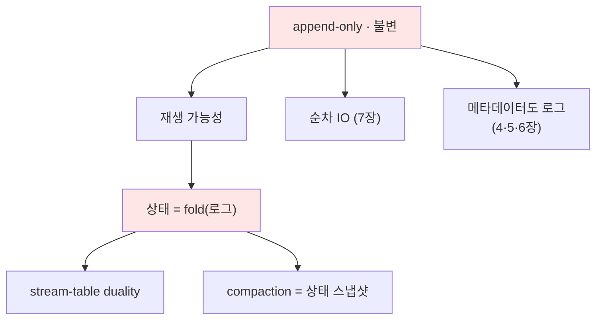

# 2장. 로그라는 추상 〔요소 추출 stub〕

> ⚠️ **장 명세(stub).** 산문 전 요소·의존·실험을 추출한다. 틀 → [I권 README](./README.md)
>
> **보장(한 문장)**: *"상태는 로그의 파생물이다 — append-only 로그가 진실의 원천(source of truth)이고, 모든 뷰는 그것을 재생(replay)해 만든다."*

---

## ① 무엇을 보장하나 (다룰 요소)

- 로그는 **불변(immutable)·추가만(append-only)·순서 있음(ordered)**
- offset의 **단조 증가·불변·재사용 없음** → "위치"이자 "논리적 시계"
- 한 번 쓰인 레코드는 바뀌지 않는다 → 재생 가능성(replayability)의 근거

## ② 왜 "로그"인가 — 대안 비교 (다룰 요소)

- 큐(소비=삭제) vs 로그(소비=offset 이동): 1장에서 본 차이의 *근본 이유*
- 가변 상태(테이블) 우선 vs 로그 우선: **MySQL은 테이블이 본체, 로그가 보조 / Kafka는 로그가 본체, 상태가 파생**
- append-only가 주는 것: 순차 IO(7장), 동시성 단순화(잠금 최소), 감사·디버깅, 시간여행

## ③ 구조·개념 (다룰 요소)

- **상태 = fold(로그)**: 이벤트를 접으면 현재 상태 (event sourcing, materialized view)
- **로그 압축(compaction)의 의미**: 키별 최신 레코드만 남기면 = "최신 상태 스냅샷"(changelog 토픽). *메커니즘은 7장, 의미는 여기*
- **stream-table duality**: 로그(스트림) ↔ 테이블(스냅샷)은 같은 것의 두 표현 (→ Streams)
- tombstone(키 삭제 표식)의 의미

## ④ 다른 개념과의 관계 (다룰 요소)

- **메타데이터도 로그**: `__cluster_metadata`(4장), `__consumer_offsets`(5장) — Kafka는 자기 상태마저 로그로
- **트랜잭션도 로그**: control record가 로그에 박힌다(6장)
- 물리 구현은 7장(segment/page cache)

## 요소 의존 그래프

## ⑤ 트레이드오프 (다룰 요소)

- 무한히 쌓이는 로그 → retention/compaction으로 절단 (7장)
- "상태를 매번 재생"의 비용 → 스냅샷/compaction으로 완화
- 불변성의 대가: 수정/삭제가 1급이 아님 (GDPR 삭제 등은 compaction+tombstone으로)

## ⑥ 증명 실험 후보

| 실험 | 관측/단언 |
|------|----------|
| compaction 토픽에 같은 key 여러 번 쓰기 | cleaner 후 키별 최신만 남음 |
| tombstone(value=null) 발행 | 해당 key가 사라짐 |
| 같은 로그를 두 consumer group이 재생 | 동일 결과 도출(결정성) |

## 참조 (적극 인용)

- Jay Kreps, *"The Log: What every software engineer should know about real-time data's unifying abstraction"* (2013) — 이 장의 사상적 출처
- DDIA(*Designing Data-Intensive Applications*) 11장(스트림 처리), 3장(로그 구조 저장소)
- Kafka 공식 design 문서 — Log Compaction

## 열린 질문

- event sourcing/CQRS를 어디까지 (messaging-lab 경계와 중복 주의)
- stream-table duality는 여기서 씨앗만, 본격은 Streams(별도 lab)로?

---

← [1장](./01-what-is-kafka.md) · 다음: [3장 복제](./03-replication.md)
