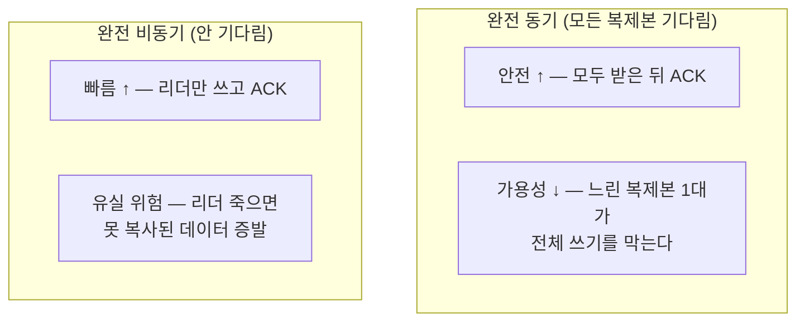
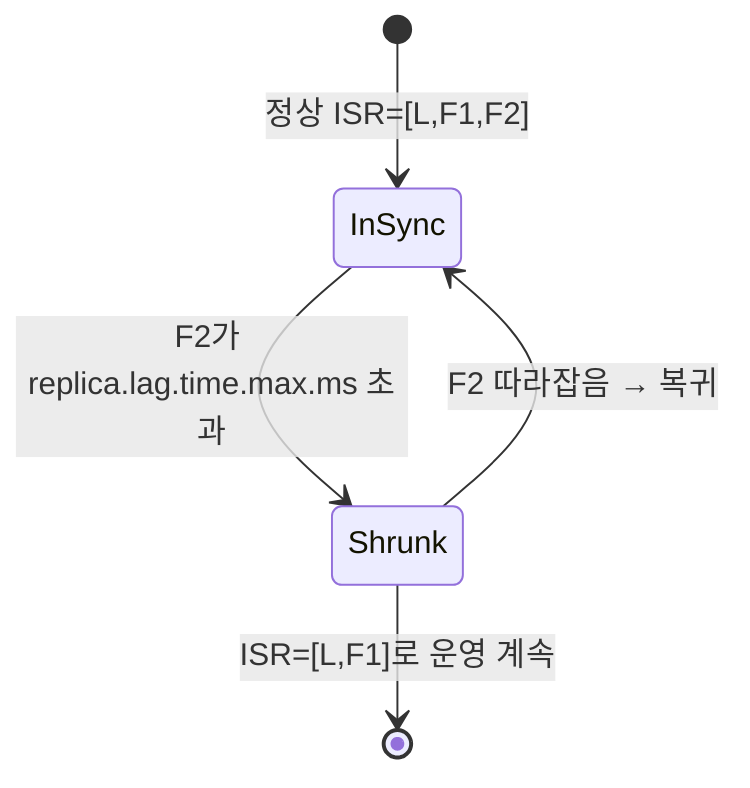
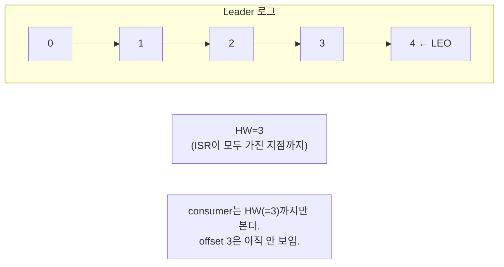
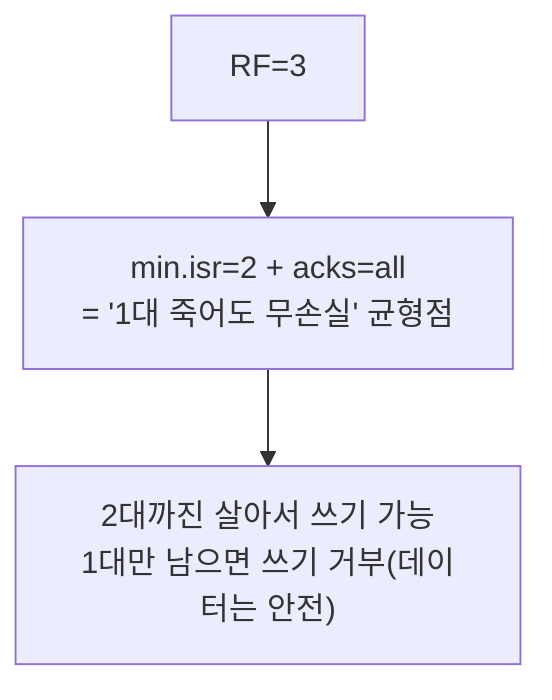
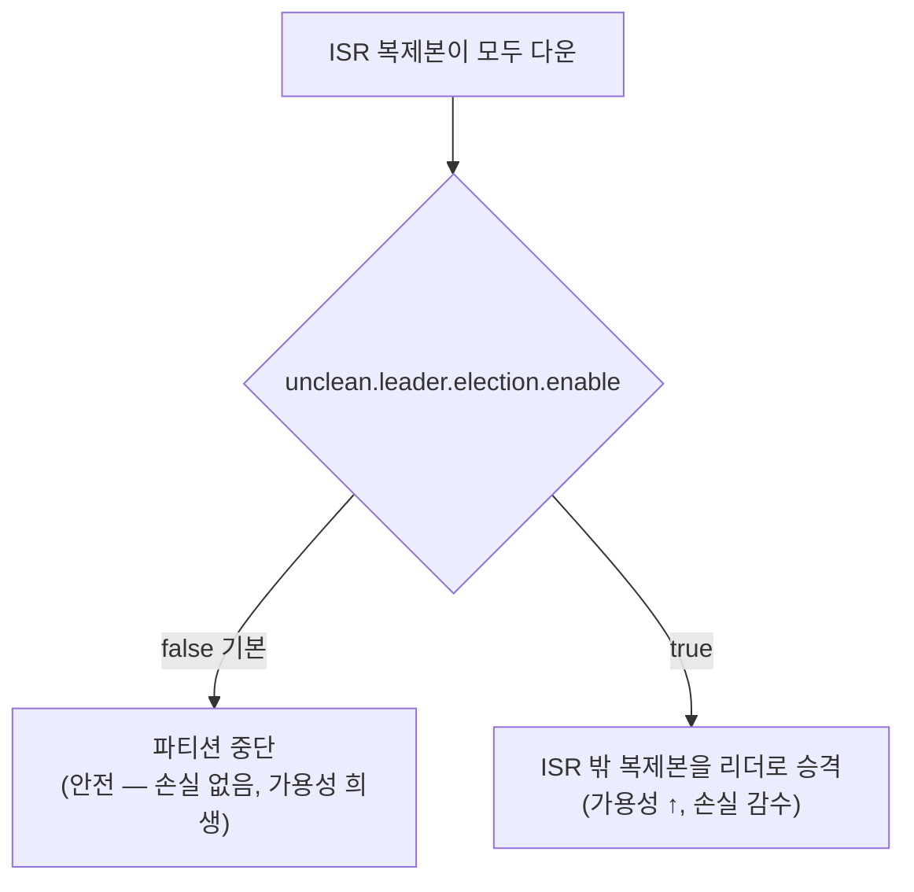
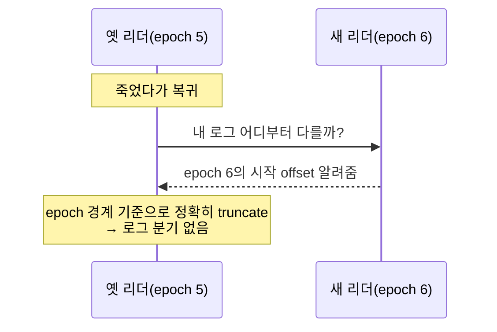
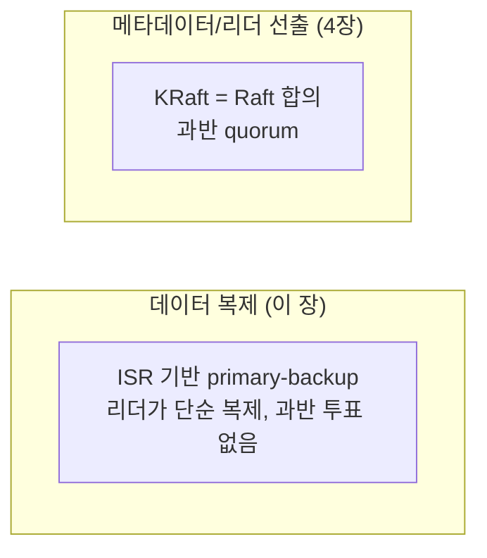

# 3장. 복제 — 데이터는 어떻게 살아남나

> 앞 장: [2장 로그라는 추상](./02-log-abstraction.md) · 다음 장: [4장 합의(KRaft)](./04-consensus.md)
>
> **이 장의 보장(한 문장)**: *커밋으로 인정된 메시지는 `min.insync.replicas`개의 복제본 로그에 존재한다 — 그 수보다 적은 수의 브로커 동시 장애까지 무손실이다.*

2장에서 로그는 "진실의 원천"이었다. 그런데 그 로그가 한 대의 브로커 디스크에만 있다면? 그 브로커가 죽는 순간 진실이 사라진다. 이 장은 **로그를 어떻게 죽지 않게 만드는가**, 그리고 그 과정에서 "커밋됐다"는 말이 정확히 무엇을 뜻하는가를 다룬다.

---

## 3.1 문제: 브로커는 언젠가 죽는다

단일 브로커는 두 가지를 동시에 잃을 위험이 있다.
- **내구성(durability)**: 디스크가 깨지면 데이터가 사라진다.
- **가용성(availability)**: 프로세스가 죽으면 읽기·쓰기가 멈춘다.

특히 최악은 **"프로듀서에게 성공이라고 응답했는데 그 데이터가 사라지는 것"** 이다. 실패는 재시도하면 되지만, "성공했다고 믿었는데 없는" 데이터는 복구할 길이 없다. 복제는 바로 이 최악을 막기 위한 장치다.

→ 그래서 이 lab의 기본 환경은 **3-broker 클러스터**다(단일 브로커로는 이 장의 어떤 것도 증명할 수 없다).

---

## 3.2 복제의 딜레마 — 완전 동기 vs 완전 비동기

리더(leader) 복제본에 쓴 데이터를 팔로워(follower)들에게 복사한다고 하자. 리더는 **언제 프로듀서에게 "성공"이라고 답해야 하는가?**

두 극단 모두 실무에선 못 쓴다. 완전 동기는 가장 느린 한 대에 전체가 인질로 잡히고, 완전 비동기는 내구성 보장이 없다. Kafka의 답은 그 사이의 절충 — **ISR**이다.

---

## 3.3 ISR — "지금 따라잡은 복제본만 기다린다"

**ISR(In-Sync Replicas)** 은 *리더를 충분히 따라잡은 복제본들의 집합*이다. 리더는 ISR에 든 복제본까지만 기다리고 ACK한다.

- 복제는 **pull 모델**이다: 팔로워가 리더에게 `Fetch` 요청을 보내 데이터를 당겨간다(리더가 밀어넣지 않는다). 리더는 각 팔로워가 어디까지 가져갔는지(fetch offset)를 추적한다.
- 팔로워가 `replica.lag.time.max.ms` 안에 따라오지 못하면 **ISR에서 축출**된다. 다시 따라잡으면 복귀한다.
- ISR 멤버십 변경을 최종 기록하는 주체는 **컨트롤러**다(→ 4장).

핵심: ISR은 **뒤처진 놈은 빼서 가용성을 지키고, 들어와 있는 놈은 반드시 기다려 내구성을 지킨다**. 동기/비동기의 절충을 *런타임에 동적으로* 한다.

> Kafka는 과반(quorum) 복제가 아니라 ISR 기반이다 — 같은 내구성을 더 적은 복제본으로, 더 낮은 지연으로 얻기 위한 선택. (왜 데이터 복제에 합의 알고리즘을 안 쓰는지는 3.8과 4장.)

---

## 3.4 "커밋"이란 무엇인가 — High Watermark

이제 핵심 정의. 복제본마다 자기가 가진 로그의 끝이 다르다.

- **LEO (Log End Offset)**: 각 복제본이 가진 마지막 offset + 1 (다음 쓸 자리).
- **HW (High Watermark)**: **ISR 전체의 LEO 중 최소값**.

**consumer는 HW까지만 읽을 수 있다.** 왜? HW 이전은 ISR 전체가 가진 데이터라 "어느 한 대가 죽어도 살아남는" 데이터다. HW 이후는 아직 일부만 가진 데이터라, 리더가 죽으면 사라질 수 있다 → 그래서 **안 보여준다**. "안 보이는 데이터는 유실로 치지 않는다"가 일관성의 핵심이다.

> 단, 트랜잭션을 쓰는 경우 `read_committed` 소비자의 가시성 경계는 HW가 아니라 **LSO**까지다(LSO ≤ HW). 트랜잭션은 아직 안 배웠으니 여기선 HW로 단순화하고, 정확한 경계는 [7.5](./07-transactions.md)에서 다룬다.

→ **"커밋됐다 = HW에 도달했다 = consumer에게 보인다"**. 이 정의가 7장 트랜잭션의 LSO로 확장된다.

---

## 3.5 보장의 다이얼 — acks × min.insync.replicas × RF

내구성은 세 설정의 **조합**으로 결정된다. 하나만으로는 보장이 안 선다.

| 설정 | 레벨 | 의미 |
|------|------|------|
| `acks` | **프로듀서** | 0(안 기다림) / 1(리더만) / all(ISR 전체) |
| `min.insync.replicas` | **토픽·브로커** | ISR이 이 수 미만이면 `acks=all` 쓰기를 거부 |
| RF(replication factor) | **토픽** | 복제본 총 개수 |

★ **핵심 함정**: `acks`는 프로듀서 설정, `min.insync.replicas`는 토픽/브로커 설정이다. **둘이 만나야** 보장이 선다.

- `acks=all` 인데 `min.insync.replicas=1` → ISR이 리더 1대로 줄어도 쓰기가 허용된다. 즉 **사실상 `acks=1`로 퇴화**한다. `[docs @3.7]`
- 그래서 의미 있는 조합은 **RF=3 + min.insync.replicas=2 + acks=all**.

이 lab의 docker-compose 기본값이 `RF=3 / min.insync.replicas=2`인 이유가 이것이다.

> **경계**: 여기까지가 I권(원리 = 무엇을 보장하나). "내 SLO에서 min.isr를 2로 둘지 3으로 둘지"는 트레이드오프 판단이라 → III권 Operations. (correctness=I / 트레이드오프=III)

---

## 3.6 리더가 죽으면 — 선출과 unclean election

리더 브로커가 죽으면 컨트롤러가 **ISR 안에서 새 리더를 뽑는다**(→ 4장). ISR 안에서 뽑으니 새 리더는 HW까지의 데이터를 갖고 있다 → 무손실.

그런데 **ISR이 전부 죽으면?** 두 갈래다:

- `false`(기본): 안전하지만 그 파티션은 ISR이 살아날 때까지 멈춘다.
- `true`: 뒤처졌던 복제본이라도 리더로 올려 서비스를 잇는다 — 대신 그 복제본에 없던 데이터는 **영구 손실**.

이건 전형적인 **일관성 ↔ 가용성** 트레이드오프(CAP/PACELC)다. 어느 쪽을 켤지는 운영 판단(→ III권).

---

## 3.7 로그가 어긋나지 않으려면 — Leader Epoch

여기가 이 장에서 가장 미묘하고 중요한 부분이다.

순진하게 "HW 기준으로 로그를 잘라(truncate) 맞춘다"고 하면, 리더가 연달아 바뀌는 상황에서 **복제본 간 로그가 영구히 어긋나는(divergence)** 버그가 생긴다. 옛 리더가 죽었다 살아 돌아왔을 때, 누구의 로그가 진짜인지 offset만으로는 구분할 수 없기 때문이다.

해결책이 **leader epoch**다: 리더가 바뀔 때마다 1씩 증가하는 번호. 각 복제본은 "어느 epoch에서 어느 offset까지 썼는지"를 기록하고, 복구 시 epoch로 **어느 리더 시대의 로그가 정당한지 펜싱(fencing)** 한다.

> 이건 4장 KRaft의 **Raft term**과 정확히 같은 발상이다 — "시대를 번호로 구분해 옛 리더의 유령을 차단한다". `[KIP-101, KIP-279]`

---

## 3.8 복제는 합의(consensus)가 아니다

마지막으로 중요한 구분. Kafka는 **데이터 복제**와 **합의**를 의도적으로 분리했다.

- **데이터 경로**(매 메시지)는 ISR primary-backup — Raft 같은 과반 투표를 안 쓴다.
- **"누가 리더인가"** 같은 메타데이터만 KRaft(Raft 합의)로 정한다.

왜 분리했나? 데이터 경로에까지 합의 다수결을 넣으면 처리량이 죽는다. **"리더가 누구인지"만 비싸게 합의하고, 데이터는 그 리더가 싸게 복제**한다 — 이 분리가 Kafka 고성능의 핵심 설계다. 합의 쪽은 다음 장에서 본다.

---

## 3.9 증명 (executable — 3-broker)

| 실험 | 관측/단언 | 라벨 |
|------|----------|------|
| RF=3 토픽, follower 1대 정지 | `describeTopics`로 ISR이 [3]→[2]로 축소 | `[테스트로 결정]` |
| `min.insync.replicas=2`, 브로커 2대 정지 | produce 시 `NotEnoughReplicasException` | `[테스트로 결정]` |
| `acks=all`, 따라잡기 전 | consumer가 HW 이전 메시지를 못 봄 | `[테스트로 결정]` |
| 리더 브로커 kill | 새 리더 승격, 데이터 보존, consumer 계속 | `[테스트로 결정]` |
| `unclean.leader.election` on/off 비교 | off=중단 / on=승격(+손실 가능) | `[docs @3.7]` |

> 도구: `AdminClient.describeTopics/describeCluster`, `docker stop kafkaN`, `listOffsets`(HW/LEO).

---

## 참조

- `[KIP-101]` Leader Epoch (truncation 안전), `[KIP-279]` 후속 수정 — 3.7 절의 근거 `[Tier 1]`
- *Designing Data-Intensive Applications* 5장(복제)·9장(일관성과 합의) `[Tier 3]`
- Kafka 공식 문서 — Replication, `unclean.leader.election.enable` 기본값 `[docs @3.7]`

← [2장 로그라는 추상](./02-log-abstraction.md) · [I권 목차](./README.md) · 다음: [4장 합의(KRaft)](./04-consensus.md)
