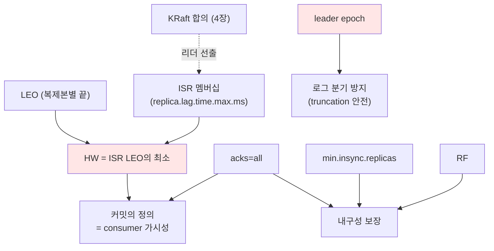

# 3장. 복제 — 데이터는 어떻게 살아남나 〔요소 추출 stub〕

> ⚠️ **이것은 산문 초안이 아니라 "장 명세(stub)"다.** 깎을 요소·의존·실험을 먼저 추출한다.
> 합의되면 이 stub을 산문으로 깎는다. (집필 틀 → [I권 README](./README.md))
>
> **이 장의 보장(한 문장)**: *"커밋으로 인정된 메시지는 `min.insync.replicas`개 복제본의 로그에 존재한다 → 그 수보다 적은 브로커 동시 장애까지 무손실."*

---

## ① 무엇을 보장하나 (다룰 요소)

- "커밋(committed)"의 정의 = consumer에게 보이는 시점 = **HW까지**
- durability 보장의 정량화: RF / `min.insync.replicas` / `acks`의 곱으로 결정
- 보장의 경계: "Kafka 로그 안"에서의 무손실 (외부 시스템은 EOS 6장/멱등키)

## ② 왜 ISR인가 — 대안 비교 (다룰 요소)

- **완전 동기 복제**: 안전 ↑ / 느린 복제본 1대가 전체 쓰기를 막음(가용성 ↓)
- **완전 비동기**: 빠름 / 리더 죽으면 유실
- **ISR(절충)**: "지금 따라잡은 복제본만 기다린다" — 뒤처진 놈은 빼서 가용성, 들어온 놈은 기다려 내구성
- 이건 CAP/PACELC의 **일관성 ↔ 지연** 트레이드오프를 런타임에 조절하는 장치
- Kafka는 quorum(과반) 복제가 아니라 **ISR 기반** — 왜? (적은 복제본으로 같은 내구성, latency 유리)

## ③ 구조·메커니즘 (다룰 요소)

- **LEO** (Log End Offset): 각 복제본이 가진 마지막 offset+1
- **HW** (High Watermark): ISR 전체의 LEO 중 **최소값**. consumer는 HW까지만 본다
- **LSO** (Last Stable Offset): 진행 중 트랜잭션 직전 (→ 6장 연결)
- **Pull 복제**: follower가 leader에 `Fetch` → leader가 각 follower fetch offset 추적
- **ISR 멤버십 판정**: `replica.lag.time.max.ms` 내 따라오면 ISR, 못 따라오면 축출
- ISR 변경의 기록 주체: Controller (→ 4장)

## ④ 합의와의 관계 — 핵심 구분 (다룰 요소)

- **데이터 복제 ≠ 합의 알고리즘**
  - 데이터 복제: ISR 기반 **primary-backup** (Raft 아님)
  - 리더 선출·메타데이터: **KRaft = Raft 합의** (→ 4장)
- 왜 분리했나: 데이터 경로에 Raft 다수결을 쓰면 처리량이 죽는다. "누가 리더냐"만 합의, 데이터는 그 리더가 ISR로 단순 복제 → **고성능의 핵심 설계**
- **leader epoch**: 리더가 바뀔 때마다 증가하는 번호
  - 왜 필요: HW만 믿는 truncation은 로그 분기(divergence) 버그 발생 (KIP-101, KIP-279)
  - epoch로 "어느 리더 시대의 로그인가"를 펜싱(fencing)
- **unclean leader election**: ISR 밖 복제본을 리더로 승격 허용?
  - on: 가용성 ↑ / 데이터 손실 위험
  - off(기본): 안전 / ISR 전멸 시 파티션 중단

## 요소 의존 그래프

## ⑤ 트레이드오프 (다룰 요소)

- `min.insync.replicas` ↑ → 안전 ↑ / 가용성 ↓ (복제본 모자라면 쓰기 거부)
- RF=3 + min.isr=2 가 균형점인 이유: "2대까진 살고, 1대 남으면 멈춘다"
- unclean election: 가용성 ↔ 손실
- 동기 복제본 수 ↔ produce latency

## ⑥ 증명 실험 후보 (3-broker 필수)

| 실험 | 관측/단언 | 관련 요소 |
|------|----------|----------|
| RF=3 토픽, follower 1대 정지 | `describeTopics`로 ISR이 [3]→[2]로 축소 | ISR 멤버십 |
| min.isr=2, 브로커 2대 정지 | produce 시 `NotEnoughReplicasException` | min.isr↔acks |
| acks=all, 따라잡기 전 | consumer가 HW 이전 메시지를 못 봄 | HW/가시성 |
| leader 브로커 kill | 새 leader 승격, 데이터 보존, consumer 계속 | 리더 선출 |
| unclean on/off 비교 | off면 중단, on이면 승격(+손실 가능) | unclean election |
| (심화) leader epoch | 옛 리더 복귀 시 truncation이 분기를 막음 | leader epoch |

> ⚙️ 실험 도구: `AdminClient.describeTopics/describeCluster`, `docker stop kafkaN`, `listOffsets`(HW/LEO), `kafka-dump-log`.

## 열린 질문 (깎을 때 결정)

- leader epoch 설명 깊이 — 개념까지? KIP 인용까지? truncation 시나리오 재현까지?
- KRaft 메타데이터 복제는 4장으로 완전 분리 (여기선 "리더 선출은 4장" 링크만)
- DDIA(Designing Data-Intensive Applications)의 복제 장 인용 수준
- 기존 `KAFKA-ARCHITECTURE.md` 3절(리플리케이션)의 다이어그램을 어디까지 흡수할지

---

## 3권 횡단 연결

- **II권**: RF/min.isr/acks **운영 기준**, unclean election 정책, under-replicated 알람
- **III권**: `spring.kafka.producer.acks`, `ProducerFactory` 설정, min.isr 위반 시 예외 처리

← [I권 목차](./README.md) · 다음: [4장 합의 — 누가 결정하나](./README.md) (예정)
