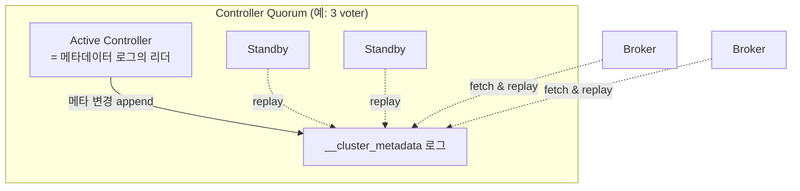
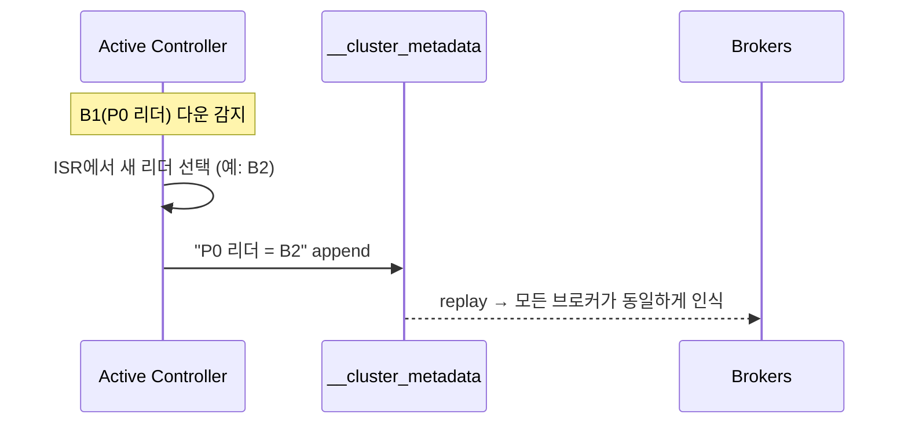

# 4장. 합의 — 누가 결정하나 (KRaft)

> 앞 장: [3장 복제](./03-replication.md) · 다음 장: [5장 조정](./05-coordination.md)
>
> **이 장의 보장(한 문장)**: *클러스터의 메타데이터(어느 브로커가 어느 파티션의 리더인가, 토픽·ISR 구성 등)에 대해 모든 노드가 단일한 진실에 합의한다.*

3장에서 "리더가 죽으면 컨트롤러가 ISR에서 새 리더를 뽑는다"고 했다. 그런데 **그 컨트롤러는 누가 정하고, "리더가 누구인지"라는 정보 자체는 어디에 어떻게 저장되어 모두가 같게 보는가?** 이 장이 그 답이다.

---

## 4.1 문제: 메타데이터의 단일 진실과 split-brain

데이터(메시지)는 3장의 ISR로 복제했다. 하지만 그보다 먼저 합의돼야 하는 게 있다 — **"P0의 리더는 B1이다"** 같은 *메타데이터*다.

이게 노드마다 다르게 보이면 재앙이다. B1도 B2도 자기가 P0 리더라고 믿으면(**split-brain**) 같은 파티션에 둘이 쓰고 로그가 갈라진다. 그래서 메타데이터는 **모든 노드가 정확히 하나의 진실로** 봐야 한다.

> 구분: 3장은 *데이터* 복제, 4장은 *메타데이터* 합의. 둘은 메커니즘이 다르다(3.8에서 예고).

---

## 4.2 분산 합의라는 문제

여러 노드가 하나의 값에 동의하는 것 — 이게 분산 합의(consensus)다. 이론적으로 까다롭다(비동기 네트워크에서 한 노드라도 죽으면 완벽한 합의가 불가능하다는 FLP 불가능성). 현실의 합의 알고리즘은 **과반(quorum)** 으로 이 문제를 우회한다: *과반이 동의하면 확정*. 과반끼리는 반드시 겹치므로 두 개의 모순된 결정이 동시에 확정될 수 없다.

→ 그래서 3-노드면 2개, 5-노드면 3개가 살아 있어야 진행된다.

---

## 4.3 왜 Raft인가 — Paxos와의 대비

합의 알고리즘의 고전은 Paxos지만, *이해하기 어렵고 구현이 제각각*이라는 악명이 있다. **Raft**는 같은 안전성을 제공하면서 **이해가능성(understandability)** 을 명시적 설계 목표로 삼았다 `[Ongaro & Ousterhout 2014, Tier 3]`. 핵심은:

- **강한 리더(strong leader)**: 한 리더가 로그를 주도하고, 팔로워는 복사만 한다.
- **term(임기)**: 리더가 바뀔 때마다 증가하는 번호로 "시대"를 구분한다.

이 두 가지가 Kafka에 그대로 들어온다. 특히 **term은 3장의 leader epoch과 같은 발상** — 옛 리더의 유령을 번호로 펜싱한다.

---

## 4.4 KRaft — "메타데이터도 로그로"

Kafka의 합의 구현이 **KRaft(Kafka Raft)** 다. 그리고 그 핵심은 2장의 사상을 메타데이터에 그대로 적용한 것이다:

> **클러스터 메타데이터의 모든 변경을 `__cluster_metadata`라는 내부 로그에 append한다.**

- 메타데이터 변경(토픽 생성, 리더 변경, ISR 축소…)은 곧 **로그 레코드**다.
- **active controller**가 그 로그의 리더이고, standby와 브로커들은 로그를 따라 읽어(replay) 자기 메타데이터 캐시를 만든다.
- 이건 정확히 2장의 "상태 = fold(로그)"다 — 클러스터 상태마저 로그를 접어 만든다.

---

## 4.5 Controller Quorum · active controller · term

- **Controller Quorum**: 메타데이터 로그를 복제하는 voter 노드들. 이 lab은 3-노드가 모두 broker+controller를 겸한다(combined 모드). 대규모에선 controller 전용 노드(isolated)로 분리한다.
- **active controller 선출**: voter들이 Raft로 과반 투표해 active를 뽑는다. active가 죽으면 남은 voter가 새 active를 선출한다.
- **빠른 승계**: standby는 이미 메타데이터 로그를 따라 읽고 있었으므로, active가 죽어도 거의 즉시 이어받는다. (ZooKeeper 시절엔 새 컨트롤러가 외부 저장소에서 전체 상태를 로딩해야 해서 느렸다 — 4.7.)

---

## 4.6 파티션 리더 선출은 컨트롤러가 한다

3장에서 미뤘던 연결: 파티션 리더(데이터 리더)는 **active controller가 ISR 안에서 지정**하고, 그 결정을 메타데이터 로그에 기록한 뒤 브로커들에 전파한다.

→ **컨트롤러(메타데이터, 4장)** 와 **코디네이터(Consumer Group, 5장)** 는 역할이 다르다. 헷갈리지 말 것.

---

## 4.7 ZooKeeper에서 KRaft로 (왜 걷어냈나)

> *진화 서사 원칙: 과거(ZK)는 "왜 현재가 이렇게 됐나"의 도약대로만 짧게.*

KRaft 이전엔 메타데이터·리더 선출을 **외부 시스템 ZooKeeper**에 의존했다. 그 비용:
- 별도 클러스터를 설치·운영·모니터링해야 했다(운영 부담).
- 컨트롤러 장애 시 ZK에서 전체 상태를 다시 로딩 → 대규모에서 느렸다.
- 메타데이터 규모 확장에 한계가 있었다.

KRaft는 이 의존을 **제거**하고 Kafka가 스스로 합의하게 했다 `[KIP-500]`. 3.3에서 production-ready, 이 lab의 3.7은 KRaft로 동작하며, 4.0에서 ZooKeeper는 완전히 제거된다. → 우리는 KRaft를 기준으로 다루고, ZK는 여기까지만(역사적 맥락).

---

## 4.8 메타데이터 로그도 무한히 안 자란다 — KRaft 스냅샷

`__cluster_metadata`도 로그다(4.4). 그런데 로그는 계속 자란다 — 메타데이터 로그가 무한히 커지면, 새 브로커가 합류할 때 처음부터 전부 replay해야 해서 느려진다.

해결은 **KRaft 스냅샷**(KIP-630): 어느 시점의 **전체 메타데이터 상태를 스냅샷으로 저장**하고, 그 이전 로그를 잘라낸다. 새 노드는 스냅샷을 먼저 로드한 뒤 그 이후 로그만 따라잡으면 된다.

> 2장의 키별 log compaction(메커니즘은 8장)과는 다르다 — compaction은 "key별 최신 레코드"를 남기지만, 스냅샷은 "한 시점의 상태 전체"를 통째로 저장하고 로그를 절단한다. (Raft 로그 압축의 표준 기법이다.) `[KIP-630]`

---

## 4.9 증명 (executable — 3-broker)

| 실험 | 관측/단언 | 라벨 |
|------|----------|------|
| `describeCluster` | controller 노드·cluster id 확인 | `[테스트로 결정]` |
| active controller 브로커 kill | 새 controller 승계, 클러스터 계속 동작 | `[테스트로 결정]` |
| 토픽 생성 직후 | 모든 브로커가 동일 리더/ISR 인식(메타 전파) | `[테스트로 결정]` |
| (심화) `__cluster_metadata` 덤프 | 메타데이터가 로그임을 확인 | `[code @3.7]` |

---

## 참조

- `[Ongaro & Ousterhout 2014]` *In Search of an Understandable Consensus Algorithm (Raft)* `[Tier 3]`
- Lamport, *Paxos Made Simple* (대비용) `[Tier 3]`
- `[KIP-500]` ZooKeeper 제거 · `[KIP-595]` Raft metadata quorum · `[KIP-631]` controller `[Tier 1]`
- *Designing Data-Intensive Applications* 9장(일관성과 합의) `[Tier 3]`

← [3장 복제](./03-replication.md) · [I권 목차](./README.md) · 다음: [5장 조정](./05-coordination.md)
