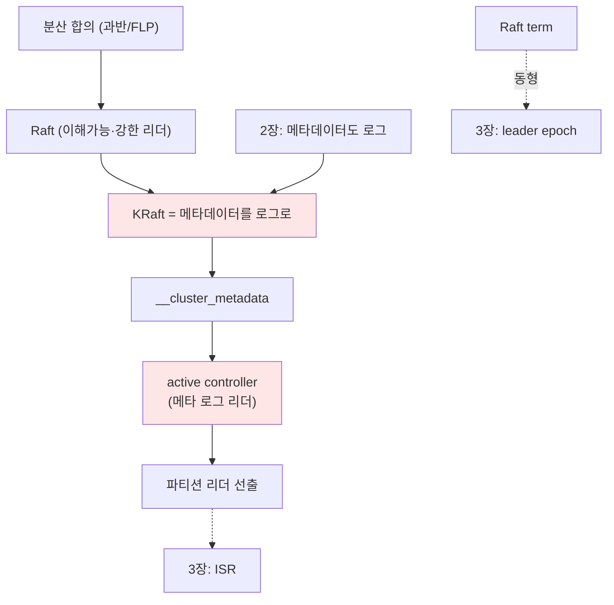

# 4장. 합의 — 누가 결정하나 (KRaft) 〔요소 추출 stub〕

> ⚠️ **장 명세(stub).** 틀 → [I권 README](./README.md) · 기존 [KAFKA-ARCHITECTURE.md](../../../KAFKA-ARCHITECTURE.md) 4절을 **흡수 예정**(산문화 시).
>
> **보장(한 문장)**: *"클러스터 메타데이터(누가 어느 파티션의 리더인가, 토픽·ISR 등)에 대해 모든 노드가 단일한 진실에 합의한다."*

---

## ① 무엇을 보장하나 (다룰 요소)

- 메타데이터의 **단일 진실(single source of truth)** + 장애 시에도 일관 유지
- "리더가 누구인가"에 대한 **split-brain 방지**
- 3장(데이터 복제)과의 구분: **여기서 합의하는 건 메타데이터, 데이터가 아니다**

## ② 왜 Raft인가 — 대안 비교 (다룰 요소)

- 분산 합의 문제란? FLP 불가능성, 과반(quorum) 기반 안전성
- **Paxos vs Raft**: Raft는 *이해가능성(understandability)* 목표, 강한 리더 기반 → 구현·운영 단순
- ZooKeeper(ZAB) 외부 의존의 비용: 별도 클러스터·운영·메타데이터 로딩 지연
- **KRaft = Kafka Raft**: "메타데이터도 로그로"(2장) → Kafka가 스스로 합의

## ③ 구조·메커니즘 (다룰 요소)

- **`__cluster_metadata`**: 메타데이터 변경을 담는 내부 **로그**(2장 사상 그대로)
- **Controller Quorum**: voter 노드들, active controller = 메타데이터 로그의 리더
- **term/epoch**: Raft term ↔ 3장 leader epoch과 같은 발상(시대 펜싱)
- 메타데이터 전파: 브로커가 metadata log를 따라가며(follow) 캐싱
- **파티션 리더 선출**: controller가 ISR에서 새 리더 지정 → 브로커에 전파
- active controller 장애 시 빠른 승계(이미 로그 follow 중이라 ZK 대비 빠름)

## ④ 다른 개념과의 관계 (다룰 요소)

- **Controller(메타데이터) vs Coordinator(컨슈머 그룹, 5장)** 구분
- 3장 leader epoch이 여기 term과 연결
- ZooKeeper 시절 → KRaft 전환(KIP-500), 4.0에서 ZK 제거

## 요소 의존 그래프

## ⑤ 트레이드오프 (다룰 요소)

- 메타데이터에만 합의를 쓰고 데이터엔 안 쓰는 이유(3장): 처리량
- controller quorum 크기 ↔ 합의 지연
- combined vs isolated 모드(이 lab은 combined 3노드)

## ⑥ 증명 실험 후보 (3-broker)

| 실험 | 관측/단언 |
|------|----------|
| `describeCluster` | controller 노드·cluster id 확인 |
| active controller 브로커 kill | 새 controller 승계, 클러스터 계속 동작 |
| 토픽 생성 직후 메타데이터 전파 | 모든 브로커가 동일 리더/ISR 인식 |
| (심화) metadata log 덤프 | `__cluster_metadata`가 로그임을 확인 |

## 참조 (적극 인용)

- Ongaro & Ousterhout, *"In Search of an Understandable Consensus Algorithm (Raft)"* (2014)
- Lamport, *Paxos Made Simple* (비교용)
- **KIP-500**(ZooKeeper 제거), **KIP-595**(Raft protocol for metadata quorum), **KIP-631**(controller)
- DDIA 9장(일관성과 합의)

## 열린 질문

- Raft 알고리즘 자체를 어디까지(로그 복제/리더 선출/안전성)? 별도 박스로?
- ZooKeeper 비교를 역사로 짧게 vs 생략
- KAFKA-ARCHITECTURE.md 4절 다이어그램 흡수 범위

---

← [3장 복제](./03-replication.md) · 다음: [5장 조정](./05-coordination.md)
