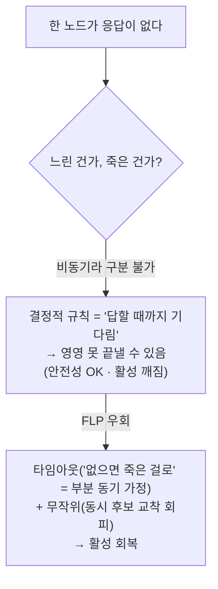
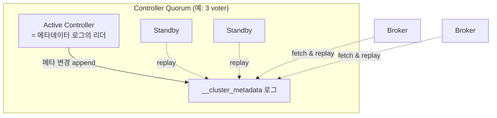
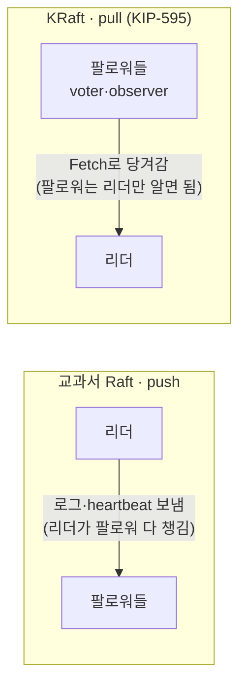
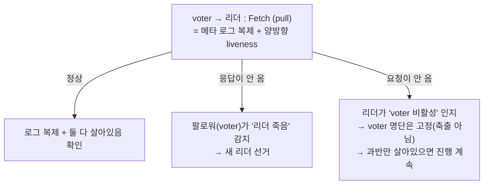
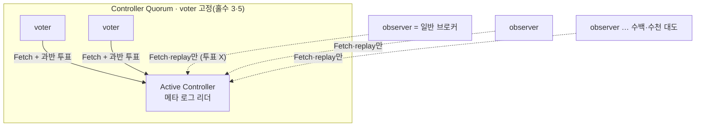
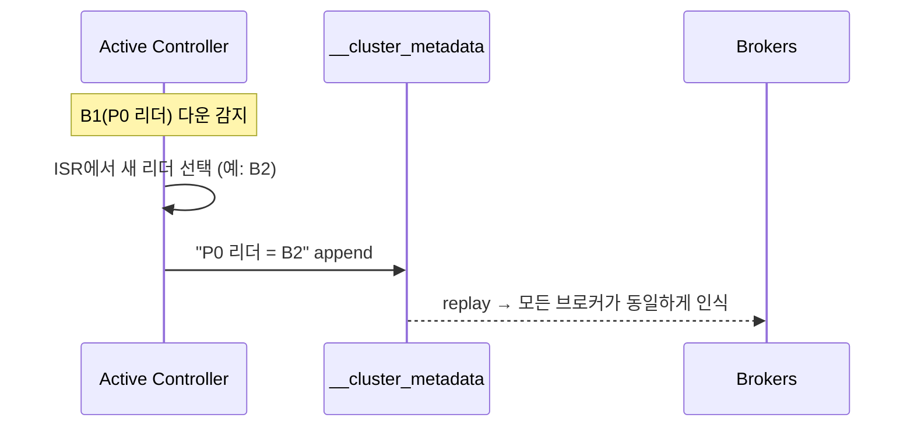

# 4장. 합의: 누가 결정하나 (KRaft)

> 앞 장: [3장 복제](./03-replication.md) · 다음 장: [5장 조정](./05-coordination.md)
>
> **이 장의 보장(한 문장)**: *클러스터의 메타데이터(어느 브로커가 어느 파티션의 리더인가, 토픽·ISR 구성 등)에 대해 모든 노드가 단일한 진실에 합의한다.*

[3장](./03-replication.md)에서 "리더가 죽으면 컨트롤러가 ISR에서 새 리더를 뽑는다"고 했다. 그런데 **그 컨트롤러는 누가 정하고, "리더가 누구인지"라는 정보 자체는 어디에 어떻게 저장되어 모두가 같게 보는가?** 이 장이 그 답이다.

---

## 4.1 문제: 메타데이터의 단일 진실과 split-brain

데이터(메시지)는 [3장](./03-replication.md)의 ISR로 복제했다. 하지만 그보다 먼저 합의돼야 하는 게 있다. **"P0의 리더는 B1이다"** 같은 *메타데이터*다.

이게 노드마다 다르게 보이면 재앙이다. B1도 B2도 자기가 P0 리더라고 믿으면(**split-brain**) 같은 파티션에 둘이 쓰고 로그가 갈라진다. 그래서 메타데이터는 **모든 노드가 정확히 하나의 진실로** 봐야 한다.

> 구분: [3장](./03-replication.md)은 *데이터* 복제, 4장은 *메타데이터* 합의. 둘은 메커니즘이 다르다(3.8에서 예고).

---

## 4.2 분산 합의라는 문제

여러 노드가 하나의 값에 동의하는 것, 이게 분산 합의(consensus)다. 이론적으로 까다롭다. 비동기 네트워크에서 한 노드라도 죽으면 *결정적(deterministic)* 알고리즘이 "언젠가 반드시 끝난다"를 보장할 수 없다(FLP 불가능성, **활성/종료성** 문제).

합의 알고리즘은 이 활성 문제를 **타임아웃 기반 리더 선출**로 우회한다(Raft의 randomized election timeout). 한편 **과반(quorum)** 은 별개로 *안전성*을 책임진다: 과반이 동의해야 확정하고, 두 과반은 반드시 겹치므로 모순된 두 결정이 동시에 확정될 수 없다(split-brain 방지).

→ 그래서 3-노드면 2개, 5-노드면 3개가 살아 있어야 진행된다.

왜 결정적 합의가 비동기+장애에서 불가능한가 (FLP)

**결정적(deterministic)** = 같은 입력·상태면 항상 같은 동작. 무작위 없음(자판기처럼, 같은 버튼이면 같은 결과).

**FLP 불가능성**(Fischer·Lynch·Paterson, 1985): 비동기 네트워크에서 노드가 **하나라도 죽을 수 있으면**, *결정적* 합의 알고리즘은 "언젠가 반드시 끝난다(종료 = 활성)"를 보장할 수 없다.

**왜?** 비동기라 "느린 노드"와 "죽은 노드"를 **구분할 수 없다.** 응답이 안 오는데 '생각 중'인지 '끊긴 건지' 모르니, 결정적 규칙("전원 답할 때까지 기다림")은 영영 결론을 못 낼 수 있다, 전화 회의에서 한 명이 말이 없을 때처럼. **안전성**(틀린 결정 안 함)은 지켜도 **활성**(언젠가 끝남)이 깨진다.

**그래서** Raft/KRaft는 **타임아웃**("응답 없으면 죽은 걸로 간주")으로 FLP를 우회한다. 이는 비동기가 구분 못 하던 '느림 vs 죽음'을 **'부분 동기(partial synchrony)' 가정**으로 풀어내는 것이다.

**randomized election timeout**은 별개다. 모두 동시에 후보가 되는 split-vote 교착을 깨 선거를 수렴시킨다(확률적 *합의*가 아니라 교착 회피).

한편 **과반(quorum)** 은 타이밍 가정 없이 **안전성**(split-brain 방지)을 맡는다.

→ 형식 증명: 이 장 [참조](#참조)의 `[Fischer, Lynch, Paterson 1985]`.

---

## 4.3 왜 Raft인가: Paxos와의 대비

합의 알고리즘의 고전은 Paxos지만, *이해하기 어렵고 구현이 제각각*이라는 악명이 있다. **Raft**는 같은 안전성을 제공하면서 **이해가능성(understandability)** 을 명시적 설계 목표로 삼았다 `[Ongaro & Ousterhout 2014, Tier 3]`. 핵심은:

- **강한 리더(strong leader)**: 한 리더가 로그를 주도하고, 팔로워는 복사만 한다.
- **term(임기)**: 선거가 일어날 때마다 증가하는 번호로 "시대"를 구분한다(당선자 없이 선거만 실패해도 올라간다).

이 두 가지가 Kafka에 그대로 들어온다. 특히 **term은 [3장](./03-replication.md)의 leader epoch과 같은 메커니즘**이다. 번호로 옛 리더의 유령을 펜싱한다. 단 *계층이 다르다*: leader epoch은 파티션별 데이터 리더, term은 메타데이터 로그(컨트롤러) 단위다.

---

## 4.4 KRaft: "메타데이터도 로그로"

Kafka의 합의 구현이 **KRaft(Kafka Raft)** 다. 그리고 그 핵심은 [2장](./02-log-abstraction.md)의 사상을 메타데이터에 그대로 적용한 것이다:

> **클러스터 메타데이터의 모든 변경을 `__cluster_metadata`라는 내부 로그에 append한다.**

- 메타데이터 변경(토픽 생성, 리더 변경, ISR 축소…)은 곧 **로그 레코드**다.
- **active controller**가 그 로그의 리더이고, standby와 브로커들은 로그를 따라 읽어(replay) 자기 메타데이터 캐시를 만든다.
- 이건 정확히 [2장](./02-log-abstraction.md)의 "상태 = fold(로그)"다. 클러스터 상태마저 로그를 접어 만든다.

> **정통 Raft와의 차이 · pull 기반(KIP-595)**: 교과서 Raft는 리더가 팔로워에게 로그를 **push**한다. KRaft는 반대로 voter·observer가 리더에게 **`Fetch`로 당겨간다(pull)**. 그리고 이 한 번의 `Fetch`가 **양방향 liveness**를 겸한다. 즉 KRaft는 "Raft 그대로"가 아니라, [9장](./09-client-runtime.md)의 fetch·[3장](./03-replication.md)의 follower 복제와 **같은 pull 모델로 통일한 변형**이다.

같은 `Fetch` 하나가 *어느 쪽이 침묵하느냐*에 따라 양쪽 죽음을 다 드러낸다.

> 단, 데이터 평면 ISR과 메타 평면 quorum은 *닮았지만 다르다*. ISR은 뒤처지면 빠지고 따라잡으면 드는 **동적** 집합이다([3장](./03-replication.md)). 반면 KRaft voter는 `controller.quorum.voters`로 박힌 **고정** 명단이다. 그래서 죽은 voter는 ISR처럼 *축출되는* 게 아니라 단지 **과반 계산에서 안 세질 뿐**이고, 과반만 살아 있으면 진행은 계속된다(4.2).

[의문]: 브로커가 수천 대면 합의 과정에서 병목이 생길까?

**결론부터, 안 생긴다.** pull이라 follower가 리더에게 `Fetch`를 보내는 건 맞지만, 투표(합의)에 끼는 노드와 메타데이터를 따라 읽기만 하는 노드가 따로 있기 때문이다 `[KIP-595]`.

- **voter**: `controller.quorum.voters`에 박아 둔 노드(보통 3대나 5대). 메타 로그를 커밋할 때 **과반**을 책임지고, active controller 선거에서 투표권을 가진다.
- **observer**: voter 명단에 없는 나머지 노드(대부분 일반 브로커). `__cluster_metadata`를 **따라 읽기만(Fetch·replay)** 하고, 과반 계산이나 투표에는 끼지 않는다.

그래서 active controller가 커밋 한 번마다 받아야 하는 **투표 ack 수**는 클러스터가 수백·수천 대로 불어나도 **voter 수 그대로(3·5대)**다. observer는 아무리 늘어도 메타 로그를 따라 읽기만 할 뿐이라 합의 비용에는 안 잡힌다. (observer가 보내는 `Fetch`는 합의가 아니라 그냥 로그 읽기 부하고, [3장](./03-replication.md)에서 follower가 리더 로그를 복제하던 것과 같은 종류다.)

그럼 voter를 늘리면 더 안전해질까? 오히려 느려지기만 한다. 커밋마다 기다려야 할 과반 ack가 늘기 때문이다. voter를 5대로 늘리면 2대까지 죽어도 버티지만, split-brain은 과반 규칙이 이미 막고 있어서(4.2) 데이터 정합성이 더 좋아지지는 않는다. 그래서 voter는 일부러 3대나 5대로 **작게 박아 둔다**.

---

## 4.5 Controller Quorum · active controller · term

- **Controller Quorum**: 메타데이터 로그를 복제하는 voter 노드들. `controller.quorum.voters`로 지정하고, 홀수(3·5)로 둬 과반을 유지한다(4.2). 노드 역할은 `process.roles`로 정한다. `broker`(데이터만) / `controller`(메타데이터만) / `broker,controller`(겸임). 이 lab은 3-노드 모두 `broker,controller`인 **combined 모드**이고, 겸임이어도 컨트롤러 통신은 **별도 리스너(CONTROLLER)** 로 분리된다. 대규모 운영에선 controller 전용 노드(**isolated**)로 떼어내 자원 경합을 없앤다. 그 트레이드오프·노드 스펙은 → [III권 운영](../3-operations/README.md).
- **active controller 선출**: voter들이 Raft로 과반 투표해 active를 뽑는다. active가 죽으면 남은 voter가 새 active를 선출한다.
- **빠른 승계**: standby는 이미 메타데이터 로그를 따라 읽고 있었으므로, active가 죽어도 거의 즉시 이어받는다. (ZooKeeper 시절엔 새 컨트롤러가 외부 저장소에서 전체 상태를 로딩해야 해서 느렸다. 4.7.)

---

## 4.6 파티션 리더 선출은 컨트롤러가 한다

[3장](./03-replication.md)에서 미뤘던 연결: 파티션 리더(데이터 리더)는 **active controller가 ISR 안에서 지정**하고, 그 결정을 메타데이터 로그에 기록한 뒤 브로커들에 전파한다.

> 엄밀히는 전파가 비동기다. 브로커는 메타데이터 로그를 fetch·replay하므로, 변경 직후 짧은 지연을 거쳐 **결국 수렴(eventual)**한다. 이 장의 보장은 그 수렴 결과의 *합의(agreement)*다.

→ **컨트롤러(메타데이터, 4장)** 와 **코디네이터(Consumer Group, [5장](./05-coordination.md))** 는 역할이 다르다. 헷갈리지 말 것.

---

## 4.7 ZooKeeper에서 KRaft로 (왜 걷어냈나)

> *진화 서사 원칙: 과거(ZK)는 "왜 현재가 이렇게 됐나"의 도약대로만 짧게.*

KRaft 이전엔 메타데이터·리더 선출을 **외부 시스템 ZooKeeper**에 의존했다. 그 비용:
- 별도 클러스터를 설치·운영·모니터링해야 했다(운영 부담).
- 컨트롤러 장애 시 ZK에서 전체 상태를 다시 로딩 → 대규모에서 느렸다.
- 메타데이터 규모 확장에 한계가 있었다.

KRaft는 이 의존을 **제거**하고 Kafka가 스스로 합의하게 했다 `[KIP-500]`. 3.3에서 production-ready, 이 lab의 브로커도 KRaft로 동작하며, 4.0에서 ZooKeeper는 완전히 제거된다. → 우리는 KRaft를 기준으로 다루고, ZK는 여기까지만(역사적 맥락).

---

## 4.8 메타데이터 로그도 무한히 안 자란다: KRaft 스냅샷

`__cluster_metadata`도 로그다(4.4). 그런데 로그는 계속 자란다. 메타데이터 로그가 무한히 커지면, 새 브로커가 합류할 때 처음부터 전부 replay해야 해서 느려진다.

해결은 **KRaft 스냅샷**(KIP-630): 어느 시점의 **전체 메타데이터 상태를 스냅샷으로 저장**하고, 그 이전 로그를 잘라낸다. 새 노드는 스냅샷을 먼저 로드한 뒤 그 이후 로그만 따라잡으면 된다.

> [2장](./02-log-abstraction.md)의 키별 log compaction(메커니즘은 [8장](./08-storage-engine.md))과는 다르다. compaction은 "key별 최신 레코드"를 남기지만, 스냅샷은 "한 시점의 상태 전체"를 통째로 저장하고 로그를 절단한다. Raft 로그 압축의 표준 기법이다. `[KIP-630]`

---

## 4.9 증명 (executable · 3-broker · 부분)

| 실험 | 관측/단언 | 라벨 |
|------|----------|------|
| `describeCluster` | controller 노드·cluster id 확인 | `[테스트 예정]` |
| active controller 브로커 kill | 새 controller 승계, 클러스터 계속 동작 | `[테스트 예정]` |
| 토픽 생성 직후 | 모든 브로커가 동일 리더/ISR 인식(메타 전파) | `[테스트 예정]` |
| (심화) `__cluster_metadata` 덤프 | 메타데이터가 로그임을 확인 | `[code @3.7]` |

---

## 참조

- `[Ongaro & Ousterhout 2014]` *In Search of an Understandable Consensus Algorithm (Raft)* `[Tier 3]`
- Lamport, *Paxos Made Simple* (대비용) `[Tier 3]`
- `[KIP-500]` ZooKeeper 제거 · `[KIP-595]` Raft metadata quorum · `[KIP-631]` controller `[Tier 1]`
- `[Fischer, Lynch, Paterson 1985]` *Impossibility of Distributed Consensus with One Faulty Process* (FLP) `[Tier 3]`
- *Designing Data-Intensive Applications* 9장(일관성과 합의) `[Tier 3]`

← [3장 복제](./03-replication.md) · [I권 목차](./README.md) · 다음: [5장 조정](./05-coordination.md)
