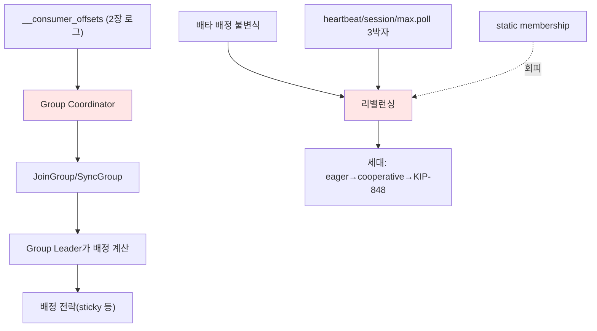

# 5장. 조정 — Consumer Group은 어떻게 나눠 읽나 〔요소 추출 stub〕

> ⚠️ **장 명세(stub).** 틀 → [I권 README](./README.md) · 기존 [KAFKA-ARCHITECTURE.md](../../../KAFKA-ARCHITECTURE.md) 5절 **흡수 예정**.
>
> **보장(한 문장)**: *"한 Consumer Group 안에서 각 파티션은 정확히 하나의 consumer에게 배정된다(소비의 배타성). 멤버가 바뀌면 재배정(리밸런싱)으로 이 불변식을 유지한다."*

---

## ① 무엇을 보장하나 (다룰 요소)

- 그룹 내 **파티션-consumer 1:1 이하** 배타 배정 (그래서 파티션 수 = 병렬성 상한, 1장)
- 멤버 변동 후에도 배타성 유지 = 리밸런싱의 존재 이유
- offset의 그룹별 독립 저장 → 같은 토픽을 여러 그룹이 독립 소비

## ② 왜 이 설계인가 — 대안 비교 (다룰 요소)

- 브로커가 배정을 다 계산? → **클라이언트(Group Leader)에 위임**해 브로커 부하 ↓
- 전체 회수 후 재배정(eager) vs 필요한 것만(cooperative): stop-the-world를 줄이는 진화
- 왜 heartbeat와 poll을 분리했나(살아있음 ≠ 처리 진행)

## ③ 구조·메커니즘 (다룰 요소)

- **Group Coordinator**: 브로커 중 하나(`hash(groupId) % __consumer_offsets 파티션 수`로 결정). 4장 Controller와 **다른 역할**
- **JoinGroup → SyncGroup** 2단계: Coordinator가 Group Leader 지정 → Leader가 배정 계산 → Coordinator가 전파
- **배정 전략**: Range / RoundRobin / Sticky / **CooperativeSticky**
- **리밸런싱 세대**:
  - 1세대 **eager**: 전 파티션 revoke (stop-the-world)
  - 2세대 **cooperative**(KIP-429): 이동 필요한 것만, 2라운드
  - 3세대 **KIP-848**: 서버 주도 배정(코디네이터가 계산), 차세대
- **타이밍 3박자**: `heartbeat.interval.ms` < `session.timeout.ms` ≪ `max.poll.interval.ms`
- **static membership**(KIP-345): `group.instance.id`로 재접속 시 리밸런싱 회피
- **`__consumer_offsets`**: compacted 내부 로그(2장), offset 커밋 저장소

## ④ 다른 개념과의 관계 (다룰 요소)

- Coordinator(그룹) ↔ Controller(클러스터, 4장)
- `__consumer_offsets`는 로그(2장) · 트랜잭션 offset 커밋(6장, EOS)
- **리밸런싱 트리거 전수는 II권** / Spring 설정은 III권 (3권 횡단의 대표)

## 요소 의존 그래프

## ⑤ 트레이드오프 (다룰 요소)

- eager(단순, 멈춤 큼) vs cooperative(복잡, 멈춤 작음)
- session.timeout 짧게(빠른 감지) ↔ 길게(오탐 적음)
- static membership(배포 안정) ↔ 죽은 멤버 감지 지연

## ⑥ 증명 실험 후보

| 실험 | 관측/단언 |
|------|----------|
| consumer 추가 시 eager vs cooperative | revoke 범위 차이(전체 vs 일부) |
| `group.instance.id` 부여 후 재접속 | 같은 파티션 유지(리밸런싱 없음) |
| `max.poll.interval` 초과하는 느린 처리 | 강제 퇴출 + 리밸런싱 |
| 두 그룹이 같은 토픽 구독 | 각자 독립 offset으로 전량 소비 |

## 참조 (적극 인용)

- **KIP-429**(Incremental Cooperative Rebalancing)
- **KIP-848**(Next Generation Consumer Group Protocol)
- **KIP-345**(Static Membership)
- DDIA 8·9장(분산 시스템의 결함·조정)

## 열린 질문

- KIP-848(서버 주도)을 현재 시점(3.7) 어느 깊이로 — 개념/예고 수준?
- 리밸런싱 "프로토콜 메커니즘"(여기) vs "운영 트리거 전수"(II권) 경계 재확인

---

← [4장 합의](./04-consensus.md) · 다음: [6장 순서와 원자성](./06-ordering-atomicity.md)
