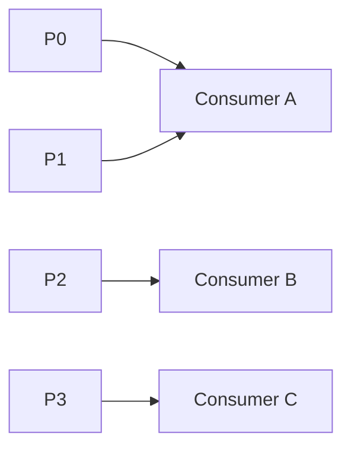
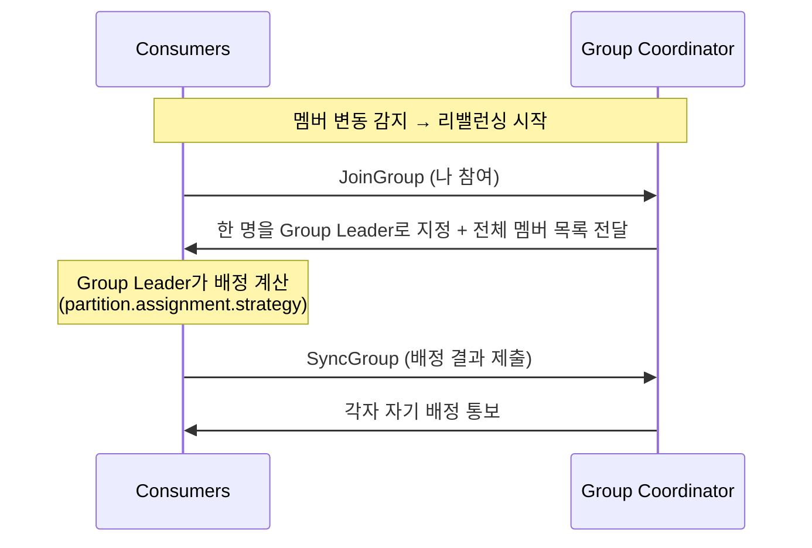
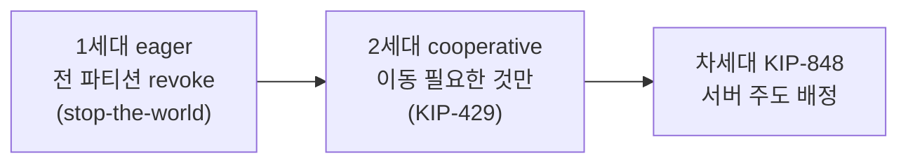

# 5장. 조정 — Consumer Group은 어떻게 나눠 읽나

> 앞 장: [4장 합의(KRaft)](./04-consensus.md) · 다음 장: [6장 멱등·순서](./06-ordering-atomicity.md)
>
> **이 장의 보장(한 문장)**: *한 Consumer Group 안에서 각 파티션은 정확히 하나의 consumer에게 배정된다(소비의 배타성). 멤버가 바뀌면 리밸런싱으로 이 불변식을 유지한다.*

4장이 "클러스터 전체의 두뇌(컨트롤러)"였다면, 이 장은 **"Consumer Group 전담 관리자(코디네이터)"** 다. 둘은 이름이 비슷하지만 역할이 다르다.

---

## 5.1 배타 배정 불변식

Consumer Group의 핵심 규칙: **그룹 안에서 한 파티션은 한 consumer에게만 배정된다.**

여기서 1장의 결론이 다시 나온다 — **파티션 수 = 그룹 내 최대 병렬성**. consumer가 파티션보다 많으면 남는 consumer는 놀고(idle), 적으면 한 consumer가 여러 파티션을 맡는다. 그리고 멤버가 들고 날 때 이 배타성을 다시 맞추는 게 **리밸런싱**이다.

---

## 5.2 왜 배정을 클라이언트에 위임했나

순진하게는 브로커가 "누가 무슨 파티션"을 다 계산할 수 있다. 하지만 Kafka는 **배정 계산을 그룹 안의 한 consumer(Group Leader)에게 위임**한다. 브로커(코디네이터)는 멤버십과 통신만 조율한다.

이유는 **브로커 부하 분산**이다 — 수많은 그룹의 배정 로직을 브로커가 다 떠안지 않게. (단 이 위임 구조는 차세대 프로토콜에서 다시 서버로 이동한다 — 5.6.)

---

## 5.3 Group Coordinator — 컨트롤러와 다른 것

**Group Coordinator**는 *브로커 중 하나*가 특정 그룹을 위해 겸임하는 역할이다.

- 어느 브로커가 코디네이터인지는 `hash(groupId) % __consumer_offsets 파티션 수`로 결정된다 — 즉 그룹이 쓰는 offset 토픽 파티션의 리더 브로커가 그 그룹의 코디네이터다.
- 하는 일: 멤버 heartbeat 감시, 리밸런싱 조율, offset 커밋 저장.

> **컨트롤러(4장) ≠ 코디네이터(5장)**: 컨트롤러는 클러스터 레벨(파티션 리더·메타데이터), 코디네이터는 그룹 레벨(멤버십·offset). 클러스터당 active 컨트롤러는 하나지만, 코디네이터는 그룹마다 다른 브로커일 수 있다.

---

## 5.4 JoinGroup → SyncGroup

리밸런싱은 2단계 프로토콜로 진행된다.

- **JoinGroup**: 모든 멤버가 합류 신청 → 코디네이터가 Group Leader 지정.
- **SyncGroup**: Group Leader가 배정을 계산해 코디네이터에 제출 → 코디네이터가 각 멤버에게 전달.

---

## 5.5 배정 전략

Group Leader가 쓰는 배정 알고리즘(`partition.assignment.strategy`):

- **Range** / **RoundRobin**: 고전적. 멤버 변동 시 배정이 크게 뒤섞인다.
- **Sticky**: 기존 배정을 최대한 유지하며 최소 이동.
- **CooperativeSticky**: Sticky + 협력적 리밸런싱(다음 절).

---

## 5.6 리밸런싱 세대 — eager → cooperative → KIP-848

> *진화 서사 원칙: 과거(eager)는 짧게, 현재 기준에 분량.*

- **eager**(과거): 리밸런싱 때 *모든* consumer가 *모든* 파티션을 일단 내려놓고(revoke) 다시 받는다 → 그 사이 **전체 처리 정지(stop-the-world)**.
- **cooperative**(현재 권장) `[KIP-429]`: 이동이 필요한 파티션만 내려놓는다. 2라운드로 진행되지만 멈춤이 작다. Kafka 3.x 기본 assignor 목록에 `CooperativeStickyAssignor`가 들어 있다.
- **KIP-848**(차세대): 배정 계산을 다시 **서버(코디네이터)** 로 옮겨 클라이언트 프로토콜을 단순화한다. 3.7 시점에선 도입 진행 중.

---

## 5.7 살아있음을 판정하는 타이밍 3박자

consumer가 "살아 있다"를 판정하는 설정이 셋이고, 관계를 알아야 한다.

- `heartbeat.interval` < `session.timeout`: 하트비트는 백그라운드 스레드가 보낸다. session.timeout 안에 못 받으면 **프로세스 죽음/네트워크 단절**로 보고 퇴출.
- `session.timeout` ≪ `max.poll.interval`: poll 간격이 이를 넘으면 **처리 로직이 너무 느린 것**으로 보고 퇴출. (살아있음 ≠ 처리 진행 — 그래서 둘을 분리했다.)

→ 이 타이밍을 Spring에서 어떻게 잡고 어디서 데이는지는 → II권. 리밸런싱 트리거 전수와 운영 대응은 → III권.

---

## 5.8 Static Membership

기본적으로 consumer가 재시작하면 새 멤버로 취급돼 리밸런싱이 일어난다. **static membership** `[KIP-345]`은 `group.instance.id`를 부여해, 같은 id로 재접속하면 **기존 배정을 유지**하고 리밸런싱을 건너뛴다. 롤링 배포 시 불필요한 리밸런싱을 줄이는 장치다.

---

## 5.9 offset은 어디에 — `__consumer_offsets`

consumer가 커밋하는 offset은 **`__consumer_offsets`라는 내부 토픽(compacted)** 에 저장된다(2장의 "메타데이터도 로그"). `key=(group, topic, partition)`, `value=offset`. 코디네이터가 이 토픽을 관리하고, consumer 재시작 시 여기서 마지막 커밋 위치를 읽어 "어디부터 읽을지"를 안다.

→ offset 커밋의 *코드/AckMode 함정*은 II권, 이게 트랜잭션과 묶이는 read-process-write는 7장.

---

## 5.10 증명 (executable — 3-broker)

| 실험 | 관측/단언 | 라벨 |
|------|----------|------|
| consumer 추가 시 eager vs cooperative | revoke 범위 차이(전체 vs 일부) | `[테스트로 결정]` |
| `group.instance.id` 부여 후 재접속 | 같은 파티션 유지(리밸런싱 없음) | `[테스트로 결정]` |
| `max.poll.interval` 초과하는 느린 처리 | 강제 퇴출 + 리밸런싱 | `[테스트로 결정]` |
| 두 그룹이 같은 토픽 구독 | 각자 독립 offset으로 전량 소비 | `[테스트로 결정]` |

---

## 참조

- `[KIP-429]` Incremental Cooperative Rebalancing · `[KIP-848]` 차세대 consumer group 프로토콜 · `[KIP-345]` Static Membership `[Tier 1]`
- Kafka 공식 문서 — Consumer Group, `__consumer_offsets` `[docs @3.7]`

← [4장 합의(KRaft)](./04-consensus.md) · [I권 목차](./README.md) · 다음: [6장 멱등·순서](./06-ordering-atomicity.md)
