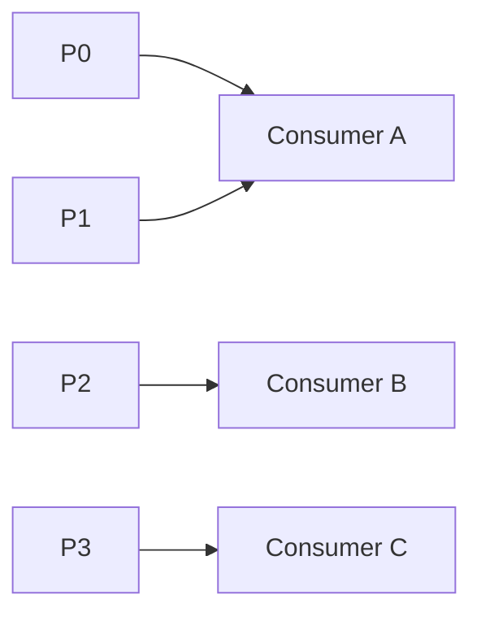
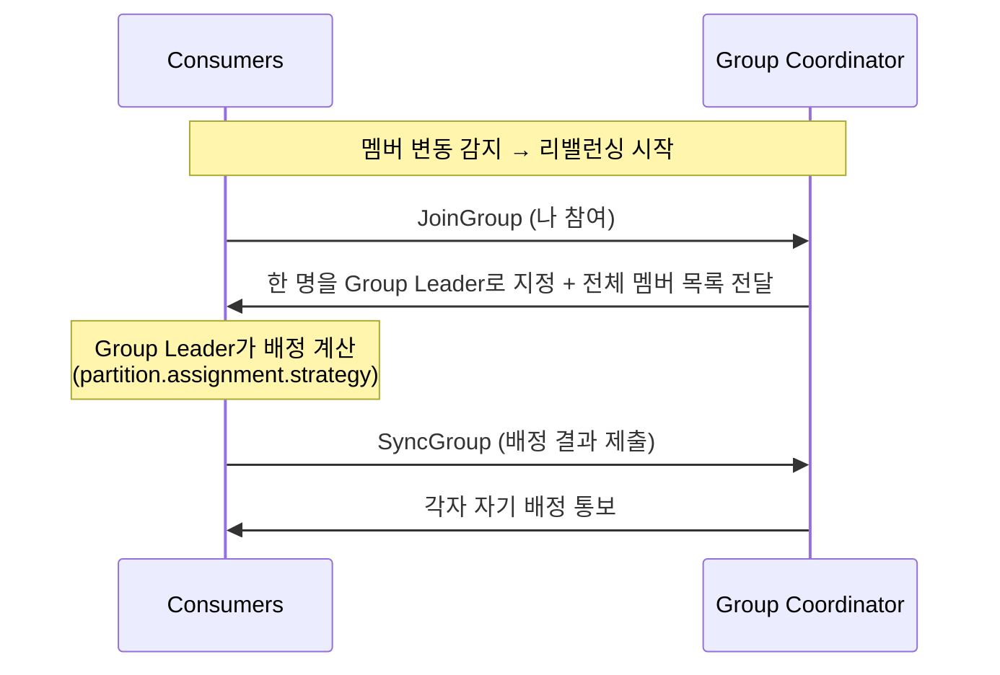
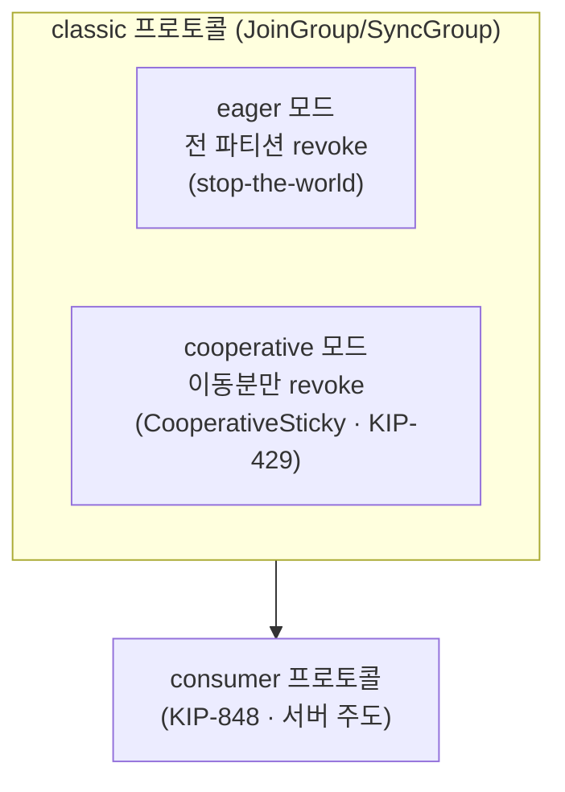

# 5장. 조정 — Consumer Group은 어떻게 나눠 읽나

> 앞 장: [4장 합의(KRaft)](./04-consensus.md) · 다음 장: [6장 멱등·순서](./06-ordering-atomicity.md)
>
> **이 장의 보장(한 문장)**: *한 Consumer Group 안에서 각 파티션은 정확히 하나의 consumer에게 배정된다(소비의 배타성). 멤버가 바뀌면 리밸런싱으로 이 불변식을 유지한다.*

4장이 "클러스터 전체의 두뇌(컨트롤러)"였다면, 이 장은 **"Consumer Group 전담 관리자(코디네이터)"** 다. 둘은 이름이 비슷하지만 역할이 다르다.

---

## 5.1 배타 배정 불변식

Consumer Group의 핵심 규칙: **그룹 안에서 각 파티션은 정확히 한 consumer에게 배정된다.** 한 파티션을 둘이 나눠 갖지도(no overlap), 구독된 파티션이 아무에게도 안 맡겨져 노는 일도(no gap) 없다 — 배타성과 완전성을 함께 만족하는 **배타적 완전 피복**이다(리밸런싱이 도는 동안은 일시적으로 깨졌다가 곧 재정합되는 *안정 상태 불변식*이다).

여기서 1장의 결론이 다시 나온다 — **파티션 수 = 그룹 내 최대 병렬성**. consumer가 파티션보다 많으면 남는 consumer는 놀고(idle), 적으면 한 consumer가 여러 파티션을 맡는다. 그리고 멤버가 들고 날 때 이 배타성을 다시 맞추는 게 **리밸런싱**이다.

**리밸런싱은 언제 도는가.** 멤버 집합 M과 구독 파티션 집합 P는 **둘 다 동적**이다 — 어느 쪽이 바뀌어 기존 배정이 위 불변식을 더는 만족하지 못하면(stale) 다시 맞춘다. 즉 **리밸런싱 트리거 = 배타·완전 배정을 무효화하는 사건**이다. 그래서 리밸런싱은 **장애 복구가 아니다** — consumer 추가(scale-out)·롤링 배포·구독 파티션 증설도 전부 트리거이고, 장애(멤버 사망)는 그중 한 경우일 뿐이다. 트리거는 네 갈래다:

- **ⓐ 멤버 변화(M)** — 합류·이탈·강제 제거.
- **ⓑ 생존 판정(liveness)** — heartbeat 실패나 `max.poll.interval` 초과로 죽었다고 보는 경우(§5.7).
- **ⓒ 토폴로지(P)** — 구독 파티션 증가·패턴 구독에 새 토픽 매칭.
- **ⓓ 코디네이터 이동** — 그룹의 코디네이터 브로커가 바뀌어 재합류.

각 트리거의 **전수 경우의 수와 운영 대응**(억제·회피·비용)은 → [III권 운영](../3-operations/README.md).

> ⚠️ (경계) 이 배타성과 "파티션 수 = 병렬성 상한"은 **consumer group 한정**이다. **share group**(10장)에선 한 파티션을 여러 consumer가 **공유** 소비해, consumer 수 > 파티션 수도 가능하다. `[KIP-932 · docs @4.2]`

---

## 5.2 왜 배정을 클라이언트에 위임했나

순진하게는 브로커가 "누가 무슨 파티션"을 다 계산할 수 있다. 하지만 Kafka는 **배정 계산을 그룹 안의 한 consumer(Group Leader)에게 위임**한다. 브로커(코디네이터)는 멤버십과 통신만 조율한다.

이유는 **유연성과 얇은 브로커**다 — 배정 알고리즘을 클라이언트에 두면 브로커 재배포 없이 커스텀 assignor를 꽂을 수 있고, 브로커는 그룹 의미론에서 분리돼 얇게 유지된다(단일 그룹의 배정 계산 자체는 무겁지 않다). 단 이 "얇은 브로커" 선택은 클라이언트를 두껍게 만들어, 차세대(KIP-848)는 그 운영 부담 때문에 배정을 다시 서버로 가져간다 — 5.6.

---

## 5.3 Group Coordinator — 컨트롤러와 다른 것

**Group Coordinator**는 *브로커 중 하나*가 특정 그룹을 위해 겸임하는 역할이다.

- 어느 브로커가 코디네이터인지는 `hash(groupId) % __consumer_offsets 파티션 수`로 결정된다 — 즉 그룹이 쓰는 offset 토픽 파티션의 리더 브로커가 그 그룹의 코디네이터다.
- 하는 일: 멤버 heartbeat 감시, 리밸런싱 조율, offset 커밋 저장.

> **컨트롤러(4장) ≠ 코디네이터(5장)**: 컨트롤러는 클러스터 레벨(파티션 리더·메타데이터), 코디네이터는 그룹 레벨(멤버십·offset). 클러스터당 active 컨트롤러는 하나지만, 코디네이터는 그룹마다 다른 브로커일 수 있다.

---

## 5.4 JoinGroup → SyncGroup

리밸런싱은 2단계 프로토콜로 진행된다(classic 기준 — KIP-848은 이 2단계 자체를 없앤다, 5.6).

- **JoinGroup**: 모든 멤버가 합류 신청 → 코디네이터가 Group Leader 지정.
- **SyncGroup**: Group Leader가 배정을 계산해 코디네이터에 제출 → 코디네이터가 각 멤버에게 전달.

---

## 5.5 배정 전략

Group Leader가 쓰는 배정 알고리즘(`partition.assignment.strategy`):

- **Range** / **RoundRobin**: 고전적. 멤버 변동 시 배정이 크게 뒤섞인다.
- **Sticky**: 기존 배정을 최대한 유지해 **순(net) 재배정량**을 줄인다. 단 리밸런싱은 여전히 **eager**(전 파티션 revoke 후 재배정)라 stop-the-world는 남는다 — 무중단은 다음 절의 `CooperativeSticky`뿐이다.
- **CooperativeSticky**: Sticky + 협력적 리밸런싱(다음 절).

---

## 5.6 리밸런싱 — classic의 두 모드, 그리고 KIP-848

5.4의 JoinGroup/SyncGroup과 5.5의 클라이언트 assignor는 모두 **classic 프로토콜** 기준이다. 흔히 "eager → cooperative → KIP-848"을 한 줄 세대로 묶지만, **eager·cooperative는 별개 세대가 아니라 classic 안의 두 모드**(5.5의 assignor 선택으로 갈린다)이고, 진짜 프로토콜 단절은 **classic → KIP-848** 한 곳이다.

- **eager 모드**: 리밸런싱 때 *모든* consumer가 *모든* 파티션을 일단 내려놓고(revoke) 다시 받는다 → 그 사이 **전체 처리 정지(stop-the-world)**.
- **cooperative 모드** `[KIP-429]`: 이동이 필요한 파티션만 내려놓는다. 2라운드지만 멈춤이 작다. 5.5의 `CooperativeStickyAssignor`를 고르면 이 모드가 켜진다.
  - ⚠️ 기본값 `partition.assignment.strategy`는 `[RangeAssignor, CooperativeStickyAssignor]`지만, **공통 최우선이 Range라 실제 기본 동작은 eager**다. cooperative로 가려면 리스트에서 Range를 빼는 **단일 rolling bounce**가 필요하다(둘을 함께 둔 이유가 이 무중단 전환 — 섞여 돌면 한쪽이 파티션을 안 내놓아 배타성이 깨질 수 있다). 전환 *절차*는 → III권. `[code @3.7]`
- **KIP-848**(consumer 프로토콜): classic의 JoinGroup/SyncGroup **전역 동기화 장벽**(한 멤버가 느리면 전원 정지)을 없애고, 배정을 **서버(코디네이터)** 가 계산해(**target assignment**) 멤버별로 **증분 reconciliation**하며 **group epoch**로 세대를 매긴다 → 안정성·확장성↑(클라이언트가 얇아지는 건 부수 효과). 3.7 EA → **4.0 GA**, baseline 3.9에선 preview. `[KIP-848]`

---

## 5.7 살아있음을 판정하는 타이밍 3박자

consumer가 "살아 있다"를 판정하는 설정이 셋이고, 관계를 알아야 한다.

- `heartbeat.interval` < `session.timeout`: 하트비트는 백그라운드 스레드가 보낸다. session.timeout 안에 못 받으면 **프로세스 죽음/네트워크 단절**로 보고 퇴출.
- `session.timeout` ≪ `max.poll.interval`: poll 간격이 이를 넘으면 **처리 로직이 너무 느린 것**으로 보고 퇴출. (살아있음 ≠ 처리 진행 — 그래서 둘을 분리했다.)

→ 이 타이밍을 Spring에서 어떻게 잡고 어디서 데이는지는 → II권. 리밸런싱 트리거 전수와 운영 대응은 → III권.

---

## 5.8 Static Membership

기본적으로 consumer가 재시작하면 새 멤버로 취급돼 리밸런싱이 일어난다. **static membership** `[KIP-345]`은 `group.instance.id`를 부여해, 같은 id로 **`session.timeout.ms` 안에** 재접속하면 **기존 배정을 유지**하고 리밸런싱을 건너뛴다(그 시간을 넘기면 코디네이터가 멤버를 만료시켜 결국 리밸런싱이 난다). 롤링 배포 시 불필요한 리밸런싱을 줄이는 장치다.

---

## 5.9 offset은 어디에 — `__consumer_offsets`

consumer가 커밋하는 offset은 **`__consumer_offsets`라는 내부 토픽(compacted)** 에 저장된다(2장의 "메타데이터도 로그"). `key=(group, topic, partition)`, `value=offset`. 코디네이터가 이 토픽을 관리하고, consumer 재시작 시 여기서 마지막 커밋 위치를 읽어 "어디부터 읽을지"를 안다.

그 "진행 위치"는 사실 **세 곳에 따로** 있고, **consumer가 재시작하면** 무엇이 남는지가 다르다:

| 위치 | 누가 들고 있나 | consumer 재시작 후 |
|------|---------------|-------|
| broker log offset | 파티션 로그(브로커) | 남음 — 레코드의 물리 위치(단 데이터는 retention으로 삭제 가능 → [8장](./08-storage-engine.md)) |
| **consumer 진행 위치** | consumer **메모리** | **사라짐** — 미커밋분은 유실된다 |
| committed offset | `__consumer_offsets`(브로커) | 남음 — 그래서 재시작 시 메모리가 아니라 *이것*을 읽는다 |

그런데 그 committed offset도 **사라지거나 무효가 될 수 있다** `[docs @3.9]`:

1. **`__consumer_offsets` 복제 계수(RF)가 낮음** — 이 내부 토픽의 RF가 낮으면(예: 1) 브로커 장애 때 커밋이 통째로 유실된다(복제 원리가 메타 토픽에도 그대로 → [3장](./03-replication.md)).
2. **offset 만료** — 비활성 그룹(멤버 0)의 커밋은 `offsets.retention.ms`(기본 7일)가 지나면 브로커가 지운다 → 재접속 시 "커밋 없음"으로 본다.
3. **retention이 데이터를 추월** — 토픽 retention(→ [8장](./08-storage-engine.md))이 메시지를 지워 committed가 **로그 시작 offset(log start)** 보다 앞서면 `OffsetOutOfRange` → `auto.offset.reset`(earliest/latest, 미설정 시 예외)로 점프한다.

또 committed offset이 말해주는 건 **"어디까지 *읽었나*"뿐**이다 — 그 데이터를 앱이 *처리 완료*했는지, *외부 DB·API에 반영*했는지는 모른다. 커밋 직전 죽으면 같은 데이터가 재전달되므로, 종단 정합은 consumer의 **멱등 처리**가 맡는다(구현 → II권).

→ offset 커밋의 *코드/AckMode 함정*은 II권, 이게 트랜잭션과 묶이는 read-process-write는 7장.

---

## 5.10 증명 (executable — 3-broker · 미구현)

| 실험 | 관측/단언 | 라벨 |
|------|----------|------|
| consumer 추가 시 eager vs cooperative | revoke 범위 차이(전체 vs 일부) | `[테스트 예정]` |
| `group.instance.id` 부여 후 재접속 | 같은 파티션 유지(리밸런싱 없음) | `[테스트 예정]` |
| `max.poll.interval` 초과하는 느린 처리 | 강제 퇴출 + 리밸런싱 | `[테스트 예정]` |
| 두 그룹이 같은 토픽 구독 | 각자 독립 offset으로 전량 소비 | `[테스트 예정]` |

---

## 참조

- `[KIP-429]` Incremental Cooperative Rebalancing · `[KIP-848]` 차세대 consumer group 프로토콜 · `[KIP-345]` Static Membership `[Tier 1]`
- Kafka 공식 문서 — Consumer Group, `__consumer_offsets` `[docs @3.9]`

← [4장 합의(KRaft)](./04-consensus.md) · [I권 목차](./README.md) · 다음: [6장 멱등·순서](./06-ordering-atomicity.md)
