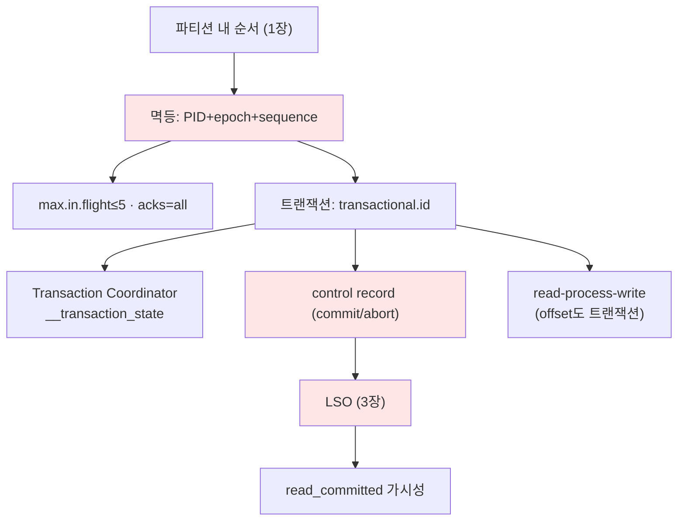

# 6장. 순서와 원자성 — 멱등·트랜잭션 〔요소 추출 stub〕

> ⚠️ **장 명세(stub).** 틀 → [I권 README](./README.md)
>
> **보장(두 문장)**: *멱등 — "재시도해도 파티션 내 중복이 생기지 않는다." 트랜잭션 — "여러 파티션에 걸친 쓰기(+offset 커밋)가 전부 반영되거나 전부 무효가 된다."*

---

## ① 무엇을 보장하나 (다룰 요소)

- **파티션 내 순서**(1장) — 전체 순서는 보장 안 함
- **멱등성**: 프로듀서 재시도로 인한 중복 제거 (같은 세션 내)
- **원자성**: 다중 파티션 쓰기의 all-or-nothing
- **EOS의 정확한 경계**: Kafka 내부(produce→consume offset)만. 외부 시스템은 범위 밖(멱등키 필요) — III권 EOS와 연결

## ② 왜 이렇게 설계했나 — 대안 비교 (다룰 요소)

- "그냥 재시도"의 함정: 네트워크 ACK 유실 → 중복 append
- 멱등 없이 순서 지키려면 `max.in.flight=1`(처리량 ↓) → 멱등이 이를 푼다
- 외부 2PC(XA) 대신 Kafka 내부 트랜잭션 + control record 방식을 택한 이유

## ③ 구조·메커니즘 (다룰 요소)

- **멱등 프로듀서**: `PID`(producer id) + `epoch` + **sequence number**(파티션별) → 브로커가 중복/순서 역전 거부
  - 요구 조합(III권 함정): `enable.idempotence=true` → `acks=all`, `max.in.flight ≤ 5`, `retries>0`
  - 세션 한계: 프로듀서 재시작(새 PID)하면 보장 끊김
- **트랜잭션**: `transactional.id` → PID 영속/펜싱(epoch로 좀비 차단)
  - **Transaction Coordinator** + `__transaction_state` 내부 로그
  - **control record**(commit/abort marker)가 데이터 로그에 박힘
  - **LSO**(Last Stable Offset, 3장 정의): read_committed는 LSO까지·abort 배치 건너뜀
  - **read-process-write**: consumer offset 커밋도 트랜잭션에 포함(`sendOffsetsToTransaction`)
- `isolation.level`: read_uncommitted(기본!) vs read_committed

## ④ 다른 개념과의 관계 (다룰 요소)

- **LSO/HW는 3장**, control record는 로그에 박히므로 **2·7장(로그/저장)**
- consumer offset 커밋 = `__consumer_offsets`(5장)
- 멱등/트랜잭션의 Spring 적용·함정 = III권 6장

## 요소 의존 그래프

## ⑤ 트레이드오프 (다룰 요소)

- 트랜잭션 오버헤드(coordinator 왕복, control record) ↔ 원자성
- EOS는 Kafka 내부 한정 — 외부 DB까지 늘리려는 욕심이 함정
- `max.in.flight` ↑ 처리량 ↔ (멱등 off면) 순서 깨짐

## ⑥ 증명 실험 후보 (3-broker)

| 실험 | 관측/단언 |
|------|----------|
| 멱등 on, 강제 재시도 유발 | 중복 append 없음(sequence 거부) |
| 프로듀서 재시작 후 같은 메시지 | 중복 발생(세션 한계) |
| 트랜잭션 abort + read_committed | 해당 메시지 안 보임(LSO/control record) |
| isolation 기본값 확인 | read_uncommitted라 abort 메시지도 보임(함정) |
| read-process-write 중 실패 | offset+출력이 함께 롤백 |

## 참조 (적극 인용)

- **KIP-98**(Exactly Once Delivery and Transactional Messaging) — 멱등+트랜잭션의 원전
- **KIP-129**(Streams EOS)
- Confluent, *"Exactly-Once Semantics in Apache Kafka"* (설계 문서/블로그)
- DDIA 9장(트랜잭션·합의), 7장(트랜잭션 격리)

## 열린 질문

- 2PC와의 비교를 어디까지(트랜잭션 coordinator = 일종의 코디네이터)
- control record 바이너리 포맷은 7장(저장)과 어디서 다룰지
- "좀비 프로듀서 펜싱(epoch)"을 4장 term/3장 epoch과 묶어 설명?

---

← [5장 조정](./05-coordination.md) · 다음: [7장 저장 엔진](./07-storage-engine.md)
