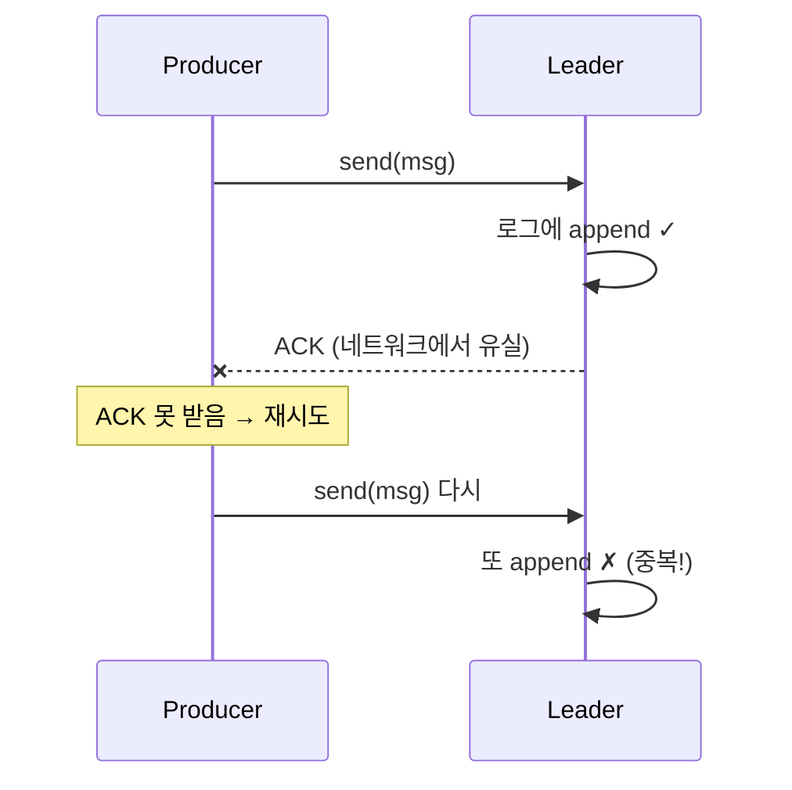

# 6장. 멱등·순서 — 중복 없이, 순서대로

> 앞 장: [5장 조정](./05-coordination.md) · 다음 장: [7장 트랜잭션·EOS](./07-transactions.md)
>
> **이 장의 보장(한 문장)**: *멱등 — 프로듀서 재시도로 인한 파티션 내 중복이 생기지 않는다. 순서 — 파티션 안에서 보낸 순서가 보장된다.*

3장에서 `acks=all`로 "잃지 않게" 만들었다. 그런데 "잃지 않음"과 "중복되지 않음"은 다른 문제다. 네트워크는 ACK를 삼킬 수 있고, 그러면 프로듀서는 재시도하며 **같은 메시지를 두 번 쓴다**. 이 장은 그 중복과 순서 역전을 어떻게 막는가다.

---

## 6.1 파티션 내 순서, 그 한계

Kafka의 순서 보장은 **파티션 안에서만**이다(1장). 같은 key는 같은 파티션으로 가니 *key 단위 순서*는 보장되지만, 토픽 전체 순서는 보장되지 않는다. 전체 순서가 필요하면 파티션 1개를 쓰거나(처리량 포기) key 설계로 풀어야 한다.

---

## 6.2 "그냥 재시도"의 함정 — 중복 append

리더는 정상 저장했는데 ACK가 유실되면, 프로듀서는 실패로 알고 재시도한다 → **같은 메시지가 두 번 로그에 쌓인다.** 순서를 지키려고 `max.in.flight=1`로 두면 처리량이 죽는다. 멱등 프로듀서가 이 딜레마를 푼다.

---

## 6.3 멱등 프로듀서 — PID + epoch + sequence

멱등 프로듀서(`enable.idempotence=true`)는 각 메시지에 신원을 붙인다:

- **PID(Producer ID)**: 브로커가 프로듀서에 발급하는 고유 id
- **epoch**: 같은 PID의 세대 번호(좀비 차단용 — 7장)
- **sequence number**: 파티션별로 0,1,2,… 증가하는 일련번호

브로커는 파티션별로 "마지막으로 받은 sequence"를 기억한다. 재시도로 **같은 sequence가 또 오면 버리고**, 건너뛴 sequence가 오면 순서 오류로 거부한다 → 중복 제거 + 순서 보장.

> ★ 요구 조합(II권 함정의 원리): `enable.idempotence=true`는 `acks=all` · `max.in.flight.requests ≤ 5` · `retries>0`을 전제한다. Kafka **3.0+** 부터 `enable.idempotence`가 **기본 true**(→ `acks=all` 강제)라, `acks=1`로 명시하면 이 전제가 깨진다. `[KIP-98/679 · docs @3.9]`

---

## 6.4 멱등의 한계 — 세션 경계

멱등성은 **한 프로듀서 세션 안에서만** 보장된다. 프로듀서가 재시작하면 새 PID를 받고, 브로커 입장에선 "처음 보는 프로듀서"다. 그래서 **재시작 전에 보냈던 메시지를 다시 보내면 중복으로 저장된다.** 

이 세션 한계를 넘어 "여러 세션·여러 파티션에 걸친" 보장이 필요할 때 → **트랜잭션**(7장)이 `transactional.id`로 PID를 영속화한다.

---

## 6.5 순서와 `max.in.flight`

`max.in.flight.requests.per.connection`은 ACK를 기다리지 않고 동시에 날리는 요청 수다.

- 멱등 **off** + `max.in.flight>1` + 재시도: 앞 요청이 실패해 재전송되는 사이 뒤 요청이 먼저 저장되면 **순서가 뒤바뀐다.**
- 멱등 **on**: sequence number 덕에 `max.in.flight≤5`까지는 순서가 보장된다(브로커가 sequence로 재정렬·거부).

→ 그래서 멱등은 "중복 제거"뿐 아니라 "처리량을 지키면서 순서 보장"의 열쇠이기도 하다.

---

## 6.6 증명 (executable · 미구현)

| 실험 | 관측/단언 | 라벨 |
|------|----------|------|
| 멱등 on, 강제 재시도 유발 | 중복 append 없음(sequence로 거부) | `[테스트 예정]` |
| 프로듀서 재시작 후 같은 메시지 | 중복 발생(세션 한계) | `[테스트 예정]` |
| 멱등 off, max.in.flight>1, 재시도 | 순서 역전 관측 | `[테스트 예정]` |

---

## 참조

- `[KIP-98]` Exactly Once Delivery and Transactional Messaging (멱등 프로듀서의 원전) `[Tier 1]`
- Kafka 공식 문서 — Idempotent Producer, `enable.idempotence` 기본값 `[docs @3.9]`
- *Designing Data-Intensive Applications* 9장 `[Tier 3]`

← [5장 조정](./05-coordination.md) · [I권 목차](./README.md) · 다음: [7장 트랜잭션·EOS](./07-transactions.md)
