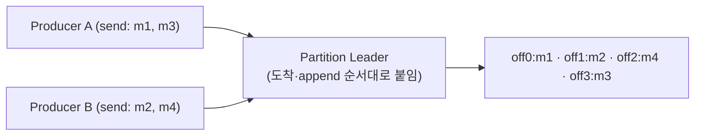
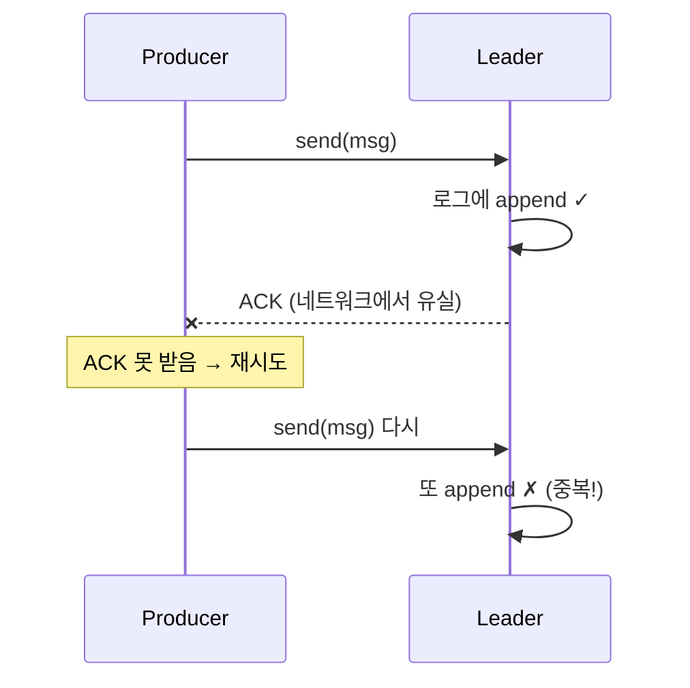

# 6장. 멱등·순서: 중복 없이, 순서대로

> 앞 장: [5장 조정](./05-coordination.md) · 다음 장: [7장 트랜잭션·EOS](./07-transactions.md)
>
> **이 장의 보장(한 문장)**: *멱등: 프로듀서 재시도로 인한 파티션 내 중복이 생기지 않는다. 순서: 파티션 안에서 보낸 순서가 보장된다.*

[3장](./03-replication.md)에서 `acks=all`로 "잃지 않게" 만들었다. 그런데 "잃지 않음"과 "중복되지 않음"은 다른 문제다. 네트워크는 ACK를 삼킬 수 있고, 그러면 프로듀서는 재시도하며 **같은 메시지를 두 번 쓴다**. 이 장은 그 중복과 순서 역전을 어떻게 막는가다.

---

## 6.1 파티션 내 순서: 그 순서는 누구 기준인가

Kafka의 순서 보장은 **파티션 안에서만**이다([1장](./01-what-is-kafka.md)). 같은 key는 같은 파티션으로 가니 *key 단위 순서*는 보장되지만(단, 파티션 수를 늘리면 `key→파티션` 매핑이 바뀌어 전환기엔 깨질 수 있다 → [II권 파티션·동시성](../2-spring/03-partition-concurrency.md)), 토픽 전체 순서는 보장되지 않는다. 대개 정말 필요한 건 *key 단위 순서*다. 진짜 토픽 전체 순서가 필요하면 **파티션 1개**(처리량 포기)뿐이다(모든 메시지를 한 key로 몰아도 결국 한 파티션과 같다).

그런데 그 "보낸 순서"가 **누구 기준**인가를 먼저 갈라야 한다.

- **단일 프로듀서**: 내가 보낸 순서가 (조건부로) 보존된다(멱등·`max.in.flight`, §6.3·§6.5).
- **여러 프로듀서**: 동시 전송엔 **절대 요청 순서가 없다.** 네트워크 지연도 스케줄링도 제각각이라, "누가 먼저 보냈나"를 비교할 원본 자체가 없다.

그래서 Kafka는 **브로커가 받아 append한 순서를 사실상의 순서로 못 박는다.** 순서를 *지키는* 게 아니라 *정의*하는 것이다.

> A의 m3과 B의 m4 중 **누가 먼저 send했든**, 브로커에 m4가 *먼저 닿으면* m4가 앞 offset이다. **"먼저 send"가 아니라 "먼저 append"가 앞 offset**이다.

이 "요청 기준 vs 저장 기준"의 갈림은 offset·순서·timestamp 세 곳에 똑같이 나타난다:

| 무엇 | 요청 기준 (send) | 저장 기준 (브로커 append) |
|------|------------------|---------------------------|
| **offset** | 프로듀서가 못 정한다 | append 시 단조 부여 → [1장](./01-what-is-kafka.md) |
| **순서**(여러 프로듀서) | 절대 순서가 없다 | **append 순서가 정의**한다 |
| **timestamp** | `CreateTime`(기본) | `LogAppendTime` → [8장](./08-storage-engine.md) |

offset은 **항상 저장 기준**이고, timestamp만 `message.timestamp.type`로 둘 중 택한다. offset 부여·timestamp 타입의 상세는 각각 [1장](./01-what-is-kafka.md)·[8장](./08-storage-engine.md)이 SSOT다.

offset은 파티션 단위라 **key별 offset 같은 건 없다**. key는 레코드가 *어느 파티션*에 들어갈지만 정하고, 그 안의 위치 번호가 offset이다.

> **순서 보장은 어디서 끝나나.** Kafka가 보장하는 건 **브로커 저장·전달(읽기) 순서까지**다. consumer가 받은 뒤 *처리를 끝낸 순서*나 *외부 DB·API에 반영한 순서*는 별개다. 그건 애플리케이션 몫이다(같은 파티션을 여러 스레드로 처리하면 처리 순서가 깨진다 → [II권 파티션·동시성](../2-spring/03-partition-concurrency.md)). 이는 [7장](./07-transactions.md) EOS가 외부 시스템까지는 원자성을 보장하지 않는 것과 **같은 결의 경계**다.

---

## 6.2 "그냥 재시도"의 함정: 중복 append

리더는 정상 저장했는데 ACK가 유실되면, 프로듀서는 실패로 알고 재시도한다 → **같은 메시지가 두 번 로그에 쌓인다.** 순서를 지키려고 `max.in.flight=1`로 두면 처리량이 크게 떨어진다(특히 RTT가 큰 링크에서). 멱등 프로듀서가 이 딜레마를 푼다.

---

## 6.3 멱등 프로듀서: PID + epoch + sequence

멱등 프로듀서(`enable.idempotence=true`)는 각 메시지에 신원을 붙인다:

- **PID(Producer ID)**: 브로커가 프로듀서에 발급하는 고유 id
- **epoch**: 같은 PID의 세대 번호(좀비 차단용, [7장](./07-transactions.md))
- **sequence number**: 파티션별로 0,1,2,… 증가하는 일련번호

브로커는 파티션별로 **직전 sequence 상태**를 들고 있다가, 재시도로 **같은 sequence가 또 오면 버리고**(중복 제거), 건너뛴 sequence가 오면 순서 오류로 거부한다. 단 이 보장은 **프로듀서→브로커 한 구간** 한정이다. 컨슈머의 중복 *소비*는 별개이고, 종단(end-to-end) exactly-once는 트랜잭션이 필요하다([7장](./07-transactions.md)).

> ★ 요구 조합(II권 함정의 원리): `enable.idempotence=true`는 `acks=all` · `max.in.flight.requests.per.connection ≤ 5` · `retries>0`을 전제한다. Kafka **3.0+** 부터 `enable.idempotence`가 **기본 true**라(그래서 `acks`도 기본값이 `all`이다), 멱등을 명시하지 않은 채 `acks=1`을 주면 멱등이 **에러 없이 조용히 꺼져**(INFO 로그뿐) 중복을 허용한다. 멱등을 `true`로 *명시*했다면 같은 충돌이 `ConfigException`으로 fail-fast한다. 이 조합 분기(silent disable vs 예외)는 → [II권 설정 조합 함정](../2-spring/08-config-combination-traps.md). `[KIP-98/679 · docs @3.9]`

---

## 6.4 멱등의 한계: 세션 경계

멱등성은 **한 프로듀서 세션 안에서만** 보장된다. 프로듀서가 재시작하면 새 PID를 받고, 브로커 입장에선 "처음 보는 프로듀서"다. 그래서 **재시작 전에 보냈던 메시지를 다시 보내면 중복으로 저장된다.** 

이 세션 한계를 넘어 "여러 세션·여러 파티션에 걸친" 보장이 필요할 때 → **트랜잭션**([7장](./07-transactions.md))이 `transactional.id`로 PID를 영속화한다.

---

## 6.5 순서와 `max.in.flight`

`max.in.flight.requests.per.connection`은 ACK를 기다리지 않고 동시에 날리는 요청 수다.

- 멱등 **off** + `max.in.flight>1` + 재시도: 앞 요청이 실패해 재전송되는 사이 뒤 요청이 먼저 저장되면 **순서가 뒤바뀐다.**
- 멱등 **on**: sequence number 덕에 `max.in.flight.requests.per.connection ≤ 5`까지는 순서가 보장된다. **브로커는 어긋난 sequence를 거부**(중복은 버림)하고, 순서를 맞춰 **재정렬하는 건 프로듀서**(재시도 시 in-flight 배치를 sequence 순서로)다(§6.3).

→ 그래서 멱등은 "중복 제거"뿐 아니라 "처리량을 지키면서 순서 보장"의 열쇠이기도 하다.

---

## 6.6 증명 (executable · 미구현)

| 실험 | 관측/단언 | 라벨 |
|------|----------|------|
| 멱등 on, 강제 재시도 유발 | 중복 append 없음(sequence로 거부) | `[테스트 예정]` |
| 프로듀서 재시작 후 같은 메시지 | 중복 발생(세션 한계) | `[테스트 예정]` |
| 멱등 off, max.in.flight>1, 재시도 | 순서 역전 관측 | `[테스트 예정]` |
| 두 프로듀서 동시 전송(같은 파티션) | offset 인터리빙이 send 순서와 무관 | `[테스트 예정]` |

---

## 참조

- `[KIP-98]` Exactly Once Delivery and Transactional Messaging (멱등 프로듀서의 원전) `[Tier 1]`
- Kafka 공식 문서: Idempotent Producer, `enable.idempotence` 기본값 `[docs @3.9]`
- *Designing Data-Intensive Applications* 9장 `[Tier 3]`

← [5장 조정](./05-coordination.md) · [I권 목차](./README.md) · 다음: [7장 트랜잭션·EOS](./07-transactions.md)
