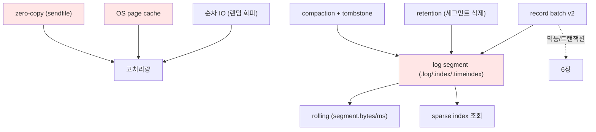

# 7장. 저장 엔진 — 디스크인데 왜 빠른가 〔요소 추출 stub〕

> ⚠️ **장 명세(stub).** 틀 → [I권 README](./README.md)
>
> **보장(한 문장)**: *"디스크 기반인데도 빠르다 — 랜덤이 아닌 순차 IO와 OS 수준 최적화(page cache·zero-copy)로 메모리 큐에 준하는 처리량을 낸다."*

---

## ① 무엇을 보장하나 (다룰 요소)

- 로그(2장)의 물리적 실체: 디스크에 어떻게 놓이는가
- 높은 처리량 + 영속성을 동시에
- offset/timestamp로 빠른 조회

## ② 왜 이 설계인가 — 통념 깨기 (다룰 요소)

- "디스크는 느리다"의 반례: **순차 쓰기/읽기는 빠르다** (랜덤만 느림)
- JVM 힙 캐시 대신 **OS page cache**를 쓰는 이유(GC 압력 회피, 재시작 시 캐시 유지)
- 애플리케이션이 데이터를 user-space로 복사하지 않는 **zero-copy**

## ③ 구조·메커니즘 (다룰 요소)

- **Log Segment**: 파티션 디렉터리 = `topic-partition/`, 그 안에 세그먼트 파일들
  - `.log`(레코드 배치), `.index`(offset→물리위치, **sparse**), `.timeindex`(timestamp→offset)
  - 파일명 = **base offset**, **active segment**에 append, `segment.bytes`/`segment.ms`로 **rolling**
- **Record Batch (v2)**: baseOffset·producerId·epoch·baseSequence·압축타입 (6장 멱등/트랜잭션이 여기 박힘)
- **조회**: sparse index로 근처 위치 점프 → `.log` 순차 스캔
- **page cache**: 쓰기는 캐시→백그라운드 flush, 읽기는 캐시 히트
- **zero-copy(`sendfile`)**: 디스크→소켓을 커널에서 직통(user-space 복사 생략)
- **압축**: producer가 batch 단위 압축(lz4/zstd/snappy/gzip), 브로커는 그대로 저장·전송
- **retention**: 시간/크기 기반, **세그먼트 단위 삭제**
- **log compaction**: cleaner thread, 키별 최신만 + tombstone (2장 "의미" → 여기 "메커니즘")

## ④ 다른 개념과의 관계 (다룰 요소)

- 2장(로그 추상)의 물리 구현
- 6장(record batch에 트랜잭션/멱등 메타)
- retention/compaction 운영은 II권, control record 포맷은 6장

## 요소 의존 그래프

## ⑤ 트레이드오프 (다룰 요소)

- 압축: CPU ↔ 네트워크/디스크 (zstd vs lz4 등)
- sparse index 간격(`index.interval.bytes`): 메모리 ↔ 조회 정밀도
- segment 크기: 너무 작으면 파일 폭증, 너무 크면 retention 지연
- page cache 의존 → 다른 프로세스와 메모리 경쟁

## ⑥ 증명 실험 후보 (docker exec)

| 실험 | 관측/단언 |
|------|----------|
| 브로커 컨테이너의 `.log` 파일 직접 보기 | 파티션 디렉터리·세그먼트 파일명(base offset) 확인 |
| `kafka-dump-log --print-data-log` | record batch 헤더(producerId 등)·control record 덤프 |
| segment.bytes 작게 + 다량 produce | 세그먼트 rolling(파일 여러 개) 관측 |
| compaction 토픽 cleaner 후 | 키별 최신만, tombstone로 삭제 |
| `listOffsets`(earliest/latest) | retention 경계·LEO 확인 |

## 참조 (적극 인용)

- Kafka 공식 design 문서 — *Persistence*, *Efficiency*(zero-copy, page cache), *Log Compaction*
- Linux `sendfile(2)` — zero-copy 근거
- **KIP-405**(Tiered Storage) — 보존 확장(예고)
- DDIA 3장(로그 구조 저장소 / SSTable·LSM와 대비)

## 열린 질문

- 바이너리 배치 포맷을 byte 단위까지 vs 필드 개념까지
- page cache/zero-copy를 "원리 설명"에서 멈출지, OS 레벨 실측까지
- tiered storage(KIP-405)는 II권 용량 운영으로 미룰지

---

← [6장 순서와 원자성](./06-ordering-atomicity.md) · [I권 목차](./README.md)
