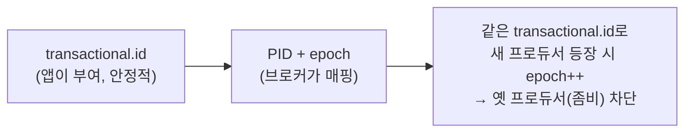
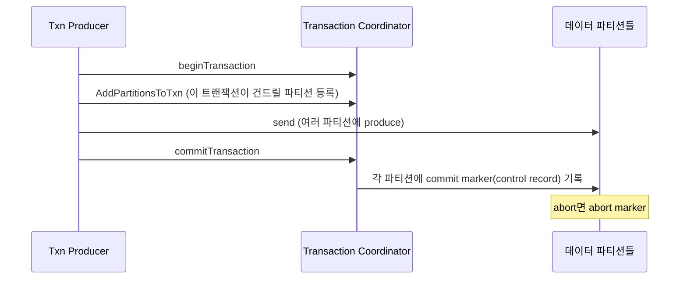
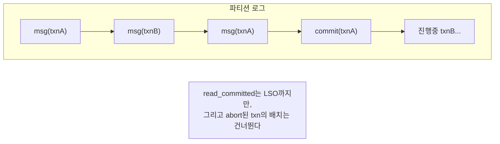
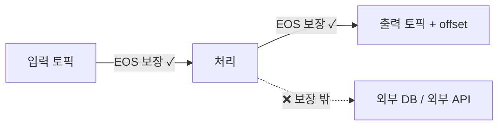

# 7장. 트랜잭션·EOS — 전부 또는 전무

> 앞 장: [6장 멱등·순서](./06-ordering-atomicity.md) · 다음 장: [8장 저장 엔진](./08-storage-engine.md)
>
> **이 장의 보장(한 문장)**: *여러 파티션에 걸친 쓰기(+consumer offset 커밋)가 전부 반영되거나 전부 무효가 된다(원자성). EOS = 멱등 + 트랜잭션 + read-process-write이며, 그 보장은 Kafka 내부에 한정된다.*

6장의 멱등은 "한 세션·한 파티션 내 중복"을 막았다. 하지만 실무는 더 큰 단위를 원한다 — *여러 파티션에 동시에 쓰고, 그게 전부 되거나 전부 안 되거나*. 그리고 *읽고-처리하고-쓰는* 한 사이클을 원자적으로 묶고 싶다. 이 장이 그 답이고, **II권에서 배우는 `read_committed`의 밑바닥**이다.

---

## 7.1 왜 트랜잭션인가

두 가지 요구가 멱등을 넘어선다:
- **다중 파티션 원자성**: 한 번의 처리가 P0·P1·P2에 모두 쓰는데, 일부만 쓰이고 죽으면 정합성이 깨진다.
- **read-process-write**: "토픽에서 읽어 → 처리해 → 다른 토픽에 쓰고 → 읽은 offset을 커밋"하는 스트림 처리 사이클. 이게 원자적이지 않으면 중복 처리나 유실이 생긴다.

트랜잭션은 6장 멱등 **위에** 쌓인다 — 멱등이 "한 파티션 중복 없음"이라면, 트랜잭션은 "여러 파티션을 한 단위로".

---

## 7.2 `transactional.id`와 좀비 펜싱

트랜잭션 프로듀서는 `transactional.id`를 갖는다. 이게 6장의 PID를 **세션을 넘어 영속화**한다.

프로듀서가 죽었다 살아나거나 중복 실행되면(좀비), 같은 `transactional.id`에 대해 **epoch를 올려** 옛 인스턴스의 쓰기를 거부한다. → 3장 leader epoch, 4장 Raft term과 같은 **"번호로 유령 펜싱"** 패턴이다.

> **서버측 방어 강화 (KIP-890)**: 위 펜싱은 원래 *프로듀서 수명당* epoch였다. KIP-890은 이를 **매 트랜잭션마다**로 강화한다 — commit/abort marker 직후 epoch를 bump해 각 트랜잭션을 `(producer id, epoch)`로 유일 식별한다. 그러면 이전 트랜잭션의 지연 메시지가 옛 epoch이라 펜싱되어 **hanging transaction**(LSO가 안 풀리는 문제)을 막는다. `[KIP-890 · 4.x]`

---

## 7.3 Transaction Coordinator와 `__transaction_state`

트랜잭션 상태는 **Transaction Coordinator**(브로커 중 하나)가 관리하고, 그 상태 역시 **`__transaction_state`라는 내부 로그**에 저장된다(2장 "메타데이터도 로그"). 트랜잭션의 시작·진행·commit/abort가 전부 로그로 남아, 코디네이터가 죽어도 복구된다.

---

## 7.4 2단계 흐름

프로듀서가 `commit`하면 코디네이터가 관련된 **모든 파티션에 control record(마커)** 를 기록한다. 이 "전부에 마커를 박는" 단계가 원자성을 만든다 — 2단계 커밋(2PC)과 닮은 구조다.

> 트랜잭션이 영원히 열린 채 방치되지 않도록, 코디네이터는 `transaction.timeout.ms`(프로듀서 설정, 기본 **60000ms=1분**)를 넘기면 그 트랜잭션을 **자동 abort**한다. (상한은 브로커 `transaction.max.timeout.ms`로 제한된다.) `[docs @3.7]`

---

## 7.5 핵심: control record + LSO + `read_committed`

여기가 **low↔high 연결의 정점**이다. II권에서 *"`read_committed` consumer는 abort된 메시지를 못 본다"* 를 배운다. 그게 **어떻게** 구현되나?

- **control record**: commit/abort 마커가 데이터 로그 안에 일반 레코드처럼 박힌다(단, consumer에겐 데이터로 안 보인다).
- **LSO (Last Stable Offset)**: 아직 끝나지 않은(진행 중) 트랜잭션의 시작 직전 offset — 정확히는 **min(HW, 가장 오래된 열린 트랜잭션의 시작)**. 3장의 HW 위에 트랜잭션 경계를 더한 것이다(LSO는 여기 7장에서 처음 정의된다). ※ 8장의 *log start offset*과 약어가 겹치지 않게, LSO는 항상 Last Stable Offset을 뜻한다.

- `read_uncommitted`(**기본값!**): LSO 무시, 진행 중·abort 메시지까지 다 본다.
- `read_committed`: **LSO까지만** 읽고, **abort 마커가 붙은 트랜잭션의 배치는 스킵**한다.

→ 그래서 "abort된 메시지를 거른다"는 **control record로 경계를 긋고 LSO로 가시성을 막는** 로그 레벨 메커니즘이다. II권의 현상이 여기서 원리로 설명된다.

> ★ 함정: `isolation.level` 기본값이 `read_uncommitted`라, 트랜잭션을 써도 consumer를 안 바꾸면 abort 메시지가 보인다. (이 함정의 *코드 처리*는 → II권.)

---

## 7.6 read-process-write — offset도 트랜잭션에

스트림 처리(읽어서→처리→써서→offset 커밋)를 원자적으로 묶는 핵심: **consumer offset 커밋조차 트랜잭션에 포함**시킨다(`sendOffsetsToTransaction`). 

그러면 "출력 메시지 쓰기"와 "입력 offset 전진"이 **한 트랜잭션**으로 묶여, commit되면 둘 다, abort되면 둘 다 무효 → 중복 처리도 유실도 없다. 이것이 Kafka 내부에서의 진짜 exactly-once다.

---

## 7.7 EOS의 경계 — 어디까지가 exactly-once인가

가장 중요한 한계. **EOS는 "Kafka 토픽 → 처리 → Kafka 토픽(+offset)"까지만** 보장한다.

처리 중 **외부 시스템(DB·결제 API 등)에 쓰는 것은 트랜잭션 밖**이다. 그건 Kafka가 롤백할 수 없다. → 외부 시스템까지의 정확성은 **멱등키(idempotency key)** 로 방어해야 한다. (이 패턴은 → II권, 그리고 분산 트랜잭션 설계는 → messaging-lab/saga-lab.)

"Kafka가 EOS 지원하니 중복 걱정 없다"는 가장 흔한 오해의 정체가 이 경계다.

---

## 7.8 증명 (executable — 3-broker)

| 실험 | 관측/단언 | 라벨 |
|------|----------|------|
| 트랜잭션 abort + `read_committed` | 해당 메시지 안 보임 | `[테스트로 결정]` |
| `isolation.level` 기본값 확인 | `read_uncommitted`라 abort 메시지도 보임(함정) | `[docs @3.7]` |
| read-process-write 중 실패 | 출력+offset이 함께 롤백 | `[테스트로 결정]` |
| 같은 `transactional.id` 중복 프로듀서 | 옛 프로듀서 펜싱(epoch) | `[테스트로 결정]` |

---

## 참조

- `[KIP-98]` 트랜잭션·idempotent producer · `[KIP-129]` Streams EOS · `[KIP-890]` 트랜잭션 서버측 방어(epoch-bump-per-txn) `[Tier 1]`
- Confluent, *Exactly-Once Semantics in Apache Kafka* (설계 문서) `[Tier 3]`
- *Designing Data-Intensive Applications* 9장(트랜잭션·합의)·7장(격리) `[Tier 3]`

← [6장 멱등·순서](./06-ordering-atomicity.md) · [I권 목차](./README.md) · 다음: [8장 저장 엔진](./08-storage-engine.md)
