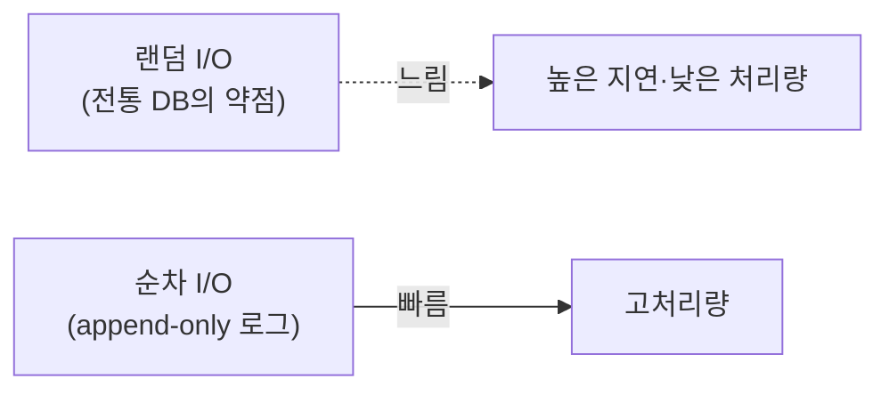
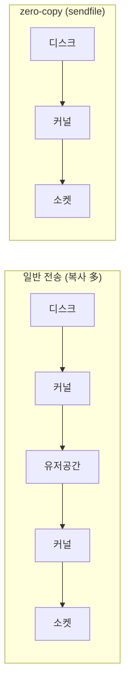
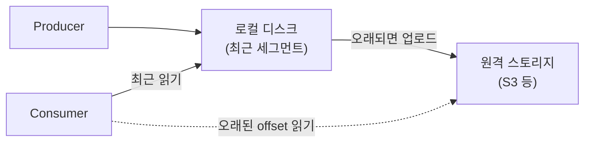

# 8장. 저장 엔진 — 디스크인데 왜 빠른가

> 앞 장: [7장 트랜잭션·EOS](./07-transactions.md) · 다음 장: [9장 클라이언트 런타임](./09-client-runtime.md)
>
> **이 장의 보장(한 문장)**: *Kafka는 디스크 기반인데도 순차 I/O와 OS 수준 최적화(page cache·zero-copy)로 메모리 큐에 준하는 처리량을 낸다.*

2장에서 로그는 추상이었다. 이 장은 그 로그가 **디스크에 실제로 어떻게 놓이는가**, 그리고 "디스크는 느리다"는 통념을 Kafka가 어떻게 뒤집는가다.

---

## 8.1 통념 깨기 — "디스크 = 느리다"가 틀리는 지점

디스크가 느린 건 **랜덤 접근**일 때다. **순차 접근**은 디스크도 충분히 빠르다(때로 메모리 랜덤 접근과 비슷). Kafka는 로그가 append-only(2장)라 **쓰기는 항상 순차**이고, 읽기도 대부분 순차다(sparse index로 근처까지 점프한 뒤 짧게 순차 스캔 — 8.5) — 이게 첫 번째 비결이다.



---

## 8.2 page cache와 zero-copy

두 번째·세 번째 비결은 OS를 적극 활용하는 것이다.

- **OS page cache**: Kafka는 데이터를 JVM 힙에 캐싱하지 않고 **OS 페이지 캐시**에 맡긴다. → GC 압력이 없고, 브로커가 재시작해도 캐시(페이지)가 살아 있으며, 쓰기는 캐시에 했다가 OS가 디스크로 flush한다.
  - 즉 Kafka는 **매 쓰기마다 fsync를 강제하지 않는다**(그래서 page cache 위임이 빠르다). 아직 flush 안 된 데이터의 내구성은 디스크 fsync가 아니라 **복제**로 보장한다 — 여러 브로커의 page cache + `acks=all`·`min.insync.replicas`(3장). 한 브로커의 디스크 손실은 복구(8.9)+복제로 메운다.
- **zero-copy (`sendfile`)**: consumer에게 보낼 때, 디스크→커널→유저공간→커널→소켓의 복사를 거치지 않고 **커널 안에서 디스크→소켓으로 바로** 보낸다(`sendfile` 시스템콜). 유저공간 복사가 사라져 CPU·메모리 대역폭을 아낀다.
  - 단, **TLS 암호화** · **브로커측 재압축** · **구버전 클라이언트용 다운컨버전(메시지 포맷 변환)** 이 끼면 데이터가 user-space를 거쳐야 해서 `sendfile` 경로를 **우회**한다 — zero-copy는 평문·무변환 전송에서만 성립하는 원리다.



> 이 둘이 "메시지 큐인데 왜 파일에 쌓나"의 답이다 — 파일에 쌓되, OS의 가장 빠른 경로를 탄다.

---

## 8.3 Log Segment — 로그의 물리적 실체

파티션 로그는 하나의 거대한 파일이 아니라 **세그먼트(segment)** 들로 쪼개진다.

```
order-events-0/                         (토픽-파티션 디렉터리)
├── 00000000000000000000.log            (레코드 배치 — 실제 데이터)
├── 00000000000000000000.index          (offset → 파일 물리위치, sparse)
├── 00000000000000000000.timeindex      (timestamp → offset)
├── 00000000000000000000.snapshot       (프로듀서 상태 PID→seq — 재시작 복원, 8.4)
├── 00000000000000170245.log            (다음 세그먼트, base offset=170245)
├── leader-epoch-checkpoint             (리더 epoch — 3장·8.9 truncation)
├── partition.metadata                  (파티션 메타: topic id 등)
└── ...
```

- 파일명 = 그 세그먼트의 **base offset**.
- 가장 최근 세그먼트가 **active segment**이고, 쓰기는 여기에만 append된다.
- `segment.bytes`(크기)나 `segment.ms`(시간)에 도달하면 **롤링** — 새 세그먼트를 연다.

**왜 크기·시간 *둘 다* 트리거인가.** retention·compaction은 **닫힌(old) 세그먼트에만** 적용된다(active segment는 안 건드린다). 그래서 크기 트리거(`segment.bytes`)만 있으면 **저트래픽 토픽**은 세그먼트가 좀처럼 안 차 active가 무한정 열려 있고 → 오래된 데이터가 active에 갇혀 retention·compaction이 **굶는다**(예: retention이 1일인데 세그먼트가 일주일째 안 닫혀 삭제가 안 됨). `segment.ms`가 저트래픽에서도 **주기적 강제 롤링**을 보장해 이 구멍을 막는다. `[docs @3.9]`

한 축만 보면 반대 상황에서 구멍이 나므로, 저장 계층의 임계는 **크기+시간 이중 트리거**로 짝지어진다:

| 무엇 | 크기 축 | 시간 축 |
|------|---------|---------|
| 세그먼트 롤링 | `segment.bytes` | `segment.ms` |
| retention 삭제 | `retention.bytes` | `retention.ms` |

(프로듀서 배치도 같은 철학의 `batch.size`+`linger.ms` 짝이다 → [클라이언트 런타임](./09-client-runtime.md).)

> `.index`/`.timeindex`는 **memory-mapped 파일(mmap)** 로 다뤄진다 — OS가 파일을 메모리에 매핑해 빠르게 접근한다. 대신 크래시 시 아직 디스크에 안 내려간 부분이 손상될 수 있어, 재시작 때 복구·재구성이 필요하다(→ 8.9). `[code @3.7]`

---

## 8.4 Record Batch (v2) — 멱등·트랜잭션이 박히는 곳

레코드는 하나씩이 아니라 **배치(RecordBatch)** 단위로 저장·전송된다. v2 배치 헤더에는 `baseOffset`, `producerId`, `producerEpoch`, `baseSequence`, 압축 타입 등이 들어간다.

→ 6장의 멱등(PID/epoch/sequence)과 7장의 트랜잭션 정보가 **바로 이 배치 헤더에 박힌다.** 즉 6·7장의 추상이 8장의 물리 포맷에서 만난다.

---

## 8.5 조회 — sparse index

`.index`는 모든 offset이 아니라 **드문드문(sparse)** 만 기록한다(`index.interval.bytes` 간격). offset을 찾을 때 index로 **근처 위치까지 점프**한 뒤 `.log`를 순차 스캔한다. → 인덱스 메모리를 아끼면서 조회도 빠르다(순차 스캔은 짧으니까).

---

## 8.6 압축(compression)

프로듀서가 **배치 단위로 압축**(lz4/zstd/snappy/gzip)해서 보내면, **기본값(`compression.type=producer`)에서는** 브로커가 그대로 저장·전송하고 consumer가 푼다. 배치 단위라 압축률이 좋고, 브로커가 풀었다 다시 압축하지 않아 CPU도 아낀다(그래서 zero-copy도 성립 — 8.2). 단 토픽 `compression.type`을 특정 코덱으로 지정하면 브로커가 **재압축**하고, compaction(8.7)·다운컨버전에서도 재인코딩이 일어난다 — 이때는 8.2의 zero-copy 우회 케이스다. (압축 알고리즘 선택은 CPU↔대역폭 트레이드오프 → III권.)

---

## 8.7 Log Compaction의 "메커니즘"

2장에서 compaction의 *의미*(키별 최신 = 상태 스냅샷)를 봤다. 여기선 *메커니즘*이다:

- **log cleaner 스레드**가 백그라운드로 세그먼트를 돌며, 같은 key의 옛 레코드를 제거하고 최신만 남긴다.
- cleaner는 **즉시·완전 압축을 보장하지 않는다** — active segment는 제외되고, dirty(미압축) 비율이 임계(`min.cleanable.dirty.ratio`, 기본 0.5)를 넘어야 돌며, `min.compaction.lag.ms`가 지난 레코드만 대상이다. 그래서 같은 key가 한동안 중복으로 남을 수 있고, **소비 측은 offset 순서로 마지막 값을 취하는(last-write-wins) 식으로 읽어야 한다**(의미는 → [로그 추상](./02-log-abstraction.md)). `[docs @3.9]`
- `value=null` 레코드(**tombstone**)는 "이 key를 삭제하라"는 표식이다(key는 살아 있어 *어느* key를 지울지 가리킨다). tombstone **레코드 자체**는 `delete.retention.ms`(기본 1일) 동안 보존됐다가 제거된다 — 소비자가 삭제를 놓치지 않게 한 grace period다. `[docs @3.9]`
- `cleanup.policy=compact`(또는 `compact,delete`)로 켠다.

→ `__consumer_offsets`가 무한히 안 자라는 이유가 이것(compaction)이다. (`__cluster_metadata`는 compaction이 아니라 **KRaft 스냅샷**으로 잘라낸다 — 메커니즘이 다르다, 4장.)

---

## 8.8 Retention — 세그먼트 단위 삭제

`cleanup.policy=delete`(기본)에서는 `retention.ms`(시간)나 `retention.bytes`(크기)를 넘긴 데이터를 지운다. 단 **레코드 하나씩이 아니라 세그먼트 통째로** 삭제한다(그래서 active segment는 안 지워지고, 경계가 세그먼트 단위로 움직인다).

**retention vs compaction — `cleanup.policy` 하나로 갈리는 두 전략.**

| | retention (`delete`) | compaction (`compact`) |
|---|---|---|
| 자르는 기준 | 시간·크기(오래된 것) | key(key별 최신 1개) |
| 무엇이 남나 | 최근 구간의 전체 이력 | 각 key의 최신값(시간 무관) |
| 삭제 단위 | 세그먼트 통째 | 같은 key의 옛 레코드 |
| 데이터 성격 | **이벤트**(흐름) | **상태**(현재 값) |

결정 규칙은 단순하다: **데이터가 이벤트면 `delete`, 상태면 `compact`** — 데이터의 성격이 정책을 정한다. 둘을 함께 켜는 `compact,delete`는 *key별 최신값은 남기되, 그마저 너무 오래되면 삭제*한다. (replay 가능 범위 관점의 retention↔compaction 대비는 → [로그 추상](./02-log-abstraction.md). retention 기간 등 *어떤 값을 고를지*는 운영 판단 → [III권 운영](../3-operations/README.md).) `[docs @3.9]`

---

## 8.9 로그 복구 — 재시작 시 어디부터 믿나

브로커가 재시작하면 **마지막으로 안전하게 디스크에 내려간 지점**을 알아야 한다. 그래서 **로그 디렉터리(`log.dir`)마다** 체크포인트 파일을 두고, 한 파일 안에 **파티션별 행**으로 적는다:

- `recovery-point-offset-checkpoint` — 어디까지 디스크로 flush됐나
- `replication-offset-checkpoint` — HW(3장)
- `log-start-offset-checkpoint` — 로그 시작 offset

(이 셋은 `log.dir` 단위 파일이고, `leader-epoch-checkpoint`는 파티션 디렉터리마다 따로 둔다 — 8.3.)

**clean shutdown**이면 이 체크포인트를 믿고 즉시 시작한다. **unclean shutdown**(크래시·`kill -9`)이면 마지막 세그먼트가 온전하다는 보장이 없으므로, **마지막 세그먼트를 스캔·재검증해 반쯤 쓰인 손상 배치를 잘라낸다.** mmap 인덱스(8.3)도 이때 재구성된다.

→ 3.1의 "커밋했는데 사라짐"을 막는 것이 복제(3장)라면, 그 약속을 **한 브로커의 디스크 레벨에서** 지키는 것이 이 복구 절차다. `[code @3.7]`

---

## 8.10 시간의 의미 — timestamp.type과 retention

레코드의 timestamp는 둘 중 하나다(`message.timestamp.type`):

- **CreateTime**(기본) — 프로듀서가 레코드를 만든 시각
- **LogAppendTime** — 브로커가 받아 로그에 쓴 시각

`.timeindex`(8.3)는 이 timestamp로 "시각 T의 메시지는 어느 offset인가"를 인덱싱해 **시간 기반 seek**을 지원한다.

★ 함정: **retention(시간 기반 삭제)도 이 timestamp를 본다** — 정확히는 한 세그먼트의 **최대 timestamp**가 기준이라 세그먼트 단위로 판정한다(과거 레코드 하나로 즉시 삭제되진 않는다). 그래서 프로듀서가 잘못된 CreateTime(예: 과거 시각)을 넣으면 데이터가 의도보다 **너무 일찍 삭제**되거나, 미래 시각이면 안 지워질 수 있다. (어느 타입을 쓸지는 운영 판단 → III권.) `[docs @3.9]`

---

## 8.11 Tiered Storage — 무한 보존 (KIP-405)

로그가 무한히 쌓이면 로컬 디스크가 한계다. **Tiered Storage**는 오래된 세그먼트를 **원격 스토리지(S3 등)로 내리고**, 로컬엔 최근 것만 둔다.



- **RemoteLogManager**가 원격 업로드·조회를 담당한다.
- consumer가 오래된 offset을 읽으면 **원격에서 fallback**해 가져온다(느리지만 가능).
- **local retention**과 **remote retention**을 따로 설정 — 로컬은 짧게, 원격은 길게(사실상 무한).

→ 보존을 로컬 디스크 용량에서 분리한다. 운영·용량 측면은 → III권. (KIP-405, 3.9부터 production-ready) `[KIP-405]`

---

## 8.12 증명 (executable — docker exec · 부분 2/4)

| 실험 | 관측/단언 | 라벨 |
|------|----------|------|
| 브로커 컨테이너의 `.log` 파일 열기 | 파티션 디렉터리·세그먼트 파일명(base offset) 확인 | `[code @3.7]` |
| `kafka-dump-log --print-data-log` | 배치 헤더(producerId 등)·control record 덤프 | `[code @3.7]` |
| `segment.bytes` 작게 + 다량 produce | 세그먼트 rolling(파일 여러 개) 관측 | `[테스트 예정]` |
| compaction 토픽 cleaner 후 | 키별 최신만, tombstone로 삭제 | `[테스트 예정]` |

---

## 참조

- Kafka 공식 문서 — *Persistence*, *Efficiency*(zero-copy·page cache), *Log Compaction* `[docs @3.9]`
- Linux `sendfile(2)` — zero-copy 근거 `[Tier 0]`
- `[KIP-405]` Tiered Storage (보존 확장, 3.9 production-ready) — 운영 측면은 III권 `[Tier 1]`
- *Designing Data-Intensive Applications* 3장(로그 구조 저장소·SSTable/LSM 대비) `[Tier 3]`

← [7장 트랜잭션·EOS](./07-transactions.md) · [I권 목차](./README.md) · 다음: [9장 클라이언트 런타임](./09-client-runtime.md)
