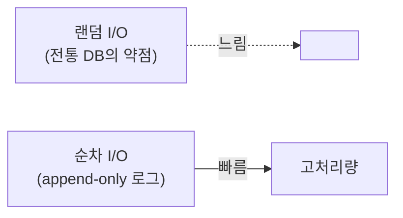
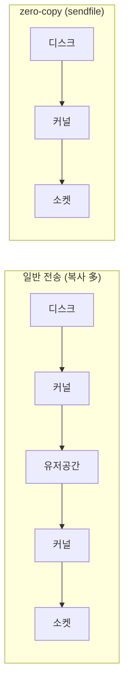

# 8장. 저장 엔진 — 디스크인데 왜 빠른가

> 앞 장: [7장 트랜잭션·EOS](./07-transactions.md) · 다음 장: [9장 클라이언트 런타임](./09-client-runtime.md)
>
> **이 장의 보장(한 문장)**: *Kafka는 디스크 기반인데도 순차 I/O와 OS 수준 최적화(page cache·zero-copy)로 메모리 큐에 준하는 처리량을 낸다.*

2장에서 로그는 추상이었다. 이 장은 그 로그가 **디스크에 실제로 어떻게 놓이는가**, 그리고 "디스크는 느리다"는 통념을 Kafka가 어떻게 뒤집는가다.

---

## 8.1 통념 깨기 — "디스크 = 느리다"가 틀리는 지점

디스크가 느린 건 **랜덤 접근**일 때다. **순차 접근**은 디스크도 충분히 빠르다(때로 메모리 랜덤 접근과 비슷). Kafka는 로그가 append-only(2장)라 **항상 순차 쓰기/읽기**만 한다 — 이게 첫 번째 비결이다.



---

## 8.2 page cache와 zero-copy

두 번째·세 번째 비결은 OS를 적극 활용하는 것이다.

- **OS page cache**: Kafka는 데이터를 JVM 힙에 캐싱하지 않고 **OS 페이지 캐시**에 맡긴다. → GC 압력이 없고, 브로커가 재시작해도 캐시(페이지)가 살아 있으며, 쓰기는 캐시에 했다가 OS가 디스크로 flush한다.
- **zero-copy (`sendfile`)**: consumer에게 보낼 때, 디스크→커널→유저공간→커널→소켓의 복사를 거치지 않고 **커널 안에서 디스크→소켓으로 바로** 보낸다(`sendfile` 시스템콜). 유저공간 복사가 사라져 CPU·메모리 대역폭을 아낀다.



> 이 둘이 "메시지 큐인데 왜 파일에 쌓나"의 답이다 — 파일에 쌓되, OS의 가장 빠른 경로를 탄다.

---

## 8.3 Log Segment — 로그의 물리적 실체

파티션 로그는 하나의 거대한 파일이 아니라 **세그먼트(segment)** 들로 쪼개진다.

```
order-events-0/                         (토픽-파티션 디렉터리)
├── 00000000000000000000.log            (레코드 배치 — 실제 데이터)
├── 00000000000000000000.index          (offset → 파일 물리위치, sparse)
├── 00000000000000000000.timeindex      (timestamp → offset)
├── 00000000000000170245.log            (다음 세그먼트, base offset=170245)
└── ...
```

- 파일명 = 그 세그먼트의 **base offset**.
- 가장 최근 세그먼트가 **active segment**이고, 쓰기는 여기에만 append된다.
- `segment.bytes`(크기)나 `segment.ms`(시간)에 도달하면 **롤링** — 새 세그먼트를 연다.

---

## 8.4 Record Batch (v2) — 멱등·트랜잭션이 박히는 곳

레코드는 하나씩이 아니라 **배치(RecordBatch)** 단위로 저장·전송된다. v2 배치 헤더에는 `baseOffset`, `producerId`, `producerEpoch`, `baseSequence`, 압축 타입 등이 들어간다.

→ 6장의 멱등(PID/epoch/sequence)과 7장의 트랜잭션 정보가 **바로 이 배치 헤더에 박힌다.** 즉 6·7장의 추상이 8장의 물리 포맷에서 만난다.

---

## 8.5 조회 — sparse index

`.index`는 모든 offset이 아니라 **드문드문(sparse)** 만 기록한다(`index.interval.bytes` 간격). offset을 찾을 때 index로 **근처 위치까지 점프**한 뒤 `.log`를 순차 스캔한다. → 인덱스 메모리를 아끼면서 조회도 빠르다(순차 스캔은 짧으니까).

---

## 8.6 압축(compression)

프로듀서가 **배치 단위로 압축**(lz4/zstd/snappy/gzip)해서 보내면, 브로커는 그대로 저장·전송하고 consumer가 푼다. 배치 단위라 압축률이 좋고, 브로커가 풀었다 다시 압축하지 않아 CPU도 아낀다. (압축 알고리즘 선택은 CPU↔대역폭 트레이드오프 → III권.)

---

## 8.7 Log Compaction의 "메커니즘"

2장에서 compaction의 *의미*(키별 최신 = 상태 스냅샷)를 봤다. 여기선 *메커니즘*이다:

- **log cleaner 스레드**가 백그라운드로 세그먼트를 돌며, 같은 key의 옛 레코드를 제거하고 최신만 남긴다.
- `key=null` 레코드(**tombstone**)는 "삭제"를 의미하고, 일정 시간 후 제거된다.
- `cleanup.policy=compact`(또는 `compact,delete`)로 켠다.

→ `__consumer_offsets`·`__cluster_metadata`가 무한히 안 자라는 이유가 이것이다.

---

## 8.8 Retention — 세그먼트 단위 삭제

`cleanup.policy=delete`(기본)에서는 `retention.ms`(시간)나 `retention.bytes`(크기)를 넘긴 데이터를 지운다. 단 **레코드 하나씩이 아니라 세그먼트 통째로** 삭제한다(그래서 active segment는 안 지워지고, 경계가 세그먼트 단위로 움직인다).

---

## 8.9 증명 (executable — docker exec)

| 실험 | 관측/단언 | 라벨 |
|------|----------|------|
| 브로커 컨테이너의 `.log` 파일 열기 | 파티션 디렉터리·세그먼트 파일명(base offset) 확인 | `[code @3.7]` |
| `kafka-dump-log --print-data-log` | 배치 헤더(producerId 등)·control record 덤프 | `[code @3.7]` |
| `segment.bytes` 작게 + 다량 produce | 세그먼트 rolling(파일 여러 개) 관측 | `[테스트로 결정]` |
| compaction 토픽 cleaner 후 | 키별 최신만, tombstone로 삭제 | `[테스트로 결정]` |

---

## 참조

- Kafka 공식 문서 — *Persistence*, *Efficiency*(zero-copy·page cache), *Log Compaction* `[docs @3.7]`
- Linux `sendfile(2)` — zero-copy 근거 `[Tier 0]`
- `[KIP-405]` Tiered Storage (보존 확장, 3.9 production-ready) — 운영 측면은 III권 `[Tier 1]`
- *Designing Data-Intensive Applications* 3장(로그 구조 저장소·SSTable/LSM 대비) `[Tier 3]`

← [7장 트랜잭션·EOS](./07-transactions.md) · [I권 목차](./README.md) · 다음: [9장 클라이언트 런타임](./09-client-runtime.md)
