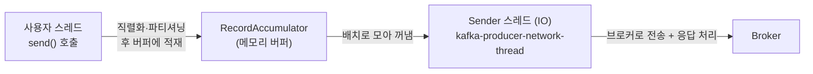
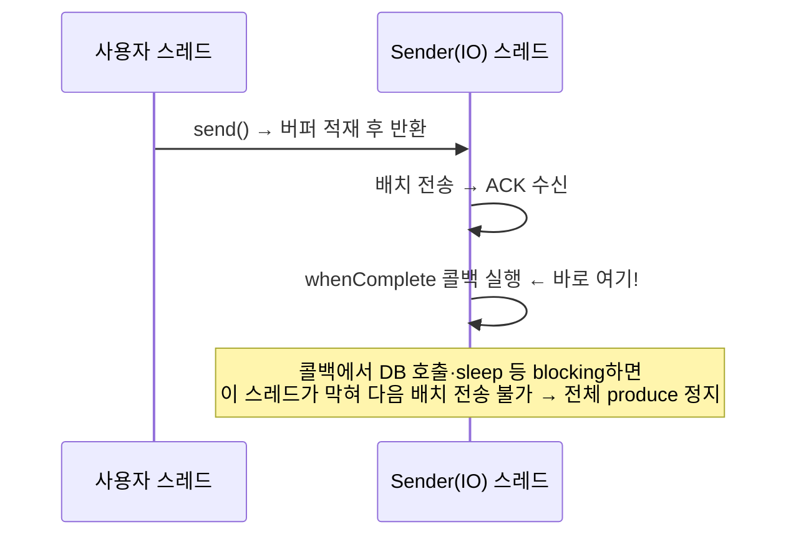
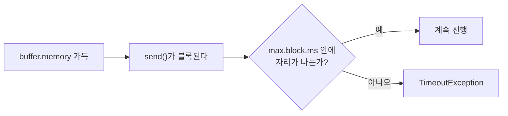
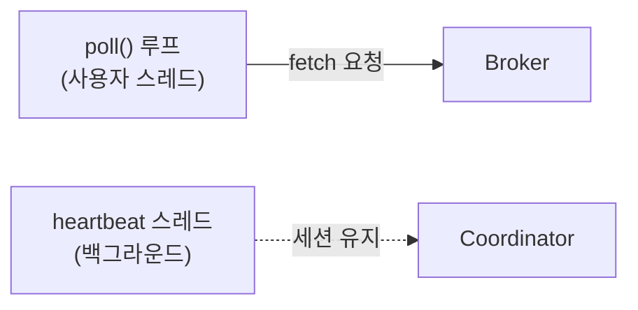

# 9장. 클라이언트 런타임 — Producer/Consumer는 내부에서 어떻게 도나

> 앞 장: [8장 저장 엔진](./08-storage-engine.md) · [I권 목차](./README.md)
>
> **이 장의 보장/관점(한 문장)**: *`send()`는 비동기다 — 사용자 스레드와 IO 스레드가 분리돼 있고, 그 경계를 모르면 콜백 한 줄로 전체 처리량을 무너뜨린다.*

지금까지는 브로커 쪽(로그·복제·합의·저장)이었다. 이 장은 **클라이언트(Producer/Consumer) 라이브러리 내부**다. 여기를 모르면 II권의 코드 함정(`whenComplete`에서 blocking, `max.block.ms` 타임아웃)이 "왜 그런지" 설명이 안 된다.

---

## 9.1 Producer 스레드 모델 — 두 개의 스레드

`KafkaProducer.send()`는 **즉시 브로커로 보내지 않는다.** 두 종류의 스레드가 일한다:



- **사용자 스레드**: `send()`를 호출한 너의 스레드. 직렬화·파티셔닝을 하고 레코드를 버퍼(RecordAccumulator)에 넣은 뒤 **곧바로 반환**한다(비동기).
- **Sender(IO) 스레드**: `kafka-producer-network-thread`. 버퍼에서 배치를 꺼내 브로커로 보내고, **응답(ACK)을 받아 콜백/Future를 완료**시킨다. 프로듀서당 보통 1개.

---

## 9.2 `send()`의 여정

```
send() → 직렬화 → 파티션 결정 → RecordAccumulator에 적재 → (사용자 스레드 반환)
                                                  ↓ (Sender 스레드가)
                              배치 모음(batch.size/linger.ms) → 브로커 전송 → ACK → 콜백 완료
```

`linger.ms`/`batch.size`(II권에서 튜닝)는 Sender가 "얼마나 모아서 한 번에 보낼지"를 정한다. 즉 **배치는 Sender 스레드의 일**이지 사용자 스레드의 일이 아니다.

> **key 없는 메시지는 어느 파티션으로?** key가 있으면 해시로 정해지지만, key가 없으면 **sticky partitioner**(KIP-480)가 한 파티션에 "달라붙어" 배치가 찰 때까지(또는 `linger.ms`까지) 거기로 모은 뒤 다음 파티션으로 옮긴다 → 배치가 커져 처리량이 오른다(9.5와 연결). 이후 **uniform sticky**(KIP-794)로 파티션 간 균형이 개선됐다. `[KIP-480, KIP-794]`

---

## 9.3 콜백은 누가 실행하나 — 그리고 그게 왜 위험한가

★ 이 장의 핵심. **`send()`가 돌려주는 Future의 콜백(`whenComplete`/`Callback`)은 Sender(IO) 스레드에서 실행된다.**



콜백 안에서 **무거운/blocking 작업**(DB 조회, 외부 API, 락 대기)을 하면, 그 Sender 스레드가 멈춰 **다음 배치들을 못 보낸다.** 프로듀서 1개에 Sender는 보통 1개뿐이므로, 콜백 한 줄이 전체 처리량을 0으로 만들 수 있다.

→ II권의 "코드 구조 함정"(콜백에서 blocking 금지)이 **여기서 원리로 설명된다.** 무거운 일은 콜백에서 다른 실행기(executor)로 넘겨야 한다.

---

## 9.4 Backpressure — `buffer.memory`와 `max.block.ms`

버퍼(RecordAccumulator)는 무한하지 않다(`buffer.memory`). 프로듀서가 브로커보다 빠르게 만들어내면 버퍼가 찬다. 그러면?



- 버퍼가 차면 `send()`는 **블록**된다(메타데이터 대기에도 블록). 즉 비동기인 `send()`가 이 순간엔 사용자 스레드를 멈춘다.
- `max.block.ms` 안에 자리가 안 나면 `TimeoutException`. → 이게 **backpressure**(소비처가 못 따라갈 때 생산을 눌러주는 장치)다.

> `max.block.ms`는 *버퍼에 들어가기까지*의 한도일 뿐이다. 그 뒤 **전송+재시도까지 포함한 전체 상한**은 별도로 `delivery.timeout.ms`(KIP-91, 기본 **120000ms=2분**)가 정한다 — `send()` 호출부터 성공/최종 실패까지의 총 시계다. `[KIP-91 · docs @3.7]`

---

## 9.5 설정 조합 — 처리량·지연·역압의 삼각형

이 네 설정이 **함께** 처리량/지연/역압을 결정한다(개별이 아니라 조합 — II권 함정의 원리):

| 설정 | 올리면 |
|------|--------|
| `batch.size` | 배치 커짐 → 처리량 ↑, 지연 ↑ |
| `linger.ms` | 더 모음 → 처리량 ↑, 지연 ↑ |
| `buffer.memory` | 버퍼 여유 ↑ → 역압 늦게, 메모리 ↑ |
| `max.block.ms` | 블록 인내 ↑ → 실패 늦게, 지연 길어질 수 있음 |

---

## 9.6 Consumer 런타임

Consumer는 Producer와 다르게 **단일 스레드 poll 루프**가 기본이다.



- **poll() 루프**: 한 스레드가 `poll()`로 레코드를 가져와 처리하고 다시 `poll()`. 처리도 이 스레드에서 한다.
- **heartbeat 스레드(백그라운드)**: 5장의 `session.timeout`을 위해 하트비트를 따로 보낸다. → "살아있음"(heartbeat)과 "처리 진행"(poll 간격=`max.poll.interval`)이 분리된 이유(5.7).
- `max.poll.records`: 한 번 poll로 가져올 최대 레코드. 너무 크면 처리에 오래 걸려 `max.poll.interval` 초과 → 퇴출(5장 리밸런싱).

→ 그래서 "리스너 안에서 오래 걸리는 blocking 작업"은 퇴출·리밸런싱을 부른다. (Spring 컨테이너의 스레드 모델·동시성은 → II권.)

---

## 9.7 Consumer/Replica는 어떻게 읽나 — fetch 프로토콜

Producer는 push(보내기)지만, **Consumer와 Replica는 둘 다 pull(당기기)** 이다 — `Fetch` 요청으로 브로커에서 데이터를 가져온다.

- **long-poll**: 데이터가 아직 없으면 브로커가 즉시 빈 응답을 주지 않고, `fetch.max.wait.ms`까지 기다렸다 `fetch.min.bytes`만큼 모이면 응답한다 → 빈 폴링을 줄이고 배치 효율을 높인다.
- **incremental fetch session**(KIP-227): 파티션이 많을 때 매번 전체 목록을 주고받지 않고 **변한 것만** 주고받는다(세션으로 상태 유지).
- **복제도 같은 fetch 프로토콜**: 3장에서 follower가 leader를 "fetch로 당겨간다"고 했는데, 그게 바로 이 프로토콜이다 — consumer fetch와 replica fetch는 동일 메커니즘이다.
- **fetch-from-follower**(KIP-392): 기본은 leader에서 읽지만, 가까운(같은 rack) follower에서 읽도록 허용할 수 있다(지연·비용 최적화). 설정·운영은 → III권이나, 동작 자체는 fetch 프로토콜의 일부다.

`[KIP-227, KIP-392]`

---

## 9.8 broker가 요청을 보류하는 법 — purgatory

`acks=all` produce나 long-poll fetch처럼, 브로커가 **"아직 응답할 수 없는" 요청을 잠시 보류**해야 할 때가 있다. 이 보류를 관리하는 장치가 **purgatory**다.

- **DelayedProduce**: `acks=all` 요청은 ISR이 다 따라잡을 때까지(3.5) 보류된다.
- **DelayedFetch**: fetch 요청은 `fetch.min.bytes`가 모일 때까지(9.7) 보류된다.
- 보류된 요청은 **timer wheel**(타임아웃 관리)과 **watcher**(조건 충족 감시)로 관리되다, 조건이 차거나 타임아웃되면 완료된다.

→ 즉 3장의 `acks=all` 대기와 9.7의 long-poll이, broker 내부에선 **같은 purgatory 메커니즘**으로 구현된다. `[Tier 0]`

---

## 9.9 증명 (executable)

| 실험 | 관측/단언 | 라벨 |
|------|----------|------|
| 콜백에서 `Thread.sleep` | produce 처리량 급락(Sender 막힘) | `[테스트로 결정]` |
| `buffer.memory` 작게 + 폭주 produce | `send()` 블록 → `max.block.ms` 후 TimeoutException | `[테스트로 결정]` |
| Sender 스레드 이름 확인 | 콜백이 `kafka-producer-network-thread`에서 실행됨 | `[테스트로 결정]` |
| `max.poll.records` 크게 + 느린 처리 | `max.poll.interval` 초과 → 퇴출 | `[테스트로 결정]` |

---

## 참조

- Kafka 공식 문서 — Producer/Consumer Configs (`buffer.memory`·`max.block.ms`·`linger.ms`·`max.poll.interval.ms`) `[docs @3.7]`
- `KafkaProducer` / `KafkaConsumer` JavaDoc — `send()`·`poll()`의 정확한 계약 `[Tier 2]`
- Kafka 소스 `clients/` — RecordAccumulator·Sender 구현 `[Tier 0]`

← [8장 저장 엔진](./08-storage-engine.md) · [I권 목차](./README.md) · 다음: [10장 공유 소비](./10-share-groups.md)
