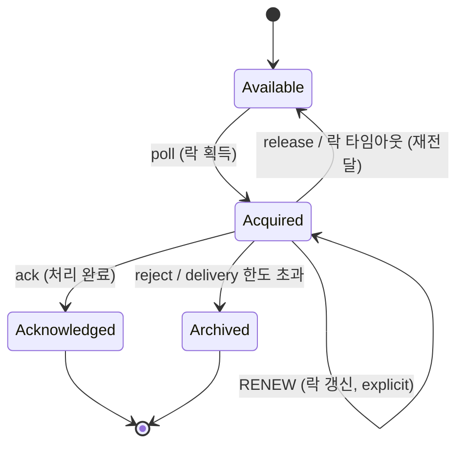

# 10장. 공유 소비 — Share Group (큐 시맨틱)

> 앞 장: [9장 클라이언트 런타임](./09-client-runtime.md) · [I권 목차](./README.md)
>
> **이 장의 보장(한 문장)**: *한 파티션을 여러 consumer가 공유 소비하고, 레코드별로 개별 ack/재전달하며(at-least-once), 한 배치 안에서만 순서가 보장된다.*

이 책의 1장은 "Kafka는 큐가 아니라 로그"라고 했고, 5장은 "한 파티션은 한 consumer에게만"이라고 했다. **Share Group(KIP-932)** 은 이 두 전제에 단서를 단다 — Kafka 4.2에서 GA된 이 기능으로, Kafka는 **로그 위에 큐 시맨틱을 얹는다**. (저장은 여전히 append-only 로그이고, ack·락 상태만 `__share_group_state`에 별도 추적된다 — KIP-932는 "Kafka에 큐를 추가"한 게 아니라 토픽으로 큐 유스케이스를 수용하는 share group을 도입한 것이다.) `[KIP-932 · docs @4.2]`

---

## 10.1 왜 별도 모델인가 — consumer group으로는 안 됐던 것

전통적인 작업 큐(job queue)가 원하는 건 두 가지다:
- **작업 분배**: consumer를 파티션 수와 무관하게 늘려 처리량을 키운다.
- **개별 ack/재시도**: 레코드 하나하나를 따로 "처리 완료"하거나 "실패 → 재전달"한다.

그런데 consumer group은 정반대 전제 위에 있다 — **배타 배정**(5.1: 한 파티션=한 consumer, 그래서 consumer ≤ 파티션)과 **로그 retention**(2장: 읽어도 안 사라지고 offset만 전진). 이 둘은 큐의 요구와 정면으로 부딪힌다:

- 배타 배정 → consumer를 파티션 수 이상으로 늘려도 **초과분은 유휴**라 처리량이 안 는다(작업 분배 불가).
- offset 기반 진행 → "레코드 42만 실패했으니 그것만 재시도"가 안 된다(offset은 한 점으로 전진할 뿐).

→ 그래서 기존 group에 큐를 얹는 대신 **새로운 group type(share group)** 으로 분리했다. 같은 토픽·같은 로그를 쓰되, 소비 모델만 큐로 바꾼 것이다.

---

## 10.2 consumer group과의 대조

| | Consumer Group (5장) | Share Group (이 장) |
|---|---------------------|---------------------|
| 파티션 배정 | **배타** (1파티션 → 1 consumer) | **공유** (1파티션 → 여러 consumer) |
| consumer 수 | ≤ 파티션 수 | **> 파티션 수 가능** |
| 진행 추적 | commit **offset**(한 점) | **SPSO + 레코드별 상태** |
| 재시도 | offset 되감기(전체) | **레코드 단위** 재전달 |
| 순서 | 파티션 내 보장 | **배치 안에서만** 보장 |
| 시맨틱 | at-least-once / EOS 가능 | **at-least-once만** |

---

## 10.3 in-flight 레코드 상태 머신

share group의 핵심은 **레코드 하나하나에 상태가 있다**는 것이다. consumer가 `poll`하면 레코드는 **Acquired**(시간제한 락) 상태가 되고, consumer가 어떻게 응답하느냐에 따라 전이한다.

- **Available**: 전달 대기.
- **Acquired**: consumer에 배정 + **시간제한 락**. 락은 `group.share.record.lock.duration.ms`(기본 **30초**) 동안 유효하고, 그 안에 ack가 없으면 자동으로 Available로 되돌아가 **다른 consumer에게 재전달**된다. 긴 처리가 필요하면 explicit 모드에서 **RENEW**로 락을 갱신해 타임아웃을 미룰 수 있다(4.2~). `[KIP-1222]`
- **Acknowledged**: 처리 완료(더는 전달 안 됨).
- **release**(명시적 반환) 또는 **락 타임아웃** → Available로 (재시도).
- **reject**(consumer가 처리 불가 판정 → 즉시) 또는 **delivery 횟수 한도 초과** → **Archived**. delivery 횟수는 전달마다 +1 되고, `group.share.delivery.count.limit`(기본 **5**)에 도달하면 재전달이 영구 중단된다.
  - archived 레코드는 **원본 로그에 그대로 남는다**. 그것만 골라내거나 다른 토픽으로 자동 이송하는 경로는 **GA에 없다**(DLQ는 별도 `[KIP-1191]` — GA 이후 로드맵).
- **in-flight 상한**: 한 share-partition가 동시에 Acquired로 잠그는 레코드 수에는 상한이 있다(`group.share.partition.max.record.locks`). 상한에 닿으면 ack로 락이 풀릴 때까지 **새 레코드를 더 획득하지 못한다**(backpressure).

→ 즉 진행을 **commit offset 한 점**으로 누르지 않는다. share-partition은 **SPSO**(Share-Partition Start Offset)부터 **SPEO**(End Offset)까지를 **in-flight 윈도우**로 잡는다. 그 안의 레코드마다 위 상태(락·delivery count)를 따로 매긴다.
윈도우 앞쪽이 연속으로 ack/archived되면 **SPSO가 전진**한다. 즉 offset을 *버린* 게 아니라 **완료된 prefix의 경계(SPSO) + 그 위 레코드별 상태**로 형태를 바꾼 것이다. 이게 큐의 개별 ack를 가능하게 한다. `[KIP-932 · docs @4.2]`

---

## 10.4 Share Coordinator와 `__share_group_state`

레코드별 상태는 어딘가 영속돼야 한다. 그 주체가 **Share Coordinator**다 — 5장 Group·7장 Transaction Coordinator에 이은 **셋째 coordinator**다. (4장 **Controller**는 합의·메타데이터를 맡는 별개 역할이라 coordinator와 결이 다르다 — 아래 표는 비교용이다.)

| coordinator | 관리 대상 | 저장 토픽 | 장 |
|-------------|----------|----------|-----|
| Controller | 클러스터 메타데이터 | `__cluster_metadata` | 4장 |
| Group Coordinator | consumer group offset | `__consumer_offsets` | 5장 |
| Transaction Coordinator | 트랜잭션 상태 | `__transaction_state` | 7장 |
| **Share Coordinator** | **share-group 레코드 상태** | **`__share_group_state`** | 이 장 |

- `__share_group_state`는 내부 토픽(기본 50파티션)으로, share-partition의 어느 레코드가 ack/archived됐는지를 durable하게 보관한다. cleanup은 **`__consumer_offsets`·`__transaction_state`의 compaction과 다르다** — delete 정책 + `retention.ms=-1`(무한 보존) + 주기적 prune 방식이다.
- Share Coordinator는 share-partition leader·group coordinator로부터 inter-broker RPC(`InitializeShareGroupState`·`ReadShareGroupState`·`WriteShareGroupState`·`DeleteShareGroupState`)를 받아 상태를 읽고 쓴다.

→ 다시 2장의 "메타데이터도 로그" — share 소비 상태조차 로그에 쌓인다.

---

## 10.5 새 프로토콜 — ShareFetch / ShareAcknowledge

consumer group이 9.7의 일반 `Fetch`를 쓴다면, share group은 두 개의 새 RPC를 쓴다:

- **ShareFetch**: share-partition leader에서 레코드를 가져오고(획득 = Acquired), 선택적으로 ack까지 piggyback.
- **ShareAcknowledge**: 가져온 레코드의 ack(Acknowledged/Released/Rejected)를 명시적으로 전달.

두 RPC는 `(GroupId, MemberId)`로 식별되는 **share session**으로 문맥을 유지한다. → 9장의 fetch가 "offset부터 순서대로 당기기"라면, ShareFetch는 "available한 레코드를 락 걸어 가져오기"다.

**ack 모드** — ack 자체는 모두 ShareAcknowledge(또는 ShareFetch piggyback)로 가지만, **언제·얼마나 잘게** 보낼지는 `share.acknowledgement.mode`로 정한다 `[docs @4.2]`:
- **implicit**(기본): 다음 `poll()` 때 직전 배치를 **일괄 ACCEPT**. 가장 단순한 at-least-once.
- **explicit**: poll로 받은 레코드를 **다음 poll 전에 하나씩** `acknowledge`로 결과를 단다 — **ACCEPT**(완료)·**RELEASE**(재전달 대기)·**REJECT**(Archived)·**RENEW**(락 연장). `[KIP-1222]`

**멤버십** — share group도 **`ShareGroupHeartbeat` RPC**로 가입·이탈·하트비트를 처리한다. KIP-848 계열의 **서버 주도 멤버십**(5.6)을 share group에 맞춰 가져온 것이다.

---

## 10.6 한계 (지금은 못 하는 것)

share group은 큐를 얻는 대신 몇 가지를 포기한다:

- **배치 간 순서 보장 없음**: 한 배치 안에서는 offset 증가 순이지만, 배치 사이엔 순서가 없다(재전달·타임아웃으로 뒤섞임). 순서가 필요하면 share group은 부적합.
- **Exactly-Once 미지원**: 시맨틱은 **at-least-once**다(7장의 트랜잭션 EOS는 consumer group/produce 경로 한정). 단 토픽에 트랜잭션 레코드가 있으면 `share.isolation.level`로 read_committed 여부는 고를 수 있다.
- **fetch-from-follower 미지원**: 9.7의 follower 읽기는 share group엔 아직 없다.

→ "큐가 필요하지만 엄격한 순서·EOS는 안 필요할 때"가 share group의 자리다.

---

## 10.7 증명 (executable — 3-broker, Kafka 4.2+ · 미구현)

| 실험 | 관측/단언 | 라벨 |
|------|----------|------|
| 파티션 1개 토픽에 consumer 3대(같은 share group) | 셋이 동시에 소비(consumer > partition) | `[테스트 예정]` |
| ack 없이 락 타임아웃 유발 | `group.share.record.lock.duration.ms` 후 다른 consumer에 재전달 | `[테스트 예정]` |
| ack 후 같은 레코드 | 재전달 안 됨(Acknowledged) | `[테스트 예정]` |
| 반복 실패로 delivery 한도 초과 | `group.share.delivery.count.limit`(기본 5) 후 Archived | `[테스트 예정]` |

> ⚠️ share group은 Kafka **4.2 GA**다. 이 lab의 브로커 baseline은 그보다 낮아, 이 장의 증명은 **4.2+ 브로커**를 별도로 띄워야 한다. 버전 매트릭스 갱신 시 [CHARTER](../../CHARTER.md) 참조.
>
> **활성화**: 4.2 브로커라도 share group은 feature로 꺼져 있을 수 있다 — `kafka-features.sh`로 `share.version=1`을 올려 켠다. (`group.coordinator.rebalance.protocols`에 `share`를 넣을 필요는 **없다** — 흔한 오해.) `[docs @4.2]`

---

## 참조

- `[KIP-932]` Queues for Kafka (share group의 원전) `[Tier 1]`
- Apache Kafka 4.2 — Queues for Kafka GA (4.0 Early Access → 4.1 Preview → **4.2 GA**) `[docs @4.2]`
- `KafkaShareConsumer` JavaDoc `[Tier 2]`
- `[KIP-1191]` Dead-letter queues for share groups (GA 이후 로드맵) `[Tier 1]`
- `[KIP-1222]` Acquisition lock timeout renewal — explicit 모드 RENEW (4.2~) `[Tier 1]`
- 연결: 1.2(로그 위에 큐 시맨틱) · 5.1(배타 배정의 경계) · 2장(메타데이터도 로그) · 9.7(fetch 대비)

← [9장 클라이언트 런타임](./09-client-runtime.md) · [I권 목차](./README.md)
