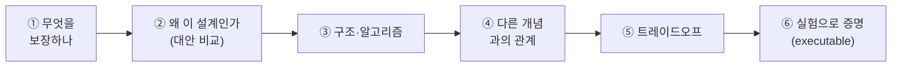
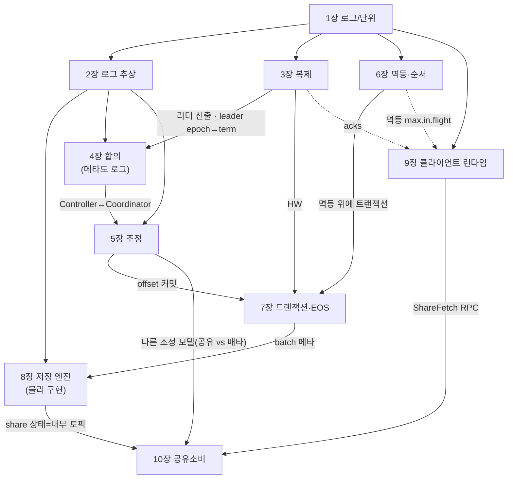

# 📘 I권 — Internals (원리와 내부)

> Kafka를 **분산 시스템의 제1원리부터** 깎아 올라간다. "ISR이 어쩌구"가 아니라 **왜 그렇게 되어야 하는지 · 무엇을 보장하는지 · 어떤 구조인지 · 어떤 합의 알고리즘인지.**

---

## 이 권의 역할 · Scope · 경계

**목적**: Kafka가 **왜 이렇게 동작하는지**를 분산 시스템 제1원리에서 증명한다. 현상·사용법이 아니라 **보장(guarantee)·구조·알고리즘**.

**한 문장**: *"Kafka의 내부 메커니즘과 그것이 보장하는 것."*

### 다룬다 (Scope)
- 로그라는 추상 · 복제/ISR · 합의/KRaft · Consumer Group 조정 · 멱등·순서 · 트랜잭션·EOS · 저장 엔진 · 클라이언트 런타임
- 각 주제를 *무엇을 보장하나 / 왜 이 설계인가 / 어떤 구조·알고리즘인가 / 트레이드오프*로
- **Kafka 그 자체** — 특정 언어·프레임워크에 중립 (코드는 증명 도구일 뿐)

### 다루지 않는다 (Out of Scope)
| 주제 | 가야 할 곳 |
|------|-----------|
| Spring Kafka 코드 · 설정 레시피 · 코드 함정 | **II권 Spring** |
| 운영 절차 · 클러스터 사이징 · 모니터링 · 장애 대응 · 보안 | **III권 Operations** |
| 이벤트 설계 · Outbox · Saga | messaging-lab / saga-lab |

> **결정 규칙**: correctness가 변하면 여기(I권), 트레이드오프만 변하면 III권.

---

## 집필 틀 (각 장을 깎는 6단계)

각 장은 *무엇을 보장하나 → 왜 이 설계인가(대안 비교) → 구조·알고리즘 → 다른 개념과의 관계 → 트레이드오프 → 실험으로 증명* 순으로 전개된다.

> 전제는 **3-broker 멀티브로커**다 — 복제·ISR·리더 선출·KRaft 합의는 단일 브로커로 증명할 수 없다.

---

## 장 간 요소 의존 (전체 점검용)

### 교차 요소 SSOT — 정의 위치

같은 개념이 여러 장에 걸칠 때, **정의 위치**를 한 곳에 모은다.

| 요소 | 정의 위치 | 주 사용처 |
|------|----------|-----------|
| HW (High Watermark) | **3장** | 3·7장 |
| LSO (= min(HW, 가장 오래된 열린 txn)) | **7장** | 7장 |
| compaction — 의미 / 메커니즘 | **2장 / 8장** | 2·8장 |
| leader epoch ↔ Raft term | **3장 ↔ 4장** | 3·4장 |
| "메타데이터 = 로그" | **2장** | 4·5·7·10장 |
| fetch 프로토콜 | **9장** | 3장(복제 공용) |
| purgatory | **9장** | 3·9장 |
| share group 경계 | **10장** | 1.2·5.1 |
| timestamp.type | **8장** | 8장 |
| 요청/저장 축 (offset·순서·timestamp) | **6장** | 1·6·8장 |

---

# 목차

## 들어가며 — Kafka는 무엇을 풀려고 태어났나

Kafka가 N×M 통합 지옥을 "중앙 로그 하나"로 풀어낸 발상과, 그 핵심의 결핍에서 생태계가 자라난 맥락을 먼저 잡는 프롤로그.

- **이 책을 읽는 법**
  - `acks`·`ISR`·`KRaft` 같은 용어를 외우지 말고 "무슨 문제가 있었고 그걸 풀려고 무엇이 나왔나"를 먼저 깔고 돌아가는 테스트로 증명한다.
- **Kafka 이전의 세계: N×M 통합 지옥**
  - 소스 N개 × 목적지 M개의 point-to-point 파이프라인이 N×M으로 폭발하고, 한 번 흘려보낸 데이터를 다시 읽을 수 없었다.
- **발상의 전환: "모든 데이터를 하나의 로그로 흘려보낸다"**
  - 시스템끼리 직접 잇지 말고 중앙 로그 하나에 쓰고 읽게 해 통합 복잡도를 N×M→N+M으로 줄이고 생산자·소비자를 디커플링·재생 가능하게 만든 것이 Kafka의 정체성(데이터 백본)이다.
- **생태계는 "결핍"에서 하나씩 자라났다**
  - Producer·Broker·Consumer라는 단순한 Core의 결핍마다 `Kafka Connect`·`Kafka Streams`·`ksqlDB`·`Schema Registry`·`KRaft`가 태어났다(Connect·Streams·KRaft는 핵심, ksqlDB·Schema Registry는 Confluent 제품).
- **이 책의 지도**
  - Core(Producer/Consumer/Broker)의 원리와 함정이 본진이며, 같은 주제를 I권(원리)→II권(코드·Spring)→III권(운영) 세 깊이로 내려가며 다룬다.
- **다음 장**
  - 다음 장(1장)에서 "로그"라는 자료구조와 가장 작은 단위들(Topic·Partition·Offset), 그리고 왜 이렇게 설계했는가를 다룬다.

📄 [00-prologue.md](./00-prologue.md)

## 1장 — Kafka란 무엇인가

Kafka는 큐가 아니라 분산·복제·순서 보장 append-only 로그이며, 그 한 끗 차이가 어휘·등장인물·근본 설계 결정과 증명 방식을 모두 결정한다.

- **1.1 한 문장으로**
  - Kafka는 메시지 큐가 아니라 분산·복제되고 순서가 보장되는 append-only 로그(commit log)이며, 이 차이가 거의 모든 동작을 설명한다.
- **1.2 "큐가 아니라 로그"가 왜 중요한가**
  - 전통 큐는 읽으면 사라지지만 로그는 읽어도 안 사라지고 소비자는 데이터가 아니라 `offset`(어디까지 읽었는지)만 기억한다.
- **1.3 가장 작은 단위들 (어휘)**
  - `Record`·`Topic`·`Partition`·`Offset`을 정의하며, 순서는 파티션 안에서만 보장되고 파티션 수가 병렬 처리(최대 동시 소비자)의 단위다.
- **1.4 등장인물**
  - `Producer`(append)·`Broker`(저장)·`Consumer`(offset 들고 읽음)·`Consumer Group`(나눠 읽음)의 역할을 정리한다.
- **1.5 왜 이렇게 설계했나 — 3가지 근본 결정**
  - 순차 append·page cache·zero-copy로 디스크가 빠른 이유, 순서를 파티션 단위로 좁힌 트레이드오프, Consumer가 `offset`을 들고 당기는 pull 모델 세 가지 근본 결정을 설명한다.
  - ① 순차 append·`OS page cache`·`zero-copy(sendfile)`로 디스크에 쓰는데도 빠르다
  - ② 파티션 단위로 순서를 좁혀 병렬성+부분 순서를 얻고 전역 순서는 포기(처리량↔순서 트레이드오프)
  - ③ Broker는 push하지 않고 Consumer가 `offset`을 들고 자기 속도로 pull — 제어권을 Consumer가 쥔다
- **1.6 이 책은 개념을 "증명"한다 (executable book)**
  - 모든 핵심 주장에 돌아가는 테스트가 붙으며, 1장이 던진 개념(offset 이동·순서·pull)의 런타임 증명은 II권 Spring Step에 있다.
- **1.7 다음 장**
  - 2장(로그라는 추상)과 3장(복제: `ISR`·`HW`·leader epoch)으로 이어진다고 안내한다.

📄 [01-what-is-kafka.md](./01-what-is-kafka.md)

## 2장 — 로그라는 추상

append-only 로그가 진실의 원천이고 상태는 그 로그의 fold 파생물이라는 한 문장을, 큐·테이블과의 대비부터 compaction·duality·메타데이터까지 밀어붙인다.

- **2.1 로그의 세 가지 성질 — append-only · 불변 · 단조 offset**
  - commit log의 세 성질 append-only(순차 I/O)·불변(replay 토대)·단조 offset(논리적 시계)이 각각 무엇을 가능하게 하나
- **2.2 왜 로그인가 — 큐도 테이블도 아닌 이유**
  - 큐는 소비 시 삭제하지만 로그는 소비자가 offset만 옮겨 replay 가능하고, 테이블과 달리 로그가 본체(source of truth)이고 상태는 파생물이다
- **2.3 상태 = fold(로그)**
  - 어떤 상태든 로그를 처음부터 fold하면 결정적으로 재현되며, 이것이 N×M 통합을 N+M으로 바꾼 힘의 정체다
- **2.4 Log Compaction의 "의미" — 로그를 상태 스냅샷으로**
  - 같은 key의 옛 레코드를 버리고 key별 최신값만 남겨 로그를 "key→최신값" 테이블 스냅샷으로 만들며, tombstone(`value=null`)으로 삭제를 표식한다
- **2.5 Stream–Table Duality**
  - fold하면 로그(스트림)가 테이블이 되고 changelog로 흘리면 테이블이 로그가 되는 stream–table duality가 Kafka Streams `KStream`/`KTable`의 토대다
- **2.6 메타데이터도 로그다**
  - Kafka는 자기 상태마저 로그로 관리한다 — `__consumer_offsets`·`__cluster_metadata`·`__transaction_state`·control record가 그 예이고 KRaft가 우아한 이유다
- **2.7 트레이드오프와 증명**
  - 로그 무한 증가는 retention/compaction으로 잘라야 하고, compaction+tombstone으로 key별 최신만 남는지·결정성을 executable 테스트로 증명한다
- **참조**
  - Jay Kreps의 The Log, DDIA, Kafka 공식 Log Compaction 문서가 이 장의 사상적 출처다

📄 [02-log-abstraction.md](./02-log-abstraction.md)

## 3장 — 복제: 데이터는 어떻게 살아남나

로그를 죽지 않게 만드는 복제의 원리 — `ISR`·`HW`·`acks`·`min.insync.replicas`가 "커밋됐다"는 보장을 어떻게 세우고 어디서 무너지는지를 본다.

- **3.1 문제: 브로커는 언젠가 죽는다**
  - 단일 브로커는 내구성과 가용성을 동시에 잃고, 최악은 성공 응답한 데이터가 사라지는 것 — 복제는 이 최악을 막는 장치다
- **3.2 복제의 딜레마 — 완전 동기 vs 완전 비동기**
  - 완전 동기는 느린 한 대에 전체가 인질이 되고 완전 비동기는 내구성이 없어, Kafka는 그 사이 절충인 `ISR`을 택한다
- **3.3 ISR — "지금 따라잡은 복제본만 기다린다"**
  - `ISR`은 리더를 따라잡은 복제본 집합(리더 자신도 늘 포함, RF의 동적 부분집합)으로, pull(`Fetch`) 모델에서 `replica.lag.time.max.ms`를 못 맞추면 `OSR`로 축출하며 뒤처진 놈은 빼 가용성을, 든 놈은 기다려 내구성을 지킨다
- **3.4 "커밋"이란 무엇인가 — High Watermark**
  - `HW`는 `ISR` 전체의 `LEO` 중 최소값이고 consumer는 `HW`까지만 읽으니, "커밋됐다 = `HW` 도달 = consumer에게 보인다"가 일관성의 정의다
- **3.5 보장의 다이얼 — acks × min.insync.replicas × RF**
  - 내구성은 `acks`·`min.insync.replicas`·RF의 조합으로 서며, `acks=all`이라도 `min.insync.replicas=1`이면 `acks=1`로 퇴화해 의미 있는 조합은 RF=3 + `min.insync.replicas=2` + `acks=all`이다
  - `acks=all`은 *무손실 경계를 broker에 긋는* 것 — acks는 producer→broker 한 홉만 통제하고 그 앞(소스)은 acks 밖 best-effort다("보장엔 경계가 있다" 구조: 순서·offset도 동일)
- **3.6 리더가 죽으면 — 선출과 unclean election**
  - 컨트롤러가 `ISR` 안에서 새 리더를 뽑아 무손실이나, `ISR`이 전부 죽으면 `unclean.leader.election.enable`로 파티션 중단(안전) vs 밖 복제본(`OSR`) 승격(손실 감수)을 가른다
- **3.7 로그가 어긋나지 않으려면 — Leader Epoch**
  - `HW` 기준 truncate만으론 리더 교체 시 로그가 영구히 분기하므로, 리더 교체마다 증가하는 leader epoch로 어느 리더 시대의 로그가 정당한지 펜싱한다
- **3.8 복제는 합의(consensus)가 아니다**
  - 데이터 경로는 `ISR` primary-backup으로 과반 투표 없이 싸게 복제하고, "누가 리더인가" 같은 메타데이터만 KRaft 합의로 비싸게 정하는 분리가 고성능의 핵심이다
- **3.9 증명 (executable — 3-broker · 미구현)**
  - follower 정지 시 `ISR` 축소, 브로커 2대 정지 시 `NotEnoughReplicasException`, `HW` 이전 미가시, 리더 kill 후 승격·보존 등을 3-broker로 단언한다
- **참조**
  - leader epoch는 `[KIP-101]`·`[KIP-279]`, 일반 이론은 DDIA 5·9장, `unclean.leader.election.enable` 기본값은 Kafka 공식 문서 `[docs @3.9]`에 근거한다

📄 [03-replication.md](./03-replication.md)

## 4장 — 합의: 누가 결정하나 (KRaft)

메타데이터(누가 리더인가)를 모든 노드가 단일 진실로 보게 하는 합의를, Raft·`KRaft`·`__cluster_metadata` 로그로 어떻게 구현하는지 본다.

- **4.1 문제: 메타데이터의 단일 진실과 split-brain**
  - 데이터보다 먼저 합의돼야 할 메타데이터(누가 리더인가)가 노드마다 다르면 `split-brain`으로 로그가 갈라지므로 모든 노드가 하나의 진실로 봐야 한다.
- **4.2 분산 합의라는 문제**
  - FLP 불가능성(비동기에서 결정적 종료 불가)은 **타임아웃 선출**로 우회하고, **과반(quorum)**은 별개로 안전성을 책임진다 — 과반끼리 겹쳐 모순된 결정이 동시 확정될 수 없다(split-brain 방지).
- **4.3 왜 Raft인가 — Paxos와의 대비**
  - Paxos는 이해가 어려워, Raft는 같은 안전성에 이해가능성을 설계 목표로 삼았고 강한 리더와 term(선거마다 증가)을 도입했다 — term은 3장 leader epoch과 같은 메커니즘이되 계층이 다르다(파티션 vs 메타데이터).
- **4.4 KRaft — "메타데이터도 로그로"**
  - `KRaft`는 모든 메타데이터 변경을 `__cluster_metadata` 로그에 append하고 active controller가 그 리더이며, 정통 Raft의 push와 달리 voter·observer가 `Fetch`로 당겨가는 pull 모델이다.
  - 그 한 번의 `Fetch`가 양방향 liveness를 겸한다 — 응답 부재=팔로워가 본 "리더 죽음"(→ 선거), 요청 부재=리더가 본 "voter 비활성"(voter 명단은 고정이라 축출이 아니라 과반 미달 여부)
  - voter(3·5대)만 과반·투표에 들고 나머지 브로커는 observer로 `Fetch`·replay만 하므로, 리더가 커밋마다 받는 투표 ack는 클러스터 크기와 무관하게 voter 수에만 달렸다 — 그래서 voter는 일부러 작게 둔다.
- **4.5 Controller Quorum · active controller · term**
  - voter들이 메타데이터 로그를 복제하며 Raft 과반 투표로 active controller를 뽑고, standby가 이미 로그를 따라 읽고 있어 active가 죽어도 거의 즉시 승계한다.
- **4.6 파티션 리더 선출은 컨트롤러가 한다**
  - 파티션 리더는 active controller가 `ISR` 안에서 지정해 메타데이터 로그에 기록 후 브로커에 전파하며, 컨트롤러(4장)와 코디네이터(5장)는 역할이 다르다.
- **4.7 ZooKeeper에서 KRaft로 (왜 걷어냈나)**
  - ZooKeeper는 별도 운영 부담·컨트롤러 장애 시 전체 상태 재로딩·확장 한계의 비용이 있어, `KRaft`가 그 의존을 제거하고 Kafka가 스스로 합의하게 했다.
- **4.8 메타데이터 로그도 무한히 안 자란다 — KRaft 스냅샷**
  - `__cluster_metadata`도 자라므로 KRaft 스냅샷이 어느 시점의 전체 상태를 통째로 저장하고 이전 로그를 잘라내어, key별 최신만 남기는 log compaction과 다르다.
- **4.9 증명 (executable — 3-broker · 부분)**
  - `describeCluster`로 컨트롤러 확인, active controller kill 시 승계, 토픽 생성 직후 메타 전파, `__cluster_metadata` 덤프로 메타데이터가 로그임을 실험으로 단언한다.
- **참조**
  - Raft 논문(Ongaro & Ousterhout 2014), Paxos Made Simple, `[KIP-500]`·`[KIP-595]`·`[KIP-631]`, DDIA 9장 등 인용 출처를 모은다.

📄 [04-consensus.md](./04-consensus.md)

## 5장 — 조정: Consumer Group은 어떻게 나눠 읽나

한 Consumer Group에서 각 파티션을 정확히 한 consumer에게 배정하는 배타성을, 코디네이터·리밸런싱·offset 저장이 어떻게 유지하는지를 본다.

- **5.1 배타 배정 불변식**
  - 각 파티션이 정확히 한 consumer에게(no overlap + no gap) 배정되는 *배타적 완전 피복*이며, 이 배정을 무효화하는 사건(멤버·생존판정·토폴로지·코디네이터 4범주)이 곧 리밸런싱 트리거다 — 장애 복구만이 아니라 scale-out·배포·증설도 포함.
- **5.2 왜 배정을 클라이언트에 위임했나**
  - 커스텀 assignor를 브로커 재배포 없이 꽂는 유연성과 얇은 브로커를 위해 배정을 Group Leader에 위임하며, 이 선택이 클라이언트를 두껍게 해 차세대(KIP-848)는 배정을 다시 서버로 가져간다.
- **5.3 Group Coordinator — 컨트롤러와 다른 것**
  - `hash(groupId) % __consumer_offsets 파티션 수`로 정해지는 코디네이터는 그룹 레벨(멤버십·offset)을, 컨트롤러는 클러스터 레벨(리더·메타데이터)을 맡아 역할이 다르다.
- **5.4 JoinGroup → SyncGroup**
  - `JoinGroup`에서 코디네이터가 Group Leader를 지정하고, `SyncGroup`에서 Group Leader가 계산한 배정을 코디네이터가 각 멤버에게 전달하는 2단계 프로토콜이다.
- **5.5 배정 전략**
  - `partition.assignment.strategy`로 Range·RoundRobin(크게 뒤섞임)·Sticky(최소 이동)·CooperativeSticky(Sticky+협력적 리밸런싱) 중 알고리즘을 고른다.
- **5.6 리밸런싱 — classic의 두 모드, 그리고 KIP-848**
  - eager·cooperative는 별개 세대가 아니라 classic 프로토콜의 두 모드(assignor 선택으로 갈리고 기본 동작은 eager)이며, 진짜 프로토콜 단절인 `[KIP-848]`은 전역 동기화 장벽을 없애고 배정을 서버로 옮긴다.
- **5.7 살아있음을 판정하는 타이밍 3박자**
  - `heartbeat.interval.ms` < `session.timeout.ms`로 죽음·단절을, `session.timeout.ms` ≪ `max.poll.interval.ms`로 처리 지연을 판정해 살아있음과 처리 진행을 분리한다.
- **5.8 Static Membership**
  - `[KIP-345]`의 `group.instance.id`를 부여하면 같은 id로 재접속 시 기존 배정을 유지해 롤링 배포의 불필요한 리밸런싱을 줄인다.
- **5.9 offset은 어디에 — `__consumer_offsets`**
  - 커밋된 offset은 `key=(group, topic, partition)`·`value=offset`으로 내부 compacted 토픽 `__consumer_offsets`에 저장돼 재시작 시 마지막 위치를 복원한다.
  - 진행 위치는 3종(broker log·consumer 메모리(재시작 시 사라짐)·committed)이고, committed도 RF 낮음·`offsets.retention.ms` 만료·retention 추월(`OffsetOutOfRange`→`auto.offset.reset`)로 사라질 수 있으며, committed는 '읽음'만 알 뿐 앱 처리·외부 반영은 모른다(→ 멱등, II권).
- **5.10 증명 (executable — 3-broker · 미구현)**
  - eager vs cooperative revoke 범위, `group.instance.id` 재접속, `max.poll.interval` 초과 퇴출, 두 그룹의 독립 offset 소비를 `[테스트 예정]`으로 단언한다.
- **참조**
  - `[KIP-429]`·`[KIP-848]`·`[KIP-345]` `[Tier 1]`와 Consumer Group·`__consumer_offsets` 공식 문서 `[docs @3.9]`를 근거로 든다.

📄 [05-coordination.md](./05-coordination.md)

## 6장 — 멱등·순서: 중복 없이, 순서대로

재시도가 만드는 파티션 내 중복과 순서 역전을, 멱등 프로듀서의 `PID`·`epoch`·`sequence`가 어떻게 막고 그 한계가 어디서 끝나는지를 본다.

- **6.1 파티션 내 순서 — 그 순서는 누구 기준인가**
  - 순서는 파티션 안에서만 보장된다(같은 key=key 단위 순서, 진짜 토픽 전체 순서는 파티션 1개뿐).
  - 그 "보낸 순서"는 요청이 아니라 **브로커 append 시점**에 정의된다 — 여러 프로듀서엔 절대 요청 순서가 없고, offset·timestamp도 같은 요청/저장 축이다.
  - 단 그 보장은 **저장·전달 순서까지**이고, 처리 완료·외부 반영 순서는 앱 책임(→ II권), offset도 파티션별이라 key별 offset은 없다.
- **6.2 "그냥 재시도"의 함정 — 중복 append**
  - 리더가 저장했는데 ACK가 유실되면 프로듀서가 재시도해 같은 메시지를 두 번 쌓고, `max.in.flight=1`로 막으면 처리량이 죽는 딜레마를 멱등이 푼다.
- **6.3 멱등 프로듀서 — PID + epoch + sequence**
  - `enable.idempotence=true`는 `PID`·`epoch`·`sequence`로 메시지에 신원을 붙여, 브로커가 같은 sequence는 버리고 건너뛴 sequence는 거부해 중복 제거와 순서를 보장한다.
  - 요구 조합: `enable.idempotence=true`는 `acks=all`·`max.in.flight≤5`·`retries>0`을 전제하며, 3.0+ 기본 true라 `acks=1` 명시는 이 전제를 깬다 `[KIP-98/679 · docs @3.9]`
- **6.4 멱등의 한계 — 세션 경계**
  - 멱등성은 한 프로듀서 세션 안에서만 보장되어, 재시작하면 새 `PID`를 받아 이전 메시지를 다시 보내면 중복되고 이 한계는 트랜잭션의 `transactional.id`가 넘는다.
- **6.5 순서와 `max.in.flight`**
  - 멱등 off에 `max.in.flight>1`과 재시도면 순서가 뒤바뀌지만, 멱등 on이면 `sequence`로 `max.in.flight≤5`까지 순서가 보장된다.
- **6.6 증명 (executable · 미구현)**
  - 멱등 on의 강제 재시도는 중복 없음, 프로듀서 재시작 후 재전송은 중복 발생, 멱등 off에 `max.in.flight>1`+재시도는 순서 역전, 두 프로듀서 동시 전송은 offset 인터리빙이 send 순서와 무관함을 관측한다.
- **참조**
  - `[KIP-98]`·Kafka 공식 문서의 `enable.idempotence` 기본값·DDIA 9장을 근거로 든다.

📄 [06-ordering-atomicity.md](./06-ordering-atomicity.md)

## 7장 — 트랜잭션·EOS: 전부 또는 전무

멱등 위에 트랜잭션을 쌓아 다중 파티션과 read-process-write를 원자적으로 묶고, `control record`·`LSO`·`read_committed`로 가시성을 제어하되 그 보장이 Kafka 경계에서 끝남을 본다.

- **7.1 왜 트랜잭션인가**
  - 멱등을 넘는 두 요구 — 다중 파티션 원자성과 read-process-write 사이클 — 때문에 트랜잭션이 멱등 위에 쌓인다
- **7.2 `transactional.id`와 좀비 펜싱**
  - `transactional.id`가 PID를 세션 너머로 영속화하고 좀비 등장 시 epoch를 올려 옛 프로듀서 쓰기를 거부하며, `[KIP-890]`은 이를 매 트랜잭션마다 bump로 강화해 hanging transaction을 막는다
- **7.3 Transaction Coordinator와 `__transaction_state`**
  - 트랜잭션 상태는 Transaction Coordinator가 관리하고 `__transaction_state` 내부 로그에 저장돼 코디네이터가 죽어도 복구된다
- **7.4 2단계 흐름**
  - 원자적 결정은 코디네이터가 `__transaction_state`에 commit을 기록하는 순간 확정되고(2PC), 파티션 `control record`(마커)는 그 결정을 가시화하는 phase-2이며, `transaction.timeout.ms`(기본 60000ms) 초과 시 자동 abort한다
- **7.5 핵심: control record + LSO + `read_committed`**
  - `control record`로 트랜잭션 경계를 긋고 `LSO`(Last Stable Offset = min(`HW`, 가장 오래된 열린 트랜잭션 시작))로 가시성을 막아, `read_committed`는 `LSO`까지만 읽고 abort 배치를 스킵한다
- **7.6 read-process-write — offset도 트랜잭션에**
  - consumer offset 커밋조차 `sendOffsetsToTransaction`으로 트랜잭션에 포함시켜 출력 쓰기와 입력 offset 전진을 한 단위로 묶는 것이 Kafka 내부 진짜 exactly-once다
- **7.7 EOS의 경계 — 어디까지가 exactly-once인가**
  - EOS는 Kafka 토픽→처리→Kafka 토픽(+offset)까지만 보장하고 외부 DB·API는 롤백 불가라 멱등키로 방어해야 한다
- **7.8 증명 (executable — 3-broker · 미구현)**
  - 트랜잭션 abort + `read_committed`, `isolation.level` 기본값(`read_uncommitted`), read-process-write 실패 롤백, 같은 `transactional.id` 중복 프로듀서 펜싱을 3-broker로 단언한다
- **참조**
  - `[KIP-98]`·`[KIP-129]`·`[KIP-890]`과 Confluent EOS 설계 문서, DDIA 9·7장을 출처로 든다

📄 [07-transactions.md](./07-transactions.md)

## 8장 — 저장 엔진: 디스크인데 왜 빠른가

디스크 기반 로그가 순차 I/O·`page cache`·`zero-copy`로 어떻게 빨라지고, 세그먼트·인덱스·압축·compaction·retention·복구·Tiered Storage로 어떻게 물리적으로 놓이는지를 본다.

- **8.1 통념 깨기 — "디스크 = 느리다"가 틀리는 지점**
  - 디스크가 느린 건 랜덤 접근일 때이고, append-only 로그라 항상 순차 쓰기/읽기만 하는 것이 첫 번째 비결
- **8.2 page cache와 zero-copy**
  - 데이터를 JVM 힙 대신 OS `page cache`에 맡기고 `sendfile`로 디스크→소켓 직송하되, TLS·재압축·다운컨버전이 끼면 `sendfile`을 우회
- **8.3 Log Segment — 로그의 물리적 실체**
  - 파티션 로그는 base offset을 파일명으로 한 세그먼트들로 쪼개지고, `segment.bytes`/`segment.ms` 도달 시 active segment를 롤링하며 `.index`/`.timeindex`는 mmap으로 다뤄진다
- **8.4 Record Batch (v2) — 멱등·트랜잭션이 박히는 곳**
  - 레코드는 배치(RecordBatch) 단위로 저장되고 v2 헤더에 `producerId`·`producerEpoch`·`baseSequence` 등 멱등·트랜잭션 정보가 박힌다
- **8.5 조회 — sparse index**
  - `.index`는 `index.interval.bytes` 간격으로 드문드문만 기록해 근처까지 점프한 뒤 `.log`를 순차 스캔한다
- **8.6 압축(compression)**
  - 프로듀서가 배치 단위로 압축하면 기본값(`compression.type=producer`)에선 브로커가 그대로 저장·전송하고 consumer가 풀어 CPU를 아끼지만, 토픽에 코덱을 지정하면 브로커가 재압축한다(이땐 zero-copy 우회)
- **8.7 Log Compaction의 "메커니즘"**
  - log cleaner 스레드가 같은 key의 옛 레코드를 제거하고 최신만 남기며, tombstone(`value=null`)은 삭제를 의미하고 `cleanup.policy=compact`로 켠다
- **8.8 Retention — 세그먼트 단위 삭제**
  - `cleanup.policy=delete`에서 `retention.ms`/`retention.bytes`를 넘긴 데이터를 레코드가 아니라 세그먼트 통째로 삭제하며, `compact,delete`는 key별 최신을 남기되 너무 오래되면 지운다
- **8.9 로그 복구 — 재시작 시 어디부터 믿나**
  - 체크포인트 파일(`recovery-point-offset-checkpoint`·`replication-offset-checkpoint`·`log-start-offset-checkpoint`)을 두어, clean shutdown이면 즉시 시작하고 unclean이면 마지막 세그먼트를 스캔·재검증해 손상 배치를 잘라낸다
- **8.10 시간의 의미 — timestamp.type과 retention**
  - 레코드 timestamp는 `message.timestamp.type`의 CreateTime/LogAppendTime 중 하나이고, retention도 세그먼트의 최대 timestamp를 보고 세그먼트 단위로 판정하기에 잘못된 CreateTime은 너무 일찍 삭제되거나 안 지워질 수 있다
- **8.11 Tiered Storage — 무한 보존 (KIP-405)**
  - RemoteLogManager가 오래된 세그먼트를 원격 스토리지로 내리고 local/remote retention을 따로 설정해 보존을 로컬 디스크 용량에서 분리한다
- **8.12 증명 (executable — docker exec · 부분 2/4)**
  - 브로커 컨테이너의 `.log` 열기·`kafka-dump-log`·`segment.bytes` 작게 produce·compaction cleaner로 세그먼트 파일명·배치 헤더·rolling·키별 최신을 관측
- **참조**
  - Kafka 공식 문서(Persistence·Efficiency·Log Compaction)·`sendfile(2)`·KIP-405·DDIA 3장을 출처로 든다

📄 [08-storage-engine.md](./08-storage-engine.md)

## 9장 — 클라이언트 런타임: Producer/Consumer는 내부에서 어떻게 도나

`send()`는 비동기다 — 사용자 스레드와 IO 스레드가 분리돼 있고, 그 경계(콜백 실행 위치·역압·purgatory)를 모르면 코드 한 줄로 처리량이 무너진다.

- **9.1 Producer 스레드 모델 — 두 개의 스레드**
  - 사용자 스레드는 직렬화·파티셔닝 후 `RecordAccumulator`에 적재하고 곧바로 반환하며, 별도의 `Sender`(IO) 스레드 `kafka-producer-network-thread`가 배치를 꺼내 브로커로 보내고 응답을 처리한다.
- **9.2 `send()`의 여정**
  - `send()`는 직렬화·파티션 결정·`RecordAccumulator` 적재까지만 사용자 스레드가 하고, 배치 모음(`batch.size`/`linger.ms`)·전송·ACK·콜백은 `Sender` 스레드의 일이며, key 없는 메시지는 sticky partitioner가 배치를 키운다.
  - 배치는 TopicPartition 단위로 쌓이고 Sender가 leader 브로커별로 묶어 `ProduceRequest`를 보내(요청 수=broker 수, 비용 3층), partition↑은 병렬성↑↔배치 효율↓ 트레이드오프이며, sticky는 순서 장치가 아니다(순서는 멱등·`max.in.flight` → 6장).
- **9.3 콜백은 누가 실행하나 — 그리고 그게 왜 위험한가**
  - kafka-clients `Callback`(과 그 위에 얹힌 Spring `whenComplete`)은 `Sender`(IO) 스레드에서 실행되므로, 콜백에서 blocking 작업을 하면 보통 1개뿐인 그 스레드가 막혀 전체 produce가 정지한다.
- **9.4 Backpressure — `buffer.memory`와 `max.block.ms`**
  - `buffer.memory`가 차면 `send()`가 블록되고 `max.block.ms` 안에 자리가 안 나면 `TimeoutException`이 나며, 전송·재시도까지의 전체 상한은 별도로 `delivery.timeout.ms`가 정한다.
- **9.5 설정 조합 — 처리량·지연·역압의 삼각형**
  - `batch.size`·`linger.ms`·`buffer.memory`·`max.block.ms` 네 설정이 개별이 아니라 함께 처리량·지연·역압을 결정한다.
- **9.6 Consumer 런타임**
  - Consumer는 단일 스레드 `poll()` 루프가 처리까지 담당하고 `heartbeat` 스레드가 백그라운드로 `session.timeout`을 유지하므로, `max.poll.records`가 너무 크면 `max.poll.interval` 초과로 퇴출된다.
- **9.7 Consumer/Replica는 어떻게 읽나 — fetch 프로토콜**
  - Consumer와 Replica는 둘 다 `Fetch` 요청으로 당기며(pull), long-poll(`fetch.max.wait.ms`/`fetch.min.bytes`)·incremental fetch session·fetch-from-follower가 모두 동일한 fetch 메커니즘이다.
- **9.8 broker가 요청을 보류하는 법 — purgatory**
  - `acks=all` produce(`DelayedProduce`)와 long-poll fetch(`DelayedFetch`)처럼 즉시 응답할 수 없는 요청은 timer wheel과 watcher로 관리되는 동일한 purgatory 메커니즘으로 보류된다.
- **9.9 증명 (executable · 미구현)**
  - 콜백 `Thread.sleep` 시 처리량 급락, 작은 `buffer.memory`+폭주 시 `TimeoutException`, 콜백이 `kafka-producer-network-thread`에서 실행됨, 큰 `max.poll.records`+느린 처리 시 `max.poll.interval` 초과 퇴출을 테스트로 단언한다.
- **참조**
  - Producer/Consumer Configs 공식 문서, `KafkaProducer`/`KafkaConsumer` JavaDoc, Kafka 소스 `clients/`(RecordAccumulator·Sender)를 근거로 제시한다.

📄 [09-client-runtime.md](./09-client-runtime.md)

## 10장 — 공유 소비: Share Group (큐 시맨틱)

로그 위에 큐 시맨틱을 얹는 Share Group(KIP-932)이 consumer group의 배타 배정·offset 진행을 어떻게 레코드별 락·ack로 바꾸는지, 그 대가로 무엇을 포기하는지를 본다.

- **10.1 왜 별도 모델인가 — consumer group으로는 안 됐던 것**
  - 큐가 원하는 작업 분배·개별 ack는 consumer group의 배타 배정(consumer ≤ 파티션)과 offset 진행과 정면 충돌해서, 같은 로그를 쓰되 소비 모델만 큐로 바꾼 새 group type(share group)으로 분리했다.
- **10.2 consumer group과의 대조**
  - Share Group은 파티션을 공유 배정해 consumer를 파티션 수보다 늘리고, 단일 offset 대신 SPSO + 레코드별 상태로 진행을 추적하며 레코드 단위 재전달과 `at-least-once`만 제공한다.
- **10.3 in-flight 레코드 상태 머신**
  - 레코드마다 상태가 있어 `poll` 시 시간제한 락(Acquired)이 걸리고 락 타임아웃·delivery 한도(기본 5) 초과로 재전달·Acknowledged·Archived(재전달 영구 중단)로 전이하며, 진행은 단일 offset이 아니라 SPSO(완료 prefix 경계) + 그 위 레코드별 상태로 추적한다.
- **10.4 Share Coordinator와 `__share_group_state`**
  - 레코드별 상태는 Group·Transaction에 이은 셋째 coordinator인 Share Coordinator가 내부 토픽 `__share_group_state`에 durable하게 보관하며, compaction이 아니라 delete + `retention.ms=-1` + 주기적 prune으로 정리한다.
- **10.5 새 프로토콜 — ShareFetch / ShareAcknowledge**
  - share group은 일반 `Fetch` 대신 레코드를 락 걸어 가져오는 `ShareFetch`와 ack를 전달하는 `ShareAcknowledge`를 `(GroupId, MemberId)` 기반 share session으로 유지하고, ack는 implicit(일괄)·explicit(레코드별 `acknowledge`) 모드가 있으며 멤버십은 `ShareGroupHeartbeat`로 조율한다.
- **10.6 한계 (지금은 못 하는 것)**
  - share group은 배치 간 순서 보장·Exactly-Once·fetch-from-follower를 포기하므로, 큐가 필요하되 엄격한 순서와 EOS는 필요 없을 때가 그 자리다.
- **10.7 증명 (executable — 3-broker, Kafka 4.2+ · 미구현)**
  - 파티션 1개에 consumer 3대 동시 소비·락 타임아웃 재전달·ack 후 미재전달·delivery 한도 초과 후 Archived를 4.2+ 브로커로 단언하는 실험 표이며, share group은 `share.version` feature로 켜야 한다.
- **참조**
  - `KIP-932`·`KIP-1191`(DLQ 로드맵)·`KIP-1222`(RENEW)·Kafka 4.2 GA 문서·`KafkaShareConsumer` JavaDoc과 1.2·5.1·2장·9.7 연결 링크를 모은 절이다.

📄 [10-share-groups.md](./10-share-groups.md)

---

← [전체 표지](../README.md) · [CHARTER](../../CHARTER.md) · [용어집](../GLOSSARY.md)
