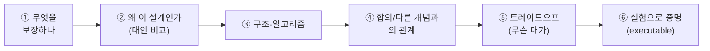
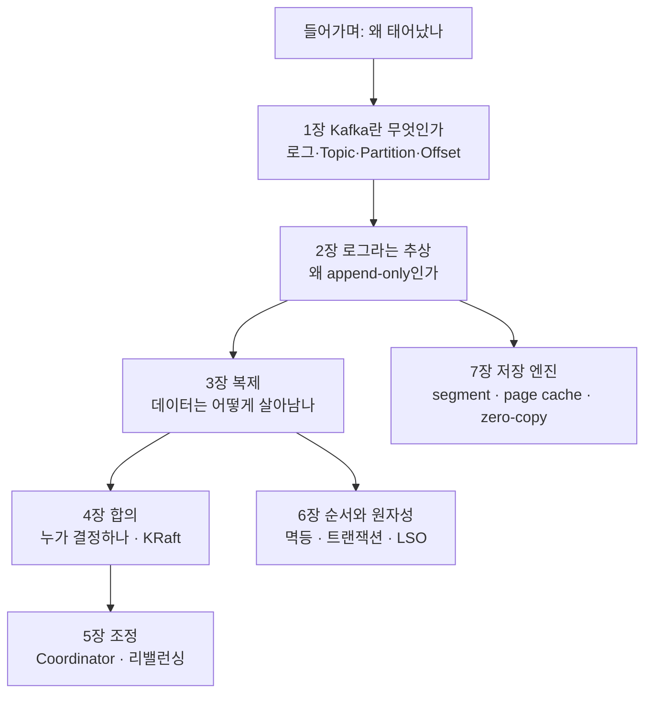

# 📘 I권 — Internals (원리와 내부)

> ⚠️ **러프 초안 — I권 목차.**
> Kafka를 **분산 시스템의 제1원리부터** 깎아 올라간다. "ISR이 어쩌구"가 아니라
> **왜 그렇게 되어야 하는지 · 무엇을 보장하는지 · 어떤 구조인지 · 어떤 합의 알고리즘인지.**

---

## 모든 deep-dive 장의 집필 틀

각 장은 아래 6단계로 깎는다. 이 순서가 "현상 암기"를 막는다.

- **Mermaid 적극 활용**: 복제 흐름, 상태 전이, 로그 구조는 반드시 그림으로.
- 모든 핵심 주장에는 ⑥ 증명 테스트가 붙는다.

> **작업 방식: 산문 초안보다 "요소 추출(stub)" 먼저.**
> 각 장은 위 6단계 틀에 따라 *보장 → 다룰 요소 → 요소 의존 그래프 → Mermaid 후보 → 증명 실험 → 트레이드오프 → 열린 질문* 을 먼저 추출한다.
> 구조를 싸게 재배치하고 의존 순서를 확정한 뒤, 합의된 stub을 산문으로 깎는다.
> 샘플: [3장 복제 stub](./03-replication.md)

---

## 목차 (원리 축)

| 장 | 제목 | 다루는 핵심 | 상태 |
|----|------|------------|------|
| 들어가며 | [Kafka는 무엇을 풀려고 태어났나](./00-prologue.md) | N×M 통합 지옥 → 로그 백본, 생태계의 결핍 | 🚧 초안 |
| 1장 | [Kafka란 무엇인가](./01-what-is-kafka.md) | 로그·단위·설계 철학 3원칙 | 🚧 초안 |
| 2장 | 로그라는 추상 | 왜 append-only인가, 상태=로그의 파생물 | 📋 예정 |
| 3장 | [복제 — 데이터는 어떻게 살아남나](./03-replication.md) | 복제 모델 비교 · ISR · HW/LEO · **leader epoch** · 복제≠합의 | 🚧 요소 추출 stub |
| 4장 | 합의 — 누가 결정하나 | **왜 Raft인가**(Paxos 비교) · KRaft(메타데이터를 로그로) · Controller | 📋 예정 |
| 5장 | 조정 — Consumer Group | Coordinator · 리밸런싱 프로토콜 · `__consumer_offsets` | 📋 예정 |
| 6장 | 순서와 원자성 | 파티션 순서의 한계 · 멱등(PID/epoch/seq) · 트랜잭션(control record/LSO) | 📋 예정 |
| 7장 | 저장 엔진 | log segment·index · page cache · zero-copy · compaction | 📋 예정 |

> 기존 [`KAFKA-ARCHITECTURE.md`](../../../KAFKA-ARCHITECTURE.md)는 3·4·5장의 재료로 **분해·흡수 예정**이다.

---

## 전제: 멀티브로커 환경

복제·ISR 축소·리더 선출·leader epoch·KRaft 합의는 **단일 브로커로는 증명할 수 없다.**
3장부터는 `docker-compose`를 **3-broker(+controller quorum)** 로 전환하는 것을 전제로 한다. → [ROADMAP](../../ROADMAP.md)

---

← [전체 표지](../README.md) · [CHARTER](../../CHARTER.md) · [용어집](../../../GLOSSARY.md)
