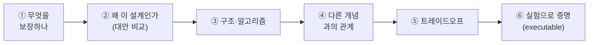
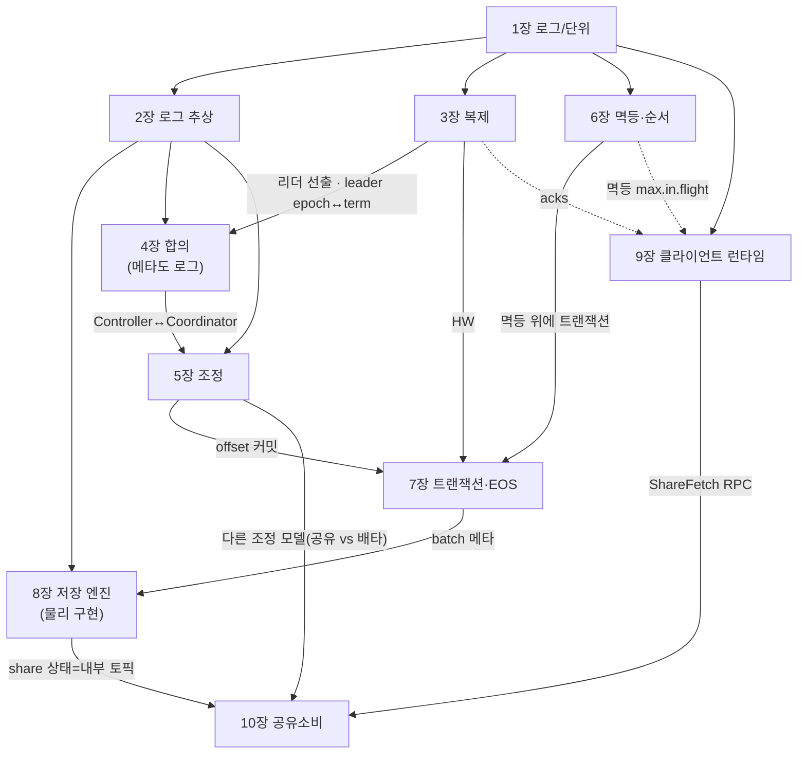

# 📘 I권 — Internals (원리와 내부)

> Kafka를 **분산 시스템의 제1원리부터** 깎아 올라간다. "ISR이 어쩌구"가 아니라
> **왜 그렇게 되어야 하는지 · 무엇을 보장하는지 · 어떤 구조인지 · 어떤 합의 알고리즘인지.**

> ⚠️ **이 README가 I권의 중심 작업판이자 단일 인덱스다.**
>
> 📐 집필 공통 규칙(README=인덱스 · SSOT 표 · 상태 2축 · 증명 모델 등)은 [전체 표지](../README.md)가 단일 진실이다 — 여기서 재서술하지 않는다.
> 특히 🔒 **불변식: 다른 장·권은 named link로만, 장/권 번호를 본문에 박지 말 것** (`(I권 7장)` ❌ → `[저장 엔진](08-storage-engine.md)` ✅). LSO·권번호 드리프트가 전부 이 위반에서 났다.

---

## 이 권의 역할 · Scope · 경계

**목적**: Kafka가 **왜 이렇게 동작하는지**를 분산 시스템 제1원리에서 증명한다. 현상·사용법이 아니라 **보장(guarantee)·구조·알고리즘**.

**한 문장**: *"Kafka의 내부 메커니즘과 그것이 보장하는 것."*

### 다룬다 (Scope)
- 로그라는 추상 · 복제/ISR · 합의/KRaft · Consumer Group 조정 · 멱등·순서 · 트랜잭션·EOS · 저장 엔진 · 클라이언트 런타임
- 각 주제를 *무엇을 보장하나 / 왜 이 설계인가 / 어떤 구조·합의 알고리즘인가 / 트레이드오프*로
- **Kafka 그 자체** — 특정 언어·프레임워크에 중립 (코드는 증명 도구일 뿐)

### 다루지 않는다 (Out of Scope)
| 주제 | 가야 할 곳 |
|------|-----------|
| Spring Kafka 코드 · 설정 레시피 · 코드 함정 | **II권 Spring** |
| 운영 절차 · 클러스터 사이징 · 모니터링 · 장애 대응 · 보안 | **III권 Operations** |
| 이벤트 설계 · Outbox · Saga | messaging-lab / saga-lab |

> 🤖 **이 권을 작업하는 AI/작업자에게**: II·III권 주제(Spring 코드, 운영 절차)로 새지 말 것.
> 필요하면 "→ II권" / "→ III권" 링크만 남기고, 여기서는 **원리만** 깎는다.
> **결정 규칙**: correctness가 변하면 여기(I권), 트레이드오프만 변하면 III권.

---

## 집필 틀 (각 장을 깎는 6단계)

- **Mermaid 적극 활용** · 모든 핵심 주장에 ⑥ 증명 테스트 · **KIP·논문 적극 인용**
- 전제: **3-broker 멀티브로커**(복제·ISR·리더 선출·KRaft 합의는 단일 브로커로 증명 불가) → [ROADMAP](../../ROADMAP.md)

상태 범례 — **2축**:
- **[산문]** ✅ 완료(개별 md) · 📝 아웃라인 확정(산문 대기) · 🚧 깎는 중
- **[executable 증명]** 현재 **전 장 ⬜ 미구현** (각 장 `[테스트로 결정]` 항목 / 10장은 4.2+ 브로커 필요). 장 헤더의 ✅는 *산문* 기준이다.

> **증명 모델 (혼합)** — 이 책의 증명은 한 곳이 아니다:
> - **저장·프로토콜 장**(복제·합의·트랜잭션·저장 엔진·클라이언트 런타임 등)은 **I권 자체 증명**: `docker`/CLI/`AdminClient`로 프레임워크 중립하게 관측한다(집필 틀 ⑥이 가리키는 게 이것).
> - **개념 장**(1장 등)이 던진 런타임 동작(offset 이동·순서·pull 등)의 증명은 **II권 Spring Step**에 위임한다.
> 즉 "I권이 다 증명한다"가 아니라 *장 성격에 따라 증명 위치가 갈린다*. 1.6의 증명 표가 II권을 가리키는 건 이 모델의 결과다.

---

## 장 간 요소 의존 (전체 점검용)

### 교차 요소 SSOT — "정의 위치"의 단일 진실

> 같은 개념이 여러 장에 걸칠 때, **정의 위치는 이 표가 유일한 진실**이다.
> 본문·그래프는 정의 위치를 **재서술하지 말고 이 표를 따른다**(인라인 `(N장 정의)` 금지 — 드리프트의 근원). 표와 산문이 어긋나면 *산문 기준으로 표를 고친다*(번호는 진실의 원천이 아니다).

| 요소 | 정의 위치 | 주 사용처 |
|------|----------|-----------|
| HW (High Watermark) | **3장** | 3·7장 |
| LSO (= min(HW, 가장 오래된 열린 txn)) | **7장** | 7장 |
| compaction — 의미 / 메커니즘 | **2장 / 8장** | 2·8장 |
| leader epoch ↔ Raft term | **3장 ↔ 4장** | 3·4장 |
| "메타데이터 = 로그" | **2장** | 4·5·7·10장 |
| fetch 프로토콜 | **9장** | 3장(복제 공용) |
| purgatory | **9장** | 3·9장 |
| share group 경계 | **10장** | 1.2·5.1 |
| timestamp.type | **8장** | 8장 |

---

# 목차 + 각 장 아웃라인

## 들어가며 — Kafka는 무엇을 풀려고 태어났나   ✅ [00-prologue.md](./00-prologue.md)

- 이 책 읽는 법 (이름 암기 ❌ / 문제→해결 맥락 ⭕ / 모든 주장은 테스트로 증명)
- Kafka 이전: **N×M 통합 지옥** (LinkedIn, point-to-point 폭발)
- 발상의 전환: 중앙 로그 하나 → **N×M → N+M** (데이터 백본)
- 생태계는 결핍에서: Connect / Streams / ksqlDB / Schema Registry / **KRaft**

## 1장 — Kafka란 무엇인가   ✅ [01-what-is-kafka.md](./01-what-is-kafka.md)

- 1.1 한 문장 (분산·복제·순서 보장 append-only 로그)
- 1.2 큐가 아니라 로그 (읽어도 안 사라짐, offset만 이동)
  - (경계) "읽어도 안 사라짐"은 **consumer group 한정** — share group(KIP-932)은 레코드별 ack·락 기반 큐 시맨틱 → 10장. 저장은 로그, 그 위에 큐 시맨틱을 얹음
- 1.3 가장 작은 단위 (Record / Topic / Partition / Offset)
- 1.4 등장인물 (Producer / Broker / Consumer / Group)
- 1.5 설계 3원칙 (디스크인데 빠른 이유 / 파티션 순서 / pull)
- 1.6 증명(executable) / 1.7 다음 장

## 2장 — 로그라는 추상   ✅ [02-log-abstraction.md](./02-log-abstraction.md)

> 보장: *상태는 로그의 파생물 — 로그가 source of truth.*

- 2.1 append-only · 불변 · offset 단조성(위치이자 논리 시계)
- 2.2 왜 로그인가 — 큐/테이블 대비, **MySQL은 테이블이 본체·로그가 보조 / Kafka는 반대**
- 2.3 상태 = `fold(로그)` (event sourcing, materialized view)
- 2.4 compaction의 **의미** = 키별 최신 = 상태 스냅샷 ([메커니즘](08-storage-engine.md))
- 2.5 stream-table duality (로그↔테이블, → Streams)
- 2.6 메타데이터도 로그 (`__cluster_metadata` 4장·`__consumer_offsets` 5장·control record 6장 예고)
- 2.7 트레이드오프(무한 로그→retention/compaction) · 증명(compaction·tombstone)
- 참조: Kreps *"The Log"*, DDIA 11·3장

## 3장 — 복제: 데이터는 어떻게 살아남나   ✅ [03-replication.md](./03-replication.md)

> 보장: *커밋된 메시지는 min.insync.replicas개 복제본에 존재 → 그만큼 동시 장애까지 무손실.*

- 3.1 문제: 브로커는 언젠가 죽는다 (단일 노드 내구성·가용성 한계, "커밋했는데 사라짐"이 최악)
- 3.2 복제의 세 선택지 — 완전 동기 / 완전 비동기 / **ISR** (보장·대가 비교표 + Mermaid)
- 3.3 ISR이라는 절충 (`replica.lag.time.max.ms`, 진입/축출, 기록 주체→4장)
- 3.4 "커밋"이란 무엇인가 — **HW** (LEO vs HW, consumer 가시성 = HW까지)
- 3.5 보장의 다이얼 — `acks × min.insync.replicas × RF` (조합표, RF=3+min.isr=2가 균형점)
- 3.6 리더가 죽으면 — ISR 선출 / **unclean leader election** on·off 트레이드오프
- 3.7 로그가 어긋나지 않으려면 — **leader epoch** (HW-only truncation 버그 KIP-101, fencing = Raft term과 동형→4장)
- 3.8 복제는 합의가 아니다 — ISR primary-backup vs KRaft, 왜 분리했나(처리량)
- 3.9 직접 증명 — follower 정지→ISR 축소 / 2대 정지→쓰기 거부 / leader kill→무손실
- 참조: KIP-101/279, DDIA 5·9장

## 4장 — 합의: 누가 결정하나 (KRaft)   ✅ [04-consensus.md](./04-consensus.md)

> 보장: *메타데이터(리더가 누구인지 등)에 모든 노드가 단일 진실로 합의.*

- 4.1 문제: 메타데이터 단일 진실 + split-brain 방지 (데이터 복제 3장과 구분)
- 4.2 분산 합의란 (과반/quorum, FLP 불가능성)
- 4.3 **Paxos vs Raft** — 왜 Raft(이해가능성, 강한 리더)
- 4.4 KRaft = "메타데이터도 로그로"(2장) → 외부 의존 제거 (정통 Raft의 push 아닌 **pull 기반** 변형, KIP-595 — 9장 fetch·3장 복제와 통일)
- 4.5 `__cluster_metadata` · Controller Quorum · active controller · term
- 4.6 파티션 리더 선출 (controller가 ISR에서 지정 → 전파)
- 4.7 ZooKeeper 시절 → KRaft 전환 (KIP-500, 4.0 ZK 제거)
- 4.8 메타데이터 로그도 무한히 안 자란다 — KRaft 스냅샷(KIP-630), 2장 키별 log compaction과 달리 **상태 스냅샷 후 로그 절단**
- 4.9 증명 — `describeCluster`, active controller kill, 메타데이터 전파
- 참조: Raft 논문(Ongaro 2014), Paxos(Lamport), KIP-500/595/631, DDIA 9장

## 5장 — 조정: Consumer Group은 어떻게 나눠 읽나   ✅ [05-coordination.md](./05-coordination.md)

> 보장: *그룹 내 각 파티션은 정확히 한 consumer에게 배정(배타성). 멤버 변동 시 리밸런싱으로 유지.*

- 5.1 배타 배정 불변식 (파티션 수 = 병렬성 상한)
  - (경계) 이 배타성·"파티션 수 = 병렬성 상한"은 **consumer group 한정** — share group은 한 파티션을 여러 consumer가 공유, 파티션 수 < consumer 수도 가능 → 10장
- 5.2 왜 배정을 클라이언트(Group Leader)에 위임했나 (브로커 부하)
- 5.3 **Group Coordinator** (브로커 중 하나, Controller 4장과 다른 역할)
- 5.4 JoinGroup → SyncGroup 2단계 (Coordinator가 Leader 지정→Leader가 계산→전파)
- 5.5 배정 전략 (Range / RoundRobin / Sticky / CooperativeSticky)
- 5.6 **리밸런싱 세대** — eager(stop-the-world) → cooperative(KIP-429) → KIP-848(서버 주도)
- 5.7 타이밍 3박자 — `heartbeat.interval < session.timeout ≪ max.poll.interval`
- 5.8 static membership (KIP-345)
- 5.9 `__consumer_offsets` (compacted 로그, 2장)
- 5.10 증명 — eager vs cooperative revoke 범위 / static 재접속
- 참조: KIP-429/848/345 · (트리거 전수=III권, Spring 설정=II권)

## 6장 — 멱등·순서: 중복 없이, 순서대로   ✅ [06-ordering-atomicity.md](./06-ordering-atomicity.md)

> 보장: *멱등 — 재시도해도 파티션 내 중복 없음. 순서 — 파티션 내에서 보장.*

- 6.1 파티션 내 순서 한계 (전체 순서는 단일 파티션이면 가능하나 병렬성 포기 — trade)
- 6.2 "그냥 재시도"의 함정 (ACK 유실 → 중복 append)
- 6.3 **멱등 프로듀서** — PID + epoch + sequence (요구 조합: `idempotence=true`→`acks=all`·`max.in.flight≤5`)
- 6.4 멱등의 세션 한계 (재시작=새 PID → 보장 끊김)
- 6.5 순서와 `max.in.flight` (멱등 off면 재시도 시 순서 역전)
- 6.6 증명 — 멱등 재시도 중복 없음 / 세션 한계 중복 / 순서 역전
- 참조: KIP-98, DDIA 9장

## 7장 — 트랜잭션·EOS: 전부 또는 전무   ✅ [07-transactions.md](./07-transactions.md)

> 보장: *다중 파티션 쓰기(+offset 커밋)가 원자적. EOS = 멱등 + 트랜잭션 + read-process-write (Kafka 내부 한정).*

- 7.1 왜 트랜잭션인가 — 다중 파티션 원자성 + read-process-write (6장 멱등 위에 쌓는다)
- 7.2 `transactional.id` 와 좀비 펜싱 (producer epoch로 옛 인스턴스 차단) — KIP-890: epoch-bump-per-txn으로 hanging txn 방지
- 7.3 **Transaction Coordinator** + `__transaction_state` (트랜잭션 상태도 로그 — 2장)
- 7.4 2단계 흐름 — `AddPartitionsToTxn` → produce → commit/abort
- 7.5 **control record**(commit/abort marker) + **LSO** + `read_committed`(abort 배치 스킵)
- 7.6 read-process-write — `sendOffsetsToTransaction` (consumer offset도 트랜잭션에)
- 7.7 **EOS의 경계** — Kafka 내부 한정, 외부 시스템은 멱등키(→ II권)
- 7.8 증명 — abort+read_committed 안 보임 / `isolation.level` 기본값(read_uncommitted) 함정 / read-process-write 원자성
- 참조: KIP-98/129, Confluent *EOS* 문서, DDIA 9·7장

## 8장 — 저장 엔진: 디스크인데 왜 빠른가   ✅ [08-storage-engine.md](./08-storage-engine.md)

> 보장: *디스크 기반인데도 순차 IO·OS 최적화로 고처리량.*

- 8.1 로그(2장)의 물리 실체
- 8.2 디스크인데 빠른 이유 — **순차 IO** / **page cache**(JVM 힙 아님) / **zero-copy(sendfile)**
- 8.3 **Log Segment** — `.log`/`.index`/`.timeindex`, 파일명=base offset, active segment, rolling(`segment.bytes/ms`)
  - `.index`/`.timeindex`는 memory-mapped(mmap) → OS 페이지 관리, 크래시 시 복구 필요(8.9와 연결)
- 8.4 **Record Batch v2** — baseOffset·producerId·epoch·압축타입 (멱등/트랜잭션 6·7장이 여기 박힘)
- 8.5 조회 — sparse index 점프 → `.log` 순차 스캔
- 8.6 압축 — producer batch 단위(lz4/zstd/snappy/gzip), 브로커는 그대로 저장·전송
- 8.7 **log compaction 메커니즘** — cleaner thread, 키별 최신 + tombstone (2장 의미→여기 메커니즘)
- 8.8 retention — 시간/크기, **세그먼트 단위 삭제**
- 8.9 로그 복구 — clean vs unclean shutdown / 체크포인트 파일(recovery-point-offset-checkpoint·replication-offset-checkpoint·log-start-offset-checkpoint) / unclean 종료 시 마지막 세그먼트 재검증 (3.1 유실 방지의 물리 구현)
- 8.10 시간의 의미
  - `message.timestamp.type` — CreateTime(프로듀서) vs LogAppendTime(브로커)
  - `.timeindex` 인덱싱 + 시간 기반 seek
  - **retention이 쓰는 timestamp** → 조기·지연 삭제 함정의 원인
- 8.11 Tiered Storage(KIP-405) — RemoteLogManager / 읽기 remote fallback / local vs remote retention 분리
- 8.12 증명 — `docker exec`로 `.log` 직접 보기 / `kafka-dump-log` / rolling 관측
- 참조: Kafka design 문서(Persistence·Efficiency·Compaction), `sendfile(2)`, KIP-405(tiered storage)

## 9장 — 클라이언트 런타임: Producer/Consumer는 내부에서 어떻게 도나   ✅ [09-client-runtime.md](./09-client-runtime.md)

> 보장/관점: *send()는 비동기다 — 사용자 스레드와 IO 스레드가 분리돼 있고, 그 경계를 모르면 콜백 한 줄로 처리량을 무너뜨린다.*
> scope: 클라이언트 런타임 + 그 클라이언트가 말을 거는 **broker 측 요청 처리**(fetch·purgatory)까지.

- 9.1 Producer 스레드 모델 — 사용자 스레드(send) vs **Sender(IO) 스레드**(`kafka-producer-network-thread`)
- 9.2 send()의 여정 — 직렬화/파티셔닝 → RecordAccumulator(버퍼) → 배치 → 전송
  - key 없는 메시지의 파티션 선택: sticky partitioner(KIP-480) → uniform sticky(KIP-794)가 `batch.size`·`linger.ms`와 맞물려 배치 효율을 좌우(9.5와 연결)
- 9.3 콜백/Future 완료는 누가 실행하나 — **Sender(IO) 스레드** → `whenComplete`에서 blocking하면 produce 정지 (★→ II권 코드 함정)
- 9.4 backpressure — `buffer.memory` 가득 → `send()`가 `max.block.ms`까지 블록 → TimeoutException
- 9.5 설정 조합 — `buffer.memory × batch.size × linger.ms × max.block.ms` = 처리량·지연·역압
- 9.6 Consumer 런타임 — 단일 스레드 poll 루프 / 백그라운드 heartbeat 스레드 / `max.poll.records ↔ max.poll.interval`
- 9.7 Consumer/Replica fetch 메커니즘 — long-poll(`fetch.min.bytes` × `fetch.max.wait.ms`) / incremental fetch session(KIP-227) / **복제도 동일 fetch 프로토콜 사용**(3장 follower↔여기) / fetch-from-follower(KIP-392)
- 9.8 broker 측 지연 요청 — purgatory: DelayedProduce(acks=all ISR 대기 ↔3.5)·DelayedFetch(min.bytes 대기 ↔9.7) / timer wheel·watcher
- 참조: Kafka producer/consumer design 문서, `KafkaProducer` Javadoc

## 10장 — 공유 소비: Share Group (큐 시맨틱)   ✅ [10-share-groups.md](./10-share-groups.md)

> 보장: *한 파티션을 여러 consumer가 공유 소비 · 레코드별 개별 ack/재전달 · at-least-once · 배치 안에서만 순서 보장.* (Kafka 4.2 GA)

- 10.1 왜 별도 모델인가 — consumer group 배타 배정(5.1)·로그 retention(2장)과 큐(개별 ack·작업 분배)의 긴장 → 기존 group에 못 얹고 새 group type으로 분리
- 10.2 consumer group과의 대조 — 배타 vs 공유 / commit offset vs 레코드별 상태 / consumer≤파티션 vs consumer>파티션 가능
- 10.3 in-flight 레코드 상태 머신 — Available→Acquired(락 `group.share.record.lock.duration.ms` 기본 30s)→Acknowledged / Released(재전달) / Archived(`group.share.delivery.count.limit` 기본 5 초과)
- 10.4 Share Coordinator + `__share_group_state`(50파티션) — Group·Transaction에 이은 셋째 coordinator (Controller는 합의/메타라 결이 다름)
- 10.5 새 프로토콜 RPC — ShareFetch / ShareAcknowledge (share session = GroupId+MemberId, 9장 일반 fetch와 대비)
- 10.6 한계 — 배치 간 순서 없음 / **EOS 미지원**(at-least-once, `share.isolation.level`로 read 제어) / fetch-from-follower 미지원
- 10.7 증명 — consumer>partition 동시 소비 / 락 만료 후 재전달 / ack 후 미재전달 / delivery 한도 후 Archived (★4.2+ 브로커 필요)
- 참조: KIP-932, Kafka 4.2 GA

> 기존 [`KAFKA-ARCHITECTURE.md`](../../../KAFKA-ARCHITECTURE.md)는 3·4·5장 산문화 시 **분해·흡수 예정**.

---

## ✅ I권 산문화 완료

- 들어가며·1~10장 전부 산문화 완료. 10장 share group은 KIP-932 + Kafka 4.2 GA 1차 소스로 검증해 작성.
- 남은 작업: 각 장 `[테스트로 결정]` 증명을 실제 테스트로 구현(executable 단계). 특히 10장은 **4.2+ 브로커** 별도 필요(baseline 3.7).

---

← [전체 표지](../README.md) · [CHARTER](../../CHARTER.md) · [용어집](../../GLOSSARY.md)
