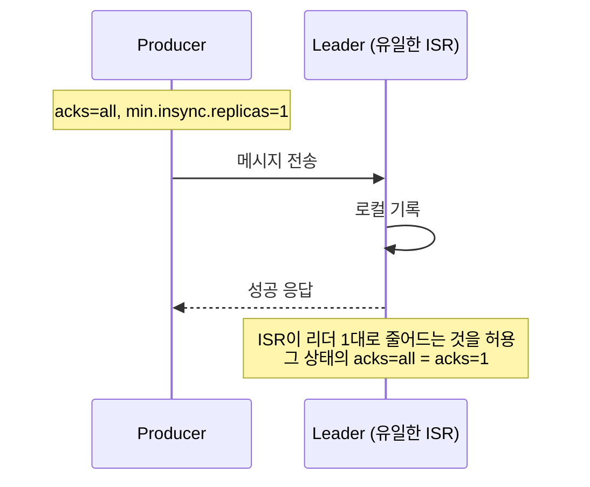
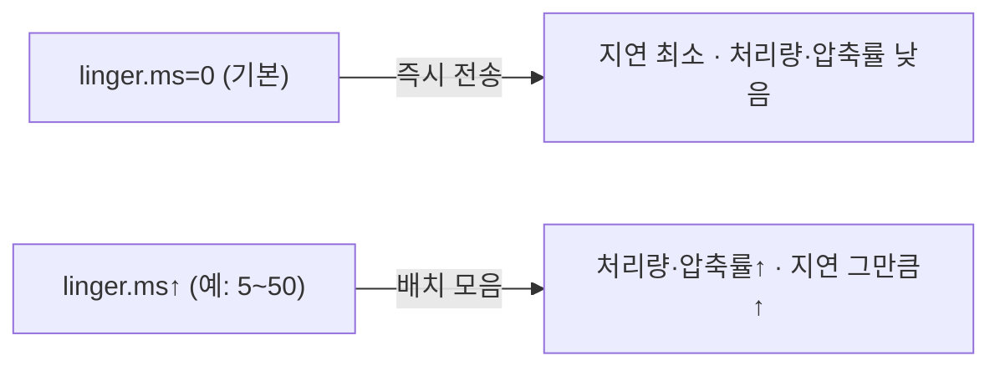
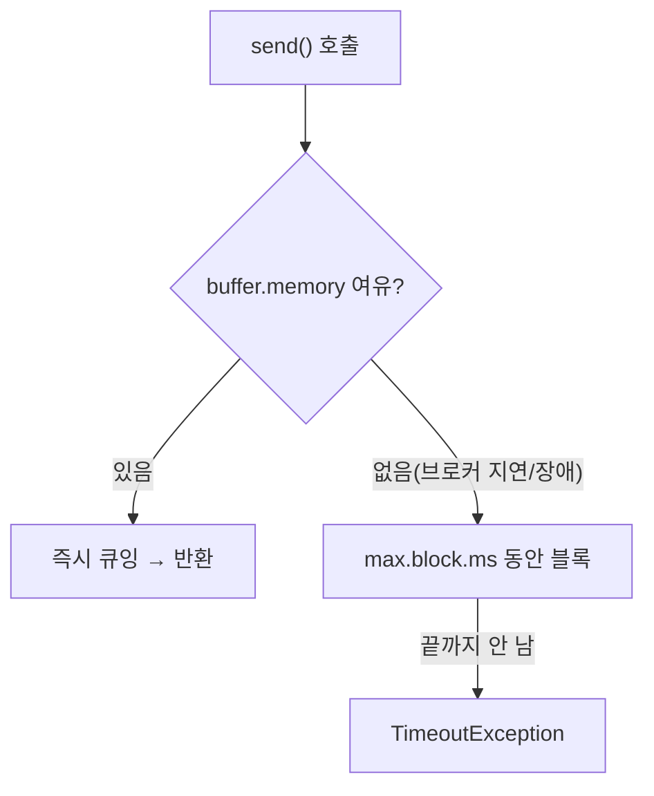

# II권 1장 — Producer 보장

> 앞: [II권 목차](./README.md) · 다음: [Consumer & Offset](./02-consumer-offset.md)
>
> **보장/착각**: *"`acks=all`이면 안전한가?"* — `acks`·`idempotence`가 **무엇까지** 보장하고, 코드에서 어디서 데이나. ISR·복제·HW의 *원리*는 → [I권 복제](../1-internals/03-replication.md).

본편의 출발점. Producer가 "보냈다"로 끝이 아니다 — **무엇을 보장받고, 무엇을 코드로 확인해야 하는가.** 각 절은 *설정의 의미 → 어디서 깨지나 → 올바른 형태 → 원리(I권)·조합(8장)·증명(Step)* 순으로 본다.

---

## 1.1 `acks=all`이면 안전한가 — 내구성은 짝이다

운영에서 유실이 났다. 팀은 이미 `acks=all`을 켜뒀다. *"모든 복제본이 확인해야 응답하는 것 아닌가?"* — **설정의 의미만 보면 맞다.** 그런데 ISR이 리더 1대뿐이면?

`acks=all`은 "**현재 ISR**(In-Sync Replicas) 전부가 기록을 확인하면 응답"이다. ISR이 리더 하나로 쪼그라들면, 리더 1대만 확인하고 응답한다 — **`acks=1`과 같아진다.**



핵심은 `min.insync.replicas`다 — "ISR이 이 수 미만이면 쓰기를 거부하라"는 **하한선**(Producer 설정이 아니라 토픽/브로커 레벨). `acks=all`은 ISR *전부*를 확인하지만, `min.insync.replicas=1`이면 ISR이 1대로 **줄어드는 것을 허용**해 그 순간 `acks=1`로 퇴화한다. 정석은 `acks=all` + `min.insync.replicas=2`(RF≥3).

> 이 책의 본편 테스트는 단일/임베디드 브로커(ISR=항상 1)라, 테스트상으로는 "항상 `acks=1`과 동일"이 맞다. **ISR 축소·리더 선출의 멀티브로커 실증**은 → [I권 복제](../1-internals/03-replication.md)·[III권 의사결정 트리](../3-operations/10-config-decision-tree.md).

- **왜** → [I권 복제](../1-internals/03-replication.md) (ISR·HW·`min.insync.replicas`의 밑바닥)
- **조합 정의** → [설정 조합의 함정](08-config-combination-traps.md) (내구성 짝은 client×broker 경계라 정의를 8장에 둔다)
- **증명** → [s01 Producer](../../../src/test/java/com/example/kafka/s01_producer/README.md) `ProducerAcksTest` 🧪

---

## 1.2 `acks` 세 레벨 — 무엇을 보장하나

| 값 | 보장 | 대가 |
|----|------|------|
| `acks=0` | 없음(브로커 응답을 안 기다림) | 가장 빠르고 가장 많이 유실 — 일부 유실 허용(메트릭·텔레메트리)만 |
| `acks=1` | 리더가 기록했다 | 리더가 죽고 복제 전이면 그 구간 유실 |
| `acks=all` | 현재 ISR 전부가 기록했다 | 복제 대기로 지연↑ · `min.insync.replicas`와 **짝**이어야 의미(1.1) |

> 값별 *언제 유리한가*(지연↔처리량↔내구성)는 → [III권 의사결정 트리(CAP·PACELC)](../3-operations/10-config-decision-tree.md). 기본값은 → [설정 레퍼런스](./10-config-reference.md).

- **증명** → `ProducerAcksTest` (`acks_0/1/all` 각 동작) 🧪

---

## 1.3 멱등성이 기본 ON이라 `acks`를 가린다

*"나는 `acks` 설정 안 했는데 왜 `all`처럼 동작하지?"* — Kafka **3.0+부터 `enable.idempotence`가 기본 `true`** 이고 `[KIP-679]`, 이게 `acks=all`·`retries>0`·`max.in.flight≤5`를 **전제·강제**한다. 그래서 `acks`를 명시 안 해도 이미 `all`이다.

여기서 함정이 갈린다 — `acks=1`이나 `acks=0`을 테스트하려면 `enable.idempotence=false`를 *먼저* 줘야 하고, 기본 의존 상태로 `acks=1`만 주면 **멱등성이 조용히 비활성화**된다(예외 없이 `INFO` 로그뿐). 이 두 갈래가 8장의 핵심이다.

- **조합 함정**(silent disable vs `ConfigException`) → [설정 조합의 함정](08-config-combination-traps.md) (8.1 멱등성 삼각형) `[code @3.7]`
- **원리**(PID·epoch·sequence) → [I권 멱등·순서](../1-internals/06-ordering-atomicity.md)
- **증명** → `ProducerAcksTest` (멱등 off로 acks 분리) 🧪

---

## 1.4 `send()`는 비동기 — 반환값을 버리면 유실을 모른다

`KafkaTemplate.send()`는 `CompletableFuture<SendResult>`를 반환한다. 이걸 무시하면 **발행이 실패해도 코드가 모른다.**

```java
kafkaTemplate.send("topic", "message");                       // 위험: 실패를 못 본다
kafkaTemplate.send("topic", "message").get(5, SECONDS);       // 안전: 타임아웃과 함께 확인
kafkaTemplate.send("topic", "message").get();                 // 위험: 브로커 불능 시 무한 블로킹
```

반환된 `RecordMetadata`로 어느 토픽·파티션·offset에 기록됐는지 확인한다. 분산 추적이 필요하면 `ProducerRecord` 헤더에 `correlation-id`를 넣어 Consumer까지 흐름을 잇는다(MDC 연계). *메트릭·SLO 판단*은 → III권.

- **런타임**(`send`가 왜 비동기인가 — 사용자 스레드 vs Sender 스레드) → [I권 클라이언트 런타임](../1-internals/09-client-runtime.md)
- **증명** → `ProducerRecordStructureTest` 🧪

---

## 1.5 배치 — `linger.ms` × `batch.size`

메시지를 하나씩 보내면 네트워크 왕복이 메시지 수만큼 난다. Producer는 **`batch.size`(바이트)와 `linger.ms`(시간) 중 먼저 차는 쪽**으로 배치를 닫아 보낸다.



`linger.ms=0`이어도 Sender가 이전 배치로 바쁜 동안 누적된 메시지는 배치로 묶일 수 있다. 즉시 보내야 하면 `flush()`가 `linger.ms`를 무시하고 비운다.

- **trade-off**(언제 올리고 내리나) → [III권 의사결정 트리](../3-operations/10-config-decision-tree.md) · 기본값 → [설정 레퍼런스](./10-config-reference.md)
- **증명** → `ProducerBatchingTest` 🧪

---

## 1.6 백프레셔 — `buffer.memory` × `max.block.ms` × `delivery.timeout.ms`

`send()`는 메시지를 내부 버퍼(`buffer.memory`)에 넣는 것까지만 하고 즉시 반환한다 — 실제 전송은 I/O 스레드가 한다. 브로커가 느리거나 메타데이터를 못 가져와 **버퍼가 차면** `send()`가 블로킹하고, `max.block.ms`가 만료되면 `TimeoutException`을 던진다(호출 스레드로 백프레셔 전파).



`delivery.timeout.ms`는 `send()` 이후 **전달 성공까지의 전체 상한**(`linger.ms` + 전송 + 재시도 포함)이다. `delivery.timeout.ms ≥ linger.ms + request.timeout.ms`를 어기면 생성 시 `ConfigException` `[code @3.7]`. `retries`와 재시도 시 순서 역전은 → [설정 조합의 함정](08-config-combination-traps.md)(8.2)·[I권 멱등·순서](../1-internals/06-ordering-atomicity.md).

- **런타임**(버퍼·Sender·purgatory) → [I권 클라이언트 런타임](../1-internals/09-client-runtime.md) · **백프레셔 정책 trade-off** → [III권](../3-operations/10-config-decision-tree.md)
- **증명** → `ProducerBackpressureTest` 🧪

---

## 1.7 yml 정리

```yaml
spring.kafka.producer:
  acks: all                  # 3.0+ 기본 idempotence=true가 이미 강제 (1.3)
  properties:
    linger.ms: 5             # 배치 대기 (1.5)
    batch.size: 16384
    buffer.memory: 33554432  # 32MB (1.6)
    max.block.ms: 60000
    delivery.timeout.ms: 120000
# min.insync.replicas는 Producer 설정이 아니다 → 토픽/브로커 레벨 (1.1) · 운영 기준 → III권
```

기본값의 검증 상태(`✓`/`?`)와 전체 인덱스는 → [설정 레퍼런스](./10-config-reference.md). *어느 값이 유리한가*는 → [III권 의사결정 트리](../3-operations/10-config-decision-tree.md).

---

← [II권 목차](./README.md) · 원리: [I권 복제](../1-internals/03-replication.md)·[멱등·순서](../1-internals/06-ordering-atomicity.md)·[클라이언트 런타임](../1-internals/09-client-runtime.md) · 조합: [설정 조합의 함정](08-config-combination-traps.md) · 증명: [s01](../../../src/test/java/com/example/kafka/s01_producer/README.md)
