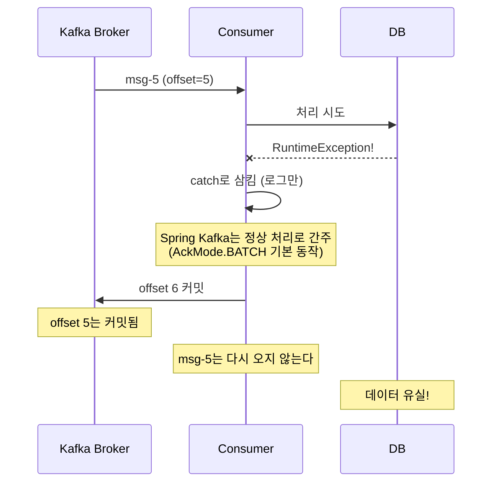
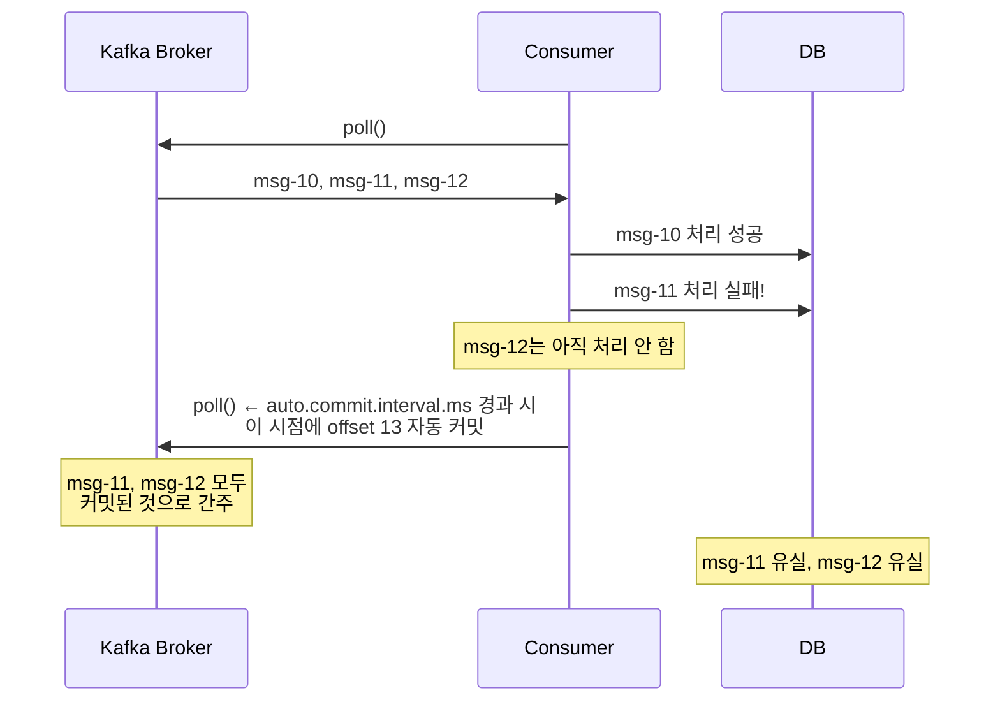
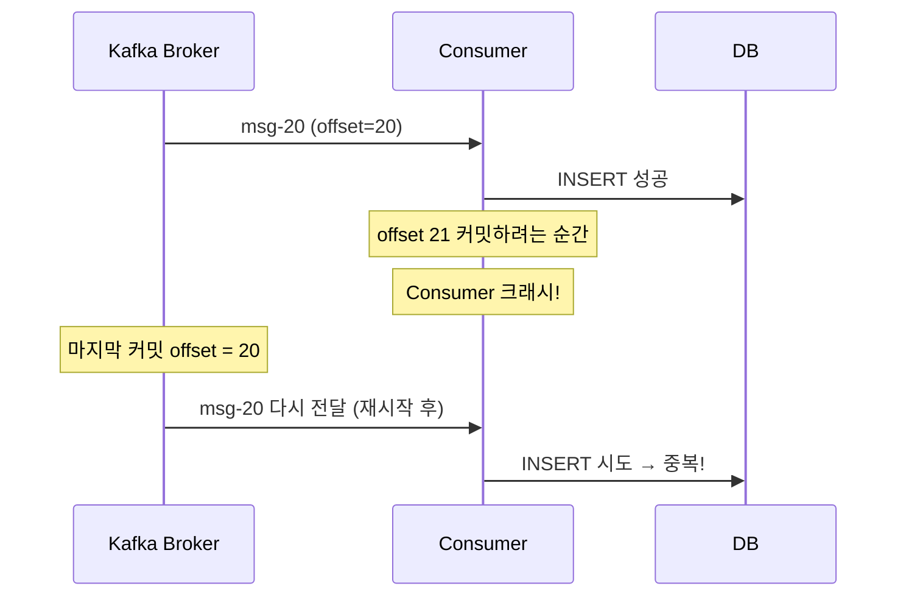
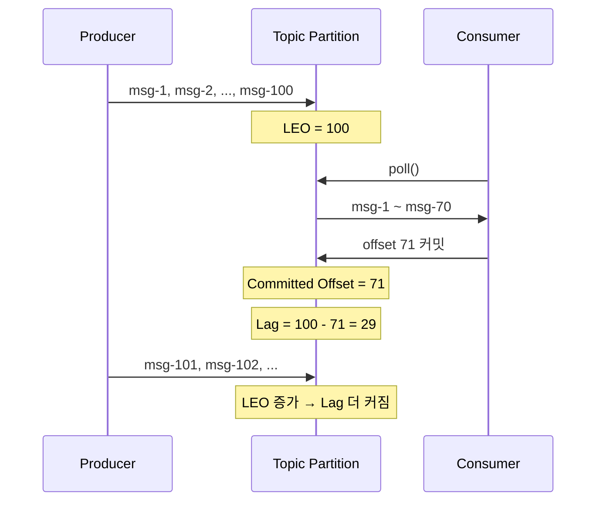

# Step 2 — Consumer Offset + Advanced

> **II권 2장** (Spring 코드 관점). offset 커밋·`__consumer_offsets`의 **원리**는 → [I권 조정](../../../../../../../docs/book/1-internals/05-coordination.md). 이 장은 AckMode·auto-commit 함정을 **Spring 코드로 어떻게 쓰고 어디서 데이나**로 다룬다.

---

## 예외를 try-catch로 삼키면 안전한 거 아닌가?

`@KafkaListener`에서 예외가 터졌다. 서비스가 죽으면 안 되니까 try-catch로 감싸고 로그만 남겼다.

```java
@KafkaListener(topics = "order-events")
void onMessage(String message) {
    try {
        orderService.process(message);
    } catch (Exception e) {
        log.error("처리 실패: {}", message, e);
        // 예외를 삼킴
    }
}
```

서비스는 안 죽었다. **근데 메시지가 유실됐다.**

예외를 삼키면 Spring Kafka는 "이 메시지 처리 완료"로 간주한다. 기본 AckMode인 BATCH에서는 poll()로 가져온 레코드 전부가 정상 처리된 것으로 보고 offset을 커밋한다. 다음 poll에서는 그다음 메시지부터 가져온다. **실패한 메시지는 영원히 다시 오지 않는다.**



> **ConsumerAckModeTest** — `예외를_삼키면_offset이_커밋되어_메시지가_유실된다()`에서 확인.

---

## auto-commit은 더 위험하다

Spring Kafka가 아닌 native Kafka Consumer의 기본값은 `enable.auto.commit=true`다. auto-commit이면 `auto.commit.interval.ms`(기본 5초) 간격으로, 다음 poll() 호출 시 이전 poll의 offset이 자동 커밋된다. **처리 성공 여부와 무관하게.**



> **ConsumerAutoCommitTrapTest** — `auto_commit이면_처리_실패해도_offset이_넘어간다()`에서 확인.

그래서 Spring Kafka는 `enable.auto.commit`을 **강제로 false**로 설정한다. auto-commit의 위험을 프레임워크 레벨에서 차단한 것이다.

> **ConsumerAutoCommitTrapTest** — `Spring_Kafka가_auto_commit을_false로_강제하는_이유를_이해한다()`에서 확인.

---

## AckMode로 커밋 타이밍을 제어한다

auto-commit을 끄고 나면, "언제 offset을 커밋할 것인가"를 직접 결정해야 한다. Spring Kafka는 AckMode로 이를 제어한다.

**AckMode.BATCH (기본값)** — poll()로 가져온 레코드를 전부 처리한 후 커밋한다.

> **ConsumerAckModeTest** — `AckMode_BATCH_기본값은_poll_반환_레코드_전부_처리_후_커밋한다()`에서 확인.

**AckMode.RECORD** — 레코드 하나를 처리할 때마다 커밋한다. BATCH보다 유실 범위가 좁지만, 커밋 횟수가 많아서 성능이 떨어진다.

> **ConsumerAckModeTest** — `AckMode_RECORD는_레코드_하나_처리할_때마다_커밋한다()`에서 확인.

**AckMode.MANUAL_IMMEDIATE** — `Acknowledgment.acknowledge()`를 명시적으로 호출해야 커밋된다. DB 커밋 성공 후에 offset을 커밋하는 패턴에 쓴다. 가장 세밀하게 제어할 수 있다.

> `MANUAL`도 있다. `MANUAL`은 acknowledge() 호출 후 **다음 poll() 시점**에 커밋되고, `MANUAL_IMMEDIATE`는 **즉시** 커밋된다. 실무에서 "acknowledge() 했는데 왜 바로 커밋 안 되지?"라는 혼란은 대부분 MANUAL과 MANUAL_IMMEDIATE를 혼동해서 생긴다.

> **ConsumerAckModeTest** — `AckMode_MANUAL_IMMEDIATE는_명시적_호출_시_즉시_커밋한다()`에서 확인.

---

## manual commit에서도 중복은 발생한다

manual commit이 유실을 막아준다는 건 이해했다. 근데 반대 방향의 문제가 있다. **커밋 전에 Consumer가 죽으면 같은 메시지를 다시 받는다.**



> Committed offset은 "마지막으로 처리한 offset + 1" = **"다음에 읽을 offset"**이다. offset 20을 커밋했다는 건 "20번부터 다시 읽겠다"는 뜻이고, offset 21을 커밋해야 "20번까지 처리 완료, 21번부터 읽겠다"는 뜻이다.

> **ConsumerAutoCommitTrapTest** — `manual_commit에서_커밋_전에_죽으면_중복_소비된다()`에서 확인.

이게 **at-least-once 시맨틱**이다. 메시지가 유실되지는 않지만, 중복 처리될 수 있다. 이 중복을 막으려면 Consumer 측에서 멱등 처리(event_id UNIQUE 등)를 해야 한다.

컨슈머는 이벤트를 의심해야 한다. Producer는 업스트림, Consumer는 다운스트림이다. Producer가 재시도 과정에서 같은 메시지를 두 번 보낼 수 있고, offset reset으로 같은 메시지를 다시 받을 수도 있다. **Consumer는 항상 at-least-once를 전제로 로직을 작성해야 한다.**

---

## auto.offset.reset — 처음부터 읽을 것인가, 지금부터 읽을 것인가

새로운 Consumer Group이 토픽을 구독할 때, 커밋된 offset이 없다. 이때 `auto.offset.reset` 설정이 결정한다.

**earliest** — 토픽의 처음부터 모든 메시지를 읽는다. 과거 데이터를 모두 처리해야 하는 경우에 쓴다.

> **ConsumerOffsetResetTest** — `auto_offset_reset_earliest이면_처음부터_모든_메시지를_소비한다()`에서 확인.

**latest** — 구독 시점 이후의 메시지만 읽는다. 과거 데이터가 필요 없는 실시간 처리에 쓴다.

> **ConsumerOffsetResetTest** — `auto_offset_reset_latest이면_기존_메시지를_무시한다()`에서 확인.

---

## Consumer Lag — 얼마나 밀려있는가

Producer가 보내는 속도가 Consumer가 처리하는 속도보다 빠르면, 처리되지 않은 메시지가 쌓인다. 이 차이가 **Consumer Lag**이다.

```
Consumer Lag = LEO(Log End Offset) - Committed Offset
```



> **ConsumerLagBasicTest** — `LEO에서_Committed_Offset을_빼면_Consumer_Lag이다()`에서 확인.
> **ConsumerLagBasicTest** — `producer_속도가_consumer보다_빠르면_lag이_누적된다()`에서 확인.

Lag이 지속적으로 증가하면 Consumer를 늘리거나(파티션 수 이내), 처리 로직을 최적화해야 한다.

> Lag 관련 튜닝 설정(`max-poll-records`, `fetch-min-size` 등)은 [Step 4 — Rebalancing](../s04_rebalancing/)에서 다룬다.

---

## 장애 복구 — seek과 offset 수동 변경

운영 중 특정 시점의 메시지를 재처리해야 할 때가 있다. Kafka는 이를 위한 도구를 제공한다.

**seekToBeginning** — 파티션의 처음부터 다시 읽는다.

> **ConsumerOffsetResetToolTest** — `seekToBeginning으로_처음부터_재소비할_수_있다()`에서 확인.

**seek(offset)** — 특정 offset부터 읽는다. 정밀한 복구에 쓴다.

> 특정 시각의 offset을 모르면 `consumer.offsetsForTimes()`로 timestamp → offset 변환이 가능하다. "어제 17시 이후 메시지만 재처리"처럼 시각 기준으로 복구할 때 사용한다.

> **ConsumerOffsetResetToolTest** — `seek으로_특정_offset부터_재소비할_수_있다()`에서 확인.

**AdminClient.alterConsumerGroupOffsets()** — Consumer Group의 offset을 수동 변경한다. 해당 Consumer Group이 **Empty 상태**(활성 멤버가 0, 모든 Consumer 인스턴스가 shutdown)여야 한다. 활성 Consumer가 남아 있으면 `GroupNotEmptyException`이 발생한다.

> **ConsumerOffsetResetToolTest** — `AdminClient로_Consumer_Group의_offset을_수동_변경할_수_있다()`에서 확인.

### replay 운영 시 주의사항

seek과 offset 변경은 강력한 도구지만, **멱등 처리 없이 replay하면 이미 처리한 메시지를 다시 처리한다.** 포인트가 2번 적립되거나, 재고가 2번 차감되는 사고가 난다.

```
파티션 설계 → 순서 보장 문제를 해결
멱등 처리   → replay 안전성 문제를 해결
```

이 둘은 **서로 다른 문제를 해결하는 것**이다. replay를 걸기 전에 반드시 Consumer 측에 멱등 처리(event_id UNIQUE 등)가 되어 있는지 확인해야 한다. 실무에서 offset reset은 매우 신중하게 사용한다.

---

## yml 대응

```yaml
spring.kafka.consumer:
  enable-auto-commit: false          # Spring Kafka가 강제 (기본)
  auto-offset-reset: earliest        # earliest / latest
spring.kafka.listener:
  ack-mode: BATCH                    # BATCH / RECORD / MANUAL / MANUAL_IMMEDIATE

# Lag 관련 튜닝 설정(max-poll-records 등)은 Step 4에서 다룬다.
```

---

## 스스로 답해보자

- `@KafkaListener`에서 예외를 삼키면 왜 메시지가 유실되는가? 어떤 AckMode의 동작 때문인가?
- `enable.auto.commit=true`와 `AckMode.BATCH`의 차이는?
- Spring Kafka가 auto-commit을 강제로 끄는 이유는?
- AckMode.MANUAL과 AckMode.MANUAL_IMMEDIATE의 차이는?
- manual commit을 쓰면 메시지 유실은 막을 수 있지만, 무엇이 발생할 수 있는가?
- Consumer Lag가 지속적으로 증가하면 어떤 조치를 취해야 하는가?
- Consumer Group의 offset을 수동 변경하려면 Group이 어떤 상태여야 하는가? 활성 Consumer가 남아 있으면?

> 답이 바로 나오면 Step 3으로 넘어가자.
> 막히면 `ConsumerAckModeTest`, `ConsumerAutoCommitTrapTest`, `ConsumerLagBasicTest`를 실행해서 확인하자.

---

## 다음 Step으로

Consumer가 메시지를 안전하게 처리하고 offset을 커밋하는 방법을 배웠다.
근데 **같은 key의 메시지가 항상 같은 Consumer에게 가는가?** 순서는 보장되는가?

Step 3에서는 파티션과 key의 관계를 다룬다.
"파티션 수를 늘리면 처리량이 올라가니까 좋은 거 아닌가?" — 이 질문에서 시작한다.