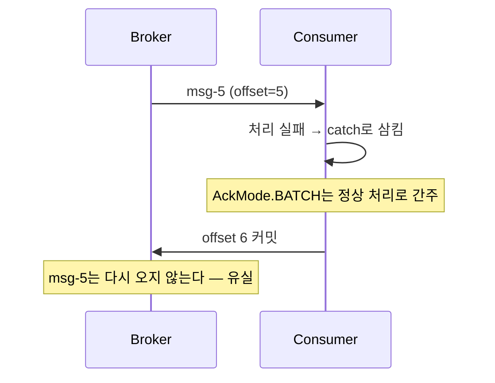
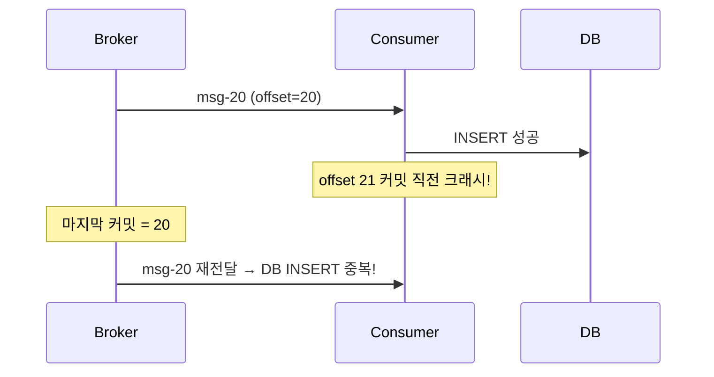

# II권 2장 — Consumer & Offset

> 앞: [Producer 보장](./01-producer.md) · 다음: [파티션 & 동시성](./03-partition-concurrency.md)

Producer가 "보냈다"를 1장에서 봤다면, 이 장은 Consumer가 "처리했다"를 어떻게 **증명(커밋)**하느냐다 — 그 시점을 잘못 잡으면 멀쩡한 코드가 메시지를 잃거나 두 번 처리한다.

offset 커밋·`__consumer_offsets`의 원리는 → [I권 조정](../1-internals/05-coordination.md).

---

## 2.1 예외를 삼키면 안전한가 — `AckMode.BATCH`의 유실

`@KafkaListener`에서 예외가 터졌다. 서비스가 죽으면 안 되니 try-catch로 감싸고 로그만 남겼다.

```java
@KafkaListener(topics = "order-events")
void onMessage(String message) {
    try { orderService.process(message); }
    catch (Exception e) { log.error("처리 실패: {}", message, e); }  // 삼킴
}
```

서비스는 안 죽었다. 그런데 메시지가 유실됐다.

**[고민]** *"예외를 try-catch로 삼켜 서비스를 살려두면 안전한 것 아닌가?"* — 서비스 생존만 보면 맞다. 그런데 삼킨 그 메시지는 어디로 갔나.

**[본질]** 예외를 삼키면 Spring Kafka는 "처리 완료"로 본다 — 기본 `AckMode.BATCH`는 poll로 가져온 레코드 *전부*가 정상 처리된 것으로 간주해 offset을 커밋하고, 다음 poll은 그다음 메시지부터 온다. 실패한 메시지는 영원히 다시 오지 않는다.



**[해결]** 예외를 *삼키지* 말고 **던져라.** 던지면 `DefaultErrorHandler`가 받아 재시도·DLQ로 보낸다(→ [에러 처리 & DLQ](./05-error-handling-dlq.md)). "어디서 커밋되느냐"의 코드 순서 함정은 → [코드 구조·순서의 함정](09-code-order-traps.md)(9.2).

**[증명]** [s02 `ConsumerAckModeTest`](../../../src/test/java/com/example/kafka/s02_consumer/README.md) 🧪 · **원리**(`__consumer_offsets`·committed offset) [I권 조정](../1-internals/05-coordination.md)

---

## 2.2 auto-commit은 더 위험 — Spring이 끄는 이유

native Kafka Consumer 기본값은 `enable.auto.commit=true`다 — `auto.commit.interval.ms`(기본 5초)마다, 다음 poll 때 이전 poll의 offset을 처리 성공 여부와 무관하게 자동 커밋한다. 처리 실패한 메시지의 offset까지 넘어간다.

그래서 Spring Kafka는 `enable.auto.commit`을 (명시하지 않으면) `false`로 둔다(2.3+) — auto-commit의 유실을 프레임워크 기본으로 차단한다(직접 `true`로 주면 유지된다).

**[증명]** `ConsumerAutoCommitTrapTest` 🧪

---

## 2.3 `AckMode` — 커밋 타이밍을 직접 정한다

auto-commit을 끄면 "언제 커밋할 것인가"를 `AckMode`로 정한다:

| AckMode | 커밋 시점 | 쓰임 |
|---------|----------|------|
| `BATCH`(기본) | poll 레코드 전부 처리 후 | 기본 — 단 2.1 함정 |
| `RECORD` | 레코드 하나마다 | 유실 범위 최소, 커밋 잦아 성능↓ |
| `MANUAL` | `acknowledge()` 후, 배치 전부 ack되면 **다음 poll 경계**(= BATCH 의미) | 수동 |
| `MANUAL_IMMEDIATE` | `acknowledge()` **즉시** | DB 커밋 성공 후 offset 커밋 패턴 |

> *"acknowledge() 했는데 왜 바로 커밋 안 되지?"* 의 정체는 대개 `MANUAL`(다음 poll)과 `MANUAL_IMMEDIATE`(즉시) 혼동이다.

**[증명]** `ConsumerAckModeTest` 🧪 · `AckMode`의 코드 순서(처리 전/후 커밋) → [코드 구조·순서의 함정](09-code-order-traps.md)(9.2)

---

## 2.4 manual에서도 중복은 난다 — at-least-once

유실을 막아도 반대 문제가 남는다.

**[고민]** *"커밋 타이밍을 직접 잡았으니 이제 깔끔한 것 아닌가?"* — 유실 쪽만 보면 맞다. 그런데 커밋 *직전*에 Consumer가 죽으면 어떻게 되나.

**[본질]** 커밋 전에 Consumer가 죽으면 같은 메시지를 다시 받는다. committed offset은 "**다음에 읽을 offset**"이다 — offset 21을 커밋해야 "20번까지 완료"이고, 그 커밋 직전 크래시면 마지막 커밋은 20에 머물러 20번이 재전달된다.



**[해결]** 이게 **at-least-once** — 유실은 없지만 중복은 가능하다. 막으려면 **Consumer 측 멱등 처리**(`event_id` UNIQUE 등). Producer 재시도·offset reset 모두 같은 메시지를 또 줄 수 있으니, **Consumer는 항상 at-least-once를 전제로** 짠다. (Kafka 내부 한정 EOS는 → [EOS & 트랜잭션](./06-eos-transactions.md), 외부 시스템은 멱등키.)

**[증명]** `ConsumerAutoCommitTrapTest` 🧪

---

## 2.5 `auto.offset.reset` — "왜 메시지가 안 와요?"

새 Consumer Group이 토픽을 구독하면 커밋된 offset이 없다.

**[고민]** *"새 그룹으로 토픽을 구독했는데 왜 메시지가 안 와요?"* — 커밋된 offset이 없으니 어디서부터 읽을지를 누군가 정해야 한다. 그 시작점은 무엇이 정하나.

**[본질]** 커밋된 offset이 없을 때 시작점을 `auto.offset.reset`이 정한다:

- **`latest`(기본)** — 구독 *이후* 메시지만. 그래서 **새 그룹은 과거 메시지를 안 읽는다** — *"왜 메시지가 안 와요?"* 의 가장 흔한 정체.
- **`earliest`** — 토픽 처음부터 전부(과거 데이터 적재·재처리).

**[해결]** 기본이 `latest`라는 점이 함정이다. 과거를 읽어야 하는 새 그룹이면 명시적으로 `earliest`.

**[증명]** `ConsumerOffsetResetTest` 🧪

---

## 2.6 `seek`/replay — 재처리, 단 멱등이 전제

운영 중 특정 시점부터 재처리해야 할 때:

- **`ConsumerSeekAware`·`seek(offset)`** — 코드에서 특정 offset으로 이동. `seekToBeginning`은 처음부터.
- 시각 기준 복구는 `offsetsForTimes()`로 timestamp → offset 변환("어제 17시 이후만").
- Consumer Group offset 일괄 변경(`AdminClient.alterConsumerGroupOffsets`, Group이 **Empty**여야 함)은 **운영 절차**라 → [III권 운영](../3-operations/README.md).

> ⚠️ **멱등 없이 replay하면 이미 처리한 메시지를 또 처리한다** — 포인트 2번 적립, 재고 2번 차감. 파티션 설계는 *순서*, 멱등 처리는 *replay 안전성* — 다른 문제다. replay 전에 Consumer 멱등(2.4)을 반드시 확인.

**[증명]** `ConsumerOffsetResetToolTest` 🧪

> **Consumer Lag**(= LEO − committed = 밀린 정도)의 *모니터링·판단·대응*(언제 컨슈머를 늘리나)은 운영이라 → [III권 모니터링](../3-operations/README.md). 처리 병렬성의 상한은 → [파티션 & 동시성](./03-partition-concurrency.md).

---

## 2.7 yml 정리

```yaml
spring.kafka.consumer:
  enable-auto-commit: false      # Spring이 강제 (2.2)
  auto-offset-reset: latest      # 기본 latest — 새 그룹 함정 (2.5). 과거 필요시 earliest
spring.kafka.listener:
  ack-mode: BATCH                # BATCH / RECORD / MANUAL / MANUAL_IMMEDIATE (2.3)
  type: single                   # batch 모드의 에러 함정은 → 코드 구조·순서의 함정 9.6
```

전체 인덱스·기본값 검증은 → [설정 레퍼런스](./10-config-reference.md).

---

← [II권 목차](./README.md) · 원리: [I권 조정](../1-internals/05-coordination.md) · 코드 순서: [9.2 commit 위치](./09-code-order-traps.md) · 증명: [s02](../../../src/test/java/com/example/kafka/s02_consumer/README.md)
