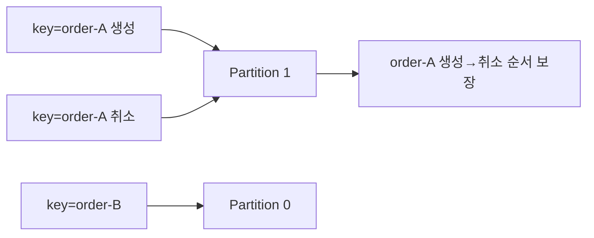
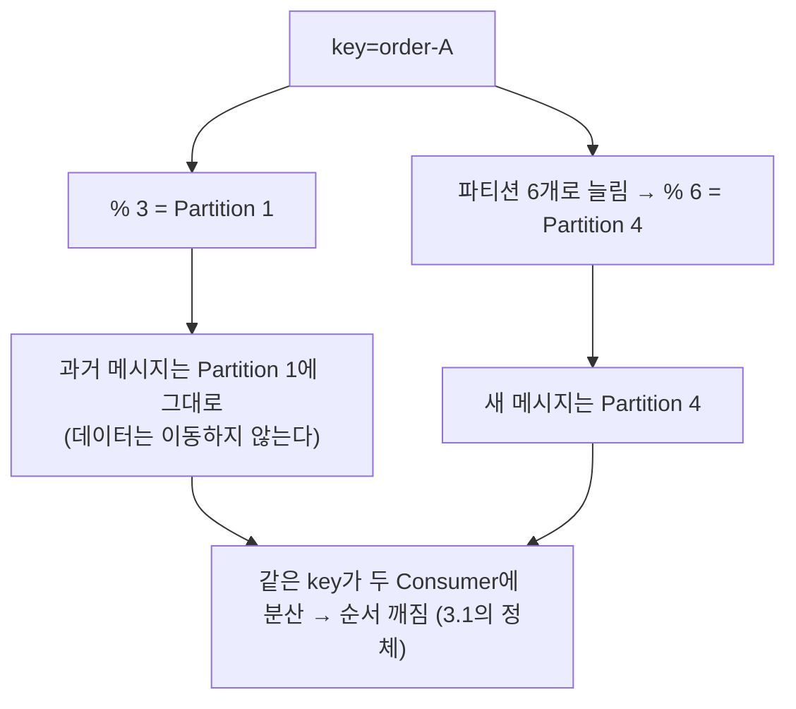

# II권 3장: 파티션 & 동시성

> 앞: [Consumer & Offset](./02-consumer-offset.md) · 다음: [리밸런싱 & 배포](./04-rebalancing.md)
>
> **보장/착각**: *"파티션을 늘리면 처리량이 오르니 좋은 것 아닌가?"*. 늘리는 순간 **key 매핑이 깨져 순서가 뒤섞인다.** 파티션·순서의 *원리*는 → [I권 멱등·순서](../1-internals/06-ordering-atomicity.md).

이 장은 *코드 제약*만 본다. **`concurrency × 인스턴스 ≤ 파티션`**, 그리고 key가 순서를 어떻게 좌우하는지. 파티션 수 *결정*·사이징은 운영이라 → [III권 토픽 설계](../3-operations/README.md).

---

## 3.1 파티션을 늘렸더니 순서가 깨졌다

트래픽이 늘어 파티션을 3→6, Consumer도 6대로 올렸다. 처리량은 2배가 됐다.

**[고민]** *"처리량은 2배가 됐는데 왜 같은 고객의 '주문 취소'가 '주문 생성'보다 먼저 처리되지?"*. 늘리기 전엔 없던 **"없는 주문을 취소?"** 에러다.

**[본질]** 파티션 수를 바꾸는 순간 key→파티션 매핑이 재계산되어, 같은 고객의 이벤트가 두 파티션·두 Consumer로 갈렸다. 같은 파티션 안에서만 보장되던 순서가 그 경계 밖으로 새어 나간 것이다.

**[해결]** 정체는 rekey다. 매핑 규칙(`murmur2(key) % 파티션수`)과 "데이터는 이동하지 않는다"는 사실이 만나 생긴 결과다. 메커니즘은 3.3에서 펼친다.

---

## 3.2 같은 key → 같은 파티션 (순서 보장의 핵심)

- **key 없이** 발행하면 분산된다. baseline 3.7 기본은 **strictly-uniform sticky**(`[KIP-794]`, 3.3+; `partitioner.class` 기본 `null`)라 **한 파티션에 `batch.size` 바이트가 쌓이면 다음 파티션으로 옮긴다**(2.4 원조 `[KIP-480]`은 *배치가 찰 때* 전환했고, 3.3+에서 바이트 기준으로 교체되며 `DefaultPartitioner`는 deprecated). 1장 `linger.ms`/`batch.size`와 직접 연결 → [클라이언트 런타임](../1-internals/09-client-runtime.md).
- **같은 key**면 기본 파티셔너가 `murmur2(key) % 파티션수`로 정한다. **같은 key는 항상 같은 파티션**, 파티션 내 순서가 보장되므로 같은 key 이벤트는 순서대로 처리된다.



> ⚠️ 이 순서 보장은 **같은 파티션을 단일 스레드로 처리할 때만** 성립한다(3.4 참고). 리스너 안에서 별도 스레드풀로 넘기면 같은 파티션도 동시 처리되어 깨진다.

**[증명]** [s03 Partition](../../../src/test/java/com/example/kafka/s03_partition/README.md) `PartitionKeyTest` 🧪

---

## 3.3 rekey 함정: 파티션 수를 바꾸면 매핑이 깨진다

`murmur2(key) % 파티션수`라는 한 줄에 함정이 숨어 있다.

**[고민]** *"파티션을 늘리면 기존 메시지도 새 규칙대로 재배치되는 것 아닌가?"*

**[본질]** **파티션수가 바뀌면 나머지 결과가 달라진다.** `murmur2("order-A") % 3 = 1`이던 게 `% 6 = 4`가 된다. 같은 key가 다른 파티션으로. 그런데 기존 파티션 데이터는 **이동하지 않는다**. 새 파티션은 비어서 시작하고, 이후 발행분만 새 규칙을 따른다. 그래서 같은 key가 두 Consumer에 갈려 순서가 깨진다.



**[해결]** **파티션은 늘릴 수만 있고 줄일 수 없다.** 그래서 *초기 수 결정·사이징·rekey를 감수할지*는 운영 판단이라 → [III권 토픽 설계](../3-operations/README.md). II권의 결론은 하나: **운영 중 파티션 수 변경은 순서를 깬다.**

**[증명]** `PartitionRekeyTest` 🧪

---

## 3.4 `concurrency × 인스턴스 ≤ 파티션`

하나의 파티션은 Consumer Group 내 **한 Consumer에게만** 배정된다. 그래서 **파티션 수가 병렬성의 상한**이다. Spring에서 Consumer를 늘리는 길은 둘:

1. **인스턴스를 늘린다**(Pod 여러 대, 같은 group)
2. **`concurrency`를 올린다**(한 인스턴스 안 Consumer 스레드 수, 기본 `1`)

```
파티션 6 · 인스턴스 1:
  concurrency=1 → 스레드 1개가 6파티션 순차 (병렬성 없음, 처리량 1/6)
  concurrency=6 → 스레드 6개 각 1파티션 (최대 병렬)
  concurrency=9 → 6개만 배정, 3개 IDLE
파티션 6 · 인스턴스 2 (concurrency=3): 총 스레드 6 = 파티션 6 (딱 맞음)
```

> **핵심: `concurrency × 인스턴스 수 > 파티션 수`면 IDLE 스레드가 생긴다**. 파티션 이하로 맞춘다. 그리고 `concurrency>1`이면 한 인스턴스가 여러 파티션을 **병렬** 처리하므로 **파티션 *간* 순서는 보장 안 됨**(같은 파티션 *내*만 보장).

**왜**(배타 배정·리밸런싱) → [I권 조정](../1-internals/05-coordination.md) · 배포 시 리밸런싱은 → [리밸런싱 & 배포](./04-rebalancing.md).

**[증명]** `PartitionConsumerTest` 🧪

---

## 3.5 key 설계: 공유 자원 기준, 그리고 Hot Partition

key는 **충돌하는 공유 자원** 기준으로 잡는다. 선착순 쿠폰이면 key는 `userId`가 아니라 `couponId`. 같은 쿠폰 요청이 한 파티션·한 스레드로 가 **동시성 문제를 락이 아니라 설계로 제거**한다.

단 특정 key에 트래픽이 몰리면 **Hot Partition**(한 파티션만 밀림)이 된다. 이를 푸는 **Key Sharding(글로벌 순서 희생 ↔ 분산)·Redis 선차단** 같은 *이벤트 설계*는 II권 범위 밖이다 → messaging-lab. 토픽 사이징·rack은 → [III권 토픽 설계](../3-operations/README.md).

---

## 3.6 yml 정리

```java
@Bean NewTopic orderEvents() {              // 토픽 프로비저닝(메커니즘만, 정책은 III권)
    return TopicBuilder.name("order-events").partitions(6).replicas(3).build();
}
```
```yaml
spring.kafka.listener:
  concurrency: 3        # 인스턴스당 Consumer 스레드 (기본 1). concurrency × 인스턴스 ≤ 파티션 (3.4)
```

> 파티션 수 결정·`replicas`/`min.insync.replicas`·운영 중 변경 절차는 → [III권](../3-operations/README.md). 전체 설정 인덱스는 → [설정 레퍼런스](./10-config-reference.md).

---

← [II권 목차](./README.md) · 원리: [I권 멱등·순서](../1-internals/06-ordering-atomicity.md)·[조정](../1-internals/05-coordination.md) · 사이징: [III권](../3-operations/README.md) · 증명: [s03](../../../src/test/java/com/example/kafka/s03_partition/README.md)
