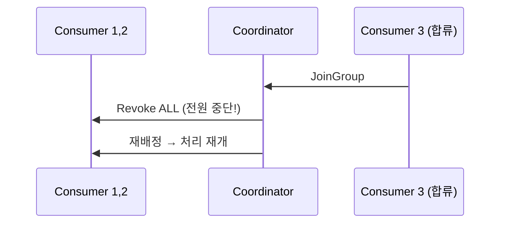

# II권 4장 — 리밸런싱 & 배포

> 앞: [파티션 & 동시성](./03-partition-concurrency.md) · 다음: [에러 처리 & DLQ](./05-error-handling-dlq.md)
>
> **보장/착각**: *"Consumer를 롤링 배포하면 왜 순간적으로 멈추나?"* — 기본 프로토콜이 **전부 멈추고 다시 나누기** 때문. Group Coordinator·리밸런싱의 *원리*는 → [I권 조정](../1-internals/05-coordination.md).

이 장은 **리밸런싱을 *회피*하는 코드**(cooperative·static)와 **퇴출을 피하는 타이밍**이다. 트리거 전수·운영 대응은 → [III권 리밸런싱 운영](../3-operations/README.md).

---

## 4.1 롤링 배포 시 왜 멈추나 — Eager

3대가 6파티션을 나눠 처리 중, 배포로 한 대를 내리는 순간 **나머지 2대도 처리를 멈췄다.** 이게 **Eager 리밸런싱** — 그룹에 변경이 생기면 **모든 파티션을 revoke하고 다시 배분**한다(Stop-the-World). `RangeAssignor`·`RoundRobinAssignor`가 이 방식이다.



C3이 합류했을 뿐인데 C1·C2가 갖던 파티션을 전부 반납한다 — 어차피 돌려받을 것도.

- **증명** → [s04 Rebalancing](../../../src/test/java/com/example/kafka/s04_rebalancing/README.md) `RebalancingEagerVsCooperativeTest` 🧪

---

## 4.2 Cooperative — 이동 파티션만 옮긴다

`CooperativeStickyAssignor`는 **실제 이동이 필요한 파티션만** revoke하고 나머지는 계속 처리한다(2라운드 동작: 1라운드 이동 대상만 revoke → 2라운드 assign). C3 합류 시 C1은 한 번도 안 멈추고, C2는 넘길 파티션만 잠깐 멈춘다.

- **증명** → `RebalancingEagerVsCooperativeTest` 🧪

---

## 4.3 프로토콜 3세대

| 세대 | 프로토콜 | 처리 중단 |
|------|---------|----------|
| 1 | **Eager** (Range·RoundRobin) | 전체 멈춤 |
| 2 | **Cooperative** (CooperativeSticky) | 이동 파티션만 잠깐 |
| 3 | **KIP-848** (서버 주도, Kafka 4.0) | Stop-the-World 제거 → [I권 조정](../1-internals/05-coordination.md) |

> Kafka 3.0+ 기본 `partition.assignment.strategy`는 `[RangeAssignor, CooperativeStickyAssignor]` — 그룹 전원이 cooperative를 지원하면 자동 전환된다. **신규 프로젝트는 `CooperativeStickyAssignor`만 명시**가 깔끔.

---

## 4.4 Static Membership — 재접속해도 리밸런싱 없이

Dynamic(기본)은 재접속할 때마다 새 멤버로 보고 리밸런싱한다. **`group.instance.id`** 를 주면 **Static Membership** — 같은 ID로 재접속하면 갖던 파티션을 리밸런싱 없이 돌려받는다. K8s에선 `${HOSTNAME}`(Pod 이름)이 일반적이다.

- **왜** → [I권 조정](../1-internals/05-coordination.md) (static membership·`group.instance.id`)
- **증명** → `StaticMembershipTest` 🧪

---

## 4.5 퇴출은 두 메커니즘 — 타이밍 3박자

"죽었다" 판정은 **두 축**이고, 정의(`heartbeat`<`session`≪`max.poll.interval`의 순서 관계)는 [설정 조합의 함정](08-config-combination-traps.md)(8.3)이 SSOT다:

- **`session.timeout.ms`(기본 45초)** — heartbeat 스레드가 이 안에 신호를 못 보내면 퇴출(프로세스 죽음·네트워크 단절 감지).
- **`max.poll.interval.ms`(기본 5분)** — poll 간격이 이를 넘으면 퇴출(프로세스는 살아 있지만 **처리가 느린** 경우).

처리 지연으로 퇴출되면 offset이 커밋 안 돼 다른 Consumer가 **중복 처리**한다. 조정 공식: `1건 처리시간 × max.poll.records < max.poll.interval.ms` — `max.poll.records`를 줄여 poll 간격을 좁힌다. 리스너 안 blocking이 이 퇴출을 부르는 코드 함정은 → [코드 구조·순서의 함정](09-code-order-traps.md)(9.3).

- **증명** → `MaxPollIntervalTest` 🧪

---

## 4.6 graceful shutdown & 리밸런싱 중복

리밸런싱 도중 *처리 완료·커밋 직전*에 파티션이 넘어가면 중복이 난다. Spring 동작:

| 종료 방식 | 중복 |
|----------|------|
| **정상 종료**(graceful·SIGTERM) | Spring이 `onPartitionsRevoked`에서 pending offset을 자동 커밋 → 거의 없음 |
| 비정상(crash·OOM)·session timeout | 커밋 기회 없음 → 생길 수 있음 |

> 종료 시 in-flight 드레이닝·`SIGTERM` 정책 등 **운영 절차**는 → [III권 운영](../3-operations/README.md). II권은 "정상 종료면 Spring이 pending을 커밋한다"는 코드 동작까지.

중복의 진짜 1순위는 리밸런싱이 아니라 **at-least-once 재전달**(처리 후 커밋 전 crash, → [Consumer & Offset](./02-consumer-offset.md) 2.4)이다. Outbox 릴레이 중복까지 — 원인이 뭐든 **`event_id` UNIQUE 하나로 막힌다**(멱등이 범용 해법). Outbox 설계 자체는 → messaging-lab.

---

## 4.7 yml 정리

```yaml
spring.kafka.consumer.properties:
  partition.assignment.strategy: org.apache.kafka.clients.consumer.CooperativeStickyAssignor
  group.instance.id: ${HOSTNAME}     # static membership (4.4)
  session.timeout.ms: 45000          # heartbeat 퇴출 (4.5)
  heartbeat.interval.ms: 3000        # session의 1/3 이하
  max.poll.interval.ms: 300000       # 처리 지연 퇴출 (4.5)
  max.poll.records: 500              # 1건 처리시간 × 이 값 < max.poll.interval
```

타이밍 세 설정의 *순서 관계*는 [8.3](./08-config-combination-traps.md)이 SSOT · 기본값 검증은 → [설정 레퍼런스](./10-config-reference.md).

---

← [II권 목차](./README.md) · 원리: [I권 조정](../1-internals/05-coordination.md) · 타이밍: [8.3](./08-config-combination-traps.md) · 운영: [III권](../3-operations/README.md) · 증명: [s04](../../../src/test/java/com/example/kafka/s04_rebalancing/README.md)
