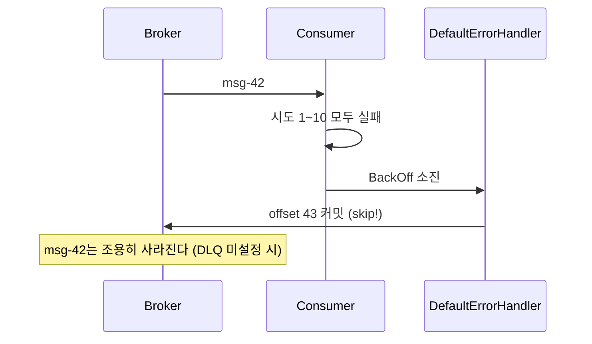

# II권 5장 — 에러 처리 & DLQ

> 앞: [리밸런싱 & 배포](./04-rebalancing.md) · 다음: [EOS & 트랜잭션](./06-eos-transactions.md)
>
> **보장/착각**: *"Spring Kafka 기본 에러 핸들러가 DLQ로 보내주는 것 아닌가?"* — **아니다. 기본은 N회 후 skip(버림)이다.** 에러 처리는 II권 고유 영역(`DefaultErrorHandler`)이라 I권 원리에 직접 대응이 없다 — 재처리 중복 방어 원리만 → [I권 멱등·순서](../1-internals/06-ordering-atomicity.md).

---

## 5.1 기본 핸들러는 DLQ가 아니라 skip이다

예외가 터지고 재시도가 소진됐다. *"DLQ로 가겠지?"* — `DefaultErrorHandler`의 기본 BackOff는 **`FixedBackOff(0L, 9)`** 다 `[code @spring-kafka 3.3]`. 0ms 간격 9회 재시도 = **총 10회** 시도 후, 실패하면 **메시지를 버리고 offset을 커밋**한다(로그만). DLQ로 안 보낸다.



설정 없이 운영하면 실패 메시지가 **조용히 사라진다** — 로그를 안 보면 유실된 줄도 모른다.

- **증명** → [s05 DLQ](../../../src/test/java/com/example/kafka/s05_dlq/README.md) `DefaultErrorHandlerTrapTest` 🧪

---

## 5.2 모든 예외를 재시도하지는 않는다 — non-retryable 분류

`DefaultErrorHandler`는 **non-retryable로 분류된 예외는 재시도 없이 즉시** skip/DLQ한다 — `DeserializationException`·`ClassCastException`처럼 **재시도해도 같은 결과**인 것들. *"10회 재시도하겠지"* 했는데 역직렬화 에러는 1회에 끝나는 게 이 때문이다. `addNotRetryableExceptions()`/`addRetryableExceptions()`로 분류를 커스터마이징한다.

> ⚠️ 역직렬화 실패는 **리스너에 들어오기도 전**(컨버터 단계)에 터져, `ErrorHandlingDeserializer`로 감싸지 않으면 `DefaultErrorHandler`가 *받지도 못하고* 무한 재폴링(poison-pill)한다 — 정의는 → [직렬화 & 스키마 진화](./07-serialization.md). **retry↔DLQ의 순서·분류 함정**의 깊은 분석은 → [코드 구조·순서의 함정](09-code-order-traps.md)(9.1).

- **증명** → `DefaultErrorHandlerTrapTest` 🧪

---

## 5.3 DLQ 설정 — `DeadLetterPublishingRecoverer`

DLQ로 보내려면 **명시적으로** recoverer를 등록한다:

```java
@Bean
DefaultErrorHandler errorHandler(KafkaTemplate<String, String> template) {
    var recoverer = new DeadLetterPublishingRecoverer(template);
    return new DefaultErrorHandler(recoverer, new FixedBackOff(1000L, 2));  // 1+2=3회 후 DLT
}
```

실패 메시지가 `{원본토픽}.DLT`로 이동하고, **원본 토픽·파티션·offset·예외 정보가 헤더에** 담긴다(원인 분석·재처리용). 일시 장애엔 `FixedBackOff` 대신 `ExponentialBackOffWithMaxRetries`로 간격을 늘려 회복 시간을 준다.

> ⚠️ 운영 브로커는 보통 `auto.create.topics.enable=false`라 **DLT 토픽을 미리 만들어야** 한다 — 없으면 DLQ 발행 자체가 실패한다. 토픽 프로비저닝 메커니즘은 [파티션 & 동시성](./03-partition-concurrency.md)(`NewTopic`).

- **증명** → `DefaultErrorHandlerTrapTest` 🧪

---

## 5.4 DLT를 방치하면 DLQ가 없는 것과 같다

DLT로 보내는 건 시작일 뿐 — **별도 Consumer가 모니터링·재처리**해야 한다. DLT 메시지 *알림(Slack/PagerDuty)·재발행·retention·건수 메트릭* 같은 **운영**은 → [III권 모니터링·운영](../3-operations/README.md). II권은 "DLT로 보낸다"는 코드까지.

---

## 5.5 yml 정리

```yaml
# DefaultErrorHandler 기본 = DLQ 없음, FixedBackOff(0,9)=총 10회 후 skip (5.1)
# DLQ는 코드로 Bean 등록: DefaultErrorHandler(DeadLetterPublishingRecoverer, BackOff) (5.3)
# DLT 토픽은 auto.create.topics.enable=false면 미리 생성 (NewTopic) — 3장
```

전체 설정 인덱스는 → [설정 레퍼런스](./10-config-reference.md).

---

← [II권 목차](./README.md) · 원리(재처리 중복 방어): [I권 멱등·순서](../1-internals/06-ordering-atomicity.md) · 순서·분류 함정: [9.1](./09-code-order-traps.md) · 운영: [III권](../3-operations/README.md) · 증명: [s05](../../../src/test/java/com/example/kafka/s05_dlq/README.md)
