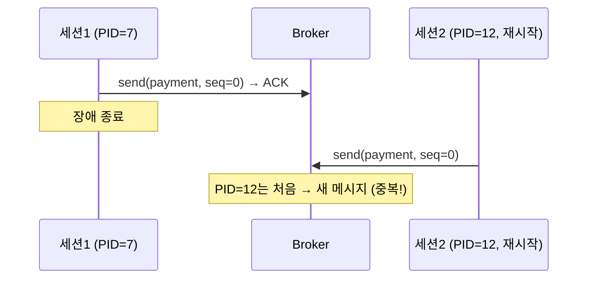
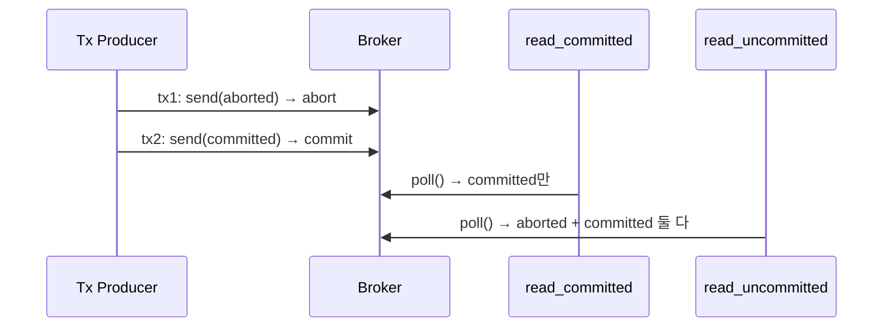
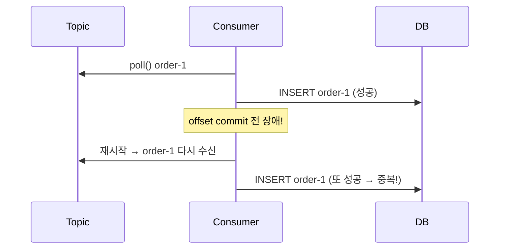

# II권 6장 — EOS & 트랜잭션

> 앞: [에러 처리 & DLQ](./05-error-handling-dlq.md) · 다음: [직렬화 & 스키마 진화](./07-serialization.md)
>
> **보장/착각**: *"Kafka가 Exactly-Once를 지원하니 중복 걱정 없는 것 아닌가?"* — **EOS는 Kafka 내부에서만 보장된다.** Consumer가 DB에 insert하는 순간 보장 밖이다. control record·LSO·EOS의 *원리*는 → [I권 트랜잭션·EOS](../1-internals/07-transactions.md).

---

## 6.1 EOS면 중복 없나 — Kafka 안과 밖

EOS를 켰으니 이제 중복도 유실도 없다고 정리하고 넘어가려는 순간이다.

**[고민]** *"Exactly-Once Semantics를 지원한다는데, 그러면 컨슈머가 DB에 쓰는 것까지 한 번만 처리되는 것 아닌가?"*

**[본질]** EOS(Exactly-Once Semantics)가 보장하는 건 **Kafka 내부의 원자성**이다. Kafka-to-Kafka 파이프라인(produce + offset commit을 한 트랜잭션)에선 exactly-once다.

**[해결]** 그러나 **Consumer가 외부 시스템(DB)에 쓰는 건 보장 밖**이다(6.4). 이 경계가 이 장의 전부다.

**[증명]** [s06 EOS](../../../src/test/java/com/example/kafka/s06_eos/README.md)의 `EOSBoundaryTest`(Kafka 안/밖 경계) 🧪 · **원리** [I권 트랜잭션·EOS](../1-internals/07-transactions.md)

---

## 6.2 멱등 프로듀서 — 세션 한정

멱등 프로듀서가 기본 ON이니, 중복은 이제 브로커가 알아서 막아준다고 믿기 쉽다.

**[고민]** *"멱등 프로듀서가 켜져 있으면 어떤 중복이든 브로커가 걸러주는 것 아닌가?"*

**[본질]** 멱등 프로듀서(3.0+ 기본 ON)는 네트워크 재시도 중복을 브로커가 **PID + sequence**로 감지해 막는다. 단 **같은 세션(같은 PID) 내, 재시도 중복만**이다.

**[해결]** 애플리케이션이 같은 내용을 두 번 `send()`하는 건 못 막고, **Producer가 재시작하면 새 PID라 이전 seq를 잊어 중복 저장**된다. 세션 밖 중복은 멱등 프로듀서의 책임이 아니다.



- **원리**(PID·epoch·sequence) → [I권 멱등·순서](../1-internals/06-ordering-atomicity.md) · **조합**(멱등 삼각형) → [설정 조합의 함정](08-config-combination-traps.md)(8.1)

**[증명]** [s06 EOS](../../../src/test/java/com/example/kafka/s06_eos/README.md) `IdempotentProducerTest` 🧪

---

## 6.3 트랜잭셔널 프로듀서 — 원자적 발행, `isolation.level` 짝

여러 발행을 원자적으로 묶으려고 프로듀서에 트랜잭션을 걸었다.

**[고민]** *"`beginTransaction()`으로 묶어 abort하면 컨슈머 쪽에서도 그 메시지는 안 보이는 것 아닌가?"*

**[본질]** `beginTransaction()` → `send()`×N → `commitTransaction()`으로 여러 발행을 원자적으로 묶는다. 커밋되면 전부 보이고 abort면 전부 안 보인다 — **단 Consumer `isolation.level`이 `read_committed`일 때만.**

**[해결]** `isolation.level` **기본값은 `read_uncommitted`** — 트랜잭션을 걸어놓고 컨슈머를 안 바꾸면 abort된 메시지까지 보여 트랜잭션이 무의미해진다. 프로듀서·컨슈머는 **짝**이다. 설정 키 **`transaction-id-prefix`**(트랜잭셔널 활성화)는 **인스턴스별 고유**여야 한다 — 같은 prefix가 겹치면 **zombie fencing**으로 옛 인스턴스가 차단된다(`tx-${HOSTNAME}-`). 트랜잭션을 쓰면 **멱등성은 자동으로 켜진다**(끄려 하면 `ConfigException`) — 이 조합 동작은 → [설정 조합의 함정](08-config-combination-traps.md)(8.4).



- **왜**(control record·LSO) → [I권 트랜잭션·EOS](../1-internals/07-transactions.md)

**[증명]** `TransactionalProducerTest` 🧪

---

## 6.4 EOS의 진짜 경계 — Kafka 안 vs 밖

offset까지 트랜잭션에 묶었으니 이제 컨슈머가 DB에 쓰는 것도 정확히 한 번이라고 결론짓고 싶다.

**[고민]** *"`sendOffsetsToTransaction()`으로 offset commit까지 한 트랜잭션에 넣었는데, 그래도 DB에 중복 insert가 날 수 있나?"*

**[본질]** `sendOffsetsToTransaction()`으로 produce + offset commit을 한 트랜잭션에 묶으면 **Kafka 내부는 exactly-once**다. 그러나 **Consumer가 DB에 insert하는 순간** 경계를 넘는다.



**[해결]** DB와 Kafka는 **다른 시스템**이라 한 트랜잭션으로 못 묶는다 — **EOS는 이걸 못 막는다.** 정석 해법 **Outbox 패턴**(같은 DB 트랜잭션에 이벤트 저장 → 별도 릴레이가 Kafka로)과 그 3단계 구현은 → [messaging-lab](../../../../messaging-lab/). `@Transactional`(DB) + Kafka를 한 메서드에 섞는 **코드 경계 함정**은 → [코드 구조·순서의 함정](09-code-order-traps.md)(9.5).

**[증명]** `EOSBoundaryTest` 🧪

---

## 6.5 Consumer 멱등키 — 최종 방어선

EOS 밖의 중복은 **Consumer가 직접 막는다** — `event_id` UNIQUE(또는 멱등 저장소 contains 체크). 원인이 재시도든 리밸런싱이든 Outbox 릴레이든, **같은 `event_id`로 두 번 오면 거부**된다(범용 해법).

> 설계 우선순위: 가능하면 **멱등 상태 전이**(같은 전이를 다시 적용해도 결과 같음 — 대기→완료 UPSERT)로, 불가하면 **이벤트 ID 기록 + 중복 체크**. 멱등 저장소(Redis TTL vs DB)·Outbox 릴레이 방식 같은 *이벤트 설계*는 → messaging-lab.

> **Producer-Consumer 비대칭**: Producer는 유실을 막으려 *공격적으로 재시도*(중복 허용), **Consumer가 멱등으로 안전하게** 만든다 — 그래서 end-to-end exactly-once *효과*를 얻는다. 이게 [Consumer & Offset](./02-consumer-offset.md)(2.4)의 "Consumer는 at-least-once를 전제로"와 같은 원칙이다.

**[증명]** `EOSBoundaryTest` 🧪

---

## 6.6 yml 정리

```yaml
spring.kafka.producer:
  transaction-id-prefix: tx-${HOSTNAME}-   # 트랜잭셔널 활성화 · 인스턴스별 고유(zombie fencing) (6.3)
  acks: all                                # 트랜잭션 필수(멱등 자동 ON)
spring.kafka.consumer.properties:
  isolation.level: read_committed          # 기본 read_uncommitted! 짝 필수 (6.3)
```

조합 동작(멱등 자동 ON·`ConfigException` 전환)은 [8.4](./08-config-combination-traps.md)·기본값은 → [설정 레퍼런스](./10-config-reference.md).

---

← [II권 목차](./README.md) · 원리: [I권 트랜잭션·EOS](../1-internals/07-transactions.md)·[멱등·순서](../1-internals/06-ordering-atomicity.md) · 조합: [8.4](./08-config-combination-traps.md) · 코드 경계: [9.5](./09-code-order-traps.md) · 증명: [s06](../../../src/test/java/com/example/kafka/s06_eos/README.md)
