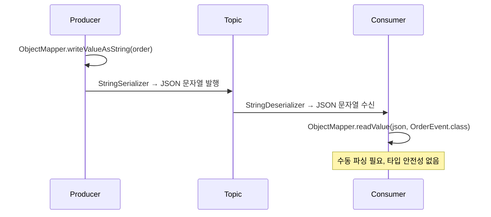
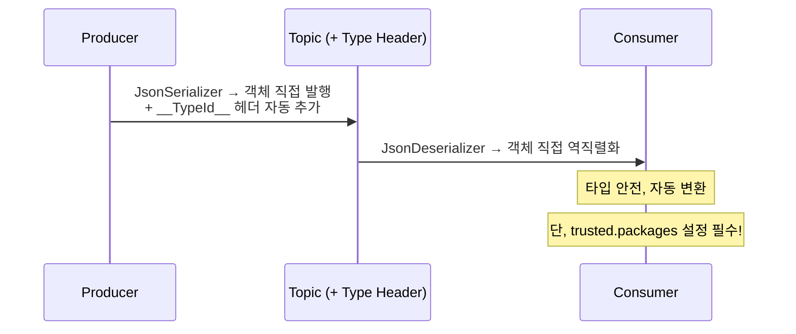
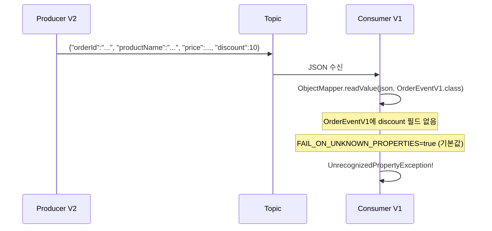
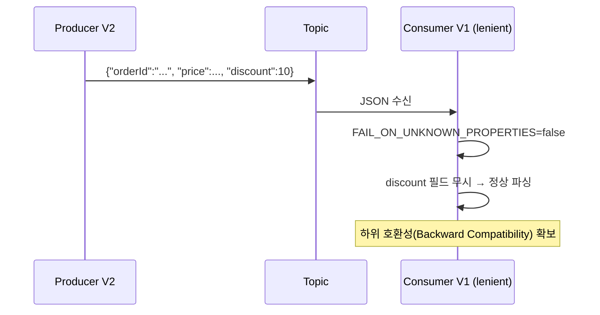
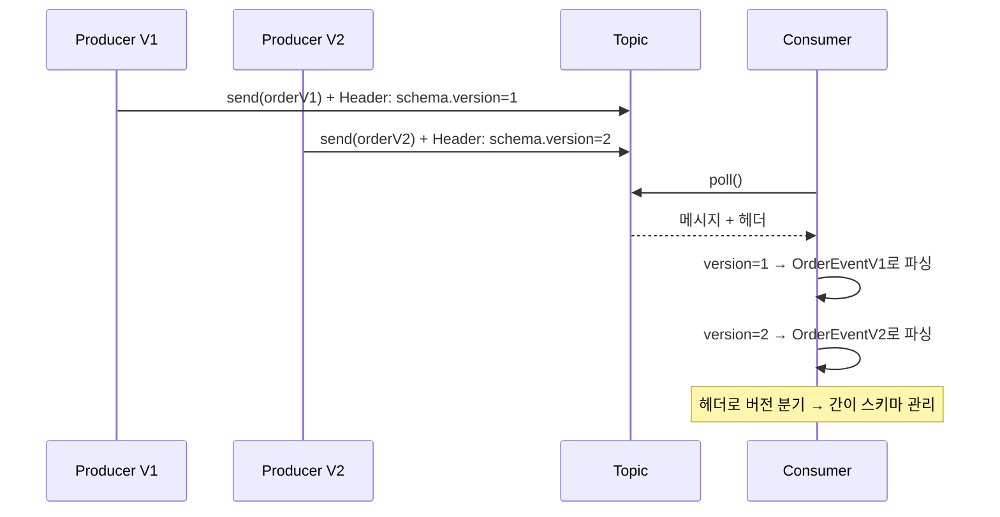

# Step 7 — Serialization & Schema Evolution

> **II권 7장** (Spring 코드 관점). JSON 직렬화·스키마 진화는 **II권 고유 영역**(Spring `JsonSerializer`·`@JsonIgnoreProperties`)이다. 중앙 스키마 관리(Avro/Schema Registry)는 → [IV권 Beyond Core](../../../../../../../docs/book/4-beyond-core/README.md).

---

## Producer가 필드를 하나 추가했는데 왜 Consumer가 죽는가?

Step 6에서 EOS의 경계와 Consumer 멱등키를 확인했다. 이제 메시지의 **구조** 자체에 집중한다.

주문 서비스 팀이 `OrderEvent`에 `discount` 필드를 추가해서 배포했다. 그런데 결제 서비스 Consumer가 `UnrecognizedPropertyException`으로 죽었다. Producer만 배포하고 Consumer는 아직 구버전이었다. **Jackson ObjectMapper의 기본값이 알 수 없는 필드를 거부하기 때문이다.**

이 Step에서는 JSON 직렬화의 동작과 함정, 그리고 스키마가 변할 때 어떻게 호환성을 유지하는지 확인한다.

---

## String vs JsonSerializer — 직렬화 방식의 선택

가장 단순한 방법은 StringSerializer로 JSON 문자열을 보내는 것이다. Consumer는 String으로 받아서 `ObjectMapper.readValue()`를 직접 호출한다.



> **JsonSerializerTest** — `String_직렬화로_JSON을_보내면_Consumer는_수동_파싱이_필요하다()`에서 확인.

Spring Kafka의 `JsonSerializer`/`JsonDeserializer`를 쓰면 객체를 직접 직렬화/역직렬화할 수 있다. 타입 헤더를 자동으로 추가하고, Consumer에서 자동 변환된다.



> **JsonSerializerTest** — `JsonSerializer로_객체를_직접_보내고_JsonDeserializer로_받을_수_있다()`에서 확인.

---

## trusted.packages 함정

`JsonDeserializer`는 보안을 위해 기본적으로 `java.util`, `java.lang` 패키지만 역직렬화를 허용한다. 커스텀 클래스를 역직렬화하려면 반드시 `trusted.packages`를 설정해야 한다. 설정하지 않으면 `IllegalArgumentException: not in the trusted packages`가 발생한다.

처음 JsonSerializer로 전환할 때 가장 흔하게 만나는 에러다.

> **JsonSerializerTest** — `trusted_packages를_설정하지_않으면_역직렬화가_거부된다()`에서 확인.

---

## 스키마 진화 — 필드 추가와 하위 호환성

이제 본론이다. Producer가 V2(필드 추가)로 업그레이드했는데 Consumer는 아직 V1이다.



ObjectMapper의 기본값은 `FAIL_ON_UNKNOWN_PROPERTIES=true`다. V2의 `discount` 필드를 V1 DTO에서 인식하지 못하면 **예외가 발생한다.**

> **SchemaEvolutionTest** — `Producer가_필드를_추가하면_기존_Consumer는_역직렬화에_실패한다()`에서 확인.

해결은 간단하다. `FAIL_ON_UNKNOWN_PROPERTIES=false`로 설정하면 알 수 없는 필드를 무시한다.



> **SchemaEvolutionTest** — `FAIL_ON_UNKNOWN_PROPERTIES를_끄면_하위_호환성을_유지할_수_있다()`에서 확인.

반대 방향도 확인하자. V1 Producer가 보낸 메시지를 V2 Consumer가 읽으면? V2에 추가된 `discount` 필드는 JSON에 없으므로 기본값(0)으로 채워진다. 이것이 **상위 호환성(Forward Compatibility)**이다.

> **SchemaEvolutionTest** — `필수_필드가_없으면_기본값으로_채워진다()`에서 확인.

---

## 헤더 기반 버전 관리 — 간이 스키마 관리

Schema Registry 없이도 메시지 헤더에 `schema.version`을 넣으면 Consumer가 버전별로 다른 역직렬화 로직을 적용할 수 있다.



> **SchemaEvolutionTest** — `메시지_헤더에_스키마_버전을_넣어_호환성을_관리할_수_있다()`에서 확인.

> 실무에서는 토픽도 버저닝한다: `order-created.v0` → `order-created.v1`. 필드 추가(하위 호환)는 `FAIL_ON_UNKNOWN_PROPERTIES=false`로 대응 가능하지만, **필드 삭제나 타입 변경 같은 Breaking Change**는 새 토픽 버전으로 분리한다. Consumer 그룹이 기존 토픽과 새 토픽을 동시에 구독하며 점진적으로 마이그레이션하는 패턴이 일반적이다.

---

## yml 대응

```yaml
spring.kafka.producer:
  value-serializer: org.springframework.kafka.support.serializer.JsonSerializer

spring.kafka.consumer:
  value-deserializer: org.springframework.kafka.support.serializer.JsonDeserializer
  properties:
    spring.json.trusted.packages: com.example.*

spring.jackson.deserialization:
  fail-on-unknown-properties: false    # 하위 호환성 확보
```

---

## 스스로 답해보자

- StringSerializer로 JSON을 보내는 것과 JsonSerializer를 쓰는 것의 차이는?
- `trusted.packages`를 설정하지 않으면 왜 역직렬화가 거부되는가?
- Producer가 필드를 추가했을 때 기존 Consumer가 죽지 않으려면 어떤 설정이 필요한가?
- V1 Producer의 메시지를 V2 Consumer가 읽으면 새 필드는 어떻게 되는가?
- 필드 삭제나 타입 변경 같은 Breaking Change는 어떻게 대응하는가?
- Schema Registry 없이 버전 관리를 하려면?

> 답이 바로 나오면 [설정 조합의 함정](./08-config-combination-traps.md)으로 넘어가자.
> 막히면 `JsonSerializerTest`, `SchemaEvolutionTest`를 실행해서 확인하자.

---

## 다음으로

직렬화와 스키마 호환성을 해결했다. 다음은 개별 설정들이 **조합**될 때 터지는 함정이다 → [설정 조합의 함정](./08-config-combination-traps.md).

> DB 변경사항을 Kafka로 흘려보내는 파이프라인(Kafka Connect)·중앙 스키마 관리(Schema Registry)는 이 권의 범위가 아니다 → [IV권 Beyond Core](../4-beyond-core/README.md).
