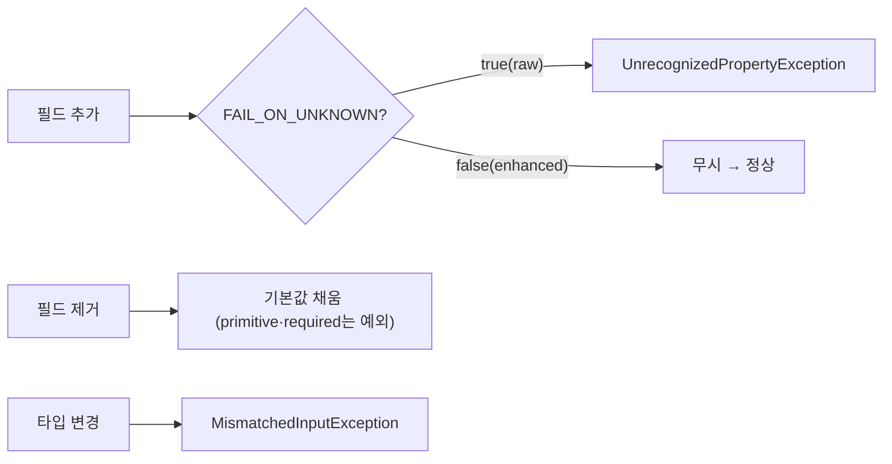

# II권 7장 — 직렬화 & 스키마 진화

> 앞: [EOS & 트랜잭션](./06-eos-transactions.md) · 다음: [설정 조합의 함정](./08-config-combination-traps.md)
>
> **보장/착각**: *"필드를 하나 추가했는데 왜 Consumer가 죽나?"* — **경로가 가른다.** StringDeserializer + 수동 `ObjectMapper`(Jackson raw)면 죽고, 기본 `JsonDeserializer`(`enhancedObjectMapper`)면 무시된다. 직렬화는 II권 고유 영역이라 I권 원리에 직접 대응이 없다. 중앙 스키마(Avro/Schema Registry)는 → [IV권](../4-beyond-core/README.md).

---

## 7.1 두 직렬화 경로 — String 수동 vs JsonSerializer

- **StringSerializer + 수동 `ObjectMapper`**: Producer가 `writeValueAsString`, Consumer가 `readValue()` 직접 호출. 타입 안전성 없음, 수동 파싱. **이 ObjectMapper는 `new ObjectMapper()`(raw)면 `FAIL_ON_UNKNOWN_PROPERTIES=true`.**
- **`JsonSerializer`/`JsonDeserializer`**: 객체를 직접 직렬화, `__TypeId__` 헤더 자동 추가, 자동 변환. 내부 ObjectMapper는 `JacksonUtils.enhancedObjectMapper()`.

- **증명** → [s07 Serialization](../../../src/test/java/com/example/kafka/s07_serialization/README.md) `JsonSerializerTest` 🧪

---

## 7.2 `trusted.packages` 함정

`JsonDeserializer`는 보안상 기본적으로 `java.util`·`java.lang`만 역직렬화를 허용한다. 커스텀 클래스는 **`trusted.packages`를 설정**해야 하고, 안 하면 `IllegalArgumentException: not in the trusted packages`. JsonSerializer로 처음 전환할 때 가장 흔히 만나는 에러다.

- **증명** → `JsonSerializerTest` 🧪

---

## 7.3 `FAIL_ON_UNKNOWN` 비대칭 — 경로마다 기본값이 다르다

핵심이다 — **같은 unknown field가 경로에 따라 죽기도, 무시되기도 한다** `[code @spring-kafka 3.3]`:

| 경로 | ObjectMapper | `FAIL_ON_UNKNOWN_PROPERTIES` | unknown field |
|------|-------------|------------------------------|---------------|
| StringDeserializer + 수동 | `new ObjectMapper()` (raw) | **`true`** | **죽는다** |
| `JsonDeserializer`(기본) | `enhancedObjectMapper()` | **`false`** | 무시 |

> ⚠️ **`spring.jackson.*`는 `JsonDeserializer`에 미적용**이다 — 그건 Spring Boot의 MVC용 ObjectMapper 빈을 만들 뿐, `JsonDeserializer`는 자체 `enhancedObjectMapper`를 쓴다. JsonDeserializer 동작을 바꾸려면 deserializer에 ObjectMapper를 직접 주입해야 한다. *"yml에서 `fail-on-unknown` 껐는데 왜 동작이 안 바뀌지?"* 의 정체.

---

## 7.4 스키마 진화 — 추가 / 제거 / 타입 변경

Producer와 Consumer 버전이 어긋날 때, 변경 종류마다 결과가 다르다(consumer 관점):

| 변경 | 결과 | 조건 |
|------|------|------|
| 필드 **추가**(V2 Producer → V1 Consumer) | `FAIL_ON_UNKNOWN`에 의존 | raw=`true`면 죽음 / `false`면 무시(하위 호환) |
| 필드 **제거**(V1 Producer → V2 Consumer) | 없는 필드는 **기본값**(`null`/0) — 보통 안전(상위 호환) | primitive·`required` 제약이면 예외 |
| **타입 변경**(예: `int`→`String`) | `MismatchedInputException` — **하드 브레이크** | 항상 |



> *추가/제거를 뭉뚱그리지 말 것* — 진짜 하드 브레이크는 **타입 변경**이고, 추가는 `FAIL_ON_UNKNOWN`이, 제거는 primitive·required 여부가 좌우한다.

- **증명** → `SchemaEvolutionTest` 🧪

---

## 7.5 `ErrorHandlingDeserializer` — poison-pill 차단

타입 변경·깨진 JSON 같은 **역직렬화 실패는 리스너에 들어오기도 전**(컨버터 단계)에 터진다. 그래서 `DefaultErrorHandler`가 **받지도 못하고**, offset이 안 넘어가 같은 레코드를 **무한 재폴링**한다(poison-pill — 파티션이 영구히 막힌다).

→ **`ErrorHandlingDeserializer`로 delegate를 감싸면** 실패를 *헤더로 옮겨* 리스너 진입을 허용하고, 그제야 `DefaultErrorHandler`/`DeadLetterPublishingRecoverer`가 DLT로 보낼 수 있다.

- **에러 처리 연결** → [에러 처리 & DLQ](./05-error-handling-dlq.md) · **순서·분류 함정** → [코드 구조·순서의 함정](09-code-order-traps.md)(9.1)

---

## 7.6 헤더 버전 관리 — Schema Registry 없이

메시지 헤더에 `schema.version`을 넣어 Consumer가 버전별 로직을 분기하는 **간이 스키마 관리**가 가능하다. 실무에선 토픽도 버저닝한다(`order-created.v0`→`v1`) — 필드 추가는 `FAIL_ON_UNKNOWN=false`로, **타입 변경·필드 삭제 같은 Breaking Change는 새 토픽 버전**으로 분리해 두 토픽을 동시 구독하며 점진 마이그레이션한다.

> **중앙 스키마 관리**(Avro/Protobuf + Schema Registry, 호환성 강제)는 II권 범위 밖이다 → [IV권 Beyond Core](../4-beyond-core/README.md).

- **증명** → `SchemaEvolutionTest` 🧪

---

## 7.7 yml 정리

```yaml
spring.kafka.producer:
  value-serializer: org.springframework.kafka.support.serializer.JsonSerializer
spring.kafka.consumer:
  value-deserializer: org.springframework.kafka.support.serializer.ErrorHandlingDeserializer  # poison-pill 차단 (7.5)
  properties:
    spring.deserializer.value.delegate.class: org.springframework.kafka.support.serializer.JsonDeserializer
    spring.json.trusted.packages: "com.example.*"   # (7.2)
# ⚠️ spring.jackson.* 는 JsonDeserializer에 미적용 (7.3) — JsonDeserializer는 enhancedObjectMapper(FAIL_ON_UNKNOWN=false) 사용
```

전체 인덱스는 → [설정 레퍼런스](./10-config-reference.md).

---

← [II권 목차](./README.md) · 중앙 스키마: [IV권](../4-beyond-core/README.md) · poison-pill: [9.1](./09-code-order-traps.md) · 증명: [s07](../../../src/test/java/com/example/kafka/s07_serialization/README.md)
