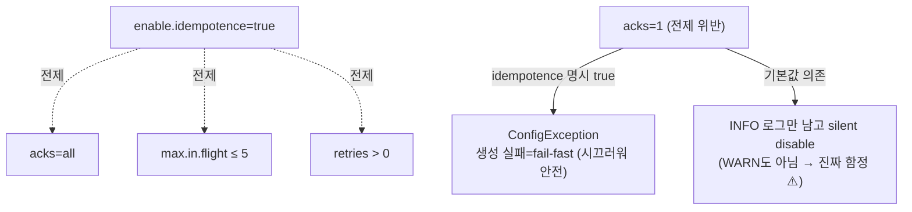

# II권 9장. 설정 조합의 함정

> 앞: [II권 목차](./README.md) · 다음: 10장 코드 구조·순서의 함정
>
> **이 장의 관점**: *개별 설정은 다 맞는데, 조합이 틀리면 장애가 난다. "설정 하나"가 아니라 "설정들의 상호작용"을 본다.*

본편(1~7장)이 "설정 하나하나의 의미"였다면, 이 장은 **여러 설정이 서로를 전제·강제·배신하는** 지점이다. 각 값은 문서상 valid인데, 조합이 깨지면 멱등성이 사라지거나 순서가 뒤집히거나 컨슈머가 퇴출된다. **왜 그렇게 되는가의 원리는 I권**에 있고, 여기서는 *Spring 설정에서 어떻게 깨지고 어떻게 막나*를 본다.

> **resilience4j 비유**: 개별 `retry`·`circuitbreaker`는 멀쩡한데 *조합·순서*가 틀리면 1번 실패를 N번 집계한다. Kafka 설정도 똑같다 — 개별 valid ≠ 조합 valid. (형제 [resilience4j-lab](../../../../resilience4j-lab/))

---

## 9.1 멱등성 삼각형 — `idempotence` × `acks` × `max.in.flight`

가장 흔한 함정. `enable.idempotence=true`는 **세 설정을 동시에 전제**한다:



- Kafka **3.0+부터 `enable.idempotence`가 기본 `true`** → 명시하지 않아도 이미 `acks=all`이 강제된다.
- 그래서 "나는 `acks` 설정 안 했는데 왜 all처럼 동작하지?"라는 혼란이 생긴다.
- 충돌 시 동작은 **두 갈래**로 갈린다:
  - **명시적으로 `enable.idempotence=true`를 켠 상태** + `acks=1` → **`ConfigException`으로 프로듀서 생성 자체가 실패(fail-fast)**. 시끄럽게 죽으므로 오히려 안전하다.
  - **기본값에 의존**(idempotence 미명시)하다 `acks=1`만 줌 → 예외는 안 나고 **멱등성이 비활성화**된다. 이때 `"Idempotence will be disabled because acks is set to 1, not set to 'all'."` 로그가 남지만 **`INFO` 레벨**이라 — WARN조차 아니라 — 기동 로그 수천 줄에 묻혀 아무도 못 본다. *그게 진짜 함정.* `[code @3.7]`
- ⚠️ 충돌 종류마다 로그 레벨이 다르다: `acks≠all`·`retries=0`은 **INFO**, `max.in.flight>5`는 **WARN**. 셋 중 **어느 하나만 어긋나도** silent disable된다.
- 그래서 `acks`를 명시할 때는 **멱등성도 함께 명시**하라(둘을 같이 박으면 충돌이 fail-fast로 드러난다). 운영에선 `"Idempotence will be disabled"` 로그를 알람에 걸어 침묵을 깬다.

**Spring 설정:**
```yaml
spring.kafka.producer:
  acks: all                 # 3.0+ 기본 idempotence=true가 이미 강제
  properties:
    enable.idempotence: true
    max.in.flight.requests.per.connection: 5   # 멱등이면 ≤5 강제
```

- **왜 이 조합인가** → [I권 멱등·순서](../1-internals/06-ordering-atomicity.md) (PID+epoch+sequence가 max.in.flight≤5에서만 순서·중복을 보장)
- **증명** → [s01 Producer](../../../src/test/java/com/example/kafka/s01_producer/README.md) `ProducerAcksTest`

> **짝 주의 — `acks=all`은 혼자선 내구성을 보장하지 못한다.** `acks=all`은 "**현재 ISR 전부**"의 ack인데, 토픽/브로커 `min.insync.replicas=1`(기본)이면 ISR이 리더 하나로 쪼그라든 순간에도 ack가 떨어진다 → 그 리더가 죽으면 **유실**. "acks=all이면 안전"이라는 client쪽 믿음이 깨지는 지점이다. 정석은 `acks=all` + `min.insync.replicas=2`(RF=3). 이건 **client × broker 경계를 넘는 조합**이라 이 장은 짚기만 하고 본문은 → [III권 의사결정 트리(CAP·PACELC)](../3-operations/10-config-decision-tree.md) · 원리 → [I권 복제](../1-internals/03-replication.md).

---

## 9.2 순서 역전 — `순서` × `retries` × `max.in.flight`

멱등을 *끄면* 새로운 함정이 열린다:

- 멱등 **off** + `max.in.flight > 1` + `retries > 0` → 앞 요청이 실패해 재전송되는 사이 뒤 요청이 먼저 기록되어 **순서가 뒤집힌다.**
- 멱등 **on**이면 `max.in.flight ≤ 5`까지 브로커가 sequence로 재정렬·거부해 순서를 지킨다.

→ "처리량 올리려고 `max.in.flight`를 키웠는데 순서가 깨졌다"의 정체. 순서가 필요하면 **멱등을 켜라**(끄고 `max.in.flight=1`은 처리량을 버린다).

- **왜** → [I권 멱등·순서](../1-internals/06-ordering-atomicity.md)
- **증명** → [s01 Producer](../../../src/test/java/com/example/kafka/s01_producer/README.md)

---

## 9.3 타이밍 3박자 — `heartbeat` × `session.timeout` × `max.poll.interval`

컨슈머 "살아있음" 판정은 **세 설정의 순서 관계**가 핵심이다:

```
heartbeat.interval.ms  <  session.timeout.ms  ≪  max.poll.interval.ms
   (하트비트 주기)         (이 안에 하트비트 없으면      (이 안에 poll 없으면
                            = 죽음 판정)                = 처리 지연으로 퇴출)
```

함정:
- `heartbeat.interval ≥ session.timeout` → 하트비트가 무의미(죽음 판정이 먼저).
- `max.poll.interval`이 처리 시간보다 짧음 → **멀쩡히 처리 중인데 퇴출**되어 리밸런싱 폭풍.
- "살아있음(heartbeat)"과 "처리 진행(poll 간격)"은 **다른 축**이다 — 둘을 분리해서 잡아야 한다.

**Spring 설정:**
```yaml
spring.kafka.consumer.properties:
  heartbeat.interval.ms: 3000
  session.timeout.ms: 45000
  max.poll.interval.ms: 300000     # 한 배치 처리에 걸리는 최대 시간보다 넉넉히
  max.poll.records: 500            # 처리가 느리면 줄여서 poll 간격을 좁힌다
```

- **왜** → [I권 조정](../1-internals/05-coordination.md) (5.7 타이밍 3박자 + heartbeat 백그라운드 스레드)
- **증명** → [s04 Rebalancing](../../../src/test/java/com/example/kafka/s04_rebalancing/README.md) `MaxPollIntervalTest`

---

## 9.4 트랜잭션 ↔ `isolation.level`

프로듀서만 트랜잭션으로 보호하고 **컨슈머를 안 바꾸면** 트랜잭션이 무의미해진다:

- 컨슈머 `isolation.level` 기본값은 **`read_uncommitted`** — 즉 abort된(롤백된) 메시지까지 다 읽는다.
- 트랜잭션을 쓰는데 abort 메시지를 거르려면 컨슈머를 **`read_committed`로 명시**해야 한다.

→ "프로듀서 트랜잭션 걸었는데 왜 롤백된 메시지가 보이지?"의 정체. **프로듀서·컨슈머는 짝**이다.

**Spring 설정:**
```yaml
spring.kafka:
  producer.transaction-id-prefix: tx-${HOSTNAME}-   # 인스턴스마다 달라야 함(정적값 복붙 금지 — 같으면 좀비 펜싱으로 서로 죽임). 예: tx-pod-a-
  consumer.isolation-level: read_committed
```

- **왜** → [I권 트랜잭션·EOS](../1-internals/07-transactions.md) (control record + LSO가 read_committed의 밑바닥)
- **증명** → [s06 EOS](../../../src/test/java/com/example/kafka/s06_eos/README.md) `TransactionalProducerTest`

---

## 9.5 정리 — 조합 체크리스트

| 조합 | 깨지는 조건 | 막는 법 | 원리 |
|------|------------|---------|------|
| 멱등 삼각형 | `idempotence=true`인데 `acks≠all`·`max.in.flight>5` | acks=all·≤5 유지 | [I권 멱등·순서](../1-internals/06-ordering-atomicity.md) |
| **내구성 짝** (client×broker) | `acks=all`인데 `min.insync.replicas=1` | min.isr=2 (RF=3) | [III권 10장](../3-operations/10-config-decision-tree.md) · [I권 복제](../1-internals/03-replication.md) |
| 순서 역전 | 멱등 off + `max.in.flight>1` + retry | 멱등 on | [I권 멱등·순서](../1-internals/06-ordering-atomicity.md) |
| 타이밍 3박자 | `heartbeat≥session` / `max.poll` 너무 짧음 | h < s ≪ m, `max.poll.records`↓ | [I권 조정](../1-internals/05-coordination.md) |
| 트랜잭션 짝 | 프로듀서만 txn, 컨슈머 `read_uncommitted` | 컨슈머 `read_committed` | [I권 트랜잭션](../1-internals/07-transactions.md) |

> 핵심: 이 네 가지는 **개별 설정 검증으로는 안 잡힌다.** 각 값이 문서상 valid라서, *조합* 단위로 봐야 보인다. `[docs @3.7]`

---

← [II권 목차](./README.md) · 원리 출처: [I권](../1-internals/README.md)
