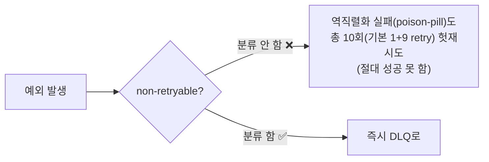
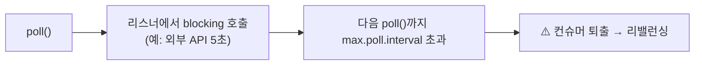

# II권 10장. 코드 구조·순서의 함정

> 앞: [9장 설정 조합의 함정](./09-config-combination-traps.md) · 다음: 11장 설정 레퍼런스
>
> **이 장의 관점**: *설정이 다 맞아도, 코드의 레이어 순서·위치가 틀리면 장애가 난다. 이건 I권(원리)도 III권(운영)도 못 잡는, 오직 코드에서만 보이는 함정이다.*

9장이 "설정들의 조합"이었다면, 이 장은 **코드의 순서·위치·경계**다. 같은 컴포넌트를 어느 순서로 두느냐, ack를 어디서 하느냐, blocking을 어디서 하느냐에 따라 멀쩡한 설정이 무너진다.

> **resilience4j 비유 (이 권의 핵심)**: `retry`가 앞단, `circuitbreaker`가 뒷단이면 — 1번 실패할 것을 retry가 N번 재시도하고, 그 N번이 *전부* 서킷에 집계되어 서킷이 잘못 열린다. **레이어 순서 하나가 전체 동작을 뒤집는다.** Kafka 에러 처리에도 똑같은 형태가 있다(10.1). (형제 [resilience4j-lab](../../../../resilience4j-lab/))

---

## 10.1 ErrorHandler — retry ↔ DLQ 순서, non-retryable 분류

가장 직접적인 "순서 함정". Spring의 `DefaultErrorHandler`는 **retry(BackOff) → 소진 후 DLQ(recoverer)** 순으로 동작한다. 문제는 **무엇을 재시도하면 안 되는지 분류**다:

- **역직렬화 실패(`DeserializationException`)** 같은 건 재시도해도 **절대 성공 못 한다(poison-pill).** 게다가 역직렬화는 **리스너에 들어오기도 전(컨버터 단계)** 에 터지므로, `ErrorHandlingDeserializer`로 감싸지 않으면 같은 레코드에서 무한 반복하며 컨슈머가 막힌다. 감싼 뒤에도 분류 안 하면 `DefaultErrorHandler` 기본 BackOff만큼(기본 **총 10회 = 1 + 9 retry**) 헛재시도하고 그제야 DLQ로 간다.
- 이게 정확히 resilience4j의 "retry-앞·서킷-뒤"와 같은 형태 — *재시도하면 안 되는 걸 재시도*해서 비용·지연·집계를 낭비한다.
- 해법: `addNotRetryableExceptions(...)`로 non-retryable을 분류 → 즉시 DLQ.

- **증명** → [s05 DLQ](../../../src/test/java/com/example/kafka/s05_dlq/README.md) `DefaultErrorHandlerTrapTest` (기본 동작은 DLQ가 아니라 10회 후 skip이라는 함정도 여기서)

---

## 10.2 commit 위치 — 처리 *전* vs *후*

offset을 **언제 커밋하느냐**가 유실/중복을 가른다:

| 순서 | 결과 |
|------|------|
| 처리 *전* commit → 처리 중 실패 | **유실** (이미 offset 넘어감) |
| 처리 *후* commit + 비멱등 처리 + 재시도 | **중복** (처리는 됐는데 commit 전 죽으면 재처리) |

- 안전한 기본은 **처리 후 커밋**(at-least-once). 그러면 중복 가능성이 남으므로 **처리를 멱등하게** 짜야 한다(멱등키).
- Spring `AckMode`(BATCH·RECORD·MANUAL)가 이 "커밋 시점"을 정한다 — 기본 BATCH에서 예외를 삼키면 offset이 커밋되어 **메시지가 영원히 유실**된다(본편 2장의 핵심 함정).

- **왜** → [I권 조정](../1-internals/05-coordination.md) (offset 커밋과 `__consumer_offsets`)
- **증명** → [s02 Consumer](../../../src/test/java/com/example/kafka/s02_consumer/README.md) `ConsumerAckModeTest`·`ConsumerAutoCommitTrapTest`

---

## 10.3 리스너 안 blocking → poll 초과 → 퇴출

리스너 메서드 안에서 **오래 걸리는 blocking 호출**(외부 API·DB·락 대기)을 하면:

- poll 루프는 **단일 스레드**다(→ [I권 클라이언트 런타임](../1-internals/09-client-runtime.md)). 리스너가 오래 막히면 다음 `poll()`이 늦어져 `max.poll.interval.ms`(9.3)를 넘기고 퇴출된다.
- 해법: 무거운 일은 **별도 executor로 넘기거나**, `max.poll.records`를 줄여 배치 처리 시간을 짧게.

- **왜** → [I권 클라이언트 런타임](../1-internals/09-client-runtime.md)(단일 poll 루프) + 9.3 타이밍
- **증명** → [s04 Rebalancing](../../../src/test/java/com/example/kafka/s04_rebalancing/README.md) `MaxPollIntervalTest`

---

## 10.4 `@RetryableTopic` — blocking vs non-blocking retry

재시도에는 두 종류가 있고, **혼용하면 중복 재시도**가 된다:

- **blocking retry**: 리스너 안에서 그 자리에서 재시도(ErrorHandler BackOff). 재시도 동안 그 파티션이 막힌다(10.3 위험).
- **non-blocking retry** (`@RetryableTopic`): 실패한 메시지를 **retry 토픽**으로 보내 나중에 재처리. 원래 파티션은 안 막힌다.
- 함정: 둘을 같이 켜면 같은 메시지가 양쪽에서 재시도되어 **재시도 횟수가 곱**해진다.

→ 하나를 선택하라. 처리량 민감하면 non-blocking, 순서 민감하면 blocking(단 10.3 주의).

---

## 10.5 `@Transactional`(DB) + Kafka 트랜잭션 경계

DB 트랜잭션과 Kafka 발행을 **한 메서드에 섞으면** 경계가 꼬인다:

- "DB 저장 + Kafka 발행"을 원자적으로 묶고 싶지만, **DB와 Kafka는 서로 다른 시스템**이라 하나의 트랜잭션으로 못 묶는다(분산 트랜잭션).
- DB commit 후 Kafka 발행 전에 죽으면 → 이벤트 유실. Kafka 발행 후 DB rollback이면 → 유령 이벤트.
- 정석 해법은 **Outbox 패턴**(DB에 이벤트도 같이 저장 → 별도 릴레이가 Kafka로). 단 **Outbox 설계는 이 lab 범위가 아니라 → messaging-lab.**

- **왜** → [I권 트랜잭션·EOS](../1-internals/07-transactions.md) (EOS는 Kafka 내부 한정, 외부 시스템은 멱등키/Outbox)
- 분산 트랜잭션 설계 → messaging-lab / saga-lab

---

## 10.6 정리 — 코드 순서 체크리스트

| 함정 | 잘못된 순서/위치 | 올바른 형태 |
|------|----------------|------------|
| ErrorHandler | non-retryable을 retry에 태움 | 분류 → 즉시 DLQ |
| commit 위치 | 처리 *전* 커밋 | 처리 *후* 커밋 + 멱등 처리 |
| 리스너 blocking | poll 루프에서 장시간 blocking | executor 위임 / `max.poll.records`↓ |
| retry 혼용 | blocking + non-blocking 동시 | 하나만 |
| 트랜잭션 경계 | DB+Kafka를 한 메서드에 | Outbox(→ messaging-lab) |

> 핵심: 이 함정들은 **설정 검증으로도, 단위 테스트로도 잘 안 잡힌다.** "코드를 어느 순서로 배치했나"의 문제라, 통합 시나리오에서만 드러난다 — 그래서 II권에만 있다.

---

← [9장 설정 조합의 함정](./09-config-combination-traps.md) · [II권 목차](./README.md) · 원리 출처: [I권](../1-internals/README.md)
