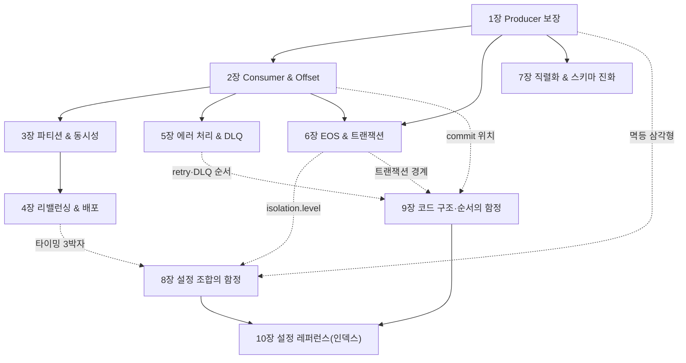

# 📙 II권 — Spring (코드로 어떻게 쓰는가)

> Spring Kafka로 **실제 코드를 어떻게 짜는가, 그리고 어디서 데이는가.**
> "설정 하나하나"가 아니라 **개별 설정 → 설정 조합 → 코드 구조·순서**의 세 층위로 함정을 깎는다.

> ⚠️ **이 README가 II권의 중심 작업판이자 단일 인덱스다.**
>
> 📐 집필 공통 규칙(README=인덱스 · SSOT 표 · 상태 2축 · 증명 모델 등)은 [전체 표지](../README.md)가 단일 진실이다 — 여기서 재서술하지 않는다.
> 특히 🔒 **불변식: 다른 장·권은 named link로만, 장/권 번호를 본문에 박지 말 것** (`(II권 8장)` ❌ → `[설정 조합의 함정](08-config-combination-traps.md)` ✅). 8장 결번·LSO 드리프트가 전부 이 위반에서 났다.

---

## 이 권의 역할 · Scope · 경계

**목적**: Spring Kafka로 **코드를 어떻게 짜고 어디서 데이나**. 각 설정이 *무엇을 보장하는지*는 [I권](../1-internals/README.md)으로 거슬러 올라가고, 여기서는 *프레임워크 코드·설정에서 어떻게 쓰고 어디서 깨지나*를 본다.

**한 문장**: *"Spring Kafka 코드와 설정의 사용법, 그리고 그 함정."*

### 다룬다 (Scope)
- Producer / Consumer / Listener 코드·설정 (기존 Step `s01~s07` 재료)
- **설정 조합 함정** · **코드 구조·순서 함정** (횡단편 신규)
- 직렬화·스키마 진화 (Spring `JsonSerializer` 한정 — 중앙 스키마는 IV권)

### 다루지 않는다 (Out of Scope)
| 주제 | 가야 할 곳 |
|------|-----------|
| 내부 원리(보장·알고리즘·"왜") | **I권 Internals** |
| 운영 절차·사이징·모니터링·장애 대응·**보안(SASL/SSL/ACL)** · 설정 trade-off 판단 | **III권 Operations** |
| Kafka Connect / CDC / Schema Registry / Streams | **IV권 Beyond Core** |
| 이벤트 설계 · Outbox · Saga | messaging-lab / saga-lab |

> 🤖 **이 권을 작업하는 AI/작업자에게**: "왜 그런가"는 [I권](../1-internals/README.md), "어떤 값이 유리한가"는 [III권](../3-operations/README.md)에 **링크만** 남기고, 여기서는 **코드 관점만** 깎는다.
> **결정 규칙**: correctness가 변하면 I권, 트레이드오프만 변하면 III권.

---

## 함정의 세 층위 (이 권을 깎는 틀)

함정은 "설정 하나 잘못 넣는 것"만이 아니다. 더 무서운 건 **개별로는 맞는데 조합·순서가 틀린 것**이다.

> **resilience4j 비유**: 개별 `retry`·`circuitbreaker`는 멀쩡한데 *조합·순서*가 틀리면 1번 실패를 N번 집계한다. Kafka도 똑같다 — **개별 valid ≠ 조합 valid ≠ 올바른 코드 배치**. (상세 → [코드 구조·순서의 함정](09-code-order-traps.md). 형제 [resilience4j-lab](../../../../resilience4j-lab/))

각 본편 장은 ①②를, 횡단편은 ②③을 정면으로 다룬다.

상태 범례 — **2축**:
- **[산문]** ✅ 작성 완료 · 🚧 옛 Step 복제본(II권 톤으로 재산문화 대기) · 📝 아웃라인
- **[executable 증명]** 본편=🧪 기존 Step 테스트 있음 · 횡단편=⬜ 미구현(본편 테스트를 링크로 참조)
- 읽는 법: `NN장` 헤더의 마커(🚧/✅)는 **[산문]** 축, 불릿 끝 🧪/⬜는 **[증명]** 축이다.

> **증명 모델** — II권의 증명은 **Spring Kafka 통합 테스트**다. I권의 `docker`/CLI 자체증명과 달리 **프레임워크에 의존**한다 — 그래서 이 권에 속한다.
> - **본편(1~7장)**: 각 장의 증명은 기존 **Step 테스트**(`src/test/.../sNN_*`)가 담당한다.
> - **횡단편(8~10장)**: 자체 테스트는 ⬜ 미구현, 본편 Step 테스트를 링크로 참조한다.

> 🔒 **본문 정본(SSOT)은 `docs/book/2-spring/NN-*.md`다.** `src/test/.../sNN_*/README.md`는 **테스트 실행 가이드**로 보존하되(삭제 안 함), 책 본문이 아니다. 같은 산문을 두 곳에 두지 않는다(드리프트 차단).

---

## 장 간 의존 (전체 점검용)

> 이 그래프는 **장→장 거시 의존(대표 엣지만)**이다. 설정 *단위*의 정의 위치는 아래 **SSOT 표가 유일한 진실** — 전체 ②③ 매핑은 8·9장 본문이 SSOT다.

### 교차 요소 SSOT — "정의 위치"의 단일 진실

> 같은 설정이 여러 장에 걸칠 때, **정의(의미) 위치는 이 표가 유일한 진실**이다.
> 본문·그래프는 정의 위치를 **재서술하지 말고 이 표를 따른다**(인라인 `(N장 정의)` 금지 — 드리프트의 근원). 표와 산문이 어긋나면 *산문 기준으로 표를 고친다*.

| 요소 | 정의 위치 | 주 사용처 |
|------|----------|-----------|
| `acks` (의미) | **1장** | 1·8·10장 |
| 멱등 삼각형 (`idempotence` × `acks` × `max.in.flight`) | **8장** (8.1) | 1·8·10장 |
| 내구성 짝 (`acks=all` × `min.insync.replicas`, client×broker) | **8장** (8.5) | 1·8장 (+ → III권 결정 트리·I권 복제) |
| `AckMode` / offset 커밋 시점 | **2장** | 2·9·10장 |
| 타이밍 3박자 (`heartbeat`<`session`≪`max.poll.interval`, + `max.poll.records`) | **8장** (8.3) | 4·8·9·10장 |
| `concurrency` / 파티션 ↔ 동시성 상한 | **3장** | 3·9·10장 |
| `DefaultErrorHandler` (retry↔DLQ, non-retryable 분류) | **5장** | 5·9장 |
| `@RetryableTopic` (non-blocking retry) | **9장** (9.4) | 9·10장 |
| `transactional.id` / `transaction-id-prefix` (좀비 펜싱 · 멱등 자동 활성) | **6장** | 6·8장 |
| `isolation.level` (read_committed 짝) | **6장** | 6·8·10장 |
| 스키마 진화 (`FAIL_ON_UNKNOWN_PROPERTIES`) | **7장** | 7장 (중앙 스키마는 IV권) |

---

# 목차 + 각 장 아웃라인

> 본편(1~7장)은 컴포넌트별 — 정본 `0N-*.md`는 현재 옛 Step README 복제본이며 **II권 톤·인용규율로 재산문화 대기(🚧)**. 횡단편(8~10장)은 신규 산문(✅).

## 본편 — 컴포넌트별 (개별 설정 → 그 보장)

> 본편은 **1→7 순서로 읽되**, 위 의존 그래프는 특정 장을 다시 펼칠 때의 **재방문 지도**다(읽기 순서가 아니라 참조 지도).

### 1장 — Producer 보장   🚧 [01-producer.md](./01-producer.md)

> 보장/착각: *"acks=all이면 안전한가?"* — acks·idempotence가 **무엇까지** 보장하는지.

- `acks` 0/1/all 의미 · `enable.idempotence`(3.0+ 기본 true) · `ProducerFactory`/`KafkaTemplate` 골격
- 내구성 짝: `acks=all`은 단독으론 부족 — 정의는 → [설정 조합의 함정](08-config-combination-traps.md)(8.5), 운영 판단 → [III권 의사결정 트리](../3-operations/10-config-decision-tree.md)
- 증명 → [s01 Producer](../../../src/test/java/com/example/kafka/s01_producer/README.md) `ProducerAcksTest` 등 🧪

### 2장 — Consumer & Offset   🚧 [02-consumer-offset.md](./02-consumer-offset.md)

> 보장/착각: *"예외를 삼키면 안전한가?"* — **커밋 시점이 유실·중복을 가른다.**

- `AckMode`(BATCH·RECORD·MANUAL·MANUAL_IMMEDIATE) · `enable.auto.commit`(Spring 기본 false)
- 기본 BATCH에서 예외를 삼키면 offset이 커밋되어 **영원히 유실** (II권의 핵심 함정)
- 원리 → [I권 조정](../1-internals/05-coordination.md)(`__consumer_offsets`) · 증명 → [s02 Consumer](../../../src/test/java/com/example/kafka/s02_consumer/README.md) 🧪

### 3장 — 파티션 & 동시성   🚧 [03-partition-concurrency.md](./03-partition-concurrency.md)

> 보장/착각: *"파티션 늘리면 좋은가?"* — `concurrency × 인스턴스 ≤ 파티션`.

- 컨테이너 `concurrency` ↔ 파티션 수 · key 기반 파티셔닝 (코드 제약만)
- 파티션 수 결정·줄이기 불가·rekey 위험·사이징은 → [III권 토픽 설계](../3-operations/README.md)
- 증명 → [s03 Partition](../../../src/test/java/com/example/kafka/s03_partition/README.md) 🧪

### 4장 — 리밸런싱 & 배포   🚧 [04-rebalancing.md](./04-rebalancing.md)

> 보장/착각: *"롤링 배포 시 왜 멈추나?"* — 리밸런싱 회피 설정.

- cooperative sticky · static membership(`group.instance.id`)
- 퇴출 두 메커니즘(`session.timeout`=heartbeat 단절 / `max.poll.interval`=느린 처리) → 타이밍 SSOT는 [설정 조합의 함정](08-config-combination-traps.md)
- 트리거 전수·운영 대응은 → [III권](../3-operations/README.md) · 원리 → [I권 조정](../1-internals/05-coordination.md) · 증명 → [s04 Rebalancing](../../../src/test/java/com/example/kafka/s04_rebalancing/README.md) 🧪

### 5장 — 에러 처리 & DLQ   🚧 [05-error-handling-dlq.md](./05-error-handling-dlq.md)

> 보장/착각: *"기본 핸들러가 DLQ로 보내나?"* — 기본은 N회 후 **skip**이다.

- `DefaultErrorHandler`(retry BackOff → recoverer) · `DeadLetterPublishingRecoverer` · non-retryable 분류
- 에러 처리·DLQ는 II권 고유 영역 — I권 원리에 직접 대응 없음. 재처리 중복 방어 원리만 → [I권 멱등·순서](../1-internals/06-ordering-atomicity.md)
- retry↔DLQ **순서·분류 함정**의 깊은 분석은 → [코드 구조·순서의 함정](09-code-order-traps.md) · 증명 → [s05 DLQ](../../../src/test/java/com/example/kafka/s05_dlq/README.md) 🧪

### 6장 — EOS & 트랜잭션   🚧 [06-eos-transactions.md](./06-eos-transactions.md)

> 보장/착각: *"EOS면 중복 없나?"* — Kafka **내부 한정**, 외부는 멱등키.

- `transaction-id-prefix`(인스턴스별 고유) · `KafkaTransactionManager` · `read_committed` 짝 · `isolation.level`(정의)
- 트랜잭션을 쓰면 멱등성은 자동으로 켜진다 (→ [설정 조합의 함정](08-config-combination-traps.md))
- 원리 → [I권 트랜잭션·EOS](../1-internals/07-transactions.md) · 증명 → [s06 EOS](../../../src/test/java/com/example/kafka/s06_eos/README.md) 🧪

### 7장 — 직렬화 & 스키마 진화   🚧 [07-serialization.md](./07-serialization.md)

> 보장/착각: *"필드 추가했는데 왜 죽나?"* — `FAIL_ON_UNKNOWN_PROPERTIES` 기본 true.

- `JsonSerializer`/`JsonDeserializer` (+ `trusted.packages`)
- 하위/상위 호환 · 헤더 기반 버전 관리
- **중앙 스키마 관리(Avro/Schema Registry)는 → [IV권](../4-beyond-core/README.md)**
- 증명 → [s07 Serialization](../../../src/test/java/com/example/kafka/s07_serialization/README.md) 🧪

## 횡단편 — 설정·코드 차원의 함정 (신규)

> 여기서 컴포넌트별 시선을 떠나, 설정들의 **상호작용**·**코드 배치**로 시야를 옮긴다 (함정의 세 층위 ②③).

### 8장 — 설정 조합의 함정   ✅ [08-config-combination-traps.md](./08-config-combination-traps.md)

> 관점: *개별 설정은 다 맞는데, **조합**이 틀리면 장애.*

- 8.1 멱등성 삼각형 — `idempotence`×`acks`×`max.in.flight` (명시 충돌=`ConfigException` fail-fast / 기본 의존=INFO 로그 silent disable)
- 8.2 순서 역전 — `max.in.flight` × retry
- 8.3 타이밍 3박자 — `heartbeat`<`session`≪`max.poll.interval`
- 8.4 트랜잭션 ↔ `isolation.level`
- 8.5 체크리스트 — 내구성 짝(`acks=all`×`min.insync.replicas`) 포함
- 증명 참조 → s01·s04·s06 (본편 Step) · ⬜ 자체 미구현

### 9장 — 코드 구조·순서의 함정   ✅ [09-code-order-traps.md](./09-code-order-traps.md)

> 관점: *설정이 다 맞아도, 코드의 레이어 순서·위치가 틀리면 장애.*

- 9.1 ErrorHandler retry↔DLQ 순서 · non-retryable 분류(poison-pill)
- 9.2 commit 위치 — 처리 *전* vs *후*
- 9.3 리스너 blocking → poll 초과 → 퇴출
- 9.4 `@RetryableTopic` — blocking vs non-blocking retry
- 9.5 `@Transactional`+Kafka 트랜잭션 경계 (→ Outbox는 messaging-lab)
- 증명 참조 → s05·s02·s04 · ⬜ 자체 미구현

### 10장 — 설정 레퍼런스(인덱스)   ✅ [10-config-reference.md](./10-config-reference.md)

> 성격: *새 설명이 아니라 인덱스.* 의미는 본편·8·9장 SSOT, 여기선 "어디서 다루나 + 검증된 기본값(`✓`)"만.

- Producer / Consumer / Listener 설정 인덱스 · 기본값은 1차 소스 확인된 것만 `✓`, 나머지는 `?`(검증 대기)
- 증명 없음(본편·8·9장 테스트를 참조)
- **언제 어느 값이 유리한가(trade-off)** → [III권 의사결정 트리](../3-operations/10-config-decision-tree.md)

---

## 🚦 II권 상태 (이 표가 II권 상태 SSOT)

- **[산문]** 본편 1~7장 = 🚧 옛 Step 복제본(재산문화 대기) · 횡단편 8~10장 = ✅ 작성
- **[증명]** 본편 = 🧪 기존 Step 테스트(`src/test/.../sNN_*`) · 횡단편 = ⬜ 미구현(본편 테스트 링크 참조)
- **다음 작업 (본편 재산문화)**: 7개를 II권 톤(컴포넌트 → 핵심 설정·보장 → 함정 → 올바른 형태 → I권 링크 → Step 증명)으로 다시 깎는다 — `# Step N` 헤더·"다음 Step으로" 제거, 깨진 `../sNN_*/` 교차참조 → named link, **본문 장번호 하드코딩 → named link**, 인용 라벨 주입, `@RetryableTopic` 동작 정의를 9장에 보강, `partition.assignment.strategy` 등 `?` 기본값 1차 소스 확정.

---

← [전체 표지](../README.md) · [I권](../1-internals/README.md) · [III권](../3-operations/README.md) · 버전 SSOT: [CHARTER](../../CHARTER.md)
