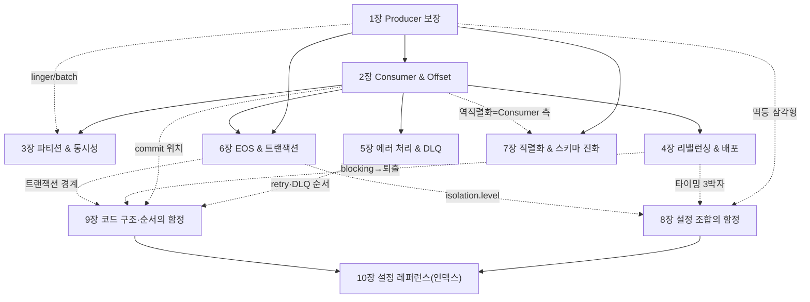

# 📙 II권 — Spring (코드로 어떻게 쓰는가)

> Spring Kafka로 **실제 코드를 어떻게 짜는가, 그리고 어디서 데이는가.**
> "설정 하나하나"가 아니라 **개별 설정 → 설정 조합 → 코드 구조·순서**의 세 층위로 함정을 깎는다.

> ⚠️ **이 README가 II권의 중심 작업판이자 단일 인덱스다.**
>
> 📐 집필 공통 규칙(README=인덱스 · SSOT 표 · 상태 2축 · 증명 모델 등)은 [전체 표지](../README.md)가 단일 진실이다 — 여기서 재서술하지 않는다.
> 특히 🔒 **불변식: 다른 장의 *내용*을 가리키는 인라인 번호 금지 — named link로만** (`(II권 8장 참조)` ❌ → `[설정 조합의 함정](08-config-combination-traps.md)` ✅). **예외**: 목차·범위·작업 노트의 *구조적* 장 번호(`본편 1~7장`·forward-link `1장→8.1`)는 허용. 8장 결번·권번호/정의 위치 드리프트가 전부 *내용 참조* 위반에서 났다.

---

## 이 권의 역할 · Scope · 경계

**목적**: Spring Kafka로 **코드를 어떻게 짜고 어디서 데이나**. 각 설정이 *무엇을 보장하는지*는 [I권](../1-internals/README.md)으로 거슬러 올라가고, 여기서는 *프레임워크 코드·설정에서 어떻게 쓰고 어디서 깨지나*를 본다.

**한 문장**: *"Spring Kafka 코드와 설정의 사용법, 그리고 그 함정."*

### 다룬다 (Scope)
- Producer / Consumer / Listener 코드·설정 (기존 Step `s01~s07` 재료)
- **설정 조합 함정** · **코드 구조·순서 함정** (횡단편 신규)
- 직렬화/역직렬화·스키마 진화 (Spring `Json(De)Serializer` 한정 — 중앙 스키마는 IV권)

### 다루지 않는다 (Out of Scope)
| 주제 | 가야 할 곳 |
|------|-----------|
| 내부 원리(보장·알고리즘·"왜") | **I권 Internals** |
| 운영 절차·사이징·모니터링·장애 대응·**보안(SASL/SSL/ACL)** · 설정 trade-off 판단 | **III권 Operations** |
| Kafka Connect / CDC / Schema Registry / Streams | **IV권 Beyond Core** |
| 이벤트 설계 · Outbox · Saga | messaging-lab / saga-lab |

> 🤖 **이 권을 작업하는 AI/작업자에게**: "왜 그런가"는 [I권](../1-internals/README.md), "어떤 값이 유리한가"는 [III권](../3-operations/README.md)에 **링크만** 남기고, 여기서는 **코드 관점만** 깎는다.
> **결정 규칙**: 개별 설정이 *무엇을 보장하나* = I권 / 어느 *조합·순서*가 깨지나 = II권(→ [설정 조합의 함정](08-config-combination-traps.md) · [코드 구조·순서의 함정](09-code-order-traps.md)) / 어느 *값이 유리한가*(trade-off) = III권.

---

## 함정의 세 층위 (이 권을 깎는 틀)

함정은 "설정 하나 잘못 넣는 것"만이 아니다. 더 무서운 건 **개별로는 맞는데 조합·순서가 틀린 것**이다.

> **resilience4j 비유**: 개별 `retry`·`circuitbreaker`는 멀쩡한데 *조합·순서*가 틀리면 1번 실패를 N번 집계한다. Kafka도 똑같다 — **개별 valid ≠ 조합 valid ≠ 올바른 코드 배치**. (상세 → [코드 구조·순서의 함정](09-code-order-traps.md). 형제 [resilience4j-lab](../../../../resilience4j-lab/))

본편(1~7장)은 ①을 깎고 ②의 *씨앗*만 남긴다 — [설정 조합의 함정](08-config-combination-traps.md)이 **②를**, [코드 구조·순서의 함정](09-code-order-traps.md)이 **③을** 전담한다.

상태 범례 — **2축**:
- **[산문]** ✅ 작성 완료 · 🚧 옛 Step 복제본(II권 톤으로 재산문화 대기)
- **[executable 증명]** 본편=🧪 기존 Step 테스트 있음 · 횡단편= **⬜ 위임**(설명형 재조합 — 본편 Step이 증명) / **🧩 창발**(silent disable·순서역전·blocking — 자체 통합테스트 필요, 미구현)
- 읽는 법: `NN장` 헤더의 마커(🚧/✅)는 **[산문]** 축, 불릿 끝 🧪/⬜/🧩는 **[증명]** 축이다. (주석 기호: 🔒 불변식 · 🤖 작업자 노트)

> **증명 모델** — II권의 증명은 **Spring Kafka 통합 테스트**다. I권의 `docker`/CLI 자체증명과 달리 **프레임워크에 의존**한다 — 그래서 이 권에 속한다.
> - **본편(1~7장)**: 각 장의 증명은 기존 **Step 테스트**(`src/test/.../sNN_*`)가 담당한다.
> - **횡단편(8~10장)**: 증명은 *두 종류*다. (a) **설명형 재조합**(예: `acks=all` 의미는 s01이 증명 → 둘을 잇기만) = **⬜ 위임**. (b) **창발 동작**(8.1 silent disable·8.2 순서역전·9.3 blocking→퇴출 — 실패·재시도·동시성이 *겹쳐야* 발현) = 개별 Step이 증명 못 함 → **🧩 자체 통합테스트 필요**(현재 미구현, 진짜 갭).

> 🔒 **본문 정본(SSOT)은 `docs/book/2-spring/NN-*.md`다.** `src/test/.../sNN_*/README.md`는 **테스트 실행 가이드**로 보존하되(삭제 안 함), 책 본문이 아니다. 같은 산문을 두 곳에 두지 않는다(드리프트 차단).

---

## 장 간 의존 (전체 점검용)

> 이 그래프는 **장→장 거시 의존(대표 엣지만)**이다. 설정 *단위*의 정의 위치는 아래 **SSOT 표가 유일한 진실** — 전체 ②③ 매핑은 8·9장 본문이 SSOT다.

### 교차 요소 SSOT — "정의 위치"의 단일 진실

> 같은 설정이 여러 장에 걸칠 때, **정의(의미) 위치는 이 표가 유일한 진실**이다.
> 본문·그래프는 정의 위치를 **재서술하지 말고 이 표를 따른다**(인라인 `(N장 정의)` 금지 — 드리프트의 근원). 표와 산문이 어긋나면 *산문 기준으로 표를 고친다*.

| 요소 | 정의 위치 | 주 사용처 |
|------|----------|-----------|
| `acks` (의미) | **1장** | 1·8·10장 |
| 멱등 삼각형 (`idempotence` × `acks` × `max.in.flight`) | **8장** | 1·8·10장 |
| 내구성 짝 (`acks=all` × `min.insync.replicas`, client×broker) | **8장** | 1·8장 (+ → [III권 결정 트리](../3-operations/10-config-decision-tree.md) · [I권 복제](../1-internals/03-replication.md)) |
| `AckMode` / offset 커밋 시점 | **2장** | 2·9·10장 |
| 타이밍 3박자 (`heartbeat`<`session`≪`max.poll.interval`, + `max.poll.records`) | **8장** (순서 관계 — 개별 설정값은 4장) | 4·8·9·10장 |
| `concurrency` / 파티션 ↔ 동시성 상한 | **3장** | 3·10장 |
| `DefaultErrorHandler` (retry↔DLQ, non-retryable 분류) | **5장** | 5·9·10장 |
| `@RetryableTopic` (non-blocking retry) | **9장** (🚧정의 보강 중) | 9·10장 |
| `transactional.id` / `transaction-id-prefix` (좀비 펜싱 · 멱등 자동 활성) | **6장** | 6·8·10장 |
| `isolation.level` (read_committed 짝) | **6장** | 6·8·10장 |
| 스키마 진화 (`FAIL_ON_UNKNOWN_PROPERTIES`) | **7장** | 7장 (중앙 스키마 → [IV권](../4-beyond-core/README.md)) |
| `ErrorHandlingDeserializer` (역직렬화 실패→DLT, poison-pill 차단) | **7장** | 5·7·9장 |
| `auto.offset.reset` (`latest` 기본 — 새 그룹 함정) | **2장** | 2·10장 |
| 배치 리스너 / `BatchListenerFailedException` (단건 복구) | **9장** | 9·10장 |
| 컨테이너 `pause()`/`resume()` (백프레셔 처방) | **9장** | 9장 |

> 🚧 = 정의 *위치*는 정해졌으나 본문이 아직 얇음(아래 *다음 작업* 참조). 표는 위치를 가리키되 미완을 숨기지 않는다.

---

# 목차 + 각 장 아웃라인

> 본편(1~7장)은 컴포넌트별 — 정본 `0N-*.md`는 현재 옛 Step README 복제본이며 **II권 톤·인용규율로 재산문화 대기(🚧)**. 횡단편(8~10장)은 신규 산문(✅).

## 본편 — 컴포넌트별 (개별 설정 → 그 보장)

> 본편은 **1→7 순서로 읽되**, 위 의존 그래프는 특정 장을 다시 펼칠 때의 **재방문 지도**다(읽기 순서가 아니라 참조 지도).

### 1장 — Producer 보장   ✅ [01-producer.md](./01-producer.md)

> 보장/착각: *"acks=all이면 안전한가?"* — acks·idempotence가 **무엇까지** 보장하는지.

- `acks` 0/1/all 의미 · `enable.idempotence`(기본값·강제 조합 → [설정 조합의 함정](08-config-combination-traps.md)) · `ProducerFactory`/`KafkaTemplate` 골격
- 내구성 짝: `acks=all`은 단독으론 부족 — 정의는 → [설정 조합의 함정](08-config-combination-traps.md), 운영 판단 → [III권 의사결정 트리](../3-operations/10-config-decision-tree.md)
- `send()`는 **비동기** — 실패는 콜백/`CompletableFuture`로 돌아온다(동기 발행으로 오인하면 유실)
- 증명 → [s01 Producer](../../../src/test/java/com/example/kafka/s01_producer/README.md) `ProducerAcksTest` 등 🧪

### 2장 — Consumer & Offset   🚧 [02-consumer-offset.md](./02-consumer-offset.md)

> 보장/착각: *"예외를 삼키면 안전한가?"* — **커밋 시점이 유실·중복을 가른다.**

- `AckMode`(BATCH·RECORD·MANUAL·MANUAL_IMMEDIATE) · `enable.auto.commit`(Spring 기본 false)
- 기본 BATCH에서 예외를 삼키면 offset이 커밋되어 **영원히 유실** (II권의 핵심 함정)
- `auto.offset.reset`(`latest` 기본 — **새 그룹은 과거를 안 읽는다**: "왜 메시지가 안 와요?") · `ConsumerSeekAware`/`seek()`로 재처리(replay)
- `listener.type=batch` 모드 (배치 에러 함정은 → [코드 구조·순서의 함정](09-code-order-traps.md))
- 원리 → [I권 조정](../1-internals/05-coordination.md)(`__consumer_offsets`) · 증명 → [s02 Consumer](../../../src/test/java/com/example/kafka/s02_consumer/README.md) 🧪

### 3장 — 파티션 & 동시성   🚧 [03-partition-concurrency.md](./03-partition-concurrency.md)

> 보장/착각: *"파티션 늘리면 좋은가?"* — `concurrency × 인스턴스 ≤ 파티션`.

- 컨테이너 `concurrency` ↔ 파티션 수 · key 기반 파티셔닝 (코드 제약만)
- 파티션 수 결정·줄이기 불가·rekey 위험·사이징은 → [III권 운영](../3-operations/README.md)
- 증명 → [s03 Partition](../../../src/test/java/com/example/kafka/s03_partition/README.md) 🧪

### 4장 — 리밸런싱 & 배포   🚧 [04-rebalancing.md](./04-rebalancing.md)

> 보장/착각: *"롤링 배포 시 왜 멈추나?"* — 리밸런싱 회피 설정.

- cooperative sticky · static membership(`group.instance.id`)
- 퇴출 두 메커니즘(`session.timeout`=heartbeat 단절 / `max.poll.interval`=느린 처리) → 타이밍 SSOT는 [설정 조합의 함정](08-config-combination-traps.md)
- 트리거 전수·운영 대응은 → [III권](../3-operations/README.md) · 원리 → [I권 조정](../1-internals/05-coordination.md) · 증명 → [s04 Rebalancing](../../../src/test/java/com/example/kafka/s04_rebalancing/README.md) 🧪

### 5장 — 에러 처리 & DLQ   🚧 [05-error-handling-dlq.md](./05-error-handling-dlq.md)

> 보장/착각: *"기본 핸들러가 DLQ로 보내나?"* — 기본은 N회 후 **skip**이다.

- `DefaultErrorHandler`(retry BackOff → recoverer) · `DeadLetterPublishingRecoverer` · non-retryable 분류
- 에러 처리·DLQ는 II권 고유 영역 — I권 원리에 직접 대응 없음. 재처리 중복 방어 원리만 → [I권 멱등·순서](../1-internals/06-ordering-atomicity.md)
- retry↔DLQ **순서·분류 함정**의 깊은 분석은 → [코드 구조·순서의 함정](09-code-order-traps.md) · 증명 → [s05 DLQ](../../../src/test/java/com/example/kafka/s05_dlq/README.md) 🧪

### 6장 — EOS & 트랜잭션   🚧 [06-eos-transactions.md](./06-eos-transactions.md)

> 보장/착각: *"EOS면 중복 없나?"* — Kafka **내부 한정**, 외부는 멱등키.

- `transaction-id-prefix`(인스턴스별 고유) · `KafkaTransactionManager` · `read_committed` 짝 · `isolation.level`
- 트랜잭션을 쓰면 멱등성은 자동으로 켜진다 (→ [설정 조합의 함정](08-config-combination-traps.md))
- 원리 → [I권 트랜잭션·EOS](../1-internals/07-transactions.md) · 증명 → [s06 EOS](../../../src/test/java/com/example/kafka/s06_eos/README.md) 🧪

### 7장 — 직렬화 & 스키마 진화   🚧 [07-serialization.md](./07-serialization.md)

> 보장/착각: *"필드 추가했는데 왜 죽나?"* — **StringDeserializer + 수동 `ObjectMapper`**(Jackson raw 기본 `FAIL_ON_UNKNOWN=true`)면 죽고, 기본 `JsonDeserializer`(`enhancedObjectMapper`)면 무시된다.

- `JsonSerializer`/`JsonDeserializer` (+ `trusted.packages`)
- **`FAIL_ON_UNKNOWN` 비대칭** `[code @spring-kafka 3.3]`:
  - Jackson raw = `true` (수동 `ObjectMapper`면 unknown field에서 죽음)
  - Spring `JsonDeserializer` = `false` (`enhancedObjectMapper`로 무시) — `spring.jackson.*`는 여기 미적용
- **스키마 진화**(consumer 관점): 필드 *추가* → `FAIL_ON_UNKNOWN` 의존(false면 무시) / 필드 *제거* → 없는 필드는 기본값(`null`/0; primitive·`required`는 예외) / *타입 변경* → `MismatchedInputException`(하드 브레이크)
- `ErrorHandlingDeserializer` — 역직렬화 실패(poison-pill)를 리스너 진입 *전*에 잡아 헤더로 옮겨 DLT로 (→ [코드 구조·순서의 함정](09-code-order-traps.md))
- 하위/상위 호환 · 헤더 기반 버전 관리
- **중앙 스키마 관리(Avro/Schema Registry)는 → [IV권](../4-beyond-core/README.md)**
- 증명 → [s07 Serialization](../../../src/test/java/com/example/kafka/s07_serialization/README.md) 🧪

## 횡단편 — 설정·코드 차원의 함정 (신규)

> 여기서 컴포넌트별 시선을 떠나, 설정들의 **상호작용**·**코드 배치**로 시야를 옮긴다 (함정의 세 층위 ②③).

### 8장 — 설정 조합의 함정   ✅ [08-config-combination-traps.md](./08-config-combination-traps.md)

> 관점: *개별 설정은 다 맞는데, **조합**이 틀리면 장애.*

- 8.1 멱등성 삼각형 — `idempotence`×`acks`×`max.in.flight` (명시 충돌=`ConfigException` fail-fast / 기본 의존=silent disable: `acks`·`retries`=INFO · `max.in.flight`=WARN `[code @3.7]`)
- 8.2 순서 역전 — `max.in.flight` × `retries` (멱등 off일 때)
- 8.3 타이밍 3박자 — `heartbeat`<`session`≪`max.poll.interval`
- 8.4 트랜잭션 ↔ `isolation.level`
- 8.5 체크리스트 — 내구성 짝(`acks=all`×`min.insync.replicas`) 포함
- 증명 참조 → ⬜ 위임: s01·s04·s06 (본편 Step) · 🧩 창발(통합테스트 필요): 8.1 silent disable · 8.2 순서 역전

### 9장 — 코드 구조·순서의 함정   ✅ [09-code-order-traps.md](./09-code-order-traps.md)

> 관점: *설정이 다 맞아도, 코드의 레이어 순서·위치가 틀리면 장애.*

- 9.1 ErrorHandler retry↔DLQ 순서 · non-retryable 분류(poison-pill)
- 9.2 commit 위치 — 처리 *전* vs *후*
- 9.3 리스너 blocking → poll 초과 → 퇴출 (처방: 컨테이너 `pause()`/`resume()` · `autoStartup=false`)
- 9.4 `@RetryableTopic` — blocking vs non-blocking retry
- 9.5 `@Transactional`+Kafka 트랜잭션 경계 (→ Outbox는 messaging-lab)
- 9.6 배치 리스너 — `BatchListenerFailedException(msg, index)` 안 쓰면 멀쩡한 N-1건 중복
- 증명 참조 → ⬜ 위임: s05·s02·s04 (본편 Step) · 🧩 창발(통합테스트 필요): 9.3 blocking→퇴출 · 9.6 배치 단건 복구

### 10장 — 설정 레퍼런스(인덱스)   ✅ [10-config-reference.md](./10-config-reference.md)

> 성격: *새 설명이 아니라 인덱스* — 의미는 본편·8·9장이 SSOT, 여기선 위치 + 검증 라벨(`✓`)만. (설명 산문은 정본에)

- **설정 주입 메커니즘**(도입): `spring.kafka.*`는 일부만 매핑 / 나머지는 `properties.*` 맵(모르면 조용히 무시) · yml↔programmatic precedence
- Producer / Consumer / Listener 설정 인덱스 · 기본값은 1차 소스 확인된 것만 `✓`, 나머지는 `?`(검증 대기)
- **증상 → 함정 역인덱스**(장애 중 진단) — 유실·중복·순서·퇴출·"설정 안 먹음" → 어디
- 증명 없음(본편·8·9장 테스트를 참조)
- **언제 어느 값이 유리한가(trade-off)** → [III권 의사결정 트리](../3-operations/10-config-decision-tree.md)

---

## 🚦 II권 상태 (이 표가 II권 상태 SSOT)

- **[산문]** 본편 = 🚧 · 횡단편 = ✅  (마커 뜻은 위 범례)
- **[증명]** 본편 = 🧪 · 횡단편 = ⬜ 위임 + 🧩 창발(통합테스트 미구현)
- **다음 작업 (본편 재산문화)** — 7개를 II권 톤(컴포넌트 → 핵심 설정·보장 → 함정 → 올바른 형태 → I권 링크 → Step 증명)으로 다시 깎으며:
  - `# Step N` 헤더·"다음 Step으로" 제거
  - 깨진 `../sNN_*/` 교차참조 → 같은 권 정본(`NN-*.md`) / 원리는 I권 named link (테스트 디렉터리는 「증명 →」 링크에서만)
  - 본문 장번호 하드코딩 → named link
  - 인용 라벨 주입
  - `@RetryableTopic` 동작 정의(retry 토픽 명명·DLT·attempts/backoff·blocking 곱셈)를 9.4에 보강 → SSOT 표 🚧 해제
  - `partition.assignment.strategy` 등 `?` 기본값 1차 소스 확정
  - **본편→횡단편 forward link 주입** (1장→8.1 / 2장→9.2 / 4장→8.3·9.3 / 5장→9.1 / 6장→8.4·9.5; 근거는 SSOT 표 *주 사용처*·의존 그래프) — 3장은 횡단 함정 씨앗이 약해 제외
  - **07 본문 보강**: `enhancedObjectMapper` 경로 산문 · `spring.jackson.*` 무효 명시 · `ErrorHandlingDeserializer` 본문화 + raw↔Spring 비대칭
  - **🧩 창발 통합테스트 구현**: 8.1 silent disable · 8.2 순서 역전 · 9.3 blocking→퇴출 · 9.6 배치 단건 복구
  - **2장 본문 보강**: `auto.offset.reset`(새 그룹 latest 함정)·`seek`/replay·`listener.type=batch` 모드 산문
  - **4장 본문**: graceful shutdown(in-flight·종료 커밋 타이밍) 코드 동작 한 문단 · 토픽 프로비저닝(`NewTopic`·`KafkaAdmin`) 언급(정책은 III권)

---

← [전체 표지](../README.md) · [I권](../1-internals/README.md) · [III권](../3-operations/README.md) · [IV권](../4-beyond-core/README.md) · [용어집](../../GLOSSARY.md) · 버전 SSOT: [CHARTER](../../CHARTER.md)
