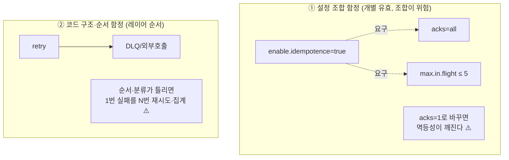
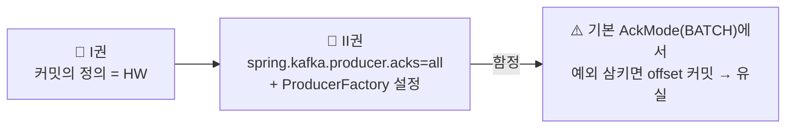

# 📙 II권 — Spring Kafka (코드로 어떻게 쓰는가)

> ⚠️ **러프 초안 — II권 목차 골격.**
> *"Spring Kafka로 실제 코드를 어떻게 짜는가, 그리고 어디서 데이는가."*
> 기존 함정 Step(s01~s07)이 이 권의 주 재료다. 각 설정이 무엇을 보장하는지는 **I권으로 거슬러** 올라간다.
>
> 📐 집필 공통 규칙은 [전체 표지](../README.md)를 따른다. 특히 🔒 **다른 장·권은 named link로만 — 장/권 번호를 본문에 박지 말 것.**

---

## 이 권의 역할 · Scope · 경계

**목적**: Spring Kafka로 **코드를 어떻게 짜고 어디서 데이나**. 개별 설정 → 설정 조합 → 코드 구조·순서 함정.

### 다룬다 (Scope)
- Producer/Consumer/Listener 코드·설정 · 설정 조합 함정 · 코드 구조·순서 함정 · 직렬화 (기존 Step s01~s07)

### 다루지 않는다 (Out of Scope)
- 내부 원리(보장·알고리즘) → [I권](../1-internals/README.md) · 운영 절차·모니터링·사이징 → [III권](../3-operations/README.md)
- **Kafka Connect / CDC / Schema Registry / Streams** → [IV권](../4-beyond-core/README.md) (인프라·플랫폼 영역)

> 🤖 "왜 그런가"는 [I권](../1-internals/README.md), "운영 기준"은 [III권](../3-operations/README.md)에 **링크만**. 여기선 코드 관점만 깎는다.

---

## 이 권이 다루는 함정의 두 차원

함정은 "설정 하나 잘못 넣는 것"만이 아니다. 더 무서운 건 **개별로는 맞는데 조합·순서가 틀린 것**이다.

> **resilience4j 비유**: `retry`가 앞단, `circuitbreaker`가 뒷단이면 1번 실패할 것을 N번 시도해 N번이 다 서킷에 집계된다.
> Kafka에도 똑같은 형태가 있다 — non-retryable 예외(역직렬화 실패)를 분류하지 않으면 **절대 성공 못 할 메시지를 10번 재시도**한다. (형제 [resilience4j-lab](../../../../resilience4j-lab/)과 연결)

**그래서 II권의 각 장은 3관점으로 깎는다:**
`개별 설정의 의미` → `설정 조합의 상호작용(함정)` → `코드 구조·순서의 함정`

---

## 이 권의 성격

함정은 버리지 않는다 — **원리를 알고 나서 보는 "현실에서 깨지는 증거"** 로 재배치된다.

---

## 증명 모델 · 상태

- **🧪 증명 모델**: II권의 증명은 **Spring Kafka 통합 테스트**(기존 Step 테스트)다. I권의 `docker`/CLI 자체증명과 달리 **프레임워크에 의존**한다 — 그래서 이 권에 속한다. (표지 "증명 모델 명시" 규칙)
- **🚦 상태 2축**: 본편(1~7장)은 산문(Step README)·증명(테스트)이 **둘 다 기존 자산 ✅**. 횡단편(9~11장)은 **📋 신규**(아웃라인만, 산문·테스트 미작성).

---

## 목차 (Spring 적용 축)

### 본편 — 기존 Step 재사용(📄)

| 장 | 제목 | 착각 질문 | 본문 위치 | 증명 |
|----|------|----------|----------|------|
| 1장 | Producer 보장 | "acks=all이면 안전한가?" | 📄 `s01_producer/README.md` | ✅ 12 |
| 2장 | Consumer & Offset | "예외를 삼키면 안전한가?" | 📄 `s02_consumer/README.md` | ✅ 14 |
| 3장 | Partition & concurrency | "파티션 늘리면 좋은가?" | 📄 `s03_partition/README.md` | ✅ 6 |
| 4장 | Rebalancing & 배포 | "롤링 배포 시 왜 멈추나?" | 📄 `s04_rebalancing/README.md` | ✅ 6 |
| 5장 | 에러 처리 & DLQ | "기본 핸들러가 DLQ로 보내나?" | 📄 `s05_dlq/README.md` | ✅ 2 |
| 6장 | EOS & 트랜잭션 | "EOS면 중복 없나?" | 📄 `s06_eos/README.md` | ✅ 8 |
| 7장 | 직렬화 & 스키마 진화 | "필드 추가했는데 왜 죽나?" | 📄 `s07_serialization/README.md` | ✅ 7 |

> `s08_connect`(Kafka Connect)는 인프라/통합 주제 → [IV권](../4-beyond-core/README.md)으로 이동.
> `s09_monitoring`·`s10_broker`(운영 성격)는 [III권](../3-operations/README.md)으로 분류.

### 횡단편 — 설정·코드 차원의 함정 (신규)

| 장 | 제목 | 다루는 핵심 | 상태 |
|----|------|------------|------|
| 9장 | **설정 조합의 함정** | idempotence ↔ acks ↔ max.in.flight / order ↔ retry / `session·heartbeat·max.poll` 3박자 타이밍 / transactional ↔ isolation.level | 📋 예정 |
| 10장 | **코드 구조·순서의 함정** | ErrorHandler retry↔DLQ 순서·non-retryable 분류 / commit 위치(처리 전 vs 후) / `@RetryableTopic` non-blocking retry / `@Transactional`+Kafka 트랜잭션 경계 / 리스너 내 blocking 호출 → poll 초과 | 📋 예정 |
| 11장 | **설정 레퍼런스** | Producer/Consumer/Listener 주요 설정의 의미·기본값·버전별 변경 (단일 설정 카탈로그) | 📋 예정 |

---

← [전체 표지](../README.md) · [I권](../1-internals/README.md) · [III권](../3-operations/README.md)
