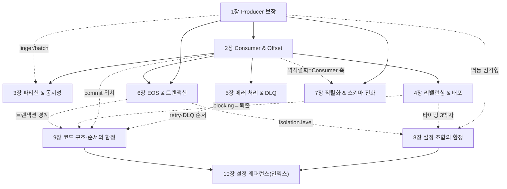

# 📙 II권: Spring (코드로 어떻게 쓰는가)

> Spring Kafka로 **실제 코드를 어떻게 짜는가, 그리고 어디서 데이는가.**
> "설정 하나하나"가 아니라 **개별 설정 → 설정 조합 → 코드 구조·순서**의 세 층위로 함정을 깎는다.

---

## 이 권의 역할 · Scope · 경계

**목적**: Spring Kafka로 **코드를 어떻게 짜고 어디서 데이나**. 각 설정이 *무엇을 보장하는지*는 [I권](../1-internals/README.md)으로 거슬러 올라가고, 여기서는 *프레임워크 코드·설정에서 어떻게 쓰고 어디서 깨지나*를 본다.

**한 문장**: *"Spring Kafka 코드와 설정의 사용법, 그리고 그 함정."*

### 다룬다 (Scope)
- Producer / Consumer / Listener 코드·설정 (기존 Step `s01~s07` 재료)
- **설정 조합 함정** · **코드 구조·순서 함정** (횡단편 신규)
- 직렬화/역직렬화·스키마 진화 (Spring `Json(De)Serializer` 한정 · 중앙 스키마는 IV권)

### 다루지 않는다 (Out of Scope)
| 주제 | 가야 할 곳 |
|------|-----------|
| 내부 원리(보장·알고리즘·"왜") | **I권 Internals** |
| 운영 절차·사이징·모니터링·장애 대응·**보안(SASL/SSL/ACL)** · 설정 trade-off 판단 | **III권 Operations** |
| Kafka Connect / CDC / Schema Registry / Streams | **IV권 Beyond Core** |
| 이벤트 설계 · Outbox · Saga | messaging-lab / saga-lab |

> **결정 규칙**: 개별 설정이 *무엇을 보장하나* = I권 / 어느 *조합·순서*가 깨지나 = II권(→ [설정 조합의 함정](08-config-combination-traps.md) · [코드 구조·순서의 함정](09-code-order-traps.md)) / 어느 *값이 유리한가*(trade-off) = III권.

---

## 함정의 세 층위 (이 권을 깎는 틀)

함정은 "설정 하나 잘못 넣는 것"만이 아니다. 더 무서운 건 **개별로는 맞는데 조합·순서가 틀린 것**이다.

> **resilience4j 비유**: 개별 `retry`·`circuitbreaker`는 멀쩡한데 *조합·순서*가 틀리면 1번 실패를 N번 집계한다. Kafka도 똑같다. **개별 valid ≠ 조합 valid ≠ 올바른 코드 배치**. (상세 → [코드 구조·순서의 함정](09-code-order-traps.md). 형제 [resilience4j-lab](../../../../resilience4j-lab/))

본편(1~7장)은 ①을 깎고 ②의 *씨앗*만 남긴다. [설정 조합의 함정](08-config-combination-traps.md)이 **②를**, [코드 구조·순서의 함정](09-code-order-traps.md)이 **③을** 전담한다.

---

## 장 간 의존 (전체 점검용)

> 장→장 거시 의존(대표 엣지만)이다. 설정 *단위*의 정의 위치는 아래 SSOT 표를 따른다.

### 교차 요소 SSOT: 정의 위치

같은 설정이 여러 장에 걸칠 때, **정의(의미) 위치**를 한 곳에 모은다.

| 요소 | 정의 위치 | 주 사용처 |
|------|----------|-----------|
| `acks` (의미) | **1장** | 1·8·10장 |
| 멱등 삼각형 (`idempotence` × `acks` × `max.in.flight`) | **8장** | 1·8·10장 |
| 내구성 짝 (`acks=all` × `min.insync.replicas`, client×broker) | **8장** | 1·8장 (+ → [III권 결정 트리](../3-operations/10-config-decision-tree.md) · [I권 복제](../1-internals/03-replication.md)) |
| `AckMode` / offset 커밋 시점 | **2장** | 2·9·10장 |
| 타이밍 3박자 (`heartbeat`<`session`≪`max.poll.interval`, + `max.poll.records`) | **8장** (순서 관계 · 개별 설정값은 4장) | 4·8·9·10장 |
| `concurrency` / 파티션 ↔ 동시성 상한 | **3장** | 3·10장 |
| `DefaultErrorHandler` (retry↔DLQ, non-retryable 분류) | **5장** | 5·9·10장 |
| `@RetryableTopic` (non-blocking retry) | **9장** | 9·10장 |
| `transactional.id` / `transaction-id-prefix` (좀비 펜싱 · 멱등 자동 활성) | **6장** | 6·8·10장 |
| `isolation.level` (read_committed 짝) | **6장** | 6·8·10장 |
| 스키마 진화 (`FAIL_ON_UNKNOWN_PROPERTIES`) | **7장** | 7장 (중앙 스키마 → [IV권](../4-beyond-core/README.md)) |
| `ErrorHandlingDeserializer` (역직렬화 실패→DLT, poison-pill 차단) | **7장** | 5·7·9장 |
| `auto.offset.reset` (`latest` 기본 · 새 그룹 함정) | **2장** | 2·10장 |
| 배치 리스너 / `BatchListenerFailedException` (단건 복구) | **9장** | 9·10장 |
| 컨테이너 `pause()`/`resume()` (백프레셔 처방) | **9장** | 9장 |

---

# 목차

## 본편: 컴포넌트별 (개별 설정 → 그 보장)

본편은 1→7 순서로 읽는다. 위 의존 그래프는 특정 장을 다시 펼칠 때의 참조 지도다.

### 1장: Producer 보장

`acks`·멱등이 무엇까지 보장하고, 그 보장이 코드에서 어디서 새는지를 본다.

- **1.1 `acks=all`이면 안전한가. 내구성은 짝이다**
  - ISR이 리더 하나로 줄면 `acks=1`로 퇴화. 짝은 `min.insync.replicas=2`(RF≥3)
- **1.2 `acks` 세 레벨: 무엇을 보장하나**
  - `0` / `1` / `all`이 각각 무엇까지 보장하고 무엇을 대가로 치르나
- **1.3 멱등성이 기본 ON이라 `acks`를 가린다**
  - 3.0+ 기본 `true`라 명시 안 해도 `all`. `acks=1`을 테스트하려면 멱등 먼저 off
- **1.4 `send()`는 비동기. 반환값을 버리면 유실을 모른다**
  - 반환 `Future`를 버리면 발행 실패를 알아채지 못한다
- **1.5 배치: `linger.ms` × `batch.size`**
  - 둘 중 먼저 차는 쪽으로 배치를 닫아 처리량↔지연을 맞바꾼다
- **1.6 백프레셔: `buffer.memory` × `max.block.ms` × `delivery.timeout.ms`**
  - 버퍼가 차면 `max.block.ms`까지 블록하다 `TimeoutException`
- **1.7 yml 정리**
  - 1장 설정의 yml 매핑을 한눈에

📄 [01-producer.md](./01-producer.md) · 🧪 [s01](../../../src/test/java/com/example/kafka/s01_producer/README.md)

### 2장: Consumer & Offset

예외 처리·`AckMode`·offset 커밋 시점이 무엇을 보장하고, 그 시점을 잘못 잡으면 어디서 유실·중복이 새는지를 본다.

- **2.1 예외를 삼키면 안전한가. `AckMode.BATCH`의 유실**
  - try-catch로 예외를 삼키면 기본 `AckMode.BATCH`가 정상 처리로 간주해 offset을 커밋. 실패 메시지는 다시 오지 않으니 삼키지 말고 던져라
- **2.2 auto-commit은 더 위험. Spring이 끄는 이유**
  - native 기본 `enable.auto.commit=true`는 처리 성공과 무관하게 자동 커밋하므로, Spring Kafka는 명시 안 하면 `false`로 둬 유실을 차단한다
- **2.3 `AckMode`: 커밋 타이밍을 직접 정한다**
  - auto-commit을 끄면 `BATCH`·`RECORD`·`MANUAL`·`MANUAL_IMMEDIATE`로 커밋 시점을 정하며, `MANUAL`(다음 poll)과 `MANUAL_IMMEDIATE`(즉시) 혼동이 흔한 함정이다
- **2.4 manual에서도 중복은 난다: at-least-once**
  - 커밋 전에 Consumer가 죽으면 같은 메시지를 다시 받는 at-least-once라, Consumer는 항상 멱등 처리(`event_id` UNIQUE 등)를 전제로 짠다
- **2.5 `auto.offset.reset`: "왜 메시지가 안 와요?"**
  - 새 그룹은 기본 `latest`라 과거 메시지를 안 읽으니, 과거를 읽어야 하면 명시적으로 `earliest`로 둔다
- **2.6 `seek`/replay: 재처리, 단 멱등이 전제**
  - `ConsumerSeekAware`·`seek(offset)`·`offsetsForTimes()`로 재처리하되, 멱등 없이 replay하면 이미 처리한 메시지를 또 처리하므로 멱등을 먼저 확인한다
- **2.7 yml 정리**
  - `enable-auto-commit`·`auto-offset-reset`·`ack-mode` 등 2장 설정의 yml 매핑을 한눈에 정리한다

📄 [02-consumer-offset.md](./02-consumer-offset.md) · 🧪 [s02](../../../src/test/java/com/example/kafka/s02_consumer/README.md)

### 3장: 파티션 & 동시성

파티션을 늘리면 처리량은 오르지만 `key→partition` 매핑이 바뀌어 순서가 깨진다. key 설계와 `concurrency × 인스턴스 ≤ 파티션` 제약이 코드에서 순서를 어떻게 좌우하는지 본다.

- **3.1 파티션을 늘렸더니 순서가 깨졌다**
  - 파티션·Consumer를 3→6으로 늘리자 처리량은 2배가 됐지만 같은 고객의 취소가 생성보다 먼저 처리되는 순서 깨짐이 발생한다. 원인은 3.3에서.
- **3.2 같은 key → 같은 파티션 (순서 보장의 핵심)**
  - 같은 key는 `murmur2(key) % 파티션수`로 항상 같은 파티션에 가 순서가 보장되고, key 없이 발행하면 strictly-uniform sticky(`[KIP-794]`)로 분산된다. 단 같은 파티션을 단일 스레드로 처리할 때만 성립.
- **3.3 rekey 함정: 파티션 수를 바꾸면 매핑이 깨진다**
  - `murmur2(key) % 파티션수`에서 파티션수가 바뀌면 같은 key가 다른 파티션으로 가는데 기존 데이터는 이동하지 않아 같은 key가 두 Consumer에 갈려 순서가 깨진다(3.1의 정체).
- **3.4 `concurrency × 인스턴스 ≤ 파티션`**
  - 한 파티션은 그룹 내 한 Consumer에게만 배정되므로 파티션 수가 병렬성 상한이며, `concurrency × 인스턴스 > 파티션`이면 IDLE 스레드가 생기고 `concurrency>1`이면 파티션 간 순서는 보장 안 된다.
- **3.5 key 설계: 공유 자원 기준, 그리고 Hot Partition**
  - key는 충돌하는 공유 자원 기준(쿠폰이면 `couponId`)으로 잡아 동시성 문제를 락이 아니라 설계로 제거하되, 트래픽이 한 key에 몰리면 Hot Partition이 된다.
- **3.6 yml 정리**
  - `NewTopic`으로 파티션 6·replicas 3을 프로비저닝하고 `spring.kafka.listener.concurrency`(기본 1)를 `concurrency × 인스턴스 ≤ 파티션`에 맞게 설정하는 yml 매핑.

📄 [03-partition-concurrency.md](./03-partition-concurrency.md) · 🧪 [s03](../../../src/test/java/com/example/kafka/s03_partition/README.md)

### 4장: 리밸런싱 & 배포

기본 리밸런싱이 전부 멈추고 다시 나누는 이유와, cooperative·static·타이밍으로 회피하는 코드를 본다.

- **4.1 롤링 배포 시 왜 멈추나: Eager**
  - Eager(`RangeAssignor`·`RoundRobinAssignor`)는 그룹 변경 시 모든 파티션을 revoke하고 재배분해 전원이 멈춘다(Stop-the-World)
- **4.2 Cooperative: 이동 파티션만 옮긴다**
  - `CooperativeStickyAssignor`는 실제 이동 대상만 2라운드로 revoke해 나머지는 안 멈추고 계속 처리한다
- **4.3 프로토콜 3세대**
  - Eager(전체 멈춤)→Cooperative(이동분만)→`KIP-848`(서버 주도, Kafka 4.0 GA opt-in `group.protocol=consumer`)로 진화하며 3.0+ 기본은 cooperative 자동 전환
- **4.4 Static Membership: 재접속해도 리밸런싱 없이**
  - `group.instance.id`를 주면 같은 ID로 재접속 시 갖던 파티션을 리밸런싱 없이 돌려받는다(K8s에선 `${HOSTNAME}`)
- **4.5 퇴출은 두 메커니즘: 타이밍 3박자**
  - `session.timeout.ms`(heartbeat 신호)와 `max.poll.interval.ms`(poll 간격)가 퇴출을 가르며, 후자 초과 시 커밋 못 해 중복 처리가 난다
- **4.6 graceful shutdown & 리밸런싱 중복**
  - 정상 종료면 Spring이 `onPartitionsRevoked`에서 pending offset을 자동 커밋해 중복이 거의 없고, crash·session timeout이면 생길 수 있다
- **4.7 yml 정리**
  - 4장의 cooperative·static·타이밍 설정을 `partition.assignment.strategy`·`group.instance.id`·`session.timeout.ms`·`max.poll.interval.ms` 등 yml로 매핑

📄 [04-rebalancing.md](./04-rebalancing.md) · 🧪 [s04](../../../src/test/java/com/example/kafka/s04_rebalancing/README.md)

### 5장: 에러 처리 & DLQ

Spring Kafka 기본 에러 핸들러는 DLQ가 아니라 N회 후 skip이며, DLQ를 쓰려면 `DeadLetterPublishingRecoverer`를 명시적으로 등록하고 DLT까지 운영해야 한다는 것을 본다.

- **5.1 기본 핸들러는 DLQ가 아니라 skip이다**
  - `DefaultErrorHandler` 기본 BackOff는 `FixedBackOff(0L, 9)`라 총 10회 시도 후 메시지를 버리고 offset을 커밋한다. DLQ로 안 보내고 조용히 사라진다
- **5.2 모든 예외를 재시도하지는 않는다: non-retryable 분류**
  - `DeserializationException`·`ClassCastException`처럼 재시도해도 같은 결과인 예외는 non-retryable로 분류돼 즉시 skip/DLQ되며 `addNotRetryableExceptions()`/`addRetryableExceptions()`로 커스터마이징한다
- **5.3 DLQ 설정: `DeadLetterPublishingRecoverer`**
  - DLQ로 보내려면 `DeadLetterPublishingRecoverer`를 명시적으로 등록해야 하며 실패 메시지는 `{원본토픽}-dlt`로 이동하고 원본 토픽·파티션·offset·예외 정보가 헤더에 담긴다
- **5.4 DLT를 방치하면 DLQ가 없는 것과 같다**
  - DLT로 보내는 건 시작일 뿐이고 별도 Consumer가 모니터링·재처리해야 하며 알림·재발행·retention 같은 운영은 III권 영역이다
- **5.5 yml 정리**
  - `DefaultErrorHandler` 기본은 DLQ 없는 `FixedBackOff(0,9)` skip이고 DLQ는 코드 Bean 등록, DLT 토픽은 `auto.create.topics.enable=false`면 미리 생성해야 함을 한눈에 매핑

📄 [05-error-handling-dlq.md](./05-error-handling-dlq.md) · 🧪 [s05](../../../src/test/java/com/example/kafka/s05_dlq/README.md)

### 6장: EOS & 트랜잭션

EOS가 보장하는 건 Kafka 내부의 원자성뿐. 멱등·트랜잭셔널 프로듀서가 어디까지 막고, DB 경계를 넘는 순간 왜 `Consumer` 멱등키가 최종 방어선이 되는지를 본다.

- **6.1 EOS면 중복 없나: Kafka 안과 밖**
  - EOS는 Kafka 내부 원자성(produce + offset commit)만 보장하고 `Consumer`가 외부 DB에 쓰는 건 보장 밖. 이 경계가 이 장의 전부다.
- **6.2 멱등 프로듀서: 세션 한정**
  - 멱등 프로듀서는 같은 세션(같은 PID) 내 재시도 중복만 `PID + sequence`로 막고, 같은 내용 두 번 `send()`나 재시작 후 새 PID로 인한 중복은 못 막는다.
- **6.3 트랜잭셔널 프로듀서: 원자적 발행, `isolation.level` 짝**
  - `beginTransaction()`→`send()`×N→`commitTransaction()`으로 원자 발행하되, `transaction-id-prefix`는 인스턴스별 고유여야 하고(zombie fencing) Consumer `isolation.level`이 `read_committed`일 때만(기본 `read_uncommitted`) 의미가 있다.
- **6.4 EOS의 진짜 경계: Kafka 안 vs 밖**
  - `sendOffsetsToTransaction()`으로 Kafka 내부는 exactly-once지만 DB와 Kafka는 다른 시스템이라 한 트랜잭션으로 못 묶어, offset commit 전 장애 시 DB INSERT 중복을 EOS가 못 막는다(정석 해법은 Outbox).
- **6.5 Consumer 멱등키: 최종 방어선**
  - EOS 밖 중복은 `Consumer`가 `event_id` UNIQUE나 멱등 상태 전이로 직접 막아, 공격적으로 재시도하는 Producer와 비대칭으로 end-to-end exactly-once 효과를 얻는다.
- **6.6 yml 정리**
  - `transaction-id-prefix`·`acks=all`(멱등 자동 ON)·`isolation.level=read_committed` 등 6장 설정의 yml 매핑을 한눈에 정리한다.

📄 [06-eos-transactions.md](./06-eos-transactions.md) · 🧪 [s06](../../../src/test/java/com/example/kafka/s06_eos/README.md)

### 7장: 직렬화 & 스키마 진화

필드 하나 추가가 Consumer를 죽이느냐 무시되느냐는 직렬화 경로가 가른다. `JsonSerializer` 경로와 `enhancedObjectMapper`, `FAIL_ON_UNKNOWN` 비대칭, 스키마 진화 규칙을 본다.

- **7.1 두 직렬화 경로: String 수동 vs JsonSerializer**
  - `StringSerializer`+수동 `ObjectMapper`(raw, `FAIL_ON_UNKNOWN_PROPERTIES=true`)냐 `JsonSerializer`/`JsonDeserializer`(`__TypeId__` 헤더 자동, 내부 `enhancedObjectMapper`)냐가 타입 안전성과 기본 동작을 가른다
- **7.2 `trusted.packages` 함정**
  - `JsonDeserializer`는 기본적으로 `java.util`·`java.lang`만 허용해 커스텀 클래스는 `trusted.packages`를 설정하지 않으면 `IllegalArgumentException: not in the trusted packages`로 죽는다
- **7.3 `FAIL_ON_UNKNOWN` 비대칭: 경로마다 기본값이 다르다**
  - 수동 경로는 raw `ObjectMapper`라 `FAIL_ON_UNKNOWN_PROPERTIES=true`로 죽고 `JsonDeserializer`는 `enhancedObjectMapper`라 `false`로 무시. 게다가 `spring.jackson.*`는 `JsonDeserializer`에 미적용이라 yml로 못 바꾼다
- **7.4 스키마 진화: 추가 / 제거 / 타입 변경**
  - 필드 추가는 `FAIL_ON_UNKNOWN`이, 제거는 기본값으로 채우되 primitive·required면 예외, 타입 변경은 항상 `MismatchedInputException`으로 하드 브레이크. 가르는 건 예외 타입이 아니라 발생 조건이다
- **7.5 `ErrorHandlingDeserializer`: poison-pill 차단**
  - 역직렬화 실패는 컨버터 단계에서 터져 `DefaultErrorHandler`가 받지도 못하고 무한 재폴링(poison-pill)되므로, `ErrorHandlingDeserializer`로 delegate를 감싸 실패를 헤더로 옮겨야 DLT로 보낼 수 있다
- **7.6 헤더 버전 관리: Schema Registry 없이**
  - 헤더 `schema.version`으로 버전 분기하고 토픽도 버저닝하되, 필드 추가는 `FAIL_ON_UNKNOWN=false`로 흡수하고 타입 변경·필드 삭제 같은 Breaking Change는 새 토픽 버전으로 분리해 점진 마이그레이션한다
- **7.7 yml 정리**
  - Producer `value-serializer`는 `JsonSerializer`, Consumer는 `ErrorHandlingDeserializer`로 `JsonDeserializer`를 감싸고 `trusted.packages`를 설정하는 7장 설정의 yml 매핑을 한눈에

📄 [07-serialization.md](./07-serialization.md) · 🧪 [s07](../../../src/test/java/com/example/kafka/s07_serialization/README.md)

## 횡단편: 설정·코드 차원의 함정

컴포넌트별 시선을 떠나, 설정들의 상호작용과 코드 배치로 시야를 옮긴다(함정의 세 층위 ②③).

### 8장: 설정 조합의 함정

개별 설정은 다 valid인데 조합이 깨지면 멱등성이 사라지거나 순서가 뒤집히거나 컨슈머가 퇴출되는 지점을, Spring 설정에서 어떻게 깨지고 어떻게 막나로 본다.

- **8.1 멱등성 삼각형: `idempotence` × `acks` × `max.in.flight`**
  - `enable.idempotence=true`는 `acks=all`·`max.in.flight≤5`·`retries>0`을 동시에 전제하며, 명시하면 `acks=1` 충돌이 `ConfigException`으로 fail-fast하지만 기본값 의존 시 `INFO` 로그만 남고 멱등이 조용히 꺼진다.
- **8.2 순서 역전: `max.in.flight` × `retries` (멱등 off일 때)**
  - 멱등 off에서 `max.in.flight>1`+`retries>0`이면 재전송 사이 뒤 요청이 먼저 기록돼 순서가 뒤집히므로, 순서가 필요하면 멱등을 켜라.
- **8.3 타이밍 3박자: `heartbeat` × `session.timeout` × `max.poll.interval`**
  - 컨슈머 살아있음 판정은 `heartbeat.interval.ms` < `session.timeout.ms` ≪ `max.poll.interval.ms` 순서 관계가 핵심이며, `max.poll.interval`이 처리 시간보다 짧으면 멀쩡히 처리 중인데 퇴출돼 리밸런싱 폭풍이 난다.
- **8.4 트랜잭션 ↔ `isolation.level`**
  - 컨슈머 `isolation.level` 기본값은 `read_uncommitted`라 abort된 메시지까지 읽으므로, 프로듀서 트랜잭션을 거르려면 컨슈머를 `read_committed`로 명시해야 한다.
- **8.5 정리: 조합 체크리스트**
  - 멱등 삼각형·내구성 짝·순서 역전·타이밍 3박자·트랜잭션 짝은 개별 설정 검증으로는 안 잡히고 조합 단위로 봐야 보인다는 점을 표로 정리한다.

📄 [08-config-combination-traps.md](./08-config-combination-traps.md)

### 9장: 코드 구조·순서의 함정

설정이 다 맞아도 코드의 레이어 순서·ack 위치·blocking 위치가 틀리면 멀쩡한 설정이 무너진다. 오직 코드에서만 보이는 함정을 본다.

- **9.1 ErrorHandler: retry ↔ DLQ 순서, non-retryable 분류**
  - `DefaultErrorHandler`는 retry(BackOff)→소진 후 DLQ 순서라, `DeserializationException`처럼 재시도해도 못 고치는 poison-pill을 분류 안 하면 기본 총 10회(1+9 retry) 헛재시도하므로 `addNotRetryableExceptions(...)`로 분류해 즉시 DLQ로 보낸다.
- **9.2 commit 위치: 처리 *전* vs *후***
  - 처리 전 커밋은 유실, 처리 후 커밋은 중복을 낳으므로 안전한 기본은 처리 후 커밋(at-least-once)+멱등 처리이고, Spring `AckMode`(BATCH·RECORD·MANUAL)가 이 커밋 시점을 정한다.
- **9.3 리스너 안 blocking → poll 초과 → 퇴출**
  - 단일 스레드 poll 루프에서 리스너가 오래 막히면 `max.poll.interval.ms`를 넘겨 퇴출되므로, 무거운 일은 executor로 넘기거나 `max.poll.records`를 줄이고, 백프레셔는 `Thread.sleep`이 아니라 컨테이너 `pause()`/`resume()`으로 처리한다.
- **9.4 `@RetryableTopic`: non-blocking retry, 그리고 blocking과의 곱셈**
  - `@RetryableTopic`은 실패 레코드를 retry 토픽으로 전달해 파티션을 안 막는 non-blocking retry인데, 같은 예외를 blocking BackOff와 양쪽에 분류하면 재시도가 총 ≈ N×B회로 곱해지는 곱셈 함정이 생긴다.
- **9.5 `@Transactional`(DB) + Kafka 트랜잭션 경계**
  - DB와 Kafka는 서로 다른 시스템이라 하나의 트랜잭션으로 못 묶어 이벤트 유실·유령 이벤트가 생기므로 정석 해법은 Outbox 패턴이지만 그 설계는 이 lab 범위 밖(messaging-lab)이다.
- **9.6 배치 리스너: 1건 실패가 N건을 재처리시킨다**
  - `spring.kafka.listener.type=batch`에서 일반 예외를 던지면 `DefaultErrorHandler`가 배치 전체를 재시도해 N-1건이 중복 처리되므로, `BatchListenerFailedException(message, index)`로 실패 인덱스를 지목해 그 한 건만 DLQ로 보내야 한다.
- **9.7 정리: 코드 순서 체크리스트**
  - ErrorHandler·commit 위치·리스너 blocking·배치 단건 복구·retry 혼용·트랜잭션 경계 함정의 잘못된 순서와 올바른 형태를 표로 정리한다.

📄 [09-code-order-traps.md](./09-code-order-traps.md)

### 10장: 설정 레퍼런스 (인덱스)

각 설정의 의미는 본편·8·9장이 SSOT이고, 이 장은 "어디서 다루나 + 검증된 기본값"만 모은 인덱스다.

- **설정은 어떻게 주입되나 (표를 읽기 전에)**
  - 전용 키가 없는 설정은 `spring.kafka.consumer.properties.*` 맵으로 넘겨야 하고, 잘못 적으면 조용히 무시되며, 커스텀 `ConsumerFactory`/`@Bean`은 yml 자동구성을 병합 아닌 대체한다.
- **Producer**
  - `acks`·`enable.idempotence`·`linger.ms`·`buffer.memory`·`delivery.timeout.ms` 등 프로듀서 키의 검증된 기본값과 다루는 곳을 표로 모으고, `min.insync.replicas`는 프로듀서 설정이 아님을 못박는다.
- **Consumer**
  - `enable.auto.commit`(Spring이 `false` 강제)·`auto.offset.reset`·`isolation.level`·`max.poll.interval.ms`·`partition.assignment.strategy` 등 컨슈머 키의 기본값과 다루는 곳을 표로 모은다.
- **Listener (Spring `ContainerProperties`)**
  - `AckMode`·`concurrency`·`CommonErrorHandler`/`DefaultErrorHandler`·`@RetryableTopic` 등 Spring 리스너 컨테이너 설정의 의미와 다루는 곳을 표로 모은다.
- **기본값 검증: 완료 ✅**
  - 표의 모든 기본값을 kafka-clients 3.7.0 `ProducerConfig`/`ConsumerConfig`로 verbatim 확인했으며, `session.timeout.ms=45000`(`[KIP-735]`)과 `[code @3.7]`이 클라이언트 기준임을 특이사항으로 적는다.
- **증상 → 함정 역인덱스 (장애 중 진단용)**
  - 유실·중복·순서 꼬임·롤링 배포 멈춤·역직렬화 사망·설정 안 먹힘 같은 증상별로 가장 흔한 원인과 펴볼 장을 잇는 증상→원인 역방향 네비게이션 표다.

📄 [10-config-reference.md](./10-config-reference.md)

---

← [전체 표지](../README.md) · [I권](../1-internals/README.md) · [III권](../3-operations/README.md) · [IV권](../4-beyond-core/README.md) · [용어집](../GLOSSARY.md) · 버전 SSOT: [CHARTER](../../CHARTER.md)
