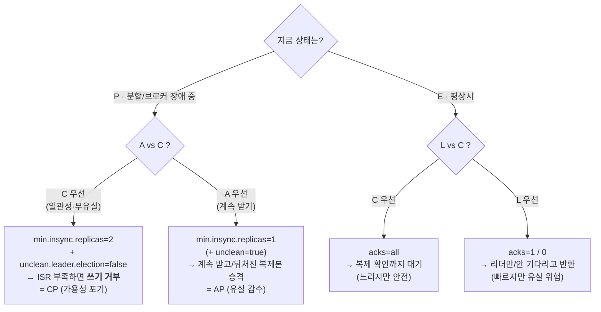
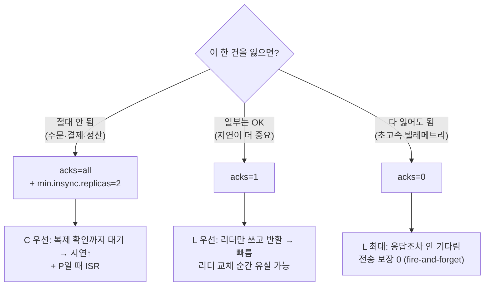
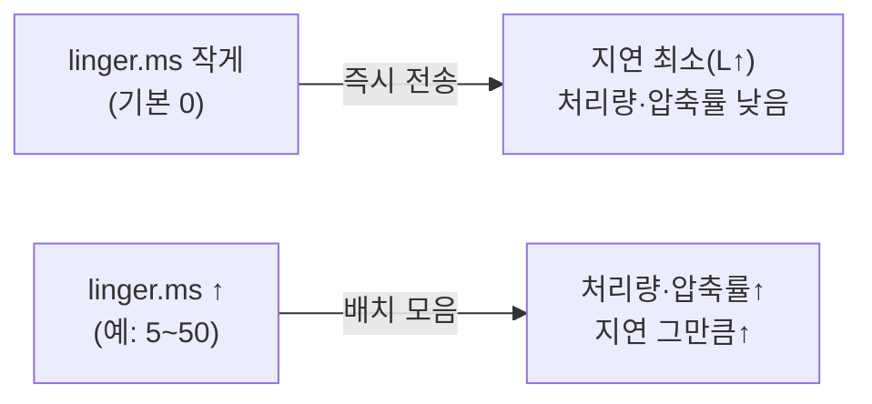
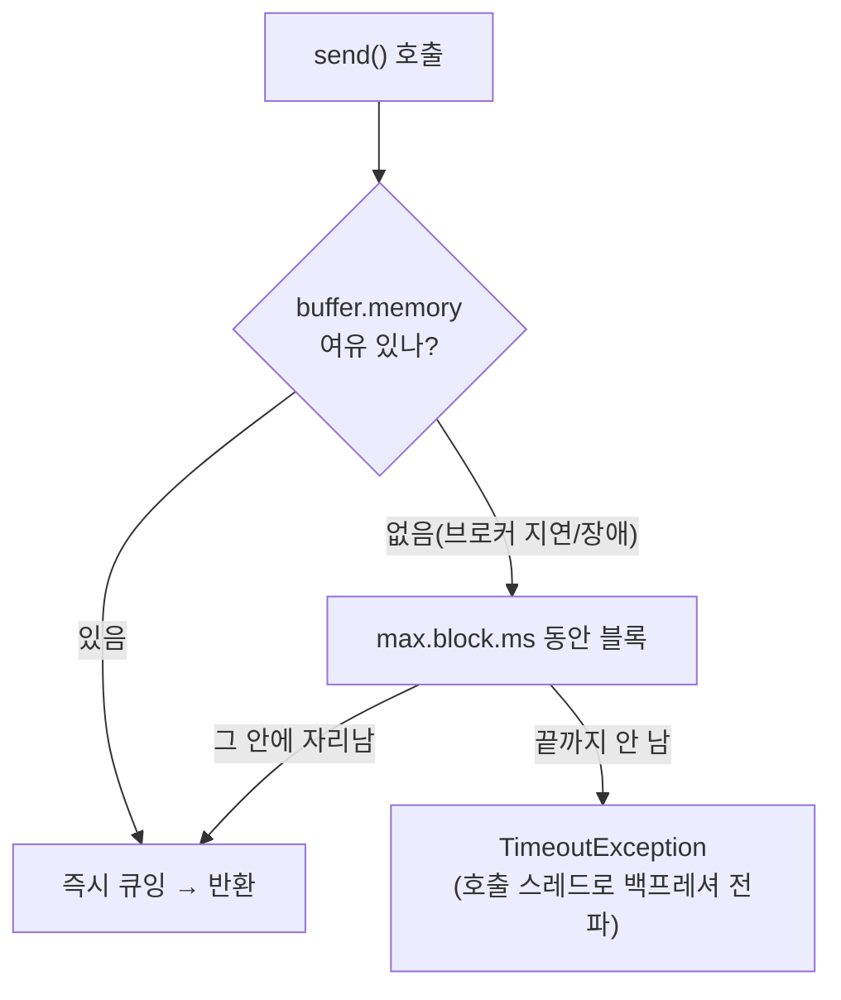
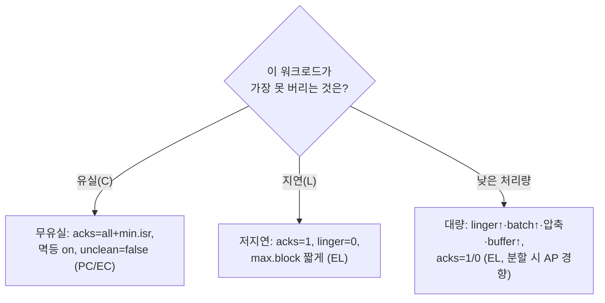

# III권 10장. 설정 trade-off 의사결정 트리 (CAP·PACELC 기반)

> 앞: [III권 목차](./README.md) · 원리 출처: [I권](../1-internals/README.md) · 기본값 인덱스: [II권 10장](../2-spring/10-config-reference.md)
>
> **이 장의 관점**: *지금까지(II권)는 "설정을 틀리면 깨진다"였다. 이 장은 다르다. 개별 설정이 다 valid하고 조합도 맞을 때, **같은 설정을 상황에 따라 어느 쪽으로 돌리느냐**. 정답이 없고, **무엇을 포기할지** 고르는 일이다. 그 포기의 정확한 학명은 **CAP / PACELC**다.*

II권 8·9장이 "조합·순서가 **틀리면** 장애"였다면, 이 장은 **틀린 게 아무것도 없을 때** 시작한다. `acks=all`도 맞고 `acks=1`도 맞다. 무엇을 **버릴 것인가**의 문제다. 그래서 암기가 아니라 **트리**다: "지금 장애(분할)인가?"·"이 데이터를 잃으면?"라는 질문에 답하면 값이 정해진다.

> 🔒 이 장은 **방향성**(어느 쪽으로 돌리면 무엇을 버리나)만 단언한다. **정확한 기본 숫자는 [II권 10장 인덱스](../2-spring/10-config-reference.md)가 SSOT**. 여기에 숫자를 박으면 드리프트가 난다. (표지 집필 공통 규칙)

---

## 10.1 정확히 말하면: 이건 CAP / PACELC 문제다

분산 시스템에서 Kafka 같은 복제 로그가 마주하는 trade-off에는 **이미 정확한 이름**이 있다. 실무 용어("내구성", "안정성")로 뭉뚱그리기 전에, 학술 프레임으로 못을 박자. 그래야 트리가 흔들리지 않는다.

**CAP (Brewer).** 흔한 오해부터 정정한다: *"C·A·P 중 2개를 고른다"는 부정확하다.* 분산 시스템에서 **네트워크 분할(P, Partition)은 고르는 게 아니라 언젠가 반드시 일어나는 사실**이다(브로커 다운, 네트워크 단절). 진짜 선택은 **분할이 일어났을 때 일관성(C)을 지킬 것이냐, 가용성(A)을 지킬 것이냐**다. 둘 다는 불가능하다.

**PACELC (Abadi): CAP의 정확한 확장.** CAP은 *분할 중*만 말한다. 하지만 현실에선 **분할이 없는 평상시에도** trade-off가 있다:

> **if (P)** then **A or C**: 분할이면 가용성이냐 일관성이냐.
> **Else (E)** then **L or C**: 평상시엔 지연(Latency)이냐 일관성이냐.

Kafka는 이 둘을 **다른 설정 손잡이**로 그대로 노출한다:

| 상황 | 손잡이 | C 쪽 (일관성) | A/L 쪽 |
|------|--------|--------------|--------|
| **P (분할 중)** | `min.insync.replicas` · `unclean.leader.election.enable` | min.isr=2 + unclean=false → **쓰기 거부**(CP) | min.isr=1 / unclean=true → **유실 감수**(AP) |
| **E (평상시)** | `acks` (+ `linger.ms`) | `acks=all` → 복제 대기(느림) | `acks=1/0` → 빠르게 반환(유실 위험) |

> ⚠️ **정확성 단서**: Kafka의 "일관성(C)"은 교과서적 선형성(linearizability)과 *완전히* 같진 않다. 정확히는 **"ack된 쓰기는 손실되지 않고 ISR에 복제된다"**(내구성 + 손실 없음)에 가깝다. 하지만 운영 결정의 구조(*분할 시 무유실(C)을 위해 쓰기 가용성(A)을 버린다*)는 CAP의 CP 그대로다. 왜 ISR·`min.insync.replicas`가 이걸 보장하는지의 밑바닥은 → [I권 복제 원리](../1-internals/03-replication.md).
>
> `unclean.leader.election.enable`·`RF`·`min.insync.replicas`를 **운영 숫자로** 잡는 법(분할 시 A/C 결정의 실제 손잡이)은 III권 *내구성 운영 기준* 장 소관이다. 이 장은 그 위에 **평상시(E)의 L 축까지 얹은 종합 트리**다.

---

## 10.2 실무 번역: 같은 trade-off의 3축

CAP/PACELC가 밑바닥이라면, 운영 현장에서 매일 쓰는 말은 **세 축**이다. 셋은 위 C/A/L을 처리량까지 늘려 펼친 것이다. 동시에 최대는 **불가능**, 하나를 당기면 다른 게 끌려온다.

| 축 | PACELC 대응 | 무엇을 원하나 | 주로 미는 설정 |
|----|------------|--------------|---------------|
| 🛡️ 내구성·일관성 | **C** (그리고 P일 때 A를 포기) | 한 건도 잃지 않기 | `acks` · `min.insync.replicas` · `enable.idempotence` · `unclean=false` |
| ⚡ 지연 | **L** (E일 때 C와 상충) | 한 건을 최대한 빨리 | `linger.ms`↓ · `max.block.ms`↓(fail-fast) |
| 📦 처리량 | (L의 형제 · 배치로 단위당 비용↓) | 단위 시간당 최대 건수 | `linger.ms`↑ · `batch.size`↑ · `buffer.memory`↑ · 압축 |

> 운영자의 일은 "올바른 값"을 외우는 게 아니라, **이 워크로드가 분할 시 A냐 C냐, 평상시 L이냐 C냐**를 먼저 정하는 것이다. 그게 정해지면 나머지는 트리로 따라온다.

---

## 10.3 `acks`. 평상시(E) 다이얼: 일관성(C) ↔ 지연(L)

PACELC의 **ELC**(평상시 L vs C)를 가장 크게 돌리는 손잡이. 질문은 하나다: **이 데이터를 잃으면 어떻게 되나?**

**`acks=all` + `min.insync.replicas=2`가 유리한 상황**: 유실이 곧 사고인 데이터(주문, 결제, 잔액, 정산). **불리한 점**: 복제 대기로 **지연↑**, 그리고 분할로 ISR이 `min.isr` 밑이면 **쓰기 거부**(= 평상시 C + 분할 시 CP, *가용성을 의도적으로 포기*).

**`acks=1`이 유리한 상황**: 약간의 유실은 감내하되 **지연·처리량이 중요**(서비스 로그, 행동 이벤트, 대시보드 메트릭). 빠르다. **불리한 점**: 리더가 죽고 복제 전 구간은 **유실**.

**`acks=0`이 유리한 상황**: 한 건쯤 사라져도 통계가 안 흔들리는 **초고처리량 텔레메트리**(IoT 틱, 추적 이벤트). 가장 빠르고 가장 많이 보낸다. **불리한 점**: 받았는지조차 모른다.

> 🔒 **`acks` 단독으로 결정하지 마라.** `enable.idempotence`(3.0+ 기본 `true`)는 이미 `acks=all`을 전제·강제한다. 멱등을 켠 채 `acks=1`을 주면 [II권 8장의 두 갈래 함정](../2-spring/08-config-combination-traps.md)(명시 시 `ConfigException` / 기본 의존 시 침묵 disable)으로 빠진다. **이 장 = "어느 쪽이 유리한가(trade-off)", 8장 = "조합이 틀리면 어떻게 깨지나(함정)"**. 짝으로 읽어야 한다.

---

## 10.4 `linger.ms` · `batch.size`: 지연(L) ↔ 처리량

프로듀서는 메시지를 **모았다가 배치로** 보낸다. `linger.ms`는 "배치가 덜 찼어도 이만큼은 기다린다"는 시간이다. PACELC의 **L**을 처리량과 맞바꾸는 손잡이다.

**올리면(예: 5~50ms) 유리**: 대량 적재(ETL, 로그 파이프라인). 배치가 커지면 **요청 횟수↓·압축률↑** → 처리량↑, 브로커 부하↓. **불리**: 모든 메시지가 최대 그만큼 **늦게** 나간다.

**`0`(기본)이 유리**: 실시간 알림, 주문 확정처럼 **한 건의 지연이 곧 사용자 체감**인 경로. **불리**: 작은 요청이 잦아 처리량·압축 효율 낮음.

> `batch.size`(한 배치 최대 바이트)와 **"시간 또는 크기, 먼저 차는 쪽"**으로 배치가 닫힌다. 배치·압축 내부 동작 → [I권 클라이언트 런타임](../1-internals/09-client-runtime.md).

---

## 10.5 `max.block.ms` · `buffer.memory`: 백프레셔 정책

브로커가 느리거나 죽어 전송이 밀리면 **전송 버퍼(`buffer.memory`)가 찬다.** 그 뒤 `send()`는 `max.block.ms`만큼 **블록**했다가, 그래도 자리가 없으면 예외를 던진다. 즉 **"백프레셔를 얼마나 참을 것인가"** 다.

**짧게(또는 매우 작게) 두면 유리**: **사용자 요청 스레드**에서 발행할 때(HTTP 핸들러). Kafka가 막혔다고 사용자 응답까지 멈추면 안 된다 → 빨리 예외로 받아 **fail-fast** 후 폴백(큐잉/스킵/회로차단). **불리**: 일시 지연에도 쉽게 실패해 **재시도 필수**.

**길게 / `buffer.memory`를 크게 두면 유리**: **배치 ETL·백그라운드 적재**처럼 스레드가 좀 막혀도 되는 경로. 폭주·지연을 **버퍼로 흡수**해 유실 없이 흘린다. **불리**: 장애가 길면 스레드가 오래 막히고, 큰 버퍼는 **힙 압박**.

> 핵심: `max.block.ms`는 **"이 스레드가 막혀도 되는가?"** 로 결정한다. 막히면 안 되는 경로(요청-응답) = 짧게+폴백, 막혀도 되는 경로(배치) = 길게+큰 버퍼.

---

## 10.6 컨슈머 쪽 짝: `fetch.min.bytes` · `max.poll.records`

같은 L↔처리량 축이 읽기 방향에도 있다.

- **`fetch.min.bytes`↑**: 그만큼 쌓일 때까지 모아 응답 → **처리량↑·요청수↓**, **지연↑**(저지연이면 낮게). `linger.ms`의 읽기판 쌍둥이.
- **`max.poll.records`↓**: 한 `poll()`의 레코드를 줄이면 **배치 처리 시간↓** → `max.poll.interval.ms` 초과 퇴출 위험↓. 무거운 처리일수록 낮춘다. (퇴출·타이밍 → [II권 9장](../2-spring/09-code-order-traps.md), 원리 → [I권 조정](../1-internals/05-coordination.md))

---

## 10.7 종합: 워크로드 프로파일별 출발점

트리를 다 타면 현실 워크로드는 대개 **세 프로파일**로 수렴한다. *값이 아니라 방향*으로 읽어라(정확한 숫자는 [II권 10장](../2-spring/10-config-reference.md) + 부하 테스트로 확정).

| 프로파일 | 대표 사례 | PACELC 성향 | `acks` | `linger.ms` | `max.block.ms` |
|---------|----------|------------|--------|------------|----------------|
| **무유실 트랜잭션** | 주문·결제·정산 | **PC / EC** (C 최우선) | `all`+`min.isr=2` | 낮게 | 보통(재시도 동반) |
| **저지연 실시간** | 알림·주문확정·요청경로 | **EL** (평상시 L) | `1` | `0` | 짧게(fail-fast+폴백) |
| **대량 스트림** | 로그·메트릭·IoT | **PA / EL** (A·처리량) | `1`/`0` | 높게(배치) | 길게(버퍼 흡수) |

> 🔒 **이 표는 출발점이지 정답이 아니다.** 같은 "주문" 토픽도 회사마다 SLA가 다르다. 트리의 가치는 *값을 주는 것*이 아니라, **CAP/PACELC로 "먼저 분할 시 A/C, 평상시 L/C 중 무엇을 버릴지 정하라"는 순서를 강제**하는 데 있다. 그다음 부하 테스트로 숫자를 깎는다. `[docs @3.9]`

---

## 스스로 답해보자

- `acks=all`이 왜 가용성(A)을 **떨어뜨릴** 수 있나? 어느 설정과 묶일 때 그런가? (힌트: `min.insync.replicas`, 분할 P)
- CAP에서 "P를 고른다/안 고른다"는 왜 부정확한 말인가?
- PACELC가 CAP보다 Kafka 튜닝을 더 잘 설명하는 지점은 어디인가? (힌트: 평상시 E)
- "멱등 켜고 `acks=1`"은 왜 이 장(유불리)이 아니라 [II권 8장](../2-spring/08-config-combination-traps.md)(함정) 소관인가?

---

← [III권 목차](./README.md) · 원리: [I권](../1-internals/README.md) · 조합 함정: [II권 8·9장](../2-spring/08-config-combination-traps.md) · 기본값: [II권 10장](../2-spring/10-config-reference.md)
