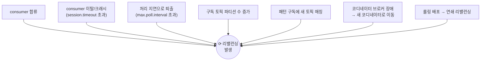

# 📗 III권 — Operations (실무 운영)

> ⚠️ **러프 초안 — III권 목차 골격.**
> *"현장에서 어떻게 운영하고 무엇을 기준으로 판단하는가."*
> 각 항목은 **I권의 어느 원리에 기대는지** 링크로 잇는다 (현상 암기 ❌).
>
> 📐 집필 공통 규칙은 [전체 표지](../README.md)를 따른다. 특히 🔒 **다른 장·권은 named link로만 — 장/권 번호를 본문에 박지 말 것.**

---

## 이 권의 역할 · Scope · 경계

**목적**: 멀티브로커 Kafka를 **현장에서 어떻게 운영·판단**하는가. 어떤 숫자로 설정하고, 어떻게 감시하고, 터지면 어떻게.

I권이 "왜"라면, III권은 "그래서 운영에서 **어떤 숫자로, 어떻게 감시하고, 터지면 어떻게**"를 다룬다.

### 다룬다 (Scope)
- 클러스터 사이징 · 토픽 설계 BP · 파티셔닝 전략 · 리밸런싱 트리거 전수+대응 · 모니터링(lag/under-replicated) · 동적 설정 · 장애 대응 · 용량

### 다루지 않는다 (Out of Scope)
- 원리의 "왜"(보장·알고리즘) → **I권 Internals** · Spring 코드·설정 → **II권 Spring**

> 🤖 원리가 필요하면 "→ I권", 코드가 필요하면 "→ II권" **링크만**. 여기선 운영 관점만 깎는다.

> 📏 이 README는 **주제를 한 문장으로** 적는 인덱스다. 상세는 개별 `NN-*.md`로. (규칙 → [전체 표지](../README.md))

---

## 리밸런싱은 "흔한 케이스"가 아니라 전수로 다룬다

가장 흔한 "consumer 한 대 추가" 말고도, 리밸런싱을 일으키는 트리거는 여럿이다. 운영자는 **이 전체 경우의 수**를 알아야 한다.

→ 이건 **권 횡단의 대표 주제**다: I권(Coordinator 원리) / **III권(트리거 전수 + 운영 대응)** / II권(Spring cooperative·static membership 설정).

---

## 목차 (운영 축)

| 장 | 제목 | 다루는 핵심 | 재료 | 상태 |
|----|------|------------|------|------|
| 1장 | 클러스터 사이징 | 브로커 수 · 파티션 수 결정 기준 · rack awareness | 신규 | 📋 예정 |
| 2장 | **토픽 설계 베스트 프랙티스** | 파티션 수 결정(늘리기만 가능, 줄이기 불가) · 네이밍 · RF/retention/compaction 정책 | 신규 | 📋 예정 |
| 3장 | **파티셔닝 전략** | sticky partitioning(2.4+ 기본, 3.3 변경) · key 설계 · rekey 위험 | Step 3 운영 각도 | 📋 예정 |
| 4장 | **리밸런싱 운영** | 위 트리거 전수 · 운영 영향 · 회피(cooperative·static·`group.initial.rebalance.delay.ms`) | Step 4 운영 각도 | 📋 예정 |
| 5장 | 모니터링 & 관측 | **Consumer Lag** · under-replicated · JMX → Prometheus/Grafana | Step 9 재료 | 🚧 일부 |
| 6장 | 토픽/브로커 설정 운영 | retention · `incrementalAlterConfigs` 동적 변경 · compaction 운영 | Step 10 재료 | 🚧 일부 |
| 7장 | 내구성 운영 기준 | RF / `min.insync.replicas` / `acks` 조합 · unclean leader election | I권 3장 기반 | 📋 예정 |
| 8장 | 장애 대응 | 리더 선출 · ISR 복구 · partition reassignment · preferred leader | 신규(멀티브로커) | 📋 예정 |
| 9장 | 용량/보존 운영 | 디스크 · throttling/quotas · tiered storage | 신규 | 📋 예정 |

> 대부분 **멀티브로커 환경**을 전제로 한다. → [ROADMAP](../../ROADMAP.md)

---

← [전체 표지](../README.md) · [I권](../1-internals/README.md) · [II권](../2-spring/README.md)
