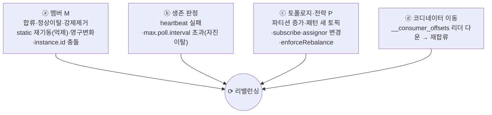
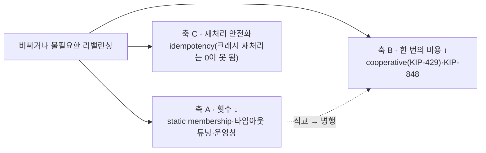
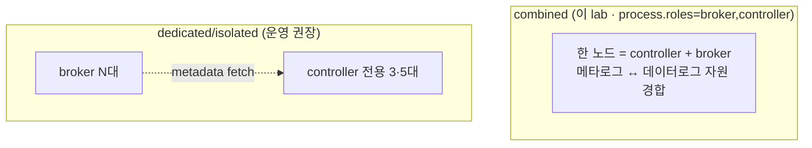

# 📗 III권: Operations (실무 운영)

> ⚠️ **러프 초안: III권 목차 골격.**
> *"현장에서 어떻게 운영하고 무엇을 기준으로 판단하는가."*
> 각 항목은 **I권의 어느 원리에 기대는지** 링크로 잇는다 (현상 암기 ❌).
>
> 📐 집필 공통 규칙은 [전체 표지](../README.md)를 따른다. 특히 🔒 **다른 장·권은 named link로만. 장/권 번호를 본문에 박지 말 것.**

---

## 이 권의 역할 · Scope · 경계

**목적**: 멀티브로커 Kafka를 **현장에서 어떻게 운영·판단**하는가. 어떤 숫자로 설정하고, 어떻게 감시하고, 터지면 어떻게.

I권이 "왜"라면, III권은 "그래서 운영에서 **어떤 숫자로, 어떻게 감시하고, 터지면 어떻게**"를 다룬다.

### 다룬다 (Scope)
- 클러스터 사이징 · 토픽 설계 BP · 파티셔닝 전략 · 리밸런싱 트리거 전수+대응 · 모니터링(lag/under-replicated) · 동적 설정 · 장애 대응 · 용량 · **보안(SASL/SSL/ACL)**

### 다루지 않는다 (Out of Scope)
- 원리의 "왜"(보장·알고리즘) → [I권](../1-internals/README.md) · Spring 코드·설정 → [II권](../2-spring/README.md)

> 🤖 원리가 필요하면 [I권](../1-internals/README.md), 코드가 필요하면 [II권](../2-spring/README.md)에 **링크만**. 여기선 운영 관점만 깎는다.

---

## 리밸런싱은 "흔한 케이스"가 아니라 전수로 다룬다

가장 흔한 "consumer 한 대 추가" 말고도, 리밸런싱을 일으키는 트리거는 여럿이다. 본질은 **배타·완전 배정을 무효화하는 사건**(→ [I권 조정](../1-internals/05-coordination.md)에서 정의)이고, 운영자는 그 **전수 경우의 수**와 **경우별 대처**를 알아야 한다.

**트리거 4범주 × 전수** (장애 복구만이 아니다. scale-out·배포·증설도 포함):

**경우별 1:N 대처: 세 직교 축** (A·B는 직교 → 병행이 정석):

- **축 A/B/C**: 횟수↓(static·타임아웃) · 비용↓(cooperative·KIP-848) · 안전화(멱등). 설정 *코드*는 → [II권](../2-spring/README.md), *원리*는 → [I권 조정](../1-internals/05-coordination.md).
- **경우별 옵션·트레이드오프**: 불필요 억제 / scale-out STW / 롤링 배포 연쇄 / 비정상 사망 회수 / `max.poll.interval` 초과 / 토폴로지 변화 / 코디네이터 이동. 각 1:N 옵션과 비용을 4장(📋 예정) 본문에서 표로.
- **KIP-848 마이그레이션**: `group.protocol=consumer`(4.0 GA·기본 classic) 전환 기준. 4장(📋 예정).

→ **권 횡단 대표 주제**: [I권](../1-internals/05-coordination.md)(본질·트리거 분류·프로토콜) / **III권(전수+대처·숫자, 여기)** / [II권](../2-spring/README.md)(cooperative·static 설정).

---

## KRaft 컨트롤러: combined vs dedicated, 그리고 노드 스펙

원리(쿼럼·합의·pull fetch)는 → [I권 합의](../1-internals/04-consensus.md). 여기선 **어떻게 배치하고 어떤 스펙으로 잡나**.

- **combined 트레이드오프**: 컨트롤러는 데이터 핫패스 밖(→ [I권 복제](../1-internals/03-replication.md))이라 produce/consume 처리량엔 영향이 없지만, 같은 노드 브로커의 과부하(GC·디스크 포화)가 **메타데이터 작업(리더 선출·ISR·reassignment) 응답성**을 떨군다. 컨트롤러만 따로 rolling/scale 불가 + blast radius도 넓다.
- **언제 분리하나**: 노드 수·파티션/토픽 총개수가 크고 가용성이 중요하면 **dedicated**.

**컨트롤러 노드 스펙** (브로커와 자원 프로파일이 정반대. 그래서 분리가 이득):

| 자원 | 브로커(데이터 평면) | 컨트롤러(메타데이터 평면) |
|---|---|---|
| RAM | 큼(페이지캐시) | **4–8GB**(시작점) · 큰 페이지캐시 불필요 |
| 디스크 | 용량·처리량 | 용량 작음(메타로그 ~GB) · **저지연 fsync(SSD/NVMe)·전용 볼륨**이 관건 |
| CPU·네트워크 | 큼 | 작게 |

- **스케일 동인**: 처리량이 아니라 **파티션·토픽·ACL 총개수**(= 메타데이터 양).

→ 정식 산문·숫자는 **클러스터 사이징 장(📋 예정)**. 원리는 → [I권 합의](../1-internals/04-consensus.md).

---

## 증명 모델 · 상태

- **🧪 증명 모델**: III권의 증명은 **멀티브로커 docker로 장애를 주입·관측**(브로커 kill → ISR 축소·리더 선출)하고 **`AdminClient`·메트릭으로 운영 신호를 확인**한다. I권과 도구(docker/CLI)는 겹치지만 관점이 다르다. I권은 *원리가 성립함*을, III권은 *운영에서 어떤 숫자·어떤 대응*을 본다.
- **🚦 상태 2축**: 아래 표의 상태는 **[산문]** 기준이다(📋 예정 / 🚧 일부). **[executable 운영 시나리오]는 전 장 ⬜ 미구현**(멀티브로커 장애 재현 환경 필요).

---

## 목차 (운영 축)

| 장 | 제목 | 다루는 핵심 | 재료 | 상태 |
|----|------|------------|------|------|
| 1장 | 클러스터 사이징 | 브로커 수 · **KRaft 컨트롤러 쿼럼(3/5)·combined vs dedicated·노드 스펙** · 파티션 수 결정 기준 · rack awareness | 신규 | 📋 예정 |
| 2장 | **토픽 설계 베스트 프랙티스** | 파티션 수 결정(늘리기만 가능, 줄이기 불가) · 네이밍 · RF/retention/compaction 정책 | 신규 | 📋 예정 |
| 3장 | **파티셔닝 전략** | sticky partitioning(2.4+ 기본, 3.3 변경) · key 설계 · rekey 위험 | Step 3 운영 각도 | 📋 예정 |
| 4장 | **리밸런싱 운영** | 트리거 4범주×전수 · 세 직교 축(횟수↓·비용↓·안전화) · 경우별 1:N 대처+트레이드오프 · `group.initial.rebalance.delay.ms` · KIP-848 마이그레이션 | Step 4 운영 각도 | 📋 예정 |
| 5장 | 모니터링 & 관측 | **Consumer Lag** · under-replicated · JMX → Prometheus/Grafana | Step 9 재료 | 🚧 일부 |
| 6장 | 토픽/브로커 설정 운영 | retention · `incrementalAlterConfigs` 동적 변경 · compaction 운영 | Step 10 재료 | 🚧 일부 |
| 7장 | 내구성 운영 기준 | RF / `min.insync.replicas` / `acks` 조합 · unclean leader election | [I권 복제](../1-internals/03-replication.md) 기반 | 📋 예정 |
| 8장 | 장애 대응 | 리더 선출 · ISR 복구 · partition reassignment · preferred leader | 신규(멀티브로커) | 📋 예정 |
| 9장 | 용량/보존 운영 | 디스크 · throttling/quotas · tiered storage | 신규 | 📋 예정 |
| 10장 | **[설정 trade-off 의사결정 트리](./10-config-decision-tree.md)** | **CAP·PACELC 기반** / `acks`·`linger.ms`·`max.block.ms`가 언제 유리·불리한가 / 워크로드 프로파일별 출발점 | 신규(종합) | ✅ 산문 |

> 대부분 **멀티브로커 환경**을 전제로 한다. → [ROADMAP](../../ROADMAP.md)
>
> **7장 ↔ 10장 경계**: 7장(*내구성 운영 기준*)은 `RF`·`min.insync.replicas`·`acks`·unclean leader election을 **내구성 축 하나로 깊게** 판다. 10장은 그 위에 **지연·처리량 축까지 얹어** CAP/PACELC로 *무엇을 버릴지*를 한 장에 종합한다. 7장이 "얼마나 안전하게", 10장이 "안전 vs 속도 중 어디로".

---

← [전체 표지](../README.md) · [I권](../1-internals/README.md) · [II권](../2-spring/README.md)
