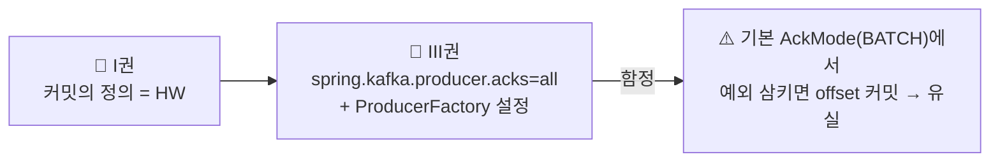

# 📙 III권 — Spring Kafka (코드로 어떻게 쓰는가)

> ⚠️ **러프 초안 — III권 목차 골격.**
> *"Spring Kafka로 실제 코드를 어떻게 짜는가, 그리고 어디서 데이는가."*
> 기존 함정 Step(s01~s08)이 이 권의 주 재료다. 각 설정이 무엇을 보장하는지는 **I권으로 거슬러** 올라간다.

---

## 이 권의 성격

함정은 버리지 않는다 — **원리를 알고 나서 보는 "현실에서 깨지는 증거"** 로 재배치된다.

---

## 목차 (Spring 적용 축) — 기존 Step 재사용(📄)

| 장 | 제목 | 착각 질문 | 본문 위치 | 증명 |
|----|------|----------|----------|------|
| 1장 | Producer 보장 | "acks=all이면 안전한가?" | 📄 `s01_producer/README.md` | ✅ 12 |
| 2장 | Consumer & Offset | "예외를 삼키면 안전한가?" | 📄 `s02_consumer/README.md` | ✅ 14 |
| 3장 | Partition & concurrency | "파티션 늘리면 좋은가?" | 📄 `s03_partition/README.md` | ✅ 6 |
| 4장 | Rebalancing & 배포 | "롤링 배포 시 왜 멈추나?" | 📄 `s04_rebalancing/README.md` | ✅ 6 |
| 5장 | 에러 처리 & DLQ | "기본 핸들러가 DLQ로 보내나?" | 📄 `s05_dlq/README.md` | ✅ 2 |
| 6장 | EOS & 트랜잭션 | "EOS면 중복 없나?" | 📄 `s06_eos/README.md` | ✅ 8 |
| 7장 | 직렬화 & 스키마 진화 | "필드 추가했는데 왜 죽나?" | 📄 `s07_serialization/README.md` | ✅ 7 |
| 8장 | Kafka Connect | "Producer를 직접 짜야 하나?" | 📄 `s08_connect/README.md` | ✅ 4 |

> `s09_monitoring`·`s10_broker`는 운영 성격이 강해 **II권**으로 분류.

---

← [전체 표지](../README.md) · [I권](../1-internals/README.md) · [II권](../2-operations/README.md)
