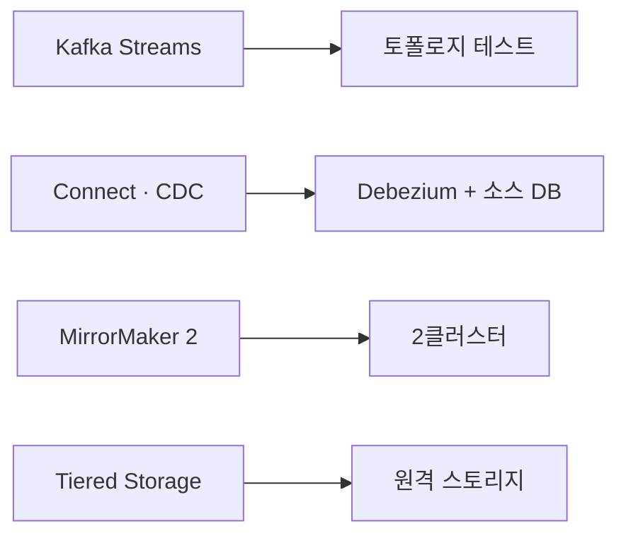
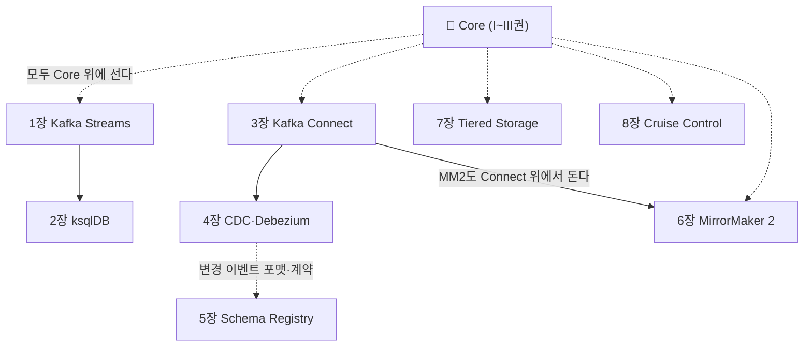

# 📕 IV권 — Beyond Core (데이터 플랫폼으로서의 Kafka)

> Core(I~III권)가 "메시지를 안전하게 주고받기"라면, IV권은 **그 위에 얹는 엔터프라이즈 스택**이다.
> 큰 회사가 Kafka를 "데이터 플랫폼"으로 쓸 때 등장하는 것들 — 스트림 처리·데이터 통합·멀티클러스터.

> ⚠️ **이 README가 IV권의 중심 작업판이자 단일 인덱스다.**
>
> **📐 집필 공통 규칙은 [전체 표지](../README.md)를 따른다.** 특히 🔒 **다른 장·권은 named link로만 — 장/권 번호를 본문에 박지 말 것.**

---

## 이 권의 역할 · Scope · 경계

**목적**: Core 위에 얹는 **데이터 플랫폼/생태계**를 다룬다. Streams·Connect/CDC·Schema Registry·멀티클러스터.

**한 문장**: *"메시지를 주고받는 것을 넘어, Kafka를 데이터 플랫폼으로 운용하는 법."*

### 다룬다 (Scope)
- **A. 스트림 처리** — Kafka Streams, ksqlDB
- **B. 데이터 통합** — Kafka Connect(심화), **CDC/Debezium**, Schema Registry(Avro/Protobuf)
- **C. 멀티클러스터·대규모** — MirrorMaker 2, Tiered Storage, Cruise Control

### 다루지 않는다 (Out of Scope)
| 주제 | 가야 할 곳 |
|------|-----------|
| Core 원리(복제·합의·트랜잭션…) | [I권](../1-internals/README.md) |
| Spring Kafka 애플리케이션 코드 | [II권](../2-spring/README.md) |
| Core 운영(사이징·모니터링·장애) | [III권](../3-operations/README.md) |
| 이벤트 설계 · **Outbox 패턴 구현** · Saga | messaging-lab / saga-lab |

> **결정 규칙**: 컴포넌트의 *원리/메커니즘*이 Core에 이미 있으면 → I권으로 **named link**(재서술 금지) / *플랫폼으로 구성·운용*하는 법만 → IV권.

> 🤖 **경계 주의**: "Outbox/CDC 릴레이를 애플리케이션에서 어떻게 설계하나"는 **messaging-lab**.
> IV권은 "**Kafka 인프라로서** Debezium 커넥터·Schema Registry·MirrorMaker를 어떻게 구성·운용하나".

> 멀티브로커가 기본 전제이며, 멀티클러스터(C파트)는 클러스터 2개 이상을 가정한다.

---

## 산문화 보류 · 증명 모델

> ⚠️ **IV권 산문화는 의도적으로 보류**다. 각 주제가 (1) 최신 기능이라 **1차 소스 검증이 무겁고**(Streams EOS·Schema Registry 호환성·Tiered Storage 등), (2) **별도 환경**이 필요하다(Streams 앱 · Debezium 커넥터+DB · MirrorMaker 2클러스터 · share/tiered는 4.x+ 브로커). **Core(I~III)를 다진 뒤 착수**한다. 그래서 아래 장은 **📝 아웃라인(골격)** 이고 산문·증명은 미착수다.

- **🧪 증명 모델**: 컴포넌트별 전용 환경에서 증명한다 — 환경 구축이 선행이라 현재 전 장 ⬜.

> Core(I~III권)는 기본 3-broker로 증명되지만, IV권은 컴포넌트마다 다른 환경이 선행이라 산문보다 환경 구축이 먼저다.

---

## 장 간 의존 (전체 점검용)

> IV권의 특징은 **모든 장이 Core 위에 선다**는 것이다 — 원리는 I권을 named link로 끌어오고, 여기서는 *플랫폼으로 구성·운용*만 다룬다. 내부적으로는 **Connect가 CDC·Debezium과 MirrorMaker 2의 토대**다(둘 다 Connect 위에서 돈다).

### 교차 요소 SSOT — 정의 위치

같은 개념이 여러 장에 걸칠 때, **정의 위치**를 한 곳에 모은다. Core 원리는 I권이 SSOT이고 IV권은 링크만 건다.

| 요소 | 정의 위치 | 주 사용처 |
|------|----------|-----------|
| stream–table duality · compaction 원리 | **[I권 로그 추상](../1-internals/02-log-abstraction.md)** (링크) | 1·2·4장 |
| EOS · 트랜잭션 | **[I권 트랜잭션](../1-internals/07-transactions.md)** (링크) | 1장 |
| Tiered Storage 메커니즘(RemoteLogManager 등) | **[I권 저장 엔진](../1-internals/08-storage-engine.md)** (링크) | 7장 |
| Connect 워커·태스크·컨버터 | **3장** | 3·4·6장 (CDC·MM2가 Connect 위) |
| 스키마 계약·호환성 모드 | **5장** | 4·5장 |
| 직렬화(앱 측) | **[II권 직렬화](../2-spring/07-serialization.md)** (링크) | 5장 |
| 이벤트 설계·Outbox 경계 | **messaging-lab** (본문 금지·링크만) | 2·4·5장 |

---

# 목차

> ⚠️ 각 장은 **📝 아웃라인(골격)** 이다 — 산문(`NN-*.md`)·executable 증명은 보류. 절 한 줄은 "다룰 주제"이며 검증된 단정이 아니다.

## A. 스트림 처리

### 1장 — Kafka Streams   📝

Kafka Streams는 별도 클러스터 없이 라이브러리만으로 토픽을 입력·출력 삼아 스트림을 처리하는 엔진이다. KStream(이벤트 흐름)과 KTable(상태 테이블)의 duality를 축으로, 로컬 상태 저장·윈도우·조인·집계를 거쳐 Core 트랜잭션 위의 EOS와 토폴로지·스케일링까지 다룬다.

- **1.1 KStream과 KTable — 흐름과 상태의 두 추상**
  - 같은 토픽을 이벤트 흐름으로 읽는 KStream과 key별 최신값 테이블로 읽는 KTable, 그리고 둘을 오가는 duality를 다룬다
- **1.2 KTable의 소스는 왜 compacted여야 하나**
  - retention 소스 위에 KTable을 세우면 오래된 key가 사라져 상태 테이블에 구멍이 생기는 문제와, 상태=compacted 짝의 정석을 다룬다
- **1.3 로컬 상태 저장 — state store와 changelog 토픽**
  - RocksDB 로컬 state store와 그것을 Kafka로 백업하는 changelog 토픽, changelog가 자동 compacted로 만들어지는 컨벤션을 다룬다
- **1.4 윈도우 · 조인 · 집계**
  - 시간 윈도우와 집계, 그리고 KStream을 KTable로 enrich하는 stream-table join으로 외부 조회 없이 로컬에서 결합하는 방식을 다룬다
- **1.5 Streams의 EOS — 처리 보장**
  - 입력 소비·상태 갱신·출력 발행을 한 단위로 묶는 exactly-once 처리 보장이 Core 트랜잭션 위에서 어떻게 서는지를 다룬다
- **1.6 토폴로지 · 스레드 모델 · 스케일링**
  - 처리 그래프인 토폴로지가 task로 쪼개지고 스레드·인스턴스로 펼쳐지며 파티션 기준으로 확장·재배치되는 방식을 다룬다

🔗 [로그라는 추상 — duality·compaction](../1-internals/02-log-abstraction.md) · [트랜잭션·EOS](../1-internals/07-transactions.md) · [저장 엔진 — retention·compaction](../1-internals/08-storage-engine.md)

### 2장 — ksqlDB   📝

스트림 처리를 SQL 한 줄로 선언하는 엔진 — Streams 위에 SQL을 얹은 것이라는 정체성에서 출발해, 무엇이 되고 무엇이 안 되는지(RDB가 아니다)의 경계까지 밀어붙인다.

- **2.1 스트림을 SQL로 — `CREATE STREAM` / `CREATE TABLE ... SELECT`**
  - 이벤트 흐름과 상태를 SQL 선언으로 다루는 진입점과, 그것이 무엇을 표현하려는지
- **2.2 ksqlDB는 무엇 위에 서 있나 — Streams 위의 SQL 엔진**
  - SQL이 토폴로지로 번역되어 실행된다는 관계와, 그래서 무엇이 같고 무엇이 새 층인지
- **2.3 두 가지 질의 — push query 와 pull query**
  - 흐름을 계속 받아보는 질의와 현재 상태를 한 번 들여다보는 질의의 다룰 거리
- **2.4 ksqlDB는 "진짜 데이터베이스"가 아니다 — 경계**
  - 이름과 달리 OLTP·임의 복잡 쿼리·트랜잭션·범용 인덱스 조회의 대체가 아니라는 경계
- **2.5 여전히 Kafka 로그 위다 — 한계의 출처**
  - 질의 가능 범위·조회 모델이 결국 로그 기반이라는 사실에서 따라오는 제약들

🔗 [Stream–Table Duality와 로그 추상](../1-internals/02-log-abstraction.md) · [저장 엔진 — retention·compaction](../1-internals/08-storage-engine.md) · 이벤트 설계 경계: messaging-lab

## B. 데이터 통합

### 3장 — Kafka Connect (심화)   📝

코드 없이 설정과 REST로 외부 시스템과 Kafka를 잇는 통합 프레임워크로서의 Connect를, 기본 Source/Sink 사용에서 분산 워커·태스크 배치·컨버터·SMT·운영까지 심화로 밀어붙인다. 데이터 통합 파트의 입구로, CDC·Schema Registry로 이어지는 골격을 잡는다.

- **3.1 왜 Connect인가 — 통합을 코드가 아닌 설정으로**
  - Producer/Consumer를 매번 손으로 짜는 대신 설정·REST로 파이프라인을 세우는 Connect의 자리와 동기
- **3.2 Source · Sink · Connector · Task — 구성 요소**
  - 외부→Kafka(Source)와 Kafka→외부(Sink)를 Connector와 그 실행 단위 Task로 나눠 보는 골격
- **3.3 분산 모드 — 워커 클러스터와 태스크 배치**
  - 여러 워커가 클러스터를 이뤄 Task를 나눠 맡고 재배치하는 분산 실행 모델을 standalone과 대비해 다룬다
- **3.4 컨버터와 SMT — 경계에서의 변환**
  - 바이트와 레코드 사이 컨버터, 레코드 단위로 건드리는 Single Message Transform이 파이프라인 경계에서 하는 역할
- **3.5 오프셋·재시작·전달 — Connect가 대신 떠안는 것**
  - 진행 위치 추적과 재시작 후 이어 처리를 Connect가 어떻게 관리하는지, 전달 보장의 맥락에서 본다
- **3.6 운영 — REST 관리·상태·실패 처리**
  - REST로 생성·일시정지·재개·삭제하고 Task 상태와 실패를 다루는 운영 흐름의 골격

🔗 [로그라는 추상](../1-internals/02-log-abstraction.md) · [직렬화](../2-spring/07-serialization.md) · [운영](../3-operations/README.md) · 이벤트 설계·Outbox 경계: messaging-lab

### 4장 — CDC / Debezium   📝

DB의 변경분(binlog/WAL)도 결국 append-only 로그라는 관점에서, 그 외부 로그를 Kafka 로그로 흘려보내는 CDC를 Debezium으로 다룬다. 초기 스냅샷·스키마 변경 같은 운영 현실부터, changelog를 compacted 토픽으로 배포해 "상태 배포 매체"로 쓰는 데까지 이어간다.

- **4.1 CDC란 무엇인가 — DB 변경분을 로그로**
  - 폴링·트리거 같은 대안과 대비해, 데이터베이스의 변경 흐름을 잡아 스트림으로 만드는 발상이 무엇을 노리는지를 다룬다
- **4.2 binlog/WAL도 로그다 — 외부 로그를 Kafka 로그로**
  - DB가 내부적으로 쓰는 변경 로그가 Kafka의 로그 추상과 같은 성질을 공유한다는 연결 고리를 다룬다
- **4.3 Debezium 구조 — Connect 위의 source connector**
  - 커넥터가 MySQL/Postgres의 변경 로그를 읽어 토픽으로 흘려보내는 배치를 Connect 워커·태스크 위에서 다룬다
- **4.4 초기 스냅샷과 실시간 변경의 전환**
  - 기존 데이터를 한 번 떠내는 스냅샷 단계와 이후 변경 스트림으로 넘어가는 전환을 다룬다
- **4.5 스키마 변경(DDL) 처리**
  - 소스 테이블 구조가 바뀔 때 변경 이벤트의 형태가 함께 변하는 상황을 어떻게 다루는지를 짚는다
- **4.6 changelog를 compacted 토픽으로 — 상태 배포 매체**
  - 변경 스트림을 key별 최신 스냅샷으로 압축해 스냅샷과 실시간 변경을 한 토픽으로 배포하는 쓰임새를 다룬다
- **4.7 경계 — 인프라 CDC vs 애플리케이션 Outbox**
  - Kafka 인프라로서의 커넥터 구성과 애플리케이션이 설계하는 Outbox/릴레이의 경계를 가른다

🔗 [로그 추상 — 상태 배포 매체·compaction](../1-internals/02-log-abstraction.md) · [저장 엔진 — compaction 메커니즘](../1-internals/08-storage-engine.md) · 애플리케이션 Outbox: messaging-lab

### 5장 — Schema Registry   📝

메시지마다 스키마를 통째로 싣는 대신 중앙 레지스트리에 등록해 ID만 실어 보낸다는 발상을, 데이터 계약·호환성 강제·진화 운영까지 밀어붙인다. [직렬화](../2-spring/07-serialization.md)가 "헤더로 버전을 직접 관리"였다면 이 장은 그 책임을 중앙 권위로 옮긴다.

- **5.1 왜 중앙 스키마인가 — 헤더 버저닝의 한계와 데이터 계약**
  - 메시지마다 스키마를 박거나 헤더로 버전을 다루던 방식의 한계와, 스키마를 계약으로 끌어올린다는 발상을 다룬다
- **5.2 동작 원리 — subject · schema ID · wire format**
  - 스키마를 레지스트리에 등록하고 페이로드에는 ID만 실어 보내며, subject로 스키마를 묶는 구조를 다룬다
- **5.3 직렬화 포맷 — Avro · Protobuf · JSON Schema**
  - 중앙 관리 대상이 되는 포맷들과 각자의 스키마 표현·진화 표현 방식의 결을 다룬다
- **5.4 호환성 모드 — backward · forward · full · none**
  - 새 스키마 등록을 무엇 기준으로 허용·거부하는지, 모드마다 누가(producer·consumer) 먼저 움직여야 하는지를 다룬다
- **5.5 스키마 진화 — 허용되는 변경과 깨지는 변경**
  - 필드 추가·삭제·타입 변경 같은 변경이 선택한 호환성 모드 아래서 통과하거나 막히는 경계를 다룬다
- **5.6 운영 — subject 네이밍 전략 · 등록 통제 · 거버넌스**
  - subject를 토픽·레코드 단위 중 무엇으로 묶을지, 누가 언제 스키마를 등록·승인하게 할지를 다룬다

🔗 [직렬화와 스키마 진화](../2-spring/07-serialization.md) · [로그라는 추상](../1-internals/02-log-abstraction.md) · 이벤트 계약 설계: messaging-lab

## C. 멀티클러스터·대규모

### 6장 — MirrorMaker 2   📝

한 클러스터의 로그를 다른 클러스터로 흘려보내 DR·geo-replication을 만드는 도구가 MirrorMaker 2다. 토픽 복제는 쉬운 쪽이고, 진짜 문제는 컨슈머가 페일오버 후 "어디부터 읽나"를 정하는 offset 변환과 양방향 토폴로지에서의 순환 방지다.

- **6.1 왜 멀티클러스터인가 — DR · geo-replication · 집계**
  - 한 클러스터로는 풀 수 없는 재해 복구·지역 근접성·여러 클러스터 집계라는 요구가 클러스터 간 복제를 부르는 맥락을 본다
- **6.2 MirrorMaker 2의 구조 — Connect 위에서 도는 복제**
  - MM2가 별도 프로세스가 아니라 Connect 프레임워크 위 커넥터 묶음으로 동작한다는 구조와 그 함의를 다룬다
- **6.3 무엇을 복제하나 — 데이터 · 컨슈머 그룹 · 토픽 설정**
  - 토픽 레코드뿐 아니라 컨슈머 그룹·offset·ACL·토픽 설정까지 따라가야 페일오버가 성립하는 이유를 짚는다
- **6.4 offset 변환 — 페일오버 후 어디부터 읽나**
  - 원본과 대상 클러스터의 offset이 같지 않기에 컨슈머 위치를 옮겨주는 offset 매핑이 왜 핵심 난제인지를 다룬다
- **6.5 토폴로지 — active-passive vs active-active**
  - 단방향 대기 구성과 양방향 동시 운용을 비교하고 각 토폴로지가 무엇을 요구하는지를 본다
- **6.6 양방향의 함정 — 복제 순환과 이름 규칙**
  - active-active에서 복제가 무한히 되돌아오지 않도록 막는 토픽 네이밍·순환 방지 메커니즘을 다룬다
- **6.7 증명 (executable — 2클러스터 · 미구현)**
  - 두 클러스터를 띄워 토픽·offset 복제와 페일오버 후 재개 위치를 실제로 관측하는 실험 골격을 잡는다

🔗 [로그 추상](../1-internals/02-log-abstraction.md) · [조정 — 컨슈머 그룹·offset](../1-internals/05-coordination.md) · [운영](../3-operations/README.md)

### 7장 — Tiered Storage (KIP-405)   📝

로그 보존을 로컬 디스크 용량에서 떼어내, 오래된 세그먼트를 원격 스토리지로 내리고 사실상 무한 보존을 운용 가능하게 만드는 장. 메커니즘은 Core 저장 엔진에 양보하고, 여기선 데이터 플랫폼으로 "어떻게 켜고·나누고·운용하나"의 관점을 잡는다.

- **7.1 왜 Tiered Storage인가 — 보존과 로컬 디스크의 분리**
  - 무한히 쌓이는 로그가 로컬 디스크 용량에 묶이는 문제와, 보존을 스토리지 계층으로 분리한다는 발상
- **7.2 local retention vs remote retention — 두 축으로 보존을 나누다**
  - 로컬은 짧게·원격은 길게라는 이중 보존 구성과 두 retention 설정이 만드는 데이터 수명의 경계
- **7.3 원격 스토리지 백엔드 구성 — S3 등 플러그러블 계층**
  - 원격 스토리지 플러그인을 어떤 백엔드로 어떻게 연결·구성하는가의 운용 관점
- **7.4 읽기 경로 — 최근은 로컬, 오래된 건 원격 fallback**
  - consumer가 오래된 offset을 읽을 때 원격에서 가져오는 경로와 그것이 운용에 주는 함의
- **7.5 운용 관점 — 어떤 토픽에 켜고, 무엇을 지켜보나**
  - Tiered Storage를 켤 대상 선택과 운용 시 마주치는 고려·경계의 큰 그림

🔗 [저장 엔진 — Tiered Storage 메커니즘](../1-internals/08-storage-engine.md) · [로그 추상 — retention·replay 범위](../1-internals/02-log-abstraction.md) · [용량·보존 운영](../3-operations/README.md)

### 8장 — Cruise Control   📝

파티션이 브로커 어디에 놓이는가를 사람이 손으로 reassignment하는 대신, 클러스터 상태를 모델링해 지속적으로 균형을 맞추고 부하·고장에 자동 대응하는 외부 컨트롤러를 다룬다. 리밸런싱·용량·자가 치유를 하나의 최적화 문제로 보는 시각을 골격으로 잡는다.

- **8.1 왜 Cruise Control인가 — 손으로 하는 reassignment의 한계**
  - 파티션 재배치를 사람이 계획·실행하는 방식이 커지는 클러스터에서 무엇이 부담이 되는가를 짚는다
- **8.2 클러스터를 모델로 — 메트릭 수집과 워크로드 표현**
  - 브로커·파티션의 부하를 어떻게 관측하고 하나의 상태 모델로 표현하는가를 다룬다
- **8.3 균형의 기준 — goal과 최적화로서의 리밸런싱**
  - 무엇을 균형으로 볼지 목표들로 나누고 그 충족을 탐색 문제로 보는 관점을 다룬다
- **8.4 용량 관리 — 디스크·네트워크·CPU 한계를 제약으로**
  - 리소스 한계를 배치 제약으로 넣어 과적·핫스팟을 피하는 시각을 다룬다
- **8.5 자가 치유 — 브로커 이탈·이상 감지와 자동 대응**
  - 고장이나 이상 신호에 사람 개입 없이 재배치를 트리거하는 흐름을 다룬다
- **8.6 운영 표면 — 제안 검토·실행 throttle·안전장치**
  - 제안된 변경을 검토하고 점진 적용하며 운영 영향을 통제하는 표면을 다룬다

🔗 [복제와 파티션 배치](../1-internals/03-replication.md) · [저장 엔진 — 디스크 특성](../1-internals/08-storage-engine.md) · [리밸런싱·용량 운영](../3-operations/README.md)

---

← [전체 표지](../README.md) · [I권](../1-internals/README.md) · [II권](../2-spring/README.md) · [III권](../3-operations/README.md) · [용어집](../GLOSSARY.md) · 버전 SSOT: [CHARTER](../../CHARTER.md)
