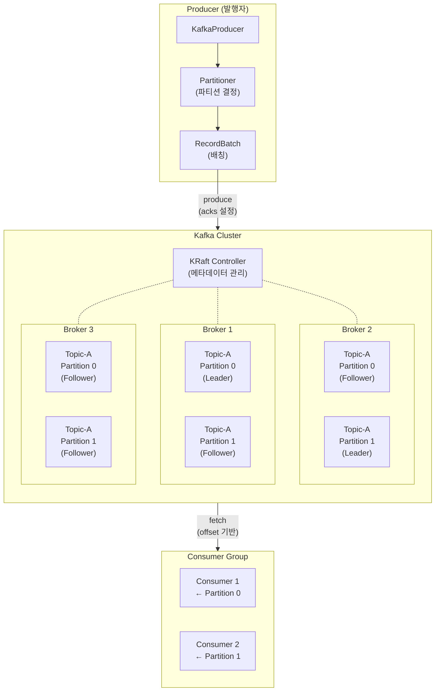
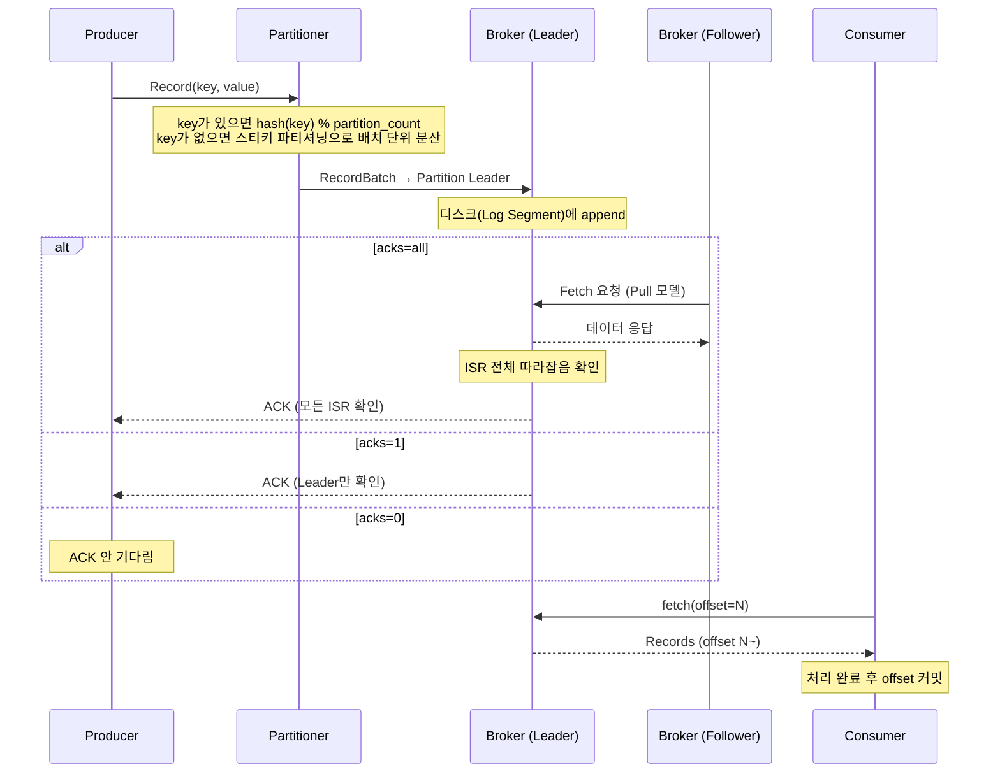

# kafka-lab 용어 사전

> Kafka를 구성하는 핵심 용어를 **"어디에 위치하는가"**와 함께 정리합니다.
> 학습 중 용어가 헷갈릴 때 돌아와서 참고하세요.

---

## 전체 아키텍처 — 용어가 어디에 있는가

---

## 메시지의 여정 — 발행부터 소비까지

---

## 용어 정리

### Cluster & Broker

| 용어 | 의미 | 위치 | 관련 Step |
|------|------|------|-----------|
| **Cluster** | 여러 Broker를 묶은 단위. 고가용성과 수평 확장의 기반 | 전체를 감싸는 최상위 단위 | 전체 |
| **Broker** | Kafka 서버 1대. 메시지를 저장하고, Producer/Consumer 요청을 처리 | Cluster 내부의 개별 서버 | Step 1, 10 |
| **Controller** | Cluster의 메타데이터(토픽, 파티션, 리더 정보)를 관리하는 특수 Broker | Cluster 내 1대 (KRaft 모드에서는 Controller Quorum) | Step 10 |
| **KRaft** | Kafka Raft. ZooKeeper 없이 Kafka 자체적으로 메타데이터를 관리하는 프로토콜. Kafka 3.3 production-ready, 4.0에서 ZooKeeper 제거 | Controller 내부 | Step 10 |

### Topic & Partition

| 용어 | 의미 | 위치 | 관련 Step |
|------|------|------|-----------|
| **Topic** | 메시지를 분류하는 논리적 채널. 이름으로 식별 | Cluster 안에 존재 | 전체 |
| **Partition** | Topic을 물리적으로 나눈 단위. 순서 보장의 최소 단위 | Topic 안에 N개 존재, 각각 다른 Broker에 분산 가능 | Step 3 |
| **Leader Partition** | 해당 Partition의 읽기/쓰기를 담당하는 주 복제본 | 특정 Broker에 1개 존재 | Step 1, 10 |
| **Follower Partition** | Leader에게 Fetch 요청을 보내서 데이터를 복제하는 백업 (Pull 모델). Leader 장애 시 새 Leader로 선출 가능 | Leader와 다른 Broker에 존재 | KAFKA-ARCHITECTURE.md |
| **Partition Key** | 메시지가 어떤 Partition에 들어갈지 결정하는 키. 기본 파티셔너는 murmur2(key) % partition_count | Producer가 메시지에 지정 | Step 3 |

### Message & Offset

| 용어 | 의미 | 위치 | 관련 Step |
|------|------|------|-----------|
| **Record** | Kafka에서 취급하는 데이터의 최소 단위. key + value + headers + timestamp | Partition 내에 순서대로 저장 | 전체 |
| **Offset** | Partition 내에서 Record의 위치를 나타내는 순차 번호. 0부터 시작 | Partition 내부 | Step 2 |
| **Committed Offset** | Consumer가 "여기까지 처리했다"고 브로커에 알린 위치. "마지막으로 처리한 offset + 1" = "다음에 읽을 offset" | Consumer Group별로 브로커(__consumer_offsets)에 저장 | Step 2 |
| **Log End Offset (LEO)** | Partition에 마지막으로 기록된 Record의 다음 위치 | Partition 내부 | Step 9, 10 |
| **High Watermark (HW)** | 모든 ISR이 복제 완료한 마지막 Offset. Consumer는 HW 이전까지만 읽을 수 있음 | Partition 내부 | KAFKA-ARCHITECTURE.md |
| **Consumer Lag** | LEO - Committed Offset. Consumer가 얼마나 뒤쳐져 있는지의 지표 | Consumer Group 단위로 측정 | Step 2, 9 |

### Producer

| 용어 | 의미 | 위치 | 관련 Step |
|------|------|------|-----------|
| **Producer** | 메시지를 Topic에 발행하는 클라이언트. thread-safe하므로 여러 스레드에서 공유 가능 | Cluster 외부 (애플리케이션) | Step 1 |
| **Partitioner** | 메시지를 어떤 Partition에 보낼지 결정하는 로직. key가 있으면 murmur2 hash, key가 없으면 스티키 파티셔닝(Kafka 2.4+ 기본)으로 배치 단위 분산 | Producer 내부 | Step 3 |
| **acks** | Producer가 브로커로부터 몇 개의 확인을 받을지 설정. 0 / 1 / all | Producer 설정 | Step 1 |
| **RecordBatch** | 여러 Record를 묶어서 한 번에 전송하는 단위. batch.size와 linger.ms 중 먼저 충족되는 조건으로 전송 | Producer 내부 버퍼 | Step 1 |
| **Idempotent Producer** | 네트워크 재시도 시에도 같은 메시지가 중복 저장되지 않도록 보장. Producer ID + Sequence Number 기반. **Kafka 3.0부터 기본 활성화되어 acks=all이 강제됨.** acks=0/1을 테스트하려면 enable.idempotence=false 필요 | Producer 설정 (enable.idempotence) | Step 1, 6 |
| **Transactional Producer** | produce + offset commit을 원자적으로 처리. read-process-write 파이프라인의 정합성 보장. transaction-id-prefix는 인스턴스별 고유해야 함 | Producer 설정 (transactional.id) | Step 6 |

### Consumer

| 용어 | 의미 | 위치 | 관련 Step |
|------|------|------|-----------|
| **Consumer** | Topic에서 메시지를 읽는 클라이언트. thread-safe하지 않음 (KafkaProducer와 다름) | Cluster 외부 (애플리케이션) | Step 2 |
| **Consumer Group** | 같은 group.id를 공유하는 Consumer의 집합. Partition이 그룹 내 Consumer에 1:1로 매핑됨 | 논리적 그룹 (브로커가 관리) | Step 2, 3, 4 |
| **Group Coordinator** | Consumer Group의 멤버십과 Partition 할당을 조율하는 Broker. 파티션 배정 계산은 Group Leader(Consumer 중 하나)가 수행 | Cluster 내 특정 Broker | Step 4 |
| **poll()** | Consumer가 브로커에서 Record를 가져오는 메서드. max.poll.records만큼 가져옴 | Consumer 코드 | Step 2, 4 |
| **Auto Commit** | poll() 호출 시 auto.commit.interval.ms(기본 5초) 간격으로 자동 offset 커밋. enable.auto.commit=true(Kafka 기본값, **Spring Kafka는 강제로 false**). 처리 전 커밋 위험 | Consumer 설정 | Step 2 |
| **Manual Commit** | 애플리케이션이 명시적으로 offset을 커밋. commitSync / commitAsync | Consumer 코드 | Step 2 |
| **AckMode** | Spring Kafka에서 offset 커밋 타이밍을 제어하는 설정. BATCH(기본) / RECORD / MANUAL / MANUAL_IMMEDIATE | Spring Kafka 설정 | Step 2 |

### Replication & High Availability

| 용어 | 의미 | 위치 | 관련 Step |
|------|------|------|-----------|
| **Replication Factor** | 각 Partition의 복제본 수. 3이면 Leader 1 + Follower 2 | Topic 설정 | Step 1, 10 |
| **ISR (In-Sync Replica)** | Leader와 동기화가 유지되고 있는 Replica 집합. **Leader 자신도 항상 ISR의 일원**(리더 뺀 팔로워들이 아님). RF 복제본의 동적 부분집합이라 따라잡으면 들고 뒤처지면 OSR로 빠진다. Leader 장애 시 ISR 중에서 새 Leader 선출 | Partition 단위로 관리 | Step 1, 9 |
| **OSR (Out-of-Sync Replica)** | Leader와 동기화가 뒤쳐진 Replica. 따로 둔 복제본이 아니라 ISR에서 빠진(원래 RF의) 멤버. Leader로 선출 불가 (unclean election 제외) | Partition 단위로 관리 | KAFKA-ARCHITECTURE.md |
| **min.insync.replicas** | "ISR이 이 수 미만이면 쓰기를 거부하라"는 하한선. acks=all + min.insync.replicas=1이면 ISR 축소 시 acks=1로 퇴화할 수 있다 | **Broker/Topic 설정** (Producer 설정 아님) | Step 1 |
| **Unclean Leader Election** | ISR이 없을 때 OSR에서도 Leader를 선출할지 여부. 데이터 유실 가능하지만 가용성 확보 | Broker 설정 | KAFKA-ARCHITECTURE.md |

### Replication & HA — epoch · fencing · zombie (3장 §3.7)

> "시대를 번호로 구분해 옛 리더의 유령을 차단하는" 패턴의 핵심어. leader epoch(데이터 리더 §3.7) · KRaft term(메타데이터 리더 4장) · producer epoch(프로듀서 세대 6·7장)이 **모두 같은 패턴**이다.

| 용어 | 정의 |
|------|------|
| **epoch (에포크)** | 시대·시기. 리더/프로듀서가 바뀔 때마다 +1 되는 "세대 번호"(= fencing token). 이 번호로 옛 세대를 식별한다. |
| **fencing (펜싱)** | 울타리 쳐 막기(fence off). 좀비를 그 epoch 번호로 식별해 차단·격리하는 *행위*. epoch=번호, fencing=그 번호로 막는 동작. |
| **zombie (좀비)** | 죽은 줄 알았는데 살아 돌아온 옛 프로세스. 자기가 아직 리더·유효한 줄 알아 split-brain을 일으킬 수 있어, epoch fencing으로 막는다. |

### Rebalancing

| 용어 | 의미 | 위치 | 관련 Step |
|------|------|------|-----------|
| **Rebalancing** | Consumer Group 내 Partition 소유권을 재배정하는 과정. Consumer 추가/제거/장애 시 발생 | Consumer Group 레벨 | Step 4 |
| **Eager Rebalancing** | 리밸런싱 시 모든 Consumer가 Partition을 반납한 뒤 재할당. Stop-the-world 발생 | Consumer Group 레벨 | Step 4 |
| **Cooperative Rebalancing** | 이동이 필요한 Partition만 2라운드에 걸쳐 점진적으로 재할당. 소비 중단 최소화 | Consumer Group 레벨 | Step 4 |
| **Static Membership** | group.instance.id를 설정해서 Consumer 재시작 시 리밸런싱을 방지. 배포 시 유용 | Consumer 설정 | Step 4 |
| **session.timeout.ms** | Consumer가 이 시간 동안 하트비트를 안 보내면 죽은 것으로 간주. 프로세스 죽음/네트워크 단절 감지 | Consumer 설정 | Step 4 |
| **max.poll.interval.ms** | 두 번의 poll() 사이 최대 허용 시간. 초과 시 Consumer 강제 퇴출. 프로세스는 살아 있지만 처리가 느린 경우 감지 | Consumer 설정 | Step 4 |
| **max.poll.records** | 한 번의 poll()로 가져오는 최대 Record 수. 기본값 500. 레코드 1건 처리 시간 × 이 값 < max.poll.interval.ms가 되도록 조정 | Consumer 설정 | Step 4 |
| **concurrency** | Spring Kafka에서 하나의 인스턴스 내 Consumer 스레드 수. 기본값 1. concurrency × 인스턴스 수 ≤ 파티션 수가 원칙 | Spring Kafka 설정 | Step 3 |

### Error Handling

| 용어 | 의미 | 위치 | 관련 Step |
|------|------|------|-----------|
| **DLQ (Dead Letter Queue)** | 반복 실패한 메시지를 격리하는 별도 토픽. Spring Kafka에서는 DeadLetterPublishingRecoverer를 명시적으로 설정해야 동작. 관례상 {원본토픽}.DLT | Kafka Topic | Step 5 |
| **Poison Pill** | Consumer가 처리할 수 없는 메시지. 파싱 불가, 스키마 불일치 등. DefaultErrorHandler는 Non-retryable 예외(DeserializationException 등)를 재시도 없이 즉시 skip | Partition 내 특정 Record | Step 5 |
| **Retry Backoff** | 실패 시 재시도 간격을 점점 늘리는 전략. 실무에서는 ExponentialBackOffWithMaxRetries 사용이 일반적 | Consumer 내부 로직 | Step 5 |

### Exactly-Once & Idempotency

| 용어 | 의미 | 위치 | 관련 Step |
|------|------|------|-----------|
| **At Most Once** | 메시지가 0번 또는 1번 처리됨. 유실 가능. (처리 전 커밋) | 전달 보장 수준 | Step 2 |
| **At Least Once** | 메시지가 1번 이상 처리됨. 중복 가능. (처리 후 커밋) | 전달 보장 수준 | Step 2 |
| **Exactly Once Semantics (EOS)** | Kafka 내부(produce → consume offset)에서 정확히 1번 처리. Consumer의 외부 시스템(DB, API)까지는 보장 못 함. Consumer 측 isolation.level 기본값이 read_uncommitted라 트랜잭션 사용 시 read_committed로 변경 필수 | Kafka 트랜잭션 | Step 6 |
| **Idempotency (멱등성)** | 같은 연산을 여러 번 수행해도 결과가 동일. EOS가 보장 못하는 외부 시스템 중복의 최종 방어선. 멱등 상태 전이(UPSERT)가 가능하면 우선, 불가능하면 이벤트 ID 기록 + 중복 체크 | Consumer 비즈니스 로직 | Step 6 |

### Storage

| 용어 | 의미 | 위치 | 관련 Step |
|------|------|------|-----------|
| **Log Segment** | Partition의 데이터가 실제로 저장되는 파일 단위. segment.bytes 도달 시 새 파일로 롤링 | Broker 디스크 | KAFKA-ARCHITECTURE.md |
| **Retention** | 메시지 보존 정책. retention.ms(시간 기반) 또는 retention.bytes(크기 기반). 이미 삭제된 데이터는 retention을 늘려도 복구 불가 | Topic/Broker 설정 | Step 10 |
| **Log Compaction** | 같은 key의 마지막 값만 유지하는 정리 정책. cleanup.policy=compact | Topic 설정 | KAFKA-ARCHITECTURE.md |

### Storage — 디스크·성능 기초 (8장 §8.1)

> 디스크가 왜 순차에 빠른지(8장 §8.1)의 토대 용어. 더 깊은 물리는 → 『데이터 중심 애플리케이션 설계』(DDIA) 3장.

| 용어 | 정의 |
|------|------|
| **seek time** | HDD 헤드 arm을 목표 트랙으로 옮기는 시간(반지름 이동). 영어 "찾다"(`lseek`/`fseek`과 같은 어원) — 헤드가 트랙을 *찾아* 이동하는 것. |
| **rotational latency** | 원하는 섹터가 헤드 밑으로 회전해 올 때까지의 대기. 평균 ≈ ½회전(7200 RPM ≈ 4.17 ms). |
| **랜덤 / 순차 I/O** | 랜덤=흩어진 위치 접근(접근마다 위치잡기 = seek+회전). 순차=이어진 위치 연속 접근(첫 1회 뒤 ≈0으로 분할상환). |
| **write amplification** | SSD에서 호스트가 쓴 양보다 실제 NAND에 쓰이는 양이 부푸는 비율(GC가 valid page를 복사하는 탓; 작은 랜덤 쓰기가 트리거). |

### Serialization & Schema

| 용어 | 의미 | 위치 | 관련 Step |
|------|------|------|-----------|
| **Forward Compatibility** | 옛 Reader(Consumer)가 새 Writer(Producer)의 데이터를 읽을 수 있음. @JsonIgnoreProperties(ignoreUnknown = true)로 확보 | Consumer DTO 설정 | Step 7 |
| **Backward Compatibility** | 새 Reader(Consumer)가 옛 Writer(Producer)의 데이터를 읽을 수 있음. 새 필드는 기본값으로 채워짐 | Consumer DTO 설정 | Step 7 |
| **trusted.packages** | Spring Kafka JsonDeserializer가 역직렬화를 허용하는 패키지 목록. 미설정 시 IllegalArgumentException 발생 | Consumer 설정 | Step 7 |
| **__TypeId__** | JsonSerializer가 메시지 헤더에 자동 추가하는 FQCN. Producer/Consumer 패키지 경로가 다르면 역직렬화 실패. type.mapping으로 해결 | 메시지 헤더 | Step 7 |
| **Schema Registry** | Avro/Protobuf 스키마를 중앙 관리하는 서버. 스키마 호환성을 자동 검증 | Cluster 외부 서비스 | 이 lab에서 다루지 않음 |

### Kafka Connect

| 용어 | 의미 | 위치 | 관련 Step |
|------|------|------|-----------|
| **Kafka Connect** | 코드 없이 외부 시스템과 Kafka 사이에 데이터를 이동하는 프레임워크. Standalone/Distributed 모드 | 별도 프로세스 (Worker) | Step 8 |
| **Source Connector** | 외부 시스템 → Kafka로 데이터를 가져오는 Connector | Connect Worker 내부 | Step 8 |
| **Sink Connector** | Kafka → 외부 시스템으로 데이터를 내보내는 Connector | Connect Worker 내부 | Step 8 |
| **tasks.max** | Connector의 병렬 처리 수. 실무 커넥터(JDBC, Debezium)에서 처리량에 직접 영향 | Connector 설정 | Step 8 |
| **SMT (Single Message Transform)** | Connector가 메시지를 변환하는 경량 변환기. 필드 추가/삭제/마스킹 등 | Connector 설정 | 이 lab에서 다루지 않음 |

### Monitoring

| 용어 | 의미 | 위치 | 관련 Step |
|------|------|------|-----------|
| **records-lag-max** | Consumer 클라이언트가 마지막 fetch 시점에 계산한 가장 큰 파티션의 Lag. Consumer가 죽으면 이 메트릭 자체가 사라짐 | Consumer 클라이언트 메트릭 | Step 9 |
| **AdminClient Lag** | 브로커 측 LEO와 committed offset의 차이. Consumer가 죽어도 계산 가능. 실무에서는 이 값을 기준으로 알림 | AdminClient API | Step 9 |

---

## 헷갈리기 쉬운 용어 쌍

| 쌍 | 차이 |
|----|------|
| **Topic vs Partition** | Topic은 논리적 분류(주문, 결제), Partition은 Topic의 물리적 분할. 순서 보장은 Partition 단위 |
| **Leader vs Follower** | Leader가 읽기/쓰기 담당, Follower는 Leader에게 Fetch 요청을 보내 복제 (Pull 모델). Leader 장애 시 ISR 중 Follower가 새 Leader |
| **ISR vs OSR** | ISR은 Leader와 동기화 유지 중인 Replica, OSR은 뒤쳐진 Replica. Leader 선출은 ISR에서만 (기본). 둘 다 같은 RF 복제본의 동적 분할이고 Leader는 늘 ISR |
| **epoch vs fencing** | epoch는 "시대 번호"(데이터 자체), fencing은 "그 번호로 옛 리더·좀비를 막는 행위". 번호 ≠ 막는 동작 |
| **leader epoch vs KRaft term vs producer epoch** | 셋 다 "시대를 번호로 구분해 유령을 펜싱"하는 같은 패턴. 계층만 다름 — 데이터 리더(leader epoch) / 메타데이터 리더(term) / 프로듀서 세대(producer epoch) |
| **Offset vs Lag** | Offset은 Partition 내 Record의 위치, Lag은 LEO - Committed Offset = "Consumer가 얼마나 뒤쳐져 있는가" |
| **acks vs min.insync.replicas** | acks는 "ISR 전체/리더만/안 기다림" (Producer 설정), min.insync.replicas는 "ISR이 이 수 미만이면 쓰기 거부" (Broker/Topic 설정). acks=all + min.insync.replicas=1이면 ISR 축소 시 acks=1로 퇴화 가능 |
| **Auto Commit vs Manual Commit** | Auto는 poll() 시 일정 간격으로 자동 커밋 (편하지만 위험, Spring Kafka는 강제 비활성화), Manual은 처리 완료 후 명시적 커밋 (안전하지만 코드 필요) |
| **Idempotent Producer vs Transactional Producer** | Idempotent는 같은 세션 내 네트워크 재시도 중복 방지 (Kafka 3.0+ 기본), Transactional은 여러 Partition + offset commit을 원자적 처리 |
| **EOS vs Idempotency (Consumer)** | EOS는 Kafka 내부 정합성, Idempotency는 Consumer 비즈니스 로직의 외부 시스템 중복 방어. EOS만으로는 부족하고 둘 다 필요 |
| **Rebalancing vs Failover** | Rebalancing은 Consumer Group 내 Partition 재배정 (코디네이터 조율), Failover는 Broker 장애 시 Leader Partition 재선출 (컨트롤러 처리) |
| **DLQ vs Retry** | Retry는 "다시 해보기", DLQ는 "더 이상 안 되니까 격리". Spring Kafka 기본은 최대 10회 시도 후 skip (DLQ 아님). DLQ는 명시적 설정 필요 |
| **session.timeout.ms vs max.poll.interval.ms** | session.timeout.ms는 heartbeat 기반 퇴출 (프로세스 죽음/네트워크 단절), max.poll.interval.ms는 poll 간격 기반 퇴출 (프로세스는 살아 있지만 처리 느림) |
| **records-lag-max vs AdminClient Lag** | records-lag-max는 Consumer 자체 보고 (죽으면 사라짐), AdminClient Lag은 외부 관측 (죽어도 감지 가능) |
| **concurrency vs 인스턴스 수** | concurrency는 한 인스턴스 내 Consumer 스레드 수, 인스턴스 수는 서버(Pod) 수. concurrency × 인스턴스 수 ≤ 파티션 수가 원칙 |