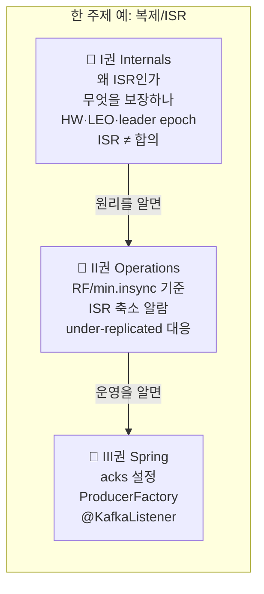

# Kafka, 직접 증명하며 읽는 책

> ⚠️ **러프 초안 — 전체 표지.**
> Kafka를 **개념으로 서술하고, 모든 핵심 주장을 돌아가는 테스트로 증명**한다. (executable book)
> 용어를 외우지 않고 **"왜 이렇게 설계할 수밖에 없었나"** 를 밑바닥부터 깎아 올라간다.

---

## 집필 원칙

- **개념이 먼저, 테스트는 증명이다.** 현상을 외우지 않고 제1원리에서 출발한다.
- **함정은 목적이 아니라 검증 도구다.** "안 되는 것"을 밟아보며 이해가 진짜인지 확인한다.
- **Mermaid 다이어그램을 적극 활용한다.** 구조·흐름·상태 전이는 글보다 그림으로 먼저 보여준다.
- 집필 규약·버전·스코프 → [CHARTER](../CHARTER.md) · [CONVENTIONS](../CONVENTIONS.md) · 진행 상태 → [ROADMAP](../ROADMAP.md)

---

## 세 권으로 나눈 이유

같은 주제라도 **독자의 목적**에 따라 알아야 할 깊이가 다르다. 그래서 한 권에 욱여넣지 않고 셋으로 나눈다.

| 권 | 성격 | 핵심 질문 | 주 재료 |
|----|------|----------|---------|
| [📘 **I권 — Internals**](./1-internals/README.md) | deep-dive, 엄밀한 원리 | *왜 · 무엇을 보장 · 어떤 구조 · 어떤 합의 알고리즘* | 새로 집필 + `KAFKA-ARCHITECTURE.md` 분해 |
| [📗 **II권 — Operations**](./2-operations/README.md) | 실무 운영 | *현장에서 어떻게 운영/판단하는가* | Step 9·10 + 신규 |
| [📙 **III권 — Spring**](./3-spring/README.md) | Spring Kafka 적용 | *코드로 어떻게 쓰는가* | Step 1~8 (spring-kafka 기반) |

---

## 어떻게 읽나

- **원리를 알고 싶다** → I권부터. 분산 시스템의 문제의식에서 출발한다.
- **운영 중 판단이 필요하다** → II권. 각 항목이 I권의 어느 원리에 기대는지 링크로 잇는다.
- **당장 코드를 짜야 한다** → III권. 각 설정이 무엇을 보장하는지 I권으로 거슬러 올라갈 수 있다.

> 부록: [용어 사전(GLOSSARY)](../../GLOSSARY.md)
