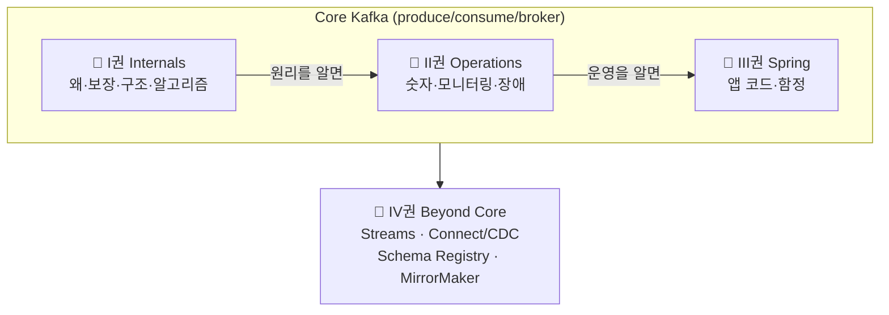

# Kafka, 직접 증명하며 읽는 책

> ⚠️ **러프 초안 — 전체 표지.**
> Kafka를 **개념으로 서술하고, 모든 핵심 주장을 돌아가는 테스트로 증명**한다. (executable book)
> 용어를 외우지 않고 **"왜 이렇게 설계할 수밖에 없었나"** 를 밑바닥부터 깎아 올라간다.

---

## 집필 원칙

- **개념이 먼저, 테스트는 증명이다.** 현상을 외우지 않고 제1원리에서 출발한다.
- **함정은 목적이 아니라 검증 도구다.** "안 되는 것"을 밟아보며 이해가 진짜인지 확인한다.
- **Mermaid 다이어그램을 적극 활용한다.** 구조·흐름·상태 전이는 글보다 그림으로 먼저 보여준다.
- 집필 규약·버전·스코프 → [CHARTER](../CHARTER.md) · [CONVENTIONS](../CONVENTIONS.md) · 진행 상태 → [ROADMAP](../ROADMAP.md)

### 📏 README 작성 규칙 (모든 권 공통)

각 권의 `README.md`는 **본문이 아니라 인덱스(지도)** 다.

- README의 각 불릿은 **"한 주제를 한 문장으로"** 표현한다. 상세 서술·다이어그램·코드·증명은 **개별 `NN-*.md`(산문화)** 에만 둔다.
- 워크플로우: README에서 무엇을 적을지 불릿로 정함 → 확정 장만 `NN-*.md`로 옮겨 산문화 → 산문에서 새 포인트가 생기면 **README 불릿(-D)에 한 문장으로 반영**(양방향 동기화).
- 각 권은 자기 **Scope/경계**를 README 상단에 명시한다. 다른 권 주제로 넘어가면 **링크만** 남기고 그 권에서 다룬다.

### 권의 경계 (한눈에 — AI/작업자용)

| 이 주제는… | …이 권에서 |
|------------|-----------|
| 왜 그렇게 동작하나 · 보장 · 구조 · 합의 알고리즘 | 📘 **I권 Internals** |
| 어떤 숫자로 운영 · 모니터링 · 사이징 · 장애 대응 | 📗 **II권 Operations** |
| Spring Kafka 앱 코드 · 설정 조합/순서 함정 | 📙 **III권 Spring** |
| Streams/ksqlDB · Connect/CDC · Schema Registry · MirrorMaker · Tiered Storage | 📕 **IV권 Beyond Core** |
| 이벤트 설계 · Outbox 패턴 구현 · Saga | (다른 lab: messaging-lab / saga-lab) |

---

## 네 권으로 나눈 이유

**I~III권은 Core Kafka** (메시지를 안전하게 주고받기) 한 덩어리이고, **IV권은 그 위 엔터프라이즈 스택**이다.
같은 Core 주제라도 **독자의 목적**에 따라 깊이가 달라서 셋으로 나눈다.

| 권 | 성격 | 핵심 질문 | 주 재료 |
|----|------|----------|---------|
| [📘 **I권 — Internals**](./1-internals/README.md) | Core 원리 (deep-dive) | *왜 · 무엇을 보장 · 어떤 구조 · 어떤 합의 알고리즘* | 새로 집필 + `KAFKA-ARCHITECTURE.md` 분해 |
| [📗 **II권 — Operations**](./2-operations/README.md) | Core 운영 | *어떤 숫자로 운영/감시/장애 대응* | Step 9·10 + 신규 |
| [📙 **III권 — Spring**](./3-spring/README.md) | Core 앱 코드 | *Spring Kafka로 어떻게 쓰고 어디서 데이나* | Step 1~7 (spring-kafka 기반) |
| [📕 **IV권 — Beyond Core**](./4-beyond-core/README.md) | 데이터 플랫폼 | *Core를 넘어 플랫폼으로 — 큰 회사 스택* | 신규 (Streams/Connect-CDC/Schema Registry/MirrorMaker) |

---

## 어떻게 읽나

- **원리를 알고 싶다** → I권부터. 분산 시스템의 문제의식에서 출발한다.
- **운영 중 판단이 필요하다** → II권. 각 항목이 I권의 어느 원리에 기대는지 링크로 잇는다.
- **당장 코드를 짜야 한다** → III권. 각 설정이 무엇을 보장하는지 I권으로 거슬러 올라간다.
- **플랫폼으로 키운다** → IV권. Core(I~III)를 먼저 다진 뒤 본다.

> 부록: [용어 사전(GLOSSARY)](../../GLOSSARY.md)
