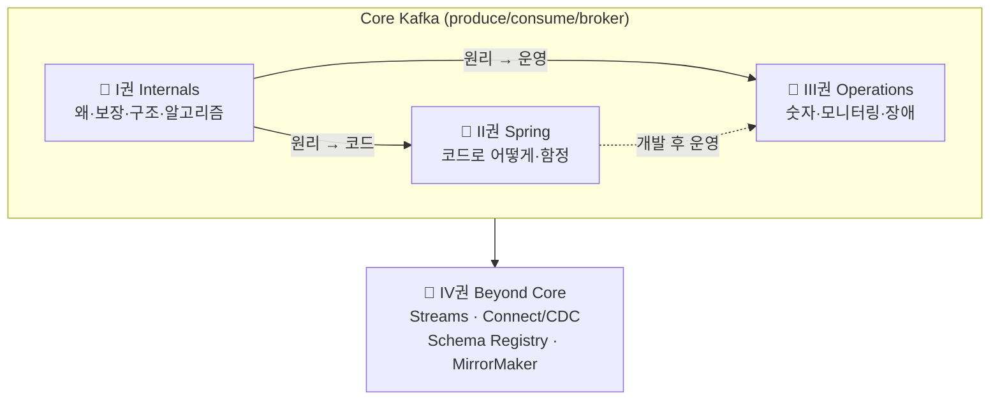

# Kafka, 직접 증명하며 읽는 책

> ⚠️ **러프 초안 — 전체 표지.**
> Kafka를 **개념으로 서술하고, 모든 핵심 주장을 돌아가는 테스트로 증명**한다. (executable book)
> 용어를 외우지 않고 **"왜 이렇게 설계할 수밖에 없었나"** 를 밑바닥부터 깎아 올라간다.

---

## 집필 원칙

- **개념이 먼저, 테스트는 증명이다.** 현상을 외우지 않고 제1원리에서 출발한다.
- **함정은 목적이 아니라 검증 도구다.** "안 되는 것"을 밟아보며 이해가 진짜인지 확인한다.
- **Mermaid 다이어그램을 적극 활용한다.** 구조·흐름·상태 전이는 글보다 그림으로 먼저 보여준다.
- 집필 규약·버전·스코프 → [CHARTER](../CHARTER.md) · [CONVENTIONS](../CONVENTIONS.md) · 진행 상태 → [ROADMAP](../ROADMAP.md)

### 집필 공통 규칙 (모든 권 — 이 표지가 단일 진실)

각 권 README는 아래 규칙을 따른다. 권 README에 재서술하지 말고 이곳을 링크한다(불변식만 자주 위반되므로 각 권에 한 줄 재게시 허용).

1. **README = 인덱스(지도).** 각 불릿은 "한 주제를 한 문장으로". 상세·다이어그램·코드·증명은 개별 `NN-*.md`(산문)에만. 산문에서 새 포인트가 생기면 README 불릿으로 역반영(양방향 동기화).

2. **다른 장·권은 named link로만.** 장/권 번호를 본문에 숫자·텍스트로 박지 마라 — 순서가 바뀌면 링크는 깨져 보이지만 박힌 숫자는 조용히 stale된다.

   ```
   지양  (I권 7장) · II권 Consumer
   지향  [저장 엔진](1-internals/08-storage-engine.md) · [II권](2-spring/README.md)
   ```

3. **SSOT 표 — 교차 요소의 "정의 위치"는 표 1곳.** 같은 개념이 여러 장에 걸치면 정의 위치를 README "교차 요소" 표에 한 번만 적고 본문은 따른다. 본문 괄호에 `(N장 정의)`로 재서술하면 거의 반드시 드리프트한다(표·산문이 어긋나면 산문 기준으로 표를 고친다).

4. **상태 2축.** `[산문]`은 완료·아웃라인·작업중으로, `[executable 증명]`은 별도 축으로 표기한다. 산문 완료가 증명 완료를 뜻하지 않는다.

5. **증명 모델 명시.** 각 권은 "무엇을 어디서 증명하나"를 README에 박는다(예: I권=docker/CLI 자체증명 + 개념은 II권 위임). "이 책이 다 증명한다 + 링크는 전부 바깥"은 모순이다.

6. **Scope/경계.** 각 권은 자기 scope를 상단에 명시하고, 다른 권 주제는 링크만 남긴다(→ 아래 "권의 경계" 표).

> 사실 검증: 버전·기본값·KIP 번호는 추정 금지. KIP 원문 / 해당 버전 공식 docs / 소스(`*Config.java` DEFAULT)로 확인하고 라벨(`[KIP-xxx]`·`[docs @x.y]`)을 단다. (→ [SOURCES](./SOURCES.md))

### 챕터 frontmatter 스키마

각 `book/<권>/NN-*.md`는 상단에 YAML frontmatter로 AI·작업자용 메타를 둔다(학습자 본문과 분리). 증명 상태는 `proof`로 구조화한다 — 자유 텍스트 런온 금지:

```yaml
proof:
  mode: self | delegated | mixed   # self=docker·CLI 자체증명 / delegated=II권 Step 위임
  status: done | 부분 | 미구현 | 위임 | 해당없음
  method: "관측 도구·방법 한 줄"
  pending: [...]   # 미구현 항목 — 본문 표의 [테스트 예정]과 1:1 대응
  done: [...]      # 검증 완료 항목([code/docs @ver])
```

나머지 키: `volume·chapter·title·prose` · `upstream/forward`(선형 선행/다음 장 파일명) · `baseline{broker,client,ref}` · `conventions`. 증명 라벨 정의는 → [SOURCES](./SOURCES.md)(`[테스트 예정]`=미구현 / `[테스트로 결정]`=문서 모호→실험).

### 권의 경계 (한눈에 — AI/작업자용)

> **결정 규칙**: 설정을 바꿨을 때 **정확성/보장(correctness)** 이 변하면 → **I권** / **비용·성능·가용성 트레이드오프**만 변하면 → **III권 Operations**.
> (예: ISR이 *무엇이고 왜 durability를 보장하나*=I권 / `min.insync.replicas`를 *2로 둘지 3으로 둘지*=III권)

| 이 주제는… | …이 권에서 |
|------------|-----------|
| 왜 그렇게 동작하나 · 보장 · 구조 · 합의 알고리즘 · 클라이언트 런타임 · wire protocol | 📘 **I권 Internals** |
| Spring Kafka 앱 코드 · 설정 조합/순서 함정 | 📙 **II권 Spring** |
| 어떤 숫자로 운영 · 모니터링 · 사이징 · 장애 대응 · 보안(SASL/SSL/ACL) | 📗 **III권 Operations** |
| Streams/ksqlDB · Connect/CDC · Schema Registry · MirrorMaker · Tiered Storage | 📕 **IV권 Beyond Core** |
| 이벤트 설계 · Outbox 패턴 구현 · Saga | (다른 lab: messaging-lab / saga-lab) |

---

## 네 권으로 나눈 이유

**I~III권은 Core Kafka** (메시지를 안전하게 주고받기) 한 덩어리이고, **IV권은 그 위 엔터프라이즈 스택**이다.
순서는 **개발자 여정**을 따른다 — 원리를 배우고(I) → 코드를 짜고(II) → 운영한다(III).



> 코드(II)도 운영(III)도 **둘 다 I권(원리)에 직접 의존**한다. II→III는 "개발 후 운영"이라는 시간 흐름일 뿐 약한 의존(점선)이다.

| 권 | 성격 | 핵심 질문 | 주 재료 |
|----|------|----------|---------|
| [📘 **I권 — Internals**](./1-internals/README.md) | Core 원리 (deep-dive) | *왜 · 무엇을 보장 · 어떤 구조 · 어떤 합의 알고리즘* | 새로 집필 + `KAFKA-ARCHITECTURE.md` 분해 |
| [📙 **II권 — Spring**](./2-spring/README.md) | Core 앱 코드 | *Spring Kafka로 어떻게 쓰고 어디서 데이나* | Step 1~7 (spring-kafka 기반) |
| [📗 **III권 — Operations**](./3-operations/README.md) | Core 운영 | *어떤 숫자로 운영/감시/장애 대응* | Step 9·10 + 신규 |
| [📕 **IV권 — Beyond Core**](./4-beyond-core/README.md) | 데이터 플랫폼 | *Core를 넘어 플랫폼으로 — 큰 회사 스택* | 신규 (Streams/Connect-CDC/Schema Registry/MirrorMaker) |

---

## 어떻게 읽나

- **원리를 알고 싶다** → I권부터. 분산 시스템의 문제의식에서 출발한다.
- **당장 코드를 짜야 한다** → II권. 각 설정이 무엇을 보장하는지 I권으로 거슬러 올라간다.
- **운영 중 판단이 필요하다** → III권. 각 항목이 I권의 어느 원리에 기대는지 링크로 잇는다.
- **플랫폼으로 키운다** → IV권. Core(I~III)를 먼저 다진 뒤 본다.

> 부록: [용어 사전(GLOSSARY)](GLOSSARY.md)
