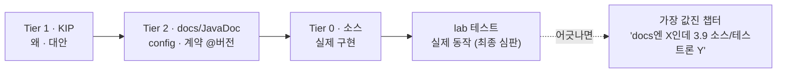

# SOURCES — Kafka를 엄밀하게 쓰기 위한 소스 계층

> 이 문서는 본문이 아니라 **검증 기준**이다.
> "일반화된 블로그 정보"와 싸우기 위한 무기 — 모든 주장은 *어느 tier에 근거했는지* 와 *어느 버전인지* 를 밝힌다.
> 권 경계·결정 규칙 → [README](./README.md) · 집필 규약 → [CONVENTIONS](../CONVENTIONS.md)

---

## 0. 핵심 원칙

**소스 화이트리스트가 아니라 인용 규율(citation discipline)이다.**

- 특정 문서 하나를 정답으로 못박지 않는다 (터널 비전·확증 편향). → ❌
- 소스의 *우선순위*를 정하고, 주장마다 *근거 tier + 버전* 을 밝힌다. → ✅
- 권위를 골라 믿는 대신 **트라이앵귤레이션**: KIP(왜) · docs(config) · 소스(구현) · 테스트(실제 동작).
- executable book의 최종 심급은 어떤 문서도 아니다 — **돌아가는 테스트**다.
  - 문서는 *"이렇게 동작해야 한다(should)"* 를, 테스트는 *"실제로 이렇게 동작한다(does)"* 를 말한다.

---

## 1. Tier 0 — 구현 그 자체 (최종 진실)

| 자료 | 위치 | 무엇에 쓰나 | 주의점 |
|------|------|------------|--------|
| Apache Kafka 소스 | `github.com/apache/kafka` | 실제 동작의 끝판. `core/`(브로커), `clients/`(producer·consumer 런타임 → 📘 I), `raft/`, `storage/` | 버전 태그로 체크아웃 (`git checkout 3.9.0`). trunk ≠ 릴리스 |
| Wire Protocol 스펙 | `kafka.apache.org/protocol` | request/response 바이너리 포맷, API 버전, 에러 코드 (→ 📘 I) | API version별 스키마가 누적됨 |

> Tier 0은 자주 안 봐도 된다. **Tier 1~3이 어긋날 때의 심판**이다.

---

## 2. Tier 1 — 설계 의도: KIP (가장 저평가된 금광)

KIP에는 *문제 · 고려한 대안 · 기각된 설계 · 그 이유* 가 다 있다.
→ 책의 핵심 질문 **"왜 이렇게 설계할 수밖에 없었나"** 에 1:1 대응.

| 자료 | 위치 | 비고 |
|------|------|------|
| KIP 인덱스 (공식) | `cwiki.apache.org/confluence/display/KAFKA/Kafka+Improvement+Proposals` | 전체 목록 + 상태(Accepted/Rejected) |
| KIP 브라우저 (비공식) | `ossip.dev/kips` | 탐색 편한 커뮤니티 미러. 최종 확인은 공식 위키로 |

### 권별 필독 KIP

| 주제 | KIP | 핵심 질문 | 해당 권 |
|------|-----|----------|---------|
| 합의 / 컨트롤러 | KIP-500 (KRaft, ZooKeeper 제거) | 왜 ZK를 걷어냈나 | 📘 I |
| durability / truncation | KIP-101 + KIP-279 (leader epoch) | 왜 high watermark만으론 유실을 못 막나 | 📘 I |
| exactly-once | KIP-98 (트랜잭션 · idempotent producer) | EOS의 밑바닥 (원리=I / Spring 적용=II) | 📘 I → 📙 II |
| 보안 | KIP-12 (SASL/Kerberos·SSL) 등 | 인증·인가를 어떻게 끼웠나 (원리=I / 운영 설정=III) | 📘 I → 📗 III |
| tiered storage | KIP-405 (3.9부터 production-ready) | 로그를 외부 스토리지로 | 📗 III / 📕 IV |

---

## 3. Tier 2 — 공식 문서 + JavaDoc

| 자료 | 위치 | 무엇에 쓰나 | 주의점 |
|------|------|------------|--------|
| 공식 문서 | `kafka.apache.org/documentation` | config 의미·기본값의 권위 출처 | **기본값은 버전마다 바뀜.** 버전 픽서 보기 (`/39/documentation`) |
| Design 섹션 | `kafka.apache.org/documentation/#design` | 짧지만 밀도 높은 1차 설계 서술 | 📘 I권 출발점으로 좋음 |
| Security 섹션 | `kafka.apache.org/documentation/#security` | SASL/SSL/ACL 설정·운영 | 📗 III권 (보안 운영) |
| Producer/Consumer JavaDoc | `kafka.apache.org/<ver>/javadoc/` | 메서드·config의 *정확한* 계약 (`send()`·`poll()` 등) | 📘 I·📙 II. docs보다 정밀할 때가 많음 |

---

## 4. Tier 3 — 권위 있는 2차 (만든 사람들 / 분산시스템 원전)

| 자료 | 무엇에 쓰나 | 주의점 |
|------|------------|--------|
| Jay Kreps, *The Log* (2013) — `engineering.linkedin.com/distributed-systems/log-what-every-software-engineer-should-know-about-real-time-datas-unifying` | "Kafka는 큐가 아니라 로그다"의 철학적 뿌리 (📘 I) | 철학이지 스펙이 아님 |
| 원논문 *Kafka: a Distributed Messaging System for Log Processing* (Kreps·Narkhede·Rao, 2011) | 최초 설계 의도 | 현재 구현과 많이 다름 — 역사 맥락용 |
| *Kafka: The Definitive Guide* (2nd ed, O'Reilly) | 커미터들이 쓴 체계적 정리 (I~III 전반) | 책이라 lag 있음. 버전 확인 |
| *Designing Data-Intensive Applications* (Kleppmann) | replication·로그·consistency의 분산시스템 일반 이론 (📘 I 토대) | Kafka 전용 아님 (그래서 더 좋음) |
| Spring for Apache Kafka Reference — `docs.spring.io/spring-kafka/reference` | `@KafkaListener`·컨테이너·ack 모드·에러 핸들러 등 (📙 II) | Spring 추상이 *어떤 native config로 번역되는지* 항상 I권으로 역추적 |
| Confluent Developer / 블로그 — `developer.confluent.io` | 깊이 있는 실전 설명 | **Apache Kafka vs Confluent Platform 구분 필수** |

---

## 5. Tier 4 — 검증 전엔 본문 금지

Medium · 개인 블로그 · StackOverflow.
포인터·검색 진입점으로만. Tier 0~2 교차검증 전엔 본문에 넣지 않는다.
→ "일반화된 오류 정보"의 진원지.

---

## 6. 실전 동선 — 한 주제를 팔 때

---

## 7. 본문 인용 라벨 규약

비자명한 주장마다 근거를 라벨로 명시한다:

| 라벨 | 의미 |
|------|------|
| `[KIP-NNN]` | 설계 의도 / 대안 근거 |
| `[docs @3.x]` / `[code @3.x]` | config 의미·기본값 (버전 핀 필수) |
| `[통념·검증필요]` | 1차 소스 미확인 — lab에서 확인해야 함 |
| `[테스트로 결정]` | 문서가 모호 — 실험이 심판 |

> 목표: 독자(미래의 나 포함)가 *사실*과 *추측*을 한눈에 가려내고, 버전 stale을 잡아낼 수 있게.

---

## 8. 권 ↔ 소스 빠른 대응 (한눈에)

| 권 | 1차로 보는 tier | 대표 소스 |
|----|----------------|-----------|
| 📘 I Internals | Tier 1(KIP) → Tier 0(소스·protocol) | KIP-500/101/279/98, `kafka.apache.org/protocol`, DDIA |
| 📙 II Spring | Tier 3(Spring ref) → Tier 2(JavaDoc) → 📘 I 역추적 | Spring Kafka Reference, Producer/Consumer JavaDoc |
| 📗 III Operations | Tier 2(docs·security) → Tier 1(운영 관련 KIP) | docs `#security`, KIP-405, Definitive Guide |
| 📕 IV Beyond Core | Tier 1(컴포넌트별 KIP) → Tier 2/3 | Streams/Connect/Schema Registry 각 docs·KIP |